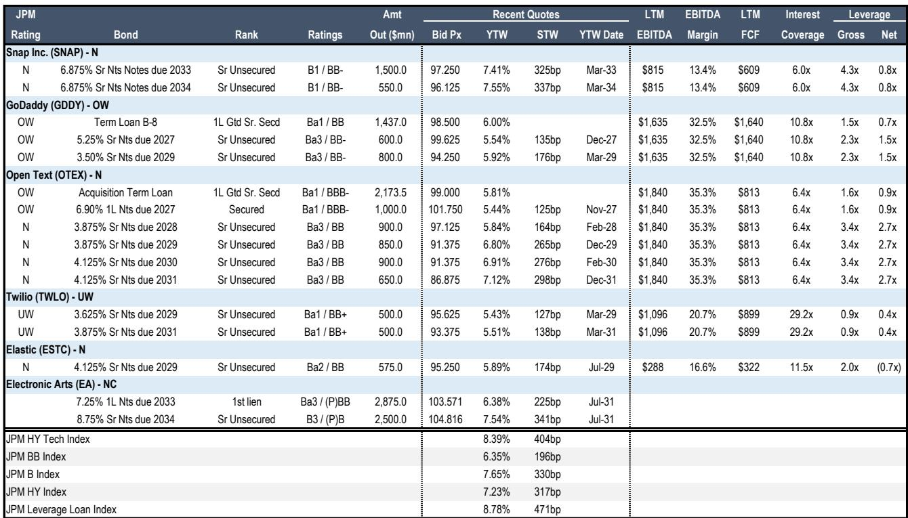
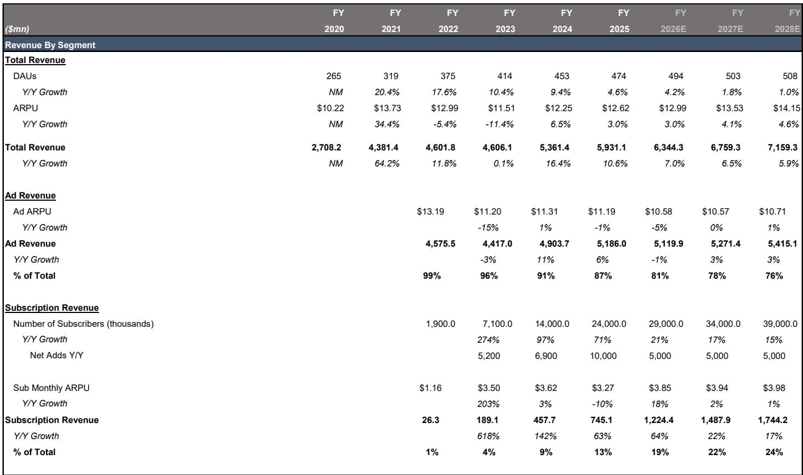
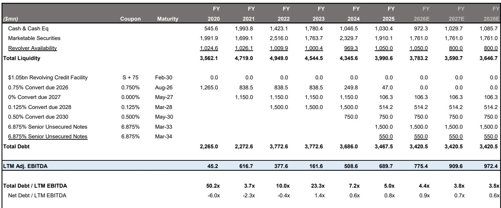

# Snap Inc. 面临的结构性挑战：现金流可缓冲但无法消除，债券折价具有合理性

Snap Inc. 是一家处于基本面张力中的公司。其商业模式面临三个重叠的结构性挑战——竞争加剧、技术过时风险以及监管审查升级——这些因素使其债券价格降至暗示真正困境的水平。然而，该公司的底层信用状况相当稳健，自2023年以来自由现金流转化率几乎增长了两倍，净杠杆率低于1倍。这并非矛盾，而是一个战略性的定价信号，表明市场正在正确地进行折价。

对于信用研究者而言，分析问题不在于Snap的债券在相对意义上是否便宜——它们确实便宜——而在于折价是买入机会还是警示信号。证据表明后者更为恰当。Snap的两只无担保债券（评级B1/BB-）目前交易利差分别为325和337个基点。这使其利差宽于BB指数但窄于B指数——恰好处于两个评级类别交界处的名称应有的交易水平。更具说明性的数据点是相对于更广泛科技指数的表现。年初至今，Snap的债券利差扩大了120至130个基点，而科技高收益指数为74个基点。这种相对表现差异并非噪音，它反映了市场正在对真实、可识别的风险进行定价。

以下论点并非关于Snap是否会违约——现金流状况使得短期流动性危机不太可能发生。论点在于当前的风险溢价是否充分补偿了债券持有人在未来三至五年内公司面临的各种结果。总体而言，答案是否定的——但这并非因为公司实力薄弱，而是因为挑战是结构性的，容错空间很小，且激进读者驱动的战略转变引入了新的不确定性，加剧了现有的不确定性。

## 竞争压力与过时风险并非新现象，但已以直接威胁Snap收入模式的方式加剧

Snap运营于数字广告、社交媒体和增强现实硬件的交汇点。这些市场中的每一个都由资源远为雄厚的公司主导。Alphabet、Meta、字节跳动和苹果各自拥有远超Snap的广告生态系统。仅Meta一家在2024年就产生了超过1300亿美元的广告收入，而Snap约为50亿美元。这种规模差异至关重要，因为数字广告的核心竞争动态是数据。平台拥有的用户越多，用户在其上花费的时间越多，平台能收集的数据就越多，其广告定向就越精准，广告商愿意支付的费用就越高。Snap的日活跃用户接近4.5亿，用户每天打开应用30至40次。但平均每日屏幕时间约为30分钟，而TikTok和Instagram各约一小时。这种参与度差距是广告拍卖中的结构性劣势。

过时风险比竞争风险更为严峻。Snap的核心产品——阅后即焚的照片和视频消息——已被每个主要竞争对手复制。Instagram Stories于2016年推出，目前日活跃用户超过5亿。WhatsApp Status和Facebook Stories提供几乎相同的功能。曾使Snapchat独一无二的差异化已被商品化。Snap的回应是大力投资增强现实，既通过软件镜头和滤镜，也通过其硬件子公司Specs。第六代Specs眼镜售价2195美元，是一个战略性赌注，认为AR将成为下一个主要计算平台，且Snap能拥有该市场的可观份额。但这一赌注的经济效益尚未得到验证。2016年推出的初代Spectacles因库存过剩和订单取消产生了4000万美元亏损。当前一代面临来自Meta的Ray-Ban智能眼镜（起价224美元）和苹果Vision Pro（起价3499美元但提供远更强大的计算能力）的竞争。Snap的AR策略是一个看涨期权，而非现金流驱动因素。它消耗资本和管理注意力，却未对收入做出有意义的贡献。

## 监管审查对Snap的损害尤为严重，因其用户群体更年轻且财务资源有限

社交媒体平台的监管环境已从滋扰转变为重大风险因素。美国、欧盟和英国的政府正在采取行动，范围从内容审核失败的罚款到基于年龄的平台访问限制。Snap比其同行更易受此趋势影响，原因有二。首先，其用户群体偏向年轻化。Snap在20多个国家覆盖了13至34岁年龄段的75%。这一人群正是监管机构最关注保护的群体，尤其是在心理健康和有害内容接触方面。其次，Snap吸收监管成本的财务能力较弱。Meta和Alphabet各自持有超过700亿美元的现金，并产生数百亿美元的年自由现金流。Snap持有约20亿美元的现金及等价物，产生约6亿美元的自由现金流。单笔大额罚款或需要大量合规投资的监管指令，将对Snap的资产负债表和信用状况产生比例更大的影响。

潜在监管结果的范围广泛且难以定价。完全禁止16岁以下用户访问社交媒体（已在多个司法管辖区被提议）将直接消除Snap用户群的很大一部分。较不严重的结果，如强制性家长同意要求或对未成年人算法内容推荐的限制，将减少参与度和广告收入，但不会完全消除。对信用研究者而言，关键在于监管风险并非对称的。不利情景的损害大于有利情景的益处。有利的监管结果仅允许Snap继续像今天一样运营。不利的结果将永久性损害其收入模式。

## Snap的现金生成能力有意义，但它是缓冲而非解决方案

自2022年和2024年的重组努力以来，Snap的财务状况已显著改善。自由现金流转化率从2023年的22%增至2025年的63%，这得益于裁员、产品终止以及转向最小化资本支出的云基础设施。公司过去三年的平均经营现金流为4.39亿美元，平均自由现金流为2.3亿美元。截至2026年第一季度，净杠杆率为0.8倍，近期到期债务可控。这些并非财务困境公司的指标。

但强劲的现金流并不能消除战略风险。它提供了一个缓冲，给予管理层执行的时间，但并不保证执行会成功。持有Snap约2.5%股份的激进读者Irenic提出了一系列建议，包括成本削减、聚焦核心广告业务以及可能出售Specs子公司。这些建议从短期价值角度看是合理的，但也引入了不确定性。资本分配政策的改变，包括股票回购或增加股票薪酬，可能减少目前支撑信用状况的现金缓冲。出售或分拆Specs将消除一个潜在的增长驱动力，收窄Snap的战略选择。激进读者的参与增加了一层治理风险，而此前管理层通过公司的双重股权结构拥有统一控制权时，这种风险并不存在。

## Snap债券的决策框架：风险回报不利，因折价反映了真实而非已定价的脆弱性

对于评估Snap债券的信用研究者而言，适当的框架并非公司能否在未来12个月内生存——它几乎肯定会。框架在于当前利差是否充分补偿了未来三至五年内各种结果的范围。该范围包括一个基准情景，即Snap继续产生现金，维持当前市场地位，并逐步偿还债务。它还包括不利情景，即监管行动减少用户群，竞争侵蚀广告收入，或AR硬件策略消耗资本而未产生回报。基准情景支持当前利差。不利情景支持更宽的利差。

相对价值数据的关键洞察在于，Snap的债券已相对于科技指数和可比发行人存在折价。这一折价并非市场低效，而是对公司面临众多未知因素的理性反应。激进读者活动、监管环境、竞争动态和AR策略各自引入了不同的不确定性来源。它们共同创造了一个比典型BB级信用更广泛的结果范围。当前利差补偿了基准情景，但未补偿尾部风险。对于债券持有人而言，对不利情景的不对称敞口使得风险回报不利，尽管信用基本面是稳健的。

结论并非Snap是一家糟糕的公司或其债券会违约，而是相对于同行的折价是合理的。市场正在正确地为强劲信用状况与面临结构性挑战的商业模式之间的张力定价。在当前水平研究Snap债券的读者正在为基准情景获得补偿，但他们并未为那些使这一信用真正值得分析的各种结果获得补偿。

*仅供参考。部分内容可能基于源材料通过AI辅助生成、翻译、总结或编辑，可能存在遗漏或错误。请独立核实。本文不构成专业建议。*

仅供参考。部分内容可能基于源材料通过AI辅助生成、翻译、总结或编辑，可能存在遗漏或错误。请独立核实。本文不构成专业建议。

