# 韩国市场观察

## 韩国市场去杠杆进程更新（二）

自6月中旬以来，韩国市场经历了一段显著的去杠杆时期。KOSPI指数自6月22日高点以来出现较大幅度波动。最初由常规基本面担忧和轮动资金引发的变化，在杠杆ETF的作用下被放大，近期则呈现出对冲基金仓位调整的特征。继上周的更新（我们当时估计杠杆ETF的调整已完成约75%，股票对冲基金的去杠杆已完成超过50%）之后，我们现在认为杠杆ETF的调整已经完成，对冲基金的去杠杆也已完成约90%（均达到可接受水平）。尽管本周观察到的价格变化可能在未来几天内产生进一步去杠杆的连锁反应，且许多读者在本周FOMC会议（存在加息可能性）和超大规模企业财报（市场预期较高）前保持谨慎，但韩国市场的仓位状况整体来看已具有一定吸引力——同时估值和盈利动能也提供了支撑。

- **去杠杆更新：** (1) 杠杆ETF资产管理规模已回归常态：截至6月底，以韩国资产为标的的杠杆ETF资产管理规模曾增长至500亿美元。相对于其市场规模，这一规模是美国同类产品的4倍，导致了较为明显的波动（以及在下跌日出现的被动去杠杆——进而引发其他读者的仓位调整）。随着市场反转，该类产品的资产管理规模现已降至170亿美元。此外，此前快速流入这些产品的资金近几日也已停滞（底部观察买入不多）。因此，VKOSPI与VIX的比率已开始下降，并可能进一步走低。(2) 对冲基金杠杆率已接近常态：掉期容量限制抑制了对冲基金在韩国市场杠杆率的积累。尽管如此，JPM Prime账簿中的多空比率曾升至5.7倍。目前这一回归常态的过程已取得较大进展。该比率在7月27日已降至3.2倍，考虑到7月28日和29日价格动量因子的调整，对冲基金杠杆率可能进一步下降，已接近2025年区间的上沿。(3) 散户通过保证金融资的杠杆风险相对较低：保证金余额从未特别高或出现快速增长。目前余额已有所回落，约为200亿美元。与杠杆ETF在现货价格下跌时会被动去杠杆不同，保证金贷款具有一定的缓冲空间和自主裁量权。韩国散户读者仍持有可观的股票收益、现金余额、较高收入及海外资产，可在需要时用于应对追加保证金的要求。(4) 创纪录的外资流出正在放缓：长期读者的卖出压力已大幅缓解，因为韩国市场（尤其是存储类个股）表现相对落后，这意味着两大权重股在MSCI新兴市场指数中的权重目前仅为6.5%和4.5%（6月底分别为9.5%和8.3%）。

- **多元化交易仍值得关注：** 我们继续看好：(1) “财富效应”相关板块（百货商店、化妆品、旅游、券商、建筑）具有较有利的支撑因素；(2) 生物制药板块表现相对滞后，可能受益于全球对医疗保健行业情绪的改善；(3) 优先股折价接近历史高位——由此带来的较高回报表现提供了良好的持有回报；(4) 银行板块尤其具有吸引力，受益于资产质量改善与收入增长、韩国央行加息周期对净息差的支撑，以及市场成交量提升对经纪业务收入的贡献三重利好。

---

**图1：KOSPI指数自6月22日高点以来已出现一定幅度调整**
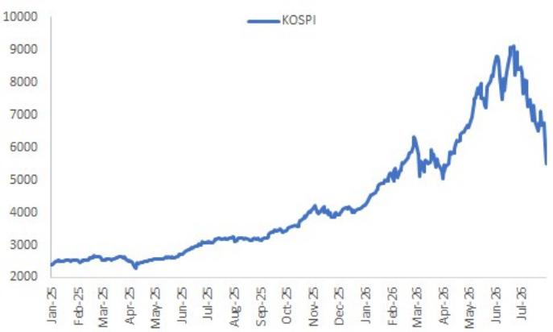
来源：彭博财经，JPM市场宏观研究。

**图2：本周走势使指数RSI进入超卖区域**
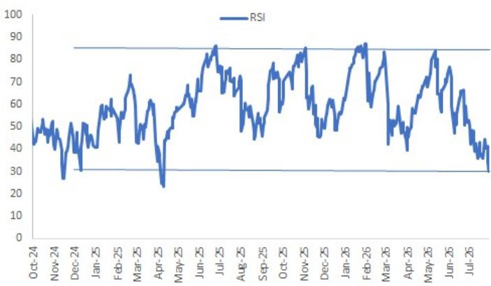
来源：彭博财经，JPM市场宏观研究。

**图3：KOSPI远期市盈率处于较低水平——即使经过周期性调整**
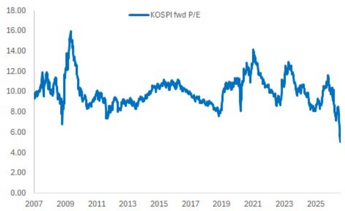
来源：彭博财经，JPM市场宏观研究。

**图4：5倍预估自由现金流同样处于历史较低估值区间**
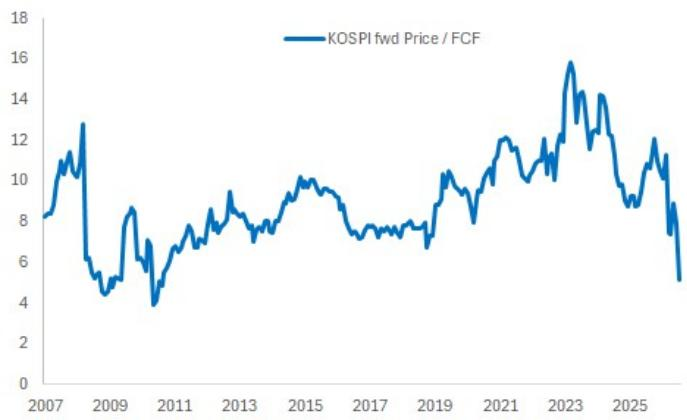
来源：彭博财经，JPM市场宏观研究。

**图5：我们对存储价格持续性的简化模型显示，当前市场定价隐含存储价格在2027年初开始回归至AI前水平；每多持续一年约增加1500亿美元**
主要存储厂商基于价格在2026年平均水平持续时间的估值。详情请咨询。
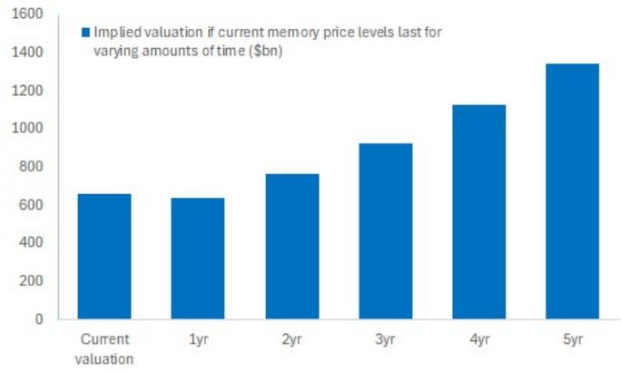
来源：彭博财经，JPM市场宏观研究。

**图6：相比之下，现货存储价格整体仍在走高；三季度合约价格亦有所上涨——尽管环比增速放缓**
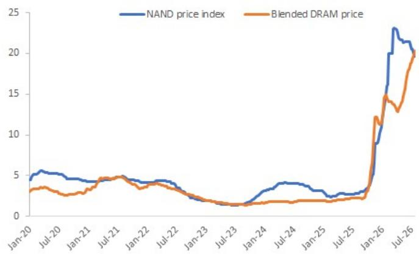
来源：彭博财经，JPM市场宏观研究。

**图7：韩国市场集中度是另一个问题——导致近期市场宽度较窄**
过去6个月跑赢KOSPI的股票占比
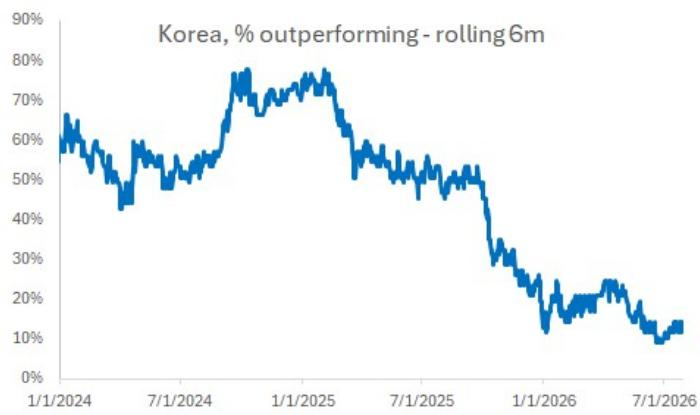
来源：彭博财经，JPM市场宏观研究。

**图8：值得注意的是，在7月的调整中，市场宽度（上涨-下跌家数）实际上保持相对良好——表明损失也集中在少数个股**
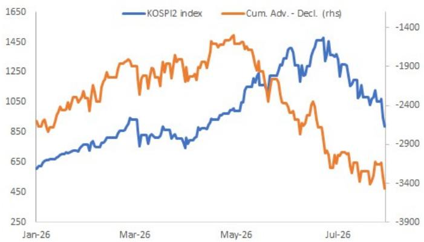
来源：彭博财经，JPM市场宏观研究。

**图9：实际上，KOSPI的下跌与存储类个股的相对弱势表现一致——但这似乎正在趋于稳定**
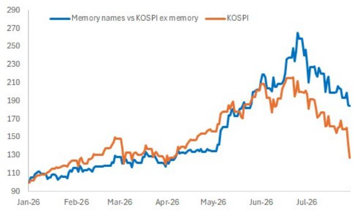
来源：彭博财经，JPM市场宏观研究。

**图10：同样，在美国，集中度的调整虽然剧烈，但可能是有益的**
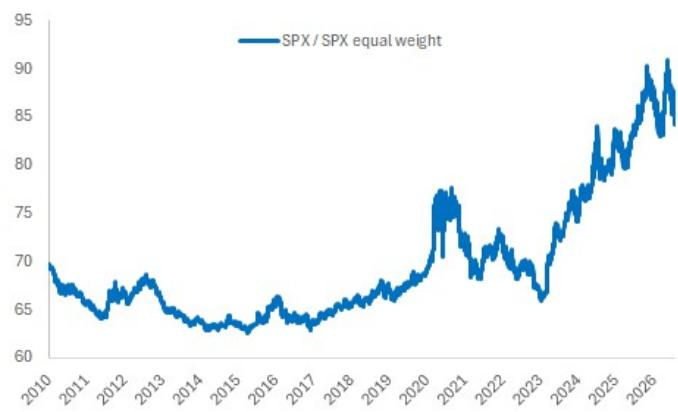
来源：彭博财经，JPM市场宏观研究。

**图11：韩国市场各板块的相对表现——价值和防御性板块中的落后股相对于KOSPI出现较大追赶**
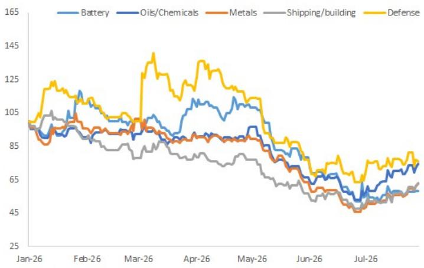
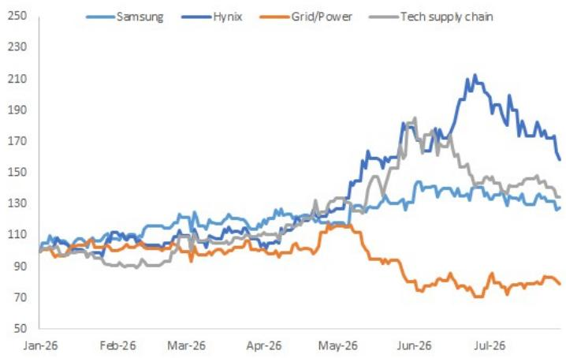
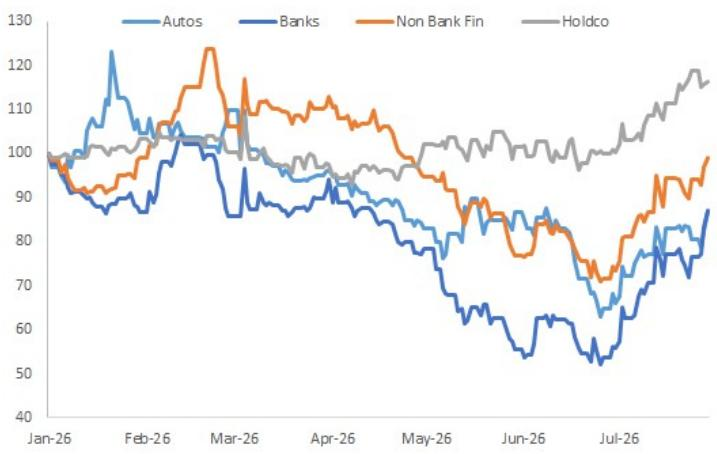
来源：彭博财经，JPM市场宏观研究。
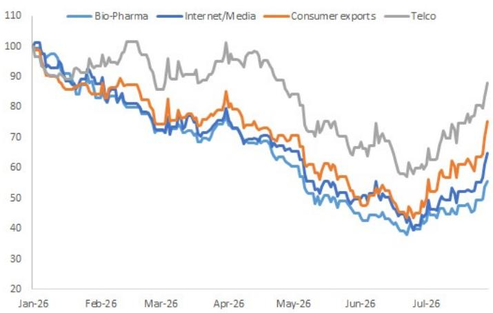

**图12：就杠杆ETF而言，其资产管理规模现已降至我们认为不再构成问题的水平**
资产管理规模 - 百万美元
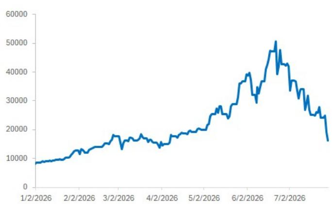
来源：彭博财经，JPM市场宏观研究。

**图13：杠杆产品的资金流入近几日也已停滞——近期监管收紧可能抑制了资金流入**
累计资金流入，百万美元
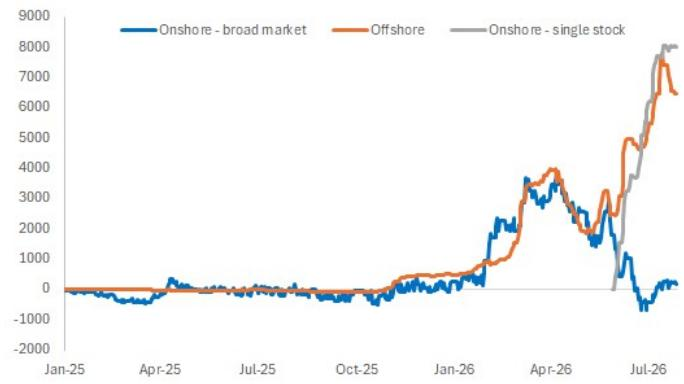
来源：彭博财经，JPM市场宏观研究。

**图14：因此，KOSPI波动率已开始回归常态，并可能继续**
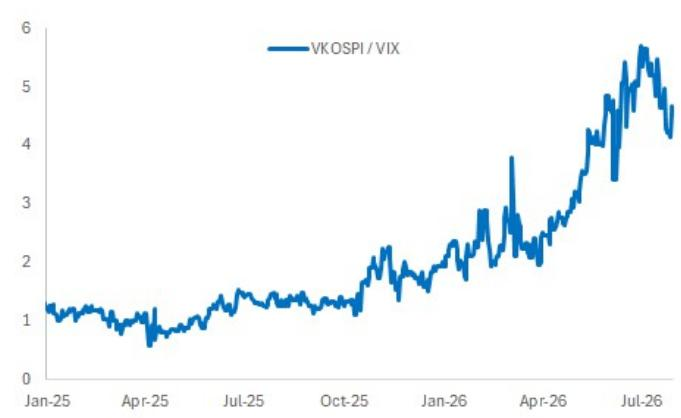
来源：彭博财经，JPM市场宏观研究。

**图15：个股期货（杠杆ETF的实施渠道）的未平仓合约也在继续减少**
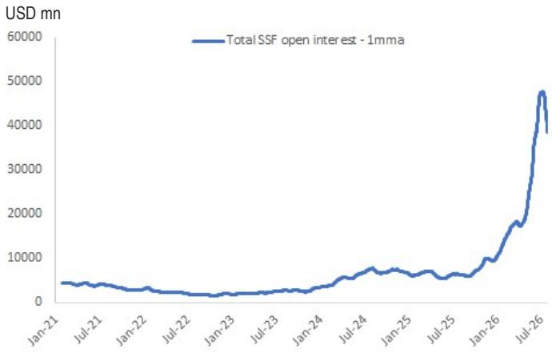
来源：彭博财经，JPM市场宏观研究。

**图16：JPM Prime账簿中对冲基金的多空比率已从高位回落**
最新数据截至7月27日
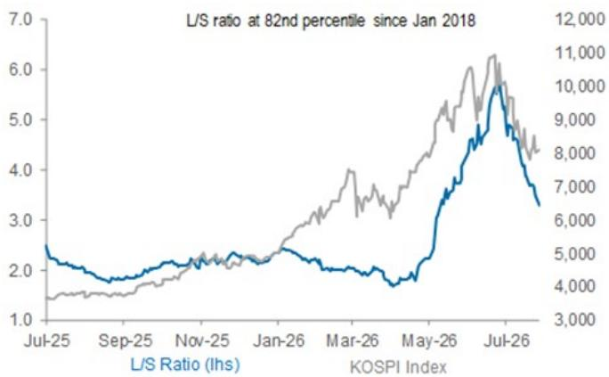
来源：JPM仓位情报。

**图17：……并且考虑到7月28日和29日价格动量因子的显著相对弱势，该比率可能已进一步回归常态**
多空五分位组的指示性表现
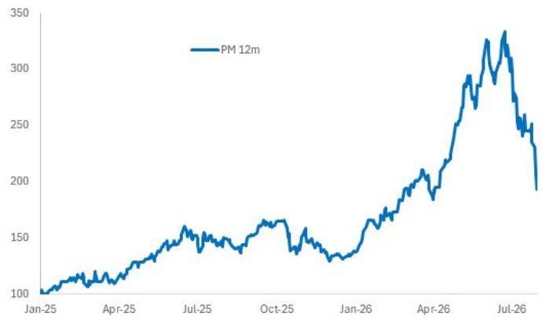
来源：彭博财经，JPM市场宏观研究。

**图18：对于散户读者而言，保证金杠杆水平并不太高，且今年并未出现急剧攀升**
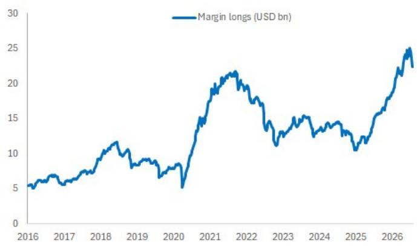
来源：彭博财经，KSD，JPM市场宏观研究。

**图19：作为市值的一部分，保证金余额今年实际上一直在下降**
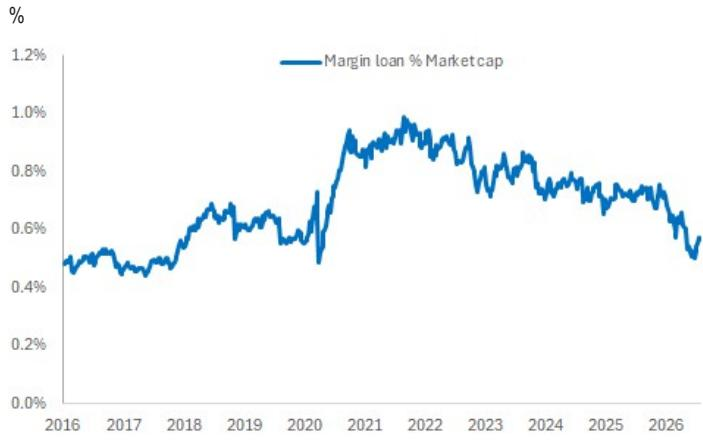
来源：彭博财经，KSD，JPM市场宏观研究。

**图20：总体而言，外资今年迄今已卖出超过1100亿美元的韩国股票，但这主要是由于长期读者对大盘股的授权限制**
累计资金流，百万美元，KRX数据
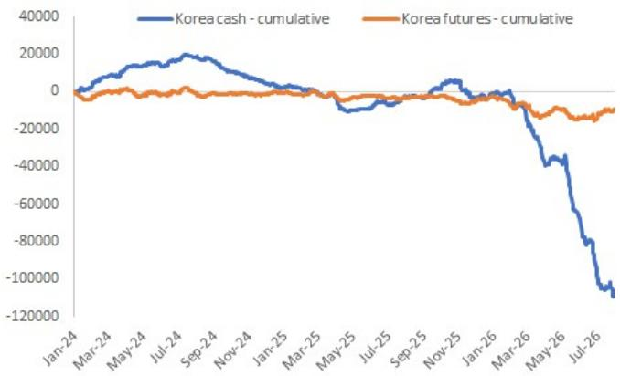
来源：彭博财经，JPM市场宏观研究。

**图21：实际上，90%的资金流出来自两只存储类个股；这些股票在新兴市场指数中权重的下降已显著减缓了资金流出**
累计资金流，百万美元
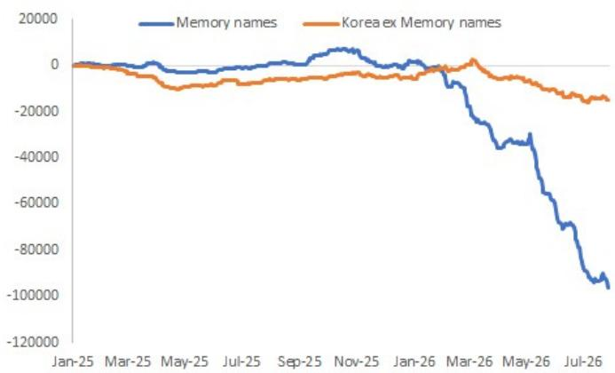
来源：彭博财经，JPM市场宏观研究。
百万美元，仅KRX数据

**图22：按市场板块和关键市场阶段划分的外资资金流（年初至今）——即使在6月22日以来的KOSPI调整期间，许多板块仍出现买入**

<table><tr><td rowspan="2">百万美元</td><td colspan="4">科技/AI相关</td><td colspan="4">价值型</td><td colspan="6">工业和商品</td><td colspan="5">其他</td></tr><tr><td>三星</td><td>海力士</td><td>电网/电力</td><td>科技供应链</td><td>汽车</td><td>银行</td><td>非银金融</td><td>控股公司</td><td>电池</td><td>石油/化工</td><td>金属</td><td>航运/建筑</td><td>国防</td><td>工程与建筑</td><td>生物制药</td><td>互联网/媒体</td><td>消费出口</td><td>电信</td><td>服务</td></tr><tr><td>1月1日-2月27日</td><td>-12987</td><td>-6419</td><td>459</td><td>988</td><td>-3854</td><td>-87</td><td>-485</td><td>92</td><td>1291</td><td>780</td><td>52</td><td>1642</td><td>-16</td><td>1296</td><td>967</td><td>324</td><td>456</td><td>146</td><td>45</td></tr><tr><td>2月27日-3月31日</td><td>-12138</td><td>-5412</td><td>-170</td><td>-482</td><td>-2587</td><td>-451</td><td>-418</td><td>-136</td><td>-181</td><td>-205</td><td>-286</td><td>62</td><td>-616</td><td>-13</td><td>269</td><td>-342</td><td>-111</td><td>48</td><td>-29</td></tr><tr><td>3月31日-6月22日</td><td>-17913</td><td>-17105</td><td>-1947</td><td>-1611</td><td>-4180</td><td>-97</td><td>50</td><td>-2073</td><td>1027</td><td>963</td><td>-79</td><td>-1190</td><td>833</td><td>-220</td><td>10</td><td>-892</td><td>81</td><td>-255</td><td>-330</td></tr><tr><td>6月22日至今</td><td>-10362</td><td>-15536</td><td>-307</td><td>1023</td><td>85</td><td>-354</td><td>116</td><td>-2472</td><td>-47</td><td>-25</td><td>56</td><td>-244</td><td>-69</td><td>175</td><td>86</td><td>15</td><td>91</td><td>-177</td><td>-28</td></tr></table>

来源：彭博财经，JPM市场宏观研究。
