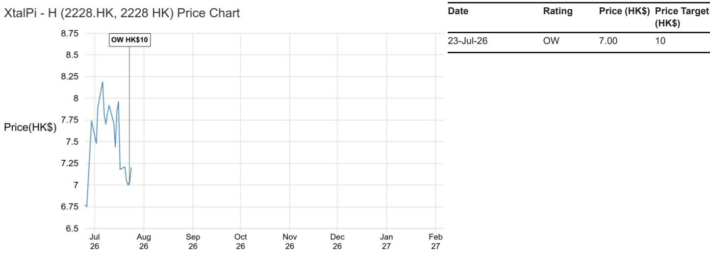

## XtalPi - H

## 1H26业绩预告解读；关注AI平台持续进展

XtalPi的1H26业绩预告基本在市场预期之内，主要由于去年同期收到DoveTree的5100万美元首付款，基数较高。剔除DoveTree的业务开发收入后，非业务开发服务驱动的核心收入增长依然强劲，同时公司加大对AI4S和智能体AI的研发投入，有望支撑其中期平台和管线变现。即将于7月29日在上海举办的AI4S Demo Day，将进一步展示管理层在AI平台开发方面的持续执行力。

- 1H26报告期内收入同比下降，我们认为基本符合预期，主要由于1H25基数较高，当时公司确认了与DoveTree重大合作项目的5100万美元首付款（人民币3.651亿元）。根据业绩预告，管理层预计1H26收入为人民币3.8亿至4.0亿元，而1H25为人民币5.171亿元；净利润预计转为亏损人民币2.15亿至2.75亿元。值得注意的是，与DoveTree的合作项目持续推进，公司已收到第二笔1900万美元付款（人民币1.294亿元），并在1H26确认为药物发现工作收入。

- 更重要的是，核心运营势头稳健。剔除DoveTree收入后，管理层表示1H26非业务开发收入应不低于人民币2.5亿元，同比增长超过65%。其中，AI for Science业务收入预计不低于人民币1.8亿元，同比增长超过120%，得益于新客户快速拓展、现有客户高复购率以及持续的技术迭代和交付质量。这表明非业务开发服务驱动的收入仍是期间内关键增长引擎，机器人实验室解决方案和智能服务均保持强劲势头。

- 同时，盈利压力也反映了公司主动投入而非业务质量下降。管理层预计1H26研发费用不低于人民币3.4亿元，同比增长超过50%，主要用于自主实验室、智能体系统、管线开发和多模态技术平台的持续投入。这与公司2025年年报中阐述的战略方向一致，即构建覆盖科学AI、物理AI和智能体系统的闭环AI驱动研发体系，同时从服务向更高价值的药物及其他资产拓展。我们认为，较高的研发投入虽会短期影响盈利，但将通过更强的平台能力、更广泛的客户变现和药物管线商业化潜力，支撑中期增长。

- 展望未来，公司将于7月29日在上海举办AI4S Demo Day，届时将适时展示其在AI平台和工具开发迭代方面的持续努力。我们认为该活动有助于读者更好地了解XtalPi AI4S技术栈的进展，尤其是公司在平衡短期盈利与长期投入于可扩展的科学基础设施（服务于制药及其他科学领域）方面的努力。

## 关注

2228.HK, 2228 HK
价格（2026年7月24日）：7.20港元

目标价（2027年12月）：10.00港元

## 医疗健康

Yang Huang AC
(852) 2800 3812
yang.huang@JPM.com
JPM Securities (Asia Pacific) Limited/ JPM Broking (Hong Kong) Limited

Derek Choi
(852) 2800-8744
derek.c.choi@JPM.com
JPM Securities (Asia Pacific) Limited/ JPM Broking (Hong Kong) Limited

Eric Zhao, CFA
(86-21) 6106 6256
eric.zhao@JPM.com
SAC Registration Number: S1730524050001
JPM Securities (China) Company Limited

分析师认证及重要披露，包括非美国分析师披露，请参见第3页。

# 研究观点、估值与风险

XtalPi - H（关注；目标价：10.00港元）

研究观点

我们给予XtalPi关注评级，认为其是以服务为导向、参与中国AI药物发现主题的差异化方式。与依赖二元临床结果的管线型公司不同，XtalPi目前通过AI驱动的发现服务和AI for Science合同产生收入，利用其独特的机器人驱动“物理AI”平台，将AI模型与自动化湿实验室实验整合为闭环发现引擎。这种可扩展的基础设施形成了持久的竞争壁垒，并得到专有实验数据的强化，应用范围可超越制药领域，延伸至材料科学和消费者健康。在礼来、强生、UCB和辉瑞等多元化蓝筹合作伙伴组合及可观积压订单的支持下，XtalPi提供了更广泛、风险更低的商业化路径，尽管收入本质上仍具有里程碑驱动和不均衡的特点。展望未来，我们认为合作伙伴里程碑、资产进展和新的业务开发机会将带来多重催化剂，在已建立且不断增长的收入基础上提供有吸引力的上行空间，而非依赖二元的验证事件。

## 估值

我们的2027年12月目标价为10港元，基于分部加总估值法。我们将XtalPi的业务分为：1）智能解决方案，2）药物发现，3）自主开发管线。前两项采用AI赋能的EV/S估值，第三项采用风险调整后净现值估值。隐含的2027年预期市销率约为25倍，处于全球AIDD同业（交易区间5倍-173倍，中位数约60倍）的较低端。

## 评级与目标价风险

主要下行风险包括：对AI主题的不利情绪、对外授权交易价值低于预期、临床试验结果不利、地缘政治风险（包括中美关系紧张加剧）、不利于AI药物发现情绪的事件，以及销售与盈利不及预期。

分析师认证：本报告封面标注“AC”的研究分析师（或当多位研究分析师主要负责本报告时，封面或文件内标注“AC”的研究分析师分别就其在本研究中覆盖的每个证券或发行人认证）：(1) 本报告中的所有观点准确反映了研究分析师对任何及所有标的证券或发行人的个人观点；(2) 研究分析师的任何部分薪酬过去、现在或将来均未直接或间接与本报告中研究分析师提出的具体建议或观点相关。对于封面列出的所有韩国研究分析师（如适用），他们还根据KOFIA要求认证，其分析是善意进行的，且观点反映了研究分析师自身的意见，未受到不当影响或干预。

除非另有说明，本报告中列出的所有作者均为独立撰写研究报告的研究分析师。在欧洲，本报告中可能显示行业专家（销售与交易）作为联系人，但他们并非报告作者或研究部门成员。

## 重要披露

- 做市商/流动性提供者（香港）：JPM Securities (Asia Pacific) Limited 和/或 JPM Broking (Hong Kong) Limited 和/或其关联公司是XtalPi - H或相关实体及/或其权证或期权的做市商和/或流动性提供者，这些证券在香港联合交易所有限公司上市或交易。

- 经理或联席经理：在过去12个月内，JPM曾担任XtalPi - H或相关实体证券或金融工具（定义见指令2014/65/EU）公开发行的经理或联席经理。

- 实益所有权（1%或以上）：JPM实益持有XtalPi - H或相关实体一类普通股证券的1%或以上。

- 客户：JPM目前拥有，或在过去12个月内曾拥有以下实体作为客户：XtalPi - H或相关实体。

- 客户/投资银行：JPM目前拥有，或在过去12个月内曾拥有以下实体作为投资银行客户：XtalPi - H或相关实体。

- 投资银行服务报酬已收：JPM在过去12个月内已从XtalPi - H或相关实体获得投资银行服务报酬。

- 潜在投资银行服务报酬：JPM预计在未来三个月内将从XtalPi - H或相关实体寻求获得投资银行服务报酬。

- 债务头寸：JPM可能持有XtalPi - H或相关实体的债务证券头寸（如有）。

公司特定披露：JPM确实并寻求与其研究报告所覆盖的公司开展业务。因此，读者应注意，公司可能存在可能影响本报告客观性的利益冲突。读者应将本报告视为其决策的单一因素。重要披露，包括价格图表和信用意见历史表（如适用），可在https://www.jpmm.com/research/disclosures查阅，或致电1-800-477-0406，或发送邮件至research.disclosure.inquiries@JPM.com索取。

<table><tr><td>日期</td><td>评级</td><td>价格（港元）</td><td>目标价（港元）</td></tr><tr><td>2026年7月23日</td><td>关注</td><td>7.00</td><td>10</td></tr></table>

  
来源：Bloomberg Finance L.P. 和 JPM；价格数据已根据股票拆分和股息进行调整。覆盖起始日期为2026年7月23日。所有股价均为前一交易日收盘价。

图表显示了JPM对相关股票的持续覆盖；当前分析师可能并未在整个期间内覆盖该股票。JPM评级或名称：关注、中性、回避、未评级

## 股票研究评级、名称及分析师覆盖范围说明：

JPM采用以下评级体系：关注（在本报告所示目标价期间内，我们预期该股票将跑赢研究分析师或其团队覆盖范围内股票的平均总回报）；中性（在本报告所示目标价期间内，我们预期该股票将与研究分析师或其团队覆盖范围内股票的平均总回报表现一致）；回避（在本报告所示目标价期间内，我们预期该股票将跑输研究分析师或其团队覆盖范围内股票的平均总回报）。未评级表示JPM已因缺乏充分基本面依据或法律、监管或政策原因而移除对该股票的评级及（如适用）目标价。先前的评级及目标价不应再被依赖。未评级并非推荐或评级。部分覆盖股票有评级但无目标价；在此情况下，我们预期该股票将在相关区域的目标期间内跑赢/表现一致/跑输研究分析师或其团队覆盖范围内股票的平均总回报。在我们的亚洲（除澳大利亚和印度外）及英国中小盘股票研究中，每只股票的预期总回报与基准国家市场指数的预期总回报进行比较，而非与研究分析师的覆盖范围进行比较。如果本报告的重要披露部分未显示，认证研究分析师的覆盖范围可在JPM研究网站https://www.JPMmarkets.com上找到。

覆盖范围：Huang, Yang：Akeso (9926.HK), Ascentage Pharma - H (6855.HK), BeOne - A (688235.SS), BeOne - H (6160.HK), Bora Pharmaceuticals (6472.TW), DaShenLin Pharmaceutical Group - A (603233.SS), Genscript Biotech - H (1548.HK), Hansoh Pharma - H (3692.HK), Hengrui - A (600276.SS), Hengrui - H (1276.HK), Innovent Biologics (1801) (1801.HK), Insilico - H (3696.HK), Kelun Biotech (6990.HK), Laobaixing Pharmacy Chain - A (603883.SS), Mindray - A (300760.SZ), RemeGen - A (688331.SS), RemeGen - H (9995.HK), Shanghai Junshi Biosciences - A (688180.SS), Shanghai Junshi Biosciences - H (1877.HK), Tigermed - A (300347.SZ), Tigermed - H (3347.HK), WuXi AppTec - A (603259.SS), WuXi AppTec - H (2359.HK), WuXi Biologics (2269.HK), WuXi XDC (2268.HK), XtalPi - H (2228.HK), Yifeng - A (603939.SS)

JPM股票研究评级分布，截至2026年7月4日

<table><tr><td></td><td>关注（买入）</td><td>中性（持有）</td><td>回避（卖出）</td></tr><tr><td>JPM全球股票研究覆盖*</td><td>53%</td><td>36%</td><td>12%</td></tr><tr><td>投行客户**</td><td>83%</td><td>80%</td><td>73%</td></tr><tr><td>JPMS股票研究覆盖*</td><td>51%</td><td>37%</td><td>12%</td></tr><tr><td>投行客户**</td><td>95%</td><td>92%</td><td>87%</td></tr></table>

\*请注意，由于四舍五入，百分比可能未加总至100%。  
\*\*在过去12个月内，JPM曾为其提供投行服务的各“买入”、“持有”和“卖出”类别中的公司百分比。

仅就FINRA评级分布规则而言，我们的关注评级属于买入类别；中性评级属于持有类别；回避评级属于卖出类别。请注意，未评级股票未包含在上述表格中。此信息截至最近一个日历季度末。

股票估值与风险：有关覆盖公司或目标公司的估值方法和风险，请参阅最新的公司特定研究报告，访问http://www.JPMmarkets.com，联系首席分析师或您的JPM代表，或发送邮件至research.disclosure.inquiries@JPM.com。有关专有模型的实质性信息，请参阅公司特定研究报告中的财务摘要和公司概况表，这些文件可在我们的客户网站http://www.JPMmarkets.com的公司页面下载。本报告还阐述了其中使用的重要基本假设。

## 研究交流历史：

过去12个月内JPM研究交流的历史记录可在http://www.JPMmarkets.com的研究与评论页面获取，您也可以按分析师姓名、行业或金融工具进行搜索。

分析师薪酬：负责编写本报告的研究分析师的薪酬基于多种因素，包括研究的质量和准确性、客户反馈、竞争因素以及公司整体收入。

非美国分析师注册：除非另有说明，本报告封面列出的非美国分析师是非美国JPM关联公司的员工，可能未在FINRA注册为研究分析师，可能不是JPM Securities LLC的关联人士，且可能不受FINRA规则2241或2242关于与覆盖公司沟通、公开露面以及研究分析师账户持有证券交易的限制。

## 其他披露

英国MIFID FICC研究分拆豁免：英国客户应参阅英国MIFID研究分拆豁免，了解JPM实施FICC研究豁免的详细信息及相关FICC研究分类指南。

除非相关法律特别允许，所有向客户提供的研究材料均同时在我们的客户网站JPM Markets上提供。并非所有研究内容都会重新分发、通过电子邮件发送或提供给第三方聚合商。如需获取特定股票的所有研究材料，请联系您的销售代表。

本研究材料中对中国的任何长格式引用为：中国大陆；香港特别行政区（中国）；台湾（中国）；澳门特别行政区（中国）。

JPM可能不时撰写关于受美国、欧盟、英国或其他相关司法管辖区政府当局实施或管理的经济或金融制裁所针对的发行人或证券（受制裁证券）的文章。本报告中的任何内容均无意被解读为鼓励、促进、推动或以其他方式批准对受制裁证券的投资或交易。客户在做出投资决策时应了解自身的法律和合规义务。

本研究报告中讨论的任何数字或加密资产均受快速变化的监管环境影响。有关加密资产（包括比特币和以太坊）的相关监管建议，请参阅https://www.JPM.com/disclosures/cryptoasset-disclosure。

本研究报告的作者可能未获授权在您的司法管辖区开展受监管活动，如果未获授权，则不会声称能够这样做。

交易所交易基金：JPM Securities LLC（“JPMS”）作为几乎所有美国上市ETF的授权参与者。如果本报告中提及任何ETF，JPMS可能因分销这些ETF份额而赚取佣金和基于交易的报酬，并可能因执行其他交易相关服务（如向ETF份额卖空者提供证券借贷）而赚取费用。JPMS还可能为ETF本身提供服务，包括担任ETF的经纪商或交易商。此外，JPMS的关联公司可能为ETF提供服务，包括信托、托管、管理、借贷、指数计算和/或维护及其他服务。

期权和期货相关研究：如果本文所含信息涉及期权或期货相关研究，则该等信息仅提供给已收到适当期权或期货风险披露文件的人士。请联系您的JPM代表，或访问https://www.theocc.com/components/docs/riskstoc.pdf获取期权清算公司标准化期权的特征和风险副本，或访问https://www.finra.org/sites/default/files/2020-08/Security_Futures_Risk_Disclosure_Statement_2020.pdf获取证券期货风险披露声明副本。

银行间报价利率及其他基准利率变更：某些利率基准目前或未来可能受到持续的国际、国内及其他监管指导、改革和改革提案的影响。更多信息，请查阅：https://www.JPM.com/global/disclosures/interbank_offered_rates

私人银行客户：如果您作为JPM Chase & Co.及其子公司（“JPM私人银行”）提供的私人银行业务的客户接收研究，则研究由JPM私人银行提供，而非JPM的任何其他部门，包括但不限于JPM企业与投资银行及其全球研究部门。

负责研究制作和分发的法律实体：编写本材料的Reg AC研究分析师姓名下方标识的法律实体是负责制作本研究的法律实体。如果多位Reg AC研究分析师编写本材料且其姓名下方标识了不同的法律实体，则这些法律实体共同负责制作本研究。如果分析师姓名下列出多个法律实体，则除非另有说明，第一个法律实体负责制作。来自不同JPM关联公司的研究分析师可能对本材料的制作有所贡献，但可能未获授权在您的司法管辖区开展受监管活动（且不会声称能够这样做）。除非法律实体披露中另有说明，本材料已由负责制作的法律实体分发，或者如果分析师姓名下列出多个法律实体，则第一个法律实体将负责分发。如有任何疑问，请联系您所在司法管辖区的相关研究分析师或已分发本研究材料的实体。

## 法律实体披露及国家/地区特定披露：

阿根廷：JPM Chase Bank N.A Sucursal Buenos Aires受阿根廷中央银行和阿根廷证券委员会监管。

澳大利亚：JPM Securities Australia Limited（“JPMSAL”）（ABN 61 003 245 234/AFS牌照号：238066）受澳大利亚证券和投资委员会监管，是ASX Limited的市场参与者、ASX Clear Pty Limited的清算和结算参与者以及ASX Clear (Futures) Pty Limited的清算参与者。本材料由JPMSAL或其代表在澳大利亚仅向“批发客户”（定义见2001年公司法第761G条）发行和分发。所有涵盖的金融产品列表可在https://www.jpmm.com/research/disclosures上找到。JPM力求覆盖与国内外读者基础相关的所有全球行业分类标准行业以及各种市值规模的公司。如适用，在对标的公司进行公开尽职调查过程中，研究分析师团队可能通过公司接触（如实地考察、与公司代表讨论、管理层演示等）进行此类尽职调查。JPMSAL发布的研究已按照JPM澳大利亚研究独立性政策编制，该政策可在以下链接找到：JPM Australia - Research Independence Policy。

巴西：Banco JPM S.A.受巴西证券委员会和巴西中央银行监管。JPM监察员：0800-7700847 / 0800-7700810（听障人士专用）/ ouvidoria.jp.morgan@jpmchase.com。

加拿大：JPM Securities Canada Inc.是一家注册投资交易商，受加拿大投资监管组织和安大略省证券委员会监管，是加拿大交易所的参与会员。本材料由JPM Securities Canada Inc.或其代表在加拿大分发。

智利：Inversiones JPM Limitada是一家在智利注册的非监管实体。

中国：JPM Securities (China) Company Limited已获中国证监会批准开展证券投资咨询业务。

哥伦比亚：Banco JPM Colombia S.A.受哥伦比亚金融监管局监管。本材料中对哥伦比亚境外实体提供的产品或服务的任何引用仅用于描述目的。此类引用不构成也不应被解释为在哥伦比亚领土内的促销活动或金融产品或服务的提供，如适用哥伦比亚法规所定义。

迪拜国际金融中心：JPM Chase Bank, N.A., Dubai Branch受迪拜金融服务管理局监管，其注册地址为迪拜国际金融中心 - The Gate, West Wing, Level 3 and 9 PO Box 506551, Dubai, UAE。本材料由JPM Chase Bank, N.A., Dubai Branch向根据DFSA规则被视为专业客户或市场对手方的人士分发。

欧洲经济区：除非另有说明，研究在EEA由JPM SE（“JPM SE”）分发，JPM SE是一家由联邦金融监管局授权作为信贷机构的公司，由BaFin、德国中央银行和欧洲中央银行共同监管。JPM SE总部位于法兰克福，注册地址为TaunusTurm, Taunustor 1, Frankfurt am Main, 60310, Germany。本材料在EEA向根据MiFID II第4条第1款第10项及附件II及其在各自母国的实施被视为专业读者（或同等）的人士（“EEA专业读者”）分发。非EEA专业读者不得依赖或依据本材料行事。本材料所涉及的任何投资或投资活动仅面向EEA相关人士，并将仅与EEA相关人士进行。

香港：JPM Securities (Asia Pacific) Limited（CE编号AAJ321）受香港金融管理局和香港证券及期货事务监察委员会监管，JPM Broking (Hong Kong) Limited（CE编号AAB027）受香港证券及期货事务监察委员会监管。JPM Chase Bank, N.A., Hong Kong Branch（CE编号AAL996）受香港金融管理局和证券及期货事务监察委员会监管，根据美国法律组建，承担有限责任。如果本材料的分发在香港属于受监管活动，则本材料由JPM Securities (Asia Pacific) Limited和/或JPM Broking (Hong Kong) Limited在香港分发或通过其分发。

印度：JPM India Private Limited（公司识别号 - U67120MH1992FTC068724），注册办事处位于JPM Tower, Off. C.S.T. Road, Kalina, Santacruz - East, Mumbai – 400098，在印度证券交易委员会注册为“研究分析师”，注册号INH000001873。JPM India Private Limited还在SEBI注册为国家证券交易所和孟买证券交易所的会员（SEBI注册号 – INZ000239730）以及商人银行家（SEBI注册号 - MB/INM000002970）。电话：91-22-6157 3000，传真：91-22-6157 3990，网站：http://www.jpmipl.com。JPM Chase Bank, N.A. - Mumbai Branch获印度储备银行许可（牌照号53/Licence No. BY.4/94；SEBI - IN/CUS/014/ CDSL : IN-DP-CDSL-444-2008/ IN-DP-NSDL-285-2008/ INBI00000984/ INE231311239）作为印度境内的一家持牌商业银行，这是其主要牌照，允许其在印度开展银行业务以及印度银行分行允许从事的其他活动。对于非本地研究材料，本材料不在印度由JPM India Private Limited分发。合规官：Ashutosh Sharma；ashutosh.j.sharma@jpmchase.com；+912261575002。申诉官：Ramprasadh K，jpmipl.research.feedback@JPM.com；+912261573000。SEBI的注册和NISM的认证不以任何方式保证中介机构的业绩或向读者提供任何回报保证。请访问条款和条件及最重要的条款和条件。年度合规审计报告可在http://www.jpmipl.com/#research上获取。

印度尼西亚：PT JPM Sekuritas Indonesia是印度尼西亚证券交易所的会员，并受金融服务管理局注册和监管。

韩国：JPM Securities (Far East) Limited, Seoul Branch是韩国交易所的会员。JPM Chase Bank, N.A., Seoul Branch在韩国注册为外国银行分行。两个实体均受金融服务委员会和金融监督院监管。对于非宏观研究材料，该材料在韩国由JPM Securities (Far East) Limited, Seoul Branch分发或通过其分发。

日本：JPM Securities Japan Co., Ltd.和JPM Chase Bank, N.A., Tokyo Branch受日本金融厅监管。

马来西亚：本材料由JPM Securities (Malaysia) Sdn Bhd (18146-X)在马来西亚发行和分发，该公司是马来西亚交易所的参与组织，并持有马来西亚证券委员会颁发的资本市场服务牌照。

墨西哥：JPM Casa de Bolsa, S.A. de C.V., JPM Grupo Financiero是墨西哥证券交易所和机构证券交易所的会员，并获国家银行和证券委员会授权作为经纪交易商。

新西兰：本材料由JPMSAL在新西兰仅向“批发客户”（定义见2013年金融市场行为法）发行和分发。JPMSAL根据2008年金融服务提供商（注册和争议解决）法案注册为金融服务提供商。

菲律宾：JPM Securities Philippines Inc.是菲律宾证券交易所的交易参与者，也是菲律宾证券清算公司和证券读者保护基金的会员。它受证券交易委员会监管。

新加坡：本材料由JPM Securities Singapore Private Limited（JPMSS）[MDDI (P) 057/08/2025 和公司注册号：199405335R]和/或JPM Chase Bank, N.A., Singapore branch（JPMCB Singapore）在新加坡发行和分发，两者均受新加坡金融管理局监管。JPMSS是新加坡交易所证券交易有限公司的会员。本材料在新加坡仅向根据证券及期货法（第289章）第4A条定义的认可读者、专家读者和机构读者发行和分发。本材料无意向任何零售读者或不符合“认可读者”、“专家读者”或“机构读者”定义的任何其他读者发行或分发。新加坡的收件人应就本材料引起或与之相关的任何事宜联系JPMSS或JPMCB Singapore。

南非：JPM Equities South Africa Proprietary Limited和JPM Chase Bank, N.A., Johannesburg Branch是约翰内斯堡证券交易所的会员，并受金融服务行为监管局监管。

台湾：JPM Securities (Taiwan) Limited是台湾证券交易所的参与者（公司型），并受台湾证券期货局监管。有关股权证券的材料由JPM Securities (Taiwan) Limited在台湾发行和分发，受限于许可证范围及台湾适用法律法规。如果JPM Securities (Taiwan) Limited制作关于非台湾上市或上柜证券的研究材料，这些材料不应构成台湾适用法规下的证券推荐，并且为免生疑问，JPM Securities (Taiwan) Limited不就非台湾上市证券担任经纪商。根据证券商受托买卖有价证券对客户推介买卖有价证券作业规范（或其修订）第7-1条第2款和/或其他适用法律法规，请注意，本材料收件人不得从事与本材料相关的可能产生利益冲突的任何活动，除非本材料“重要披露”中另有披露。

泰国：本材料由JPM Securities (Thailand) Ltd.在泰国发行和分发，该公司是泰国证券交易所的会员，并受财政部和证券交易委员会监管。注册地址为548 One City Center Building, 50th Floor, Ploenchit Road, Lymphini, Pathum Wan, Bangkok 10330。

英国：研究由JPM Securities plc（“JPMS plc”）在英国制作，JPMS plc是伦敦证券交易所的会员，并受审慎监管局授权和受金融行为监管局及审慎监管局监管；或由JPM Markets Limited（“JPMML Ltd”）制作，JPMML Ltd受金融行为监管局授权和监管。除非另有说明，本材料由JPMS plc在英国分发，并在英国仅面向：(a) 具有投资相关事务专业经验的人士（属于2005年金融服务和市场法案（金融促销）命令第19(5)条范围）；(b) 该命令第49条所述人士（高净值公司、非法人协会或合伙企业、高价值信托的受托人等）；或(c) 可以合法接收此通讯的任何其他人士；所有这些人士均称为“英国相关人士”。非英国相关人士不得依据或依赖本材料行事。本材料所涉及的任何投资或投资活动仅面向英国相关人士，并将仅与英国相关人士进行。JPM EMEA关于预防和避免研究制作利益冲突的政策说明可在以下链接找到：JPM EMEA - Research Independence Policy。

美国：JPM Securities LLC（“JPMS”）是NYSE、FINRA、SIPC和NFA的会员。JPM Chase Bank, N.A.是FDIC的会员。非美国关联公司发布的材料由JPMS在美国分发，JPMS对其内容承担责任。

一般信息：可根据要求提供更多信息。本材料中的信息来自被认为可靠的来源。尽管已采取一切合理谨慎措施确风险自担材料中陈述的事实准确，且其中包含的预测、意见和预期公平合理，但JPM Chase & Co.或其关联公司和/或子公司（统称“JPM”）不对所提供材料的完整性或准确性作出任何陈述或保证，但有关JPM和研究分析师与作为材料主题的发行人之间的参与情况的披露除外。因此，不应依赖本材料所含信息的准确性、公平性或完整性。由于计算、调整、翻译成不同语言和/或当地监管限制（如适用），本材料中可能存在某些数据差异和/或内容限制。这些差异不应影响对材料中可能讨论的标的公司的整体研究分析、观点和/或建议。人工智能工具可能已用于本材料的准备，包括协助数据分析、模式识别和研究材料的内容起草。JPM对因使用本材料或其内容而产生的任何损失不承担任何责任，且JPM或其各自的董事、高级职员或员工均不对本内容负责，但相关司法管辖区的监管机构或该监管制度可能施加的责任和义务除外。本材料中的意见、预测或预测仅代表JPM截至材料日期的当前意见或判断，因此如有变更，恕不另行通知。可能会根据公司特定发展或公告、市场状况或任何其他公开信息提供关于公司/行业的定期更新。无法保证未来结果或事件将与任何此类意见、预测或预测一致，这些意见、预测或预测仅代表一种可能的结果。此外，此类意见、预测或预测受某些风险、不确定性和假设的影响，尚未得到验证，未来的实际结果或事件可能存在重大差异。本材料中提及的任何投资的价值或收入可能会波动和/或受汇率变化的影响。除非另有说明，所有定价均为所讨论证券的市场收盘价指示性价格。过往表现并不预示未来结果。因此，读者可能收回少于最初投资的金额。本材料不构成购买或出售任何金融工具的要约或招揽。本文中的意见和推荐未考虑个别客户的情况、目标或需求，也不构成对特定客户推荐特定证券、金融工具或策略。本材料可能包含对结构化证券、期权、期货和其他衍生品的看法。这些是复杂工具，可能涉及高风险，可能仅适合能够理解并承担相关风险的成熟读者。本材料的接收者必须就本文提及的任何证券或金融工具做出自己的独立决定，并应寻求其认为必要的独立财务、法律、税务或其他顾问的建议。JPM可能基于研究分析师的观点和研究作为主体进行交易，也可能以与本材料中观点不一致的方式为其自身账户或客户账户进行交易，且JPM无义务确保此类其他沟通被本材料的任何接收者知晓。JPM内部的其他人员，包括策略师、销售人员和其他研究分析师，可能持有与本材料中观点不一致的观点。未参与本材料准备的JPM员工可能持有本材料中提及的证券（或此类证券的衍生品）并可能以与本材料中讨论的方式不同的方式进行交易。本材料并非在任何司法管辖区对任何发行人、其产品或服务或其证券的广告或营销。

保密与安全通知：此传输可能包含根据适用法律享有特权、保密、法律特权且/或免于披露的信息。如果您不是预期的接收者，特此通知您，对本文所含信息的任何披露、复制、分发或使用（包括任何依赖）均被严格禁止。尽管此传输及其任何附件被认为不含任何可能影响接收和打开它的任何计算机系统的病毒或其他缺陷，但接收者有责任确保其无病毒，且JPM Chase & Co.及其子公司和关联公司（如适用）不对因使用而产生的任何损失或损害承担任何责任。如果您错误地收到此传输，请立即联系发件人并完全销毁该材料，无论是电子版还是硬拷贝版。此消息受电子监控：https://www.JPM.com/disclosures/email

MSCI：本文中的某些信息（“信息”）经MSCI Inc.、其关联公司和信息提供商（“MSCI”）许可复制©2026。未经适当许可，不得复制或传播该信息。MSCI不对该信息作出任何明示或暗示的保证（包括适销性或适用性），并在法律允许的范围内免除所有责任。任何信息均不构成研究交流，除非是来自MSCI ESG Research的适用信息。另请参阅msci.com/disclaimer

Sustainalytics：本文中包含的某些信息、数据、分析和意见经Sustainalytics许可复制，并且：(1) 包含Sustainalytics的专有信息；(2) 除非特别授权，不得复制或重新分发；(3) 不构成研究交流或对任何产品或项目的认可；(4) 仅用于信息目的；(5) 不保证完整、准确或及时。Sustainalytics不对任何交易决策、损害或其他损失负责。数据的使用受限于https://www.sustainalytics.com/legal-disclaimers上提供的条件。©2026 Sustainalytics。保留所有权利。

“其他披露”最后修订于2026年7月4日。

版权所有2026 JPM Chase & Co.保留所有权利。未经JPM书面同意，不得转载、出售或重新分发本材料或其任何部分。未经JPM事先书面同意，严禁在任何第三方人工智能系统或模型中（当此类JPM数据可供第三方访问时）使用或共享从JPM或授权第三方收到的任何研究材料（“JPM数据”）。
