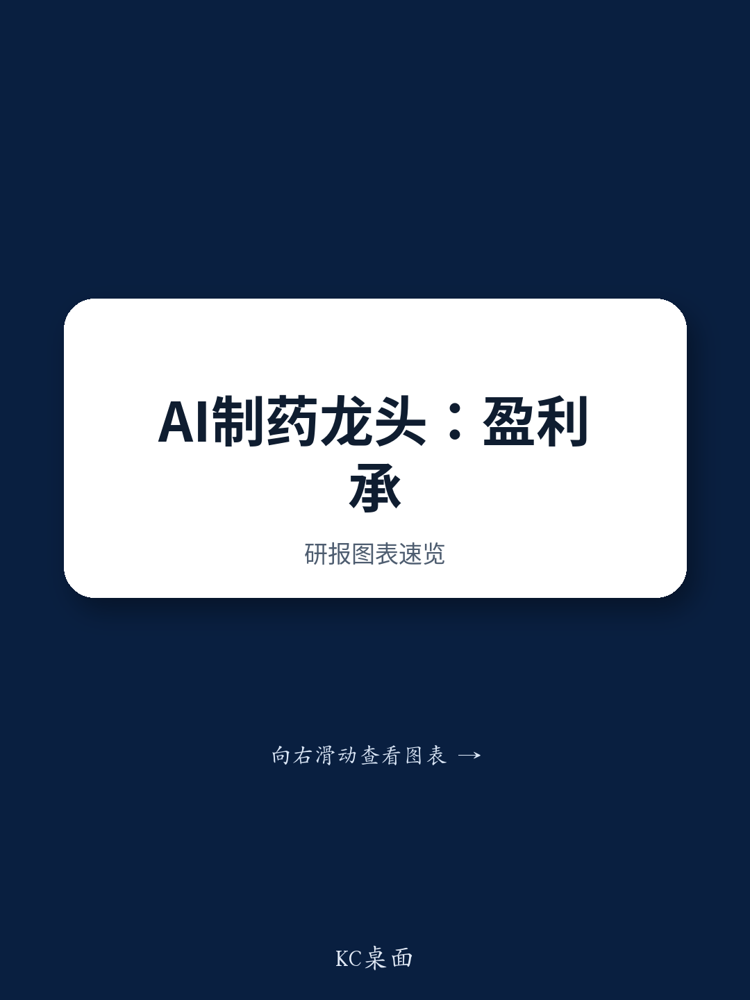

# JPM：晶泰科技与AI及近期数据观察

晶泰科技发布1H26盈利预警，市场对此已有预期。去年同期公司从与DoveTree的合作中确认了5100万美元首付款，构成高基数。JPM在最新报告中指出，剔除这笔BD收入后，公司非BD业务收入上半年不低于2.5亿元，同比增长超过65%。其中AI for Science业务收入不低于1.8亿元，同比增长超过120%。这份盈利预警反映的是研发投入的主动加码，而非业务基本面走弱。

报告认为，市场应关注7月29日在上海举行的AI4S Demo Day。这是公司展示其AI平台迭代进展的关键节点，也是读者评估其从服务向高价值资产延伸路径的窗口。

## 1. 上半年收入下滑主要由高基数驱动，非BD业务增长强劲

1H26公司预计实现营收3.8-4.0亿元，低于去年同期的5.171亿元；净利润预计转为亏损2.15-2.75亿元。但这一对比需要放在特定背景下理解：1H25公司从DoveTree项目确认了3.651亿元首付款。值得注意的是，该合作仍在推进，公司已在1H26确认了第二笔1900万美元付款，计入药物发现服务收入。

剔除DoveTree相关收入后，非BD业务收入不低于2.5亿元，同比增长超过65%。JPM认为，这显示非BD服务仍是公司当前的核心增长引擎。机器人实验室解决方案和智能服务均保持了强劲势头，新客户拓展迅速，老客户复购率高，技术迭代和交付质量持续提升。

> **KC评论：** 盈利预警本身不是新闻，真正值得关注的是非BD业务的增长质量。65%的同比增速意味着公司在没有大额BD交易的情况下，服务收入已经形成了可自我维持的增长曲线。AI for Science业务超过120%的增长，则暗示其平台化能力正在加速变现。

## 2. 研发费用同比增长超50%，是盈利不确定性的主要来源

公司预计1H26研发费用不低于3.4亿元，同比增长超过50%。JPM认为，这是主动研究而非业务出现变化。资金主要投向自主实验室、智能体系统、管线开发和多模态技术平台。这与公司在2025年年报中提出的战略方向一致——构建覆盖科学AI、物理AI和智能体系统的闭环AI驱动研发体系，同时从服务向更高价值的药物资产延伸。

短期盈利承压，但研发投入支撑的是中期增长潜力：更强的平台能力、更广泛的客户变现机会，以及药物管线商业化前景。

## 3. 7月AI4S Demo Day是观察平台进展的关键窗口

公司将于7月29日在上海举办AI4S Demo Day。JPM将其视为一个催化剂事件，有助于读者更清晰地评估晶泰科技AI for Science技术栈的进展。报告认为，公司正在平衡短期盈利与长期研究——后者指向一个可扩展的科学基础设施，不仅服务于制药，也适用于材料科学等其他学科。

**观察框架：** 评估这类AI驱动平台公司时，可以区分三个层次——服务收入增速反映当前商业化能力，研发投入方向反映平台迭代节奏，而Demo Day等公开活动则是验证技术路线是否可复现、可交付的窗口。三个层次缺一不可。

For informational purposes only. Portions may be generated,translated,summarized,or edited with AI assistance based on source materials and may contain omissions or errors. Please verify independently. This is not investment,legal,tax,accounting,or other professional advice.

For informational purposes only. Portions may be generated,translated,summarized,or edited with AI assistance based on source materials and may contain omissions or errors. Please verify independently. This is not investment,legal,tax,accounting,or other professional advice.

