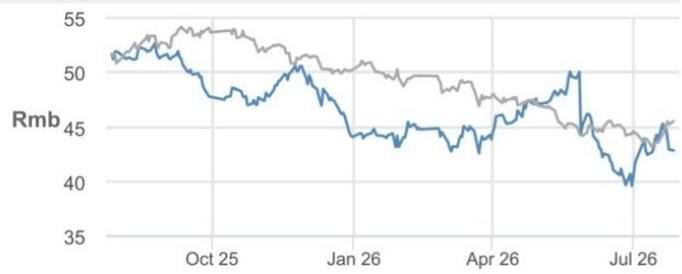
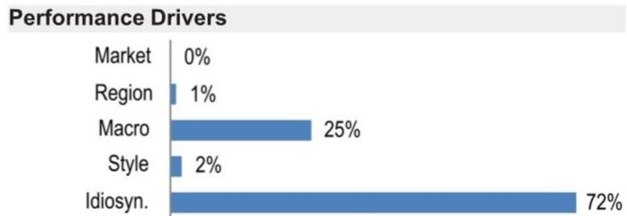
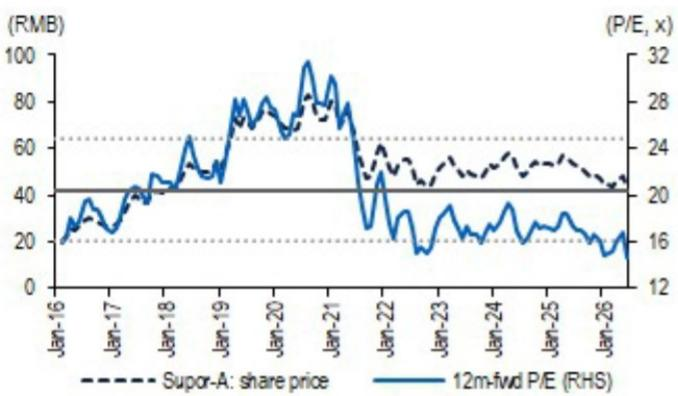
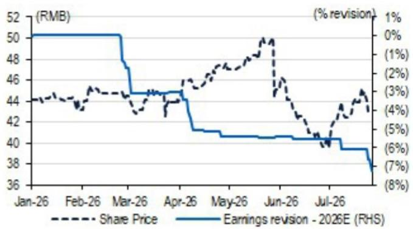

# 苏泊尔（002032.SZ）研究笔记

## 盈利与分红预期调整，评级调至中性

我们下调苏泊尔评级至中性，主要因为对其通过自有OEM出口需求来缓冲成本压力的能力信心减弱。苏泊尔初步公布的二季度业绩（我们的初步看法）令人失望，而分析师会议也未能增强我们对公司近期盈利恢复的信心。调整后，我们对FY26-27E的每股盈利预测较市场共识低6-9%；我们认为更大的风险在于分红方面的预期差，我们预计其每股分红较市场预期低20%——我们预测FY26E每股分红为2.01元，对应4.7%的回报率，而市场共识为2.51元，对应5.8%的回报率。我们将目标估值倍数下调至16倍，接近历史均值下方一个标准差（此前为19倍，与历史均值持平），由此得出2027年6月目标价为45元，仅对应5%的潜在上行空间。评级下调至中性。

- **下半年收入预期面临下行风险。** 二季度收入同比转为负增长3%，低于我们预期的同比增长4%。主要拖累因素是出口业务。SEB作为苏泊尔持股83%的母公司，贡献了苏泊尔约90%的出口收入，目前似乎在控制库存，且库存调整可能延续至下半年，影响出货节奏的可预见性。国内业务表现出韧性，但不足以抵消出口疲软。我们目前预计下半年收入增长3%（此前为4%），主要因下调了出口增长假设（+4%，此前为+7%）。这与彭博一致预期的同比增长7%（全年-上半年）相比，意味着盈利下调可能延续至下半年。

- **持续的商品成本压力影响经营利润势头。** 二季度毛利率可能同比下滑1个百分点，而一季度为扩张1.2个百分点，出口毛利率是主要拖累因素。苏泊尔在4-5月锁定了商品价格，但似乎是在石化相关成本上涨已经发生后进行的。因此，锁定价格未能缩小与通胀上升前与SEB约定的成本加成定价之间的差距。国内毛利率因平均售价提升而同比改善，销售及管理费用控制良好（同比下降2%），但这不足以抵消出口利润率压力。二季度经营利润同比下降16%，较一季度同比增长3%有所恶化。鉴于成本通胀持续，我们目前预计下半年经营利润同比下降3%（此前为+6%），尽管基数较低，但主要因下调了出口毛利率假设（16.3%，此前为19%）。

- **目标价与盈利预测调整；评级下调至中性。** 苏泊尔仍是一家运营质量较高的公司，国内执行力稳健、产品创新能力强、自由现金流生成能力良好。问题不在于结构性竞争力，而在于近期盈利风险：出口不确定性、成本压力以及有限的经营杠杆，使得此前的估值溢价难以维持。我们因下调出口收入和毛利率假设，将FY26-27E每股盈利预测下调5-9%，并因盈利预测下调及派息率假设降低，将FY26E每股分红预测下调27%。我们还将目标估值倍数下调15%至16倍。目标价下调18%至45元。基于调整后的JPMe预测，苏泊尔目前对应FY27市盈率16倍，因相对稳定性仍较小型家电同业存在溢价。主要上行风险包括：出口订单恢复好于预期、出口定价重新谈判以及更清晰的分红承诺。

## 中性

此前：增持

002032.SZ, 002032 CH
价格（2026年7月27日）：42.83元

▼目标价（2027年6月）：45.00元
此前（2027年6月）：55.00元

亚太区消费研究联席主管及亚洲博彩/休闲研究主管

DS Kim AC (852) 2800-8597 ds.kim@JPM.com

Yibo Wu
(852) 2800-8559
yibo.wu@JPM.com
JPM Securities (Asia Pacific) Limited / JPM Broking (Hong Kong) Limited

主要变化（财年截至12月）

| | 此前 | 当前 | 变化 |
|---|---|---|---|
| 调整后每股盈利 - 26E (元) | 2.76 | 2.51 | -8.9% |
| 调整后每股盈利 - 27E (元) | 2.89 | 2.74 | -5.2% |

风格暴露

| 量化因子 | 当前百分位排名 | 历史百分位排名（1=最高） |
|---|---|---|
| | | 6个月 | 1年 | 3年 | 5年 |
| 价值 | 64 | 58 | 66 | 60 | 52 |
| 成长 | 17 | 57 | 24 | 39 | 35 |
| 动量 | 49 | 82 | 57 | 42 | 85 |
| 质量 | 1 | 4 | 1 | 5 | 5 |
| 低波动 | 10 | 4 | 10 | 22 | 10 |

价格表现

— 002032.SZ 价格 (元) — 深证B指 (基准调整)

| | 年初至今 | 1个月 | 3个月 | 12个月 |
|---|---|---|---|---|
| 相对 | -2.8% | 8.0% | -9.1% | -17.2% |
| 相对 | 6.6% | 5.0% | -5.0% | -5.3% |

| 公司数据 |
|---|
| 流通股数 (百万股) | 797 |
| 52周价格区间 (元) | 52.75-38.63 |
| 市值 (百万美元) | 5,039 |
| 汇率 | 6.77 |
| 自由流通比例 (%) | 16.0% |
| 3个月日均成交量 (百万股) | 2.02 |
| 3个月日均成交额 (百万美元) | 13.4 |
| 波动率 (90天) | 31 |
| 指数 | SZBSHR |
| 彭博分析师评级 (买入 | 持有 | 卖出) | 15|3|1 |

关键指标（财年截至12月）

| 百万元人民币 | FY25A | FY26E | FY27E | FY28E |
|---|---|---|---|---|
| **财务预测** | | | | |
| 收入 | 22,772 | 23,035 | 23,795 | 24,428 |
| 调整后EBITDA | 2,782 | 2,693 | 2,889 | 3,075 |
| 调整后EBIT | 2,572 | 2,486 | 2,681 | 2,866 |
| 调整后净利润 | 2,097 | 2,004 | 2,182 | 2,340 |
| 调整后每股盈利 | 2.63 | 2.51 | 2.74 | 2.94 |
| 彭博每股盈利 | 2.69 | 2.75 | 2.94 | 3.06 |
| 经营活动现金流 | 2,649 | 2,120 | 2,333 | 2,483 |
| 公司自由现金流 | 2,435 | 1,968 | 2,162 | 2,304 |

| **利润率与增长** | | | | |
| 收入同比增长 (%) | 1.5% | 1.2% | 3.3% | 2.7% |
| 毛利率 | 24.9% | 24.4% | 24.8% | 25.1% |
| EBITDA利润率 | 12.2% | 11.7% | 12.1% | 12.6% |
| EBIT利润率 | 11.3% | 10.8% | 11.3% | 11.7% |
| 调整后每股盈利增长 | (6.1%) | (4.4%) | 8.9% | 7.2% |

| **比率** | | | | |
| 调整后税率 | 19.1% | 19.1% | 19.0% | 19.0% |
| 利息覆盖倍数 | NM | 226.9 | NM | NM |
| 净债务/权益 | NM | NM | NM | NM |
| 净债务/EBITDA | NM | NM | NM | NM |
| 已动用资本回报率 | 32.8% | 32.2% | 33.5% | 32.8% |
| 净资产回报表现 | 33.0% | 32.1% | 33.7% | 33.1% |

| **估值** | | | | |
| 公司自由现金流回报表现 | 7.1% | 5.8% | 6.3% | 6.8% |
| 股息率 | 6.1% | 4.7% | 5.1% | 5.5% |
| 企业价值/收入 | 1.3 | 1.3 | 1.2 | 1.2 |
| 企业价值/EBITDA | 10.5 | 10.9 | 10.0 | 9.2 |
| 调整后市盈率 | 16.3 | 17.0 | 15.6 | 14.6 |

## 投资论点摘要与估值

### 投资论点

我们对苏泊尔持中性观点。苏泊尔仍是我们覆盖范围内的一家高质量小家电公司，受益于稳健的国内执行力和良好的自由现金流生成能力。国内业务相较于大家电仍具相对防御性，产品创新支撑平均售价和利润率提升。然而，出口业务（约占收入三分之一）面临来自母公司SEB的订单可见度下降，以及预先约定的OEM定价下商品通胀带来的利润率压力。以FY27E市盈率16倍和FY26E股息率4.7%来看，我们认为风险回报较为均衡，相对稳定性与近期盈利和分红预期调整风险并存。主要上行风险包括出口复苏和OEM出口定价重新谈判。

### 估值

我们给予苏泊尔FY27E市盈率16倍，接近历史均值下方一个标准差，得出2027年6月目标价45元。

| 因子 | 6个月相关性 | 1年相关性 |
|---|---|---|
| 市场：MSCI亚太（除日本） | -0.03 | 0.01 |
| 区域：中国 | -0.14 | -0.12 |
| **宏观：** | | |
| 通用1st 'CO' 期货 | -0.08 | -0.33 |
| Markit新兴市场综合PMI SA | -0.45 | -0.29 |
| JPM中国A股情绪指数 | 0.26 | 0.24 |
| **量化风格：** | | |
| 价值 | -0.13 | -0.09 |
| 成长 | 0.11 | 0.07 |
| 规模 | 0.00 | 0.07 |

## 盈利预测

基于2026年上半年初步业绩公告及分析师会议，我们预测2026年第二季度收入同比下降3%（国内增长2%，海外下降14%），集团毛利率同比下降1个百分点至22.3%（国内上升0.2个百分点至28.1%；海外下降6.3个百分点至6.4%），集团运营费用总额同比下降2%，净利润率同比下降1.2个百分点至6.6%。

表1：苏泊尔 - 季度损益表摘要

| (百万元人民币, 财年截至12月31日) | 1Q25 | 2Q25 | 3Q25 | 4Q25 | 1Q26 | 2Q26E | 3Q26E | 4Q26E |
|---|---|---|---|---|---|---|---|---|
| **损益表** | | | | | | | | |
| 收入 | 5,786 | 5,691 | 5,420 | 5,874 | 5,882 | 5,528 | 5,581 | 6,044 |
| 同比增长% | 8% | 2% | (2%) | (1%) | 2% | (3%) | 3% | 3% |
| 中国 | 3,793 | 3,968 | 3,661 | 3,912 | 3,869 | 4,047 | 3,734 | 4,021 |
| 同比增长% | 3% | 4% | 2% | 2% | 2% | 2% | 2% | 3% |
| 海外 | 1,993 | 1,723 | 1,759 | 1,963 | 2,013 | 1,481 | 1,847 | 2,023 |
| 同比增长% | 18% | (2%) | (10%) | (6%) | 1% | (14%) | 5% | 3% |
| (营业成本) | (4,403) | (4,365) | (4,123) | (4,218) | (4,408) | (4,296) | (4,351) | (4,367) |
| 毛利润 | 1,383 | 1,326 | 1,297 | 1,657 | 1,474 | 1,231 | 1,230 | 1,677 |
| 毛利率% | 23.9% | 23.3% | 23.9% | 28.2% | 25.1% | 22.3% | 22.0% | 27.7% |
| 中国 | 1,045 | 1,107 | 998 | 1,235 | 1,132 | 1,137 | 1,008 | 1,267 |
| 毛利率% | 27.5% | 27.9% | 27.2% | 31.6% | 29.3% | 28.1% | 27.0% | 31.5% |
| 海外 | 339 | 219 | 299 | 421 | 342 | 94 | 222 | 409 |
| 毛利率% | 17.0% | 12.7% | 17.0% | 21.5% | 17.0% | 6.4% | 12.0% | 20.2% |
| (运营费用) | (812) | (814) | (809) | (988) | (859) | (797) | (814) | (992) |
| (销售费用) | (581) | (571) | (563) | (694) | (646) | (553) | (569) | (697) |
| (管理费用) | (93) | (105) | (88) | (113) | (87) | (99) | (84) | (110) |
| (研发费用) | (103) | (108) | (127) | (139) | (97) | (116) | (128) | (142) |
| (税金及附加) | (35) | (30) | (31) | (43) | (29) | (29) | (32) | (44) |
| 同比增长% | 5% | 7% | 8% | 8% | 6% | (2%) | 1% | 0% |
| (销售费用) | 5% | 11% | 15% | 12% | 11% | (3%) | 1% | 0% |
| (管理费用) | 1% | 3% | (12%) | 11% | (7%) | (6%) | (5%) | (3%) |
| (研发费用) | 9% | (2%) | 3% | (2%) | (5%) | 8% | 1% | 2% |
| (税金及附加) | 27% | (16%) | (18%) | (9%) | (17%) | (3%) | 3% | 2% |
| 经营利润（非GAAP） | 571 | 512 | 487 | 668 | 615 | 434 | 416 | 685 |
| 同比增长% | 12% | (9%) | (15%) | (2%) | 8% | (15%) | (15%) | 2% |
| 经营利润率% | 9.9% | 9.0% | 9.0% | 11.4% | 10.5% | 7.9% | 7.5% | 11.3% |
| 其他收入/(支出) | 42 | 33 | 38 | 220 | 31 | 35 | 42 | 228 |
| 财务收入/(支出) | 7 | 7 | 5 | (2) | (8) | (5) | 1 | 0 |
| 经营利润（报告） | 619 | 552 | 530 | 886 | 638 | 464 | 460 | 913 |
| 同比增长% | 6% | (6%) | (14%) | (7%) | 3% | (16%) | (13%) | 3% |
| 经营利润率% | 10.7% | 9.7% | 9.8% | 15.1% | 10.8% | 8.4% | 8.2% | 15.1% |
| 营业外收入 | 1 | 1 | 1 | 2 | 2 | - | 1 | 2 |
| (营业外支出) | (1) | (1) | (1) | (2) | (1) | (1) | (1) | (2) |
| 税前利润 | 620 | 552 | 530 | 886 | 638 | 462 | 460 | 913 |
| (所得税费用) | (124) | (110) | (104) | (156) | (133) | (101) | (87) | (152) |
| 税率% | (20.1%) | (19.9%) | (19.6%) | (17.6%) | (20.8%) | (21.8%) | (19.0%) | (16.6%) |
| (少数股东损益) | 2 | 1 | (0) | 0 | (0) | 1 | (0) | 2 |
| 净利润 | 497 | 443 | 426 | 731 | 505 | 362 | 372 | 764 |
| 同比增长% | 6% | (6%) | (13%) | (10%) | 2% | (18%) | (13%) | 5% |
| 净利润率% | 8.6% | 7.8% | 7.9% | 12.4% | 8.6% | 6.6% | 6.7% | 12.6% |

来源：公司数据，JPM预测

我们因下调出口收入和毛利率假设，将FY26/27E每股盈利预测下调9%/5%（表2）。盈利预测调整后，我们预测FY26收入同比增长1%，净利润同比下降4%，净利润率为8.7%。在FY26-28期间，我们预测收入/净利润复合年增长率分别为3%/8%，假设出口订单恢复且成本压力缓解。

表2：苏泊尔 - 盈利预测变化

| (百万元人民币, 财年截至12月31日) | FY26E | 新预测 | | 此前预测 | | 变化 | |
| | | FY27E | FY28E | FY26E | FY27E | FY28E | FY26E | FY27E | FY28E |
| 收入 | 23,035 | 23,795 | 24,428 | 23,499 | 24,277 | 24,936 | (2%) | (2%) | (2%) |
| 同比增长% | 1% | 3% | 3% | 3% | 3% | 3% | | | |
| 中国 | 15,671 | 16,063 | 16,464 | 15,671 | 16,063 | 16,464 | 0% | (0%) | 0% |
| 海外 | 7,364 | 7,732 | 7,964 | 7,828 | 8,214 | 8,471 | (6%) | (6%) | (6%) |
| (营业成本) | (17,422) | (17,899) | (18,300) | (17,606) | (18,188) | (18,682) | (1%) | (2%) | (2%) |
| 毛利润 | 5,612 | 5,895 | 6,129 | 5,893 | 6,088 | 6,253 | (5%) | (3%) | (2%) |
| 毛利率% | 24.4% | 24.8% | 25.1% | 25.1% | 25.1% | 25.1% | (0.7%) | (0.3%) | 0.0% |
| 中国毛利率% | 29.0% | 29.0% | 29.0% | 28.8% | 28.8% | 28.7% | 0.2% | 0.2% | 0.3% |
| 海外毛利率% | 14.5% | 16.0% | 17.0% | 17.6% | 17.8% | 18.0% | (3.1%) | (1.8%) | (1.0%) |
| (运营费用) | (3,462) | (3,560) | (3,615) | (3,527) | (3,629) | (3,686) | (2%) | (2%) | (2%) |
| (销售费用) | (2,465) | (2,546) | (2,589) | (2,514) | (2,598) | (2,643) | (2%) | (2%) | (2%) |
| (管理费用) | (380) | (385) | (391) | (399) | (408) | (411) | (5%) | (5%) | (5%) |
| (研发费用) | (484) | (490) | (493) | (470) | (476) | (479) | 3% | 3% | 3% |
| (税金及附加) | (134) | (138) | (142) | (143) | (148) | (152) | (7%) | (7%) | (7%) |
| 经营利润（非GAAP） | 2,150 | 2,336 | 2,513 | 2,366 | 2,459 | 2,568 | (9%) | (5%) | (2%) |
| 同比增长% | (4%) | 9% | 8% | 6% | 4% | 4% | | | |
| 经营利润率% | 9.3% | 9.8% | 10.3% | 10.1% | 10.1% | 10.3% | (0.7%) | (0.3%) | (0.0%) |
| 税前利润 | 2,474 | 2,691 | 2,886 | 2,695 | 2,823 | 2,942 | (8%) | (5%) | (2%) |
| (所得税费用) | (472) | (511) | (548) | (499) | (522) | (544) | (5%) | (2%) | 1% |
| 税率% | (19.1%) | (19.0%) | (19.0%) | (18.5%) | (18.5%) | (18.5%) | (0.6%) | (0.5%) | (0.5%) |
| 净利润 | 2,004 | 2,182 | 2,340 | 2,199 | 2,303 | 2,400 | (9%) | (5%) | (3%) |
| 同比增长% | (4%) | 9% | 7% | 5% | 5% | 4% | | | |
| 净利润率% | 8.7% | 9.2% | 9.6% | 9.4% | 9.5% | 9.6% | (0.7%) | (0.3%) | (0.0%) |
| 每股分红 | 2.01 | 2.19 | 2.35 | 2.76 | 2.89 | 3.01 | (27%) | (24%) | (22%) |
| 派息率% | 80% | 80% | 80% | 100% | 100% | 100% | (20%) | (20%) | (20%) |

来源：JPM预测

表3：苏泊尔 - JPMe vs 彭博一致预期

| (百万元人民币, 财年截至12月31日) | JPMe | | 彭博一致预期 | | JPMe vs 一致预期 | |
| | FY26 | FY27 | FY28 | FY26 | FY27 | FY28 | FY26 | FY27 | FY28 |
| 收入 | 23,035 | 23,795 | 24,428 | 23,556 | 24,521 | 25,448 | (2%) | (3%) | (4%) |
| 同比增长% | 1% | 3% | 3% | 3% | 4% | 4% | | | |
| 毛利润 | 5,612 | 5,895 | 6,129 | 5,860 | 6,098 | 6,357 | (4%) | (3%) | (4%) |
| 毛利率% | 24.4% | 24.8% | 25.1% | 24.9% | 24.9% | 25.0% | (0.5%) | (0.1%) | 0.1% |
| 经营利润（报告） | 2,474 | 2,692 | 2,886 | 2,693 | 2,853 | 3,029 | (8%) | (6%) | (5%) |
| 经营利润率% | 10.7% | 11.3% | 11.8% | 11.4% | 11.6% | 11.9% | (0.7%) | (0.3%) | (0.1%) |
| 税前利润 | 2,474 | 2,691 | 2,886 | 2,664 | 2,865 | 2,988 | (7%) | (6%) | (3%) |
| 净利润 | 2,004 | 2,182 | 2,340 | 2,195 | 2,329 | 2,450 | (9%) | (6%) | (5%) |
| 同比增长% | (4%) | 9% | 7% | 5% | 6% | 5% | | | |
| 净利润率% | 8.7% | 9.2% | 9.6% | 9.3% | 9.5% | 9.6% | (0.6%) | (0.3%) | (0.0%) |
| 每股分红 | 2.01 | 2.19 | 2.35 | 2.51 | 2.48 | 2.63 | (20%) | (12%) | (11%) |

来源：JPM预测，彭博财经有限合伙

## 分析师会议要点

- **收入：** 2026年上半年收入同比小幅下降0.6%；国内销售增长，但出口销售下降。一季度表现优于二季度，因二季度出口疲软加剧，成为收入和利润的主要拖累因素。

- **国内销售：** 国内业务（约占收入的70%）保持正增长。京东平台销售因去年补贴带来的高基数及今年补贴退出而下降，而天猫及其他渠道保持增长。管理层强调产品升级是主要增长驱动力。

- **出口销售：** 出口疲软主要由于海外需求减弱以及SEB订单减少，SEB占苏泊尔出口销售的90%以上。管理层表示SEB一直在控制库存以避免对三季度/四季度销售造成压力，下半年出口出货节奏仍不确定，尽管处于旺季。

- **成本压力：** 投入成本压力从4月开始显现，石化相关塑料产品涨幅明显。管理层预计成本压力可能持续至三季度；缓解措施包括提升平均售价、供应商谈判、内部成本效率项目以及原材料价格锁定。

- **毛利率：** 集团上半年毛利率同比小幅上升，但结构不均衡。国内毛利率因新品推出、提价和产品结构升级而改善；出口毛利率承压，因为SEB的OEM标准成本是预先约定的，苏泊尔以标准成本之上的固定加成百分比向SEB销售，因此难以立即转嫁原材料通胀。

- **销售及管理费用：** 上半年销售费用率上升，主要由于市场竞争加剧、平台促销要求提高以及国家补贴退出后公司自行承担补贴。管理层预计下半年销售费用率不会显著下降。

- **下半年展望：** 国内销售预计在创新和渠道执行的支撑下继续增长。出口仍是主要不确定性因素，与SEB相关的交易目标面临压力；管理层将在观察三季度出口表现后重新评估。

- **FY26指引/优先事项：** 管理层仍致力于保护盈利能力和运营质量，但承认面临更大挑战，包括出口销售疲软、国内销售及市场推广强度以及出口毛利率压力。公司目标为跑赢行业，但整体销售可能受出口影响，利润压力较此前更大。

## 估值与目标价

我们给予苏泊尔FY27E市盈率16倍，较其历史均值低一个标准差（图1），此前为19倍（基本与历史均值持平）。我们得出新的2027年6月目标价为45元（此前为55元），综合了估值倍数和每股盈利下调的影响。

图1：苏泊尔 - 股价与估值

来源：彭博财经有限合伙（截至2026年7月27日）

图2：苏泊尔 - 2026年年初至今一致预期每股盈利修正

来源：彭博财经有限合伙（截至2026年7月27日）

表4：家电 - 估值对比表

| 公司 | 代码 | JPM评级 | 目标价 | 价格(本币) | 市值(十亿美元) | 股价表现 | | 市盈率(倍) | | | 企业价值/收入(倍) | | | 净资产回报表现 | | 收入增长(年化) | | | | 利润率('26E) | | | 占收入比('25A) | | |
| | | | | | | 年初至今 | 12个月 | '26E | '27E | '28E | '26E | '27E | '28E | '26E | '22-25 | '26E | '27E | '28E | 毛利率 | 净利润率 | 研发 | 销售及市场推广 | 管理费用 |
| **中国大家电** | | | | | | | | | | | | | | | | | | | | | | | |
| 美的集团 - A | 000333 CH | OW | 105.0 | 84.1 | 94.4 | 8% | 16% | 13.8 | 12.7 | 11.8 | 1.3 | 1.2 | 1.1 | 21% | 10% | 5% | 6% | 7% | 26% | 10% | 4% | 9% | 4% |
| 海尔智家 - A | 600690 CH | OW | 25.0 | 21.9 | 28.6 | (16%) | (15%) | 10.1 | 9.3 | 8.6 | 0.6 | 0.6 | 0.6 | 17% | 7% | 4% | 4% | 4% | 26% | 6% | 3% | 11% | 8% |
| 海尔智家 - H | 6690 HK | OW | 25.0 | 21.5 | 28.6 | (11%) | (16%) | 8.5 | 7.9 | 7.3 | 0.6 | 0.6 | 0.6 | 17% | 7% | 4% | 4% | 4% | 26% | 6% | 3% | 11% | 8% |
| 格力电器 - A | 000651 CH | N | 42.0 | 40.3 | 33.4 | 0% | (14%) | 7.8 | 7.9 | 7.8 | 1.3 | 1.3 | 1.2 | 20% | (3%) | 2% | -2% | (0%) | 29% | 17% | 4% | 5% | 3% |
| 海信家电 - H | 921 HK | NC | NC | 22.8 | 4.8 | (2%) | (6%) | 9.7 | 8.9 | 8.1 | 0.4 | 0.3 | 0.3 | 18% | 6% | 3% | 5% | 7% | 21% | 4% | 4% | 10% | 3% |
| 老板电器 - A | 002508 CH | N | 17.0 | 15.6 | 2.2 | (20%) | (21%) | 10.7 | 10.7 | 10.0 | 1.4 | 1.4 | 1.3 | 12% | (1%) | 3% | 0% | 3% | 50% | 13% | 4% | 29% | 5% |
| | | | | | | 加权平均 | | 11.5 | 10.8 | 10.1 | 1.2 | 1.1 | 1.0 | 20% | 6% | 4% | 4% | 5% | 27% | 10% | 4% | 9% | 4% |
| **中国小家电** | | | | | | | | | | | | | | | | | | | | | | | |
| 苏泊尔 - A | 002032 CH | N | 45.0 | 42.8 | 5.1 | (3%) | (17%) | 17.1 | 15.7 | 14.6 | 1.5 | 1.4 | 1.3 | 35% | 4% | 1% | 3% | 3% | 24% | 9% | 2% | 11% | 2% |
| 科沃斯 - A | 603486 CH | UW | 47.0 | 55.1 | 4.7 | (32%) | (22%) | 18.0 | 16.4 | 15.4 | 1.4 | 1.3 | 1.1 | 18% | 8% | 16% | 6% | 6% | 48% | 8% | 5% | 31% | 3% |
| 小熊电器 - A | 002959 CH | NC | NC | 32.7 | 0.8 | (23%) | (33%) | 12.4 | 11.3 | 10.4 | 0.9 | 0.9 | 0.8 | 13% | 8% | 5% | 6% | 6% | 37% | 7% | 4
