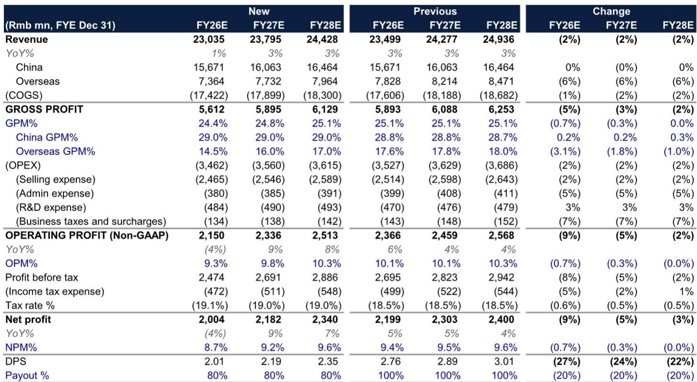
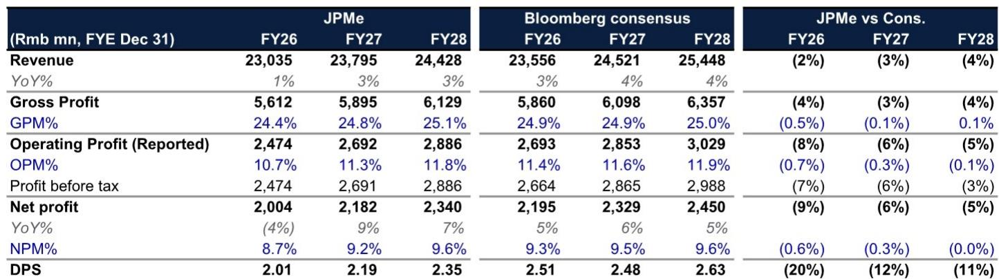
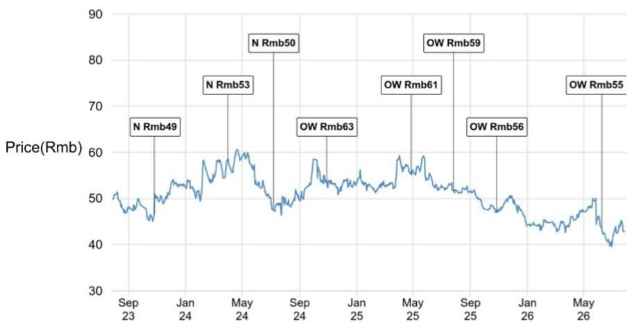

# JPM：月度与季度数据变化观察

苏泊尔二季度初步业绩低于预期，出口业务成为主要影响，并将评级从超配下调至中性。报告认为，公司短期面临出口订单可见度下降和原材料成本不确定性，这些因素正在削弱其过往的盈利稳定性溢价。

二季度收入同比下滑3%，低于JPM此前预期的增长4%。出口是主要影响项。苏泊尔约90%的出口收入来自母公司SEB，而SEB目前正在控制库存，这一调整可能延续至下半年，影响出货节奏的可见度。国内业务表现稳健，但不足以完全对冲出口的变化。JPM因此将下半年收入增长预期从4%下调至3%，而彭博一致预期为增长7%，这意味着后续盈利下调可能继续。

## 1. 出口毛利率大幅下滑，成本锁定未能对冲通胀

二季度毛利率同比下滑约1个百分点，出口毛利率是主要影响。苏泊尔在4-5月锁定了部分原材料价格，但锁价时点晚于石化成本上涨，导致与SEB在通胀前约定的OEM定价之间仍存在缺口。国内毛利率受益于提价而同比改善，销售管理费用也控制得当，但不足以弥补出口端的不确定性。二季度经营利润同比下降16%，较一季度增长3%明显出现变化。JPM预计下半年经营利润将继续同比下降3%，主要基于出口毛利率假设从19%下调至16.3%。

> **KC评论：** 苏泊尔与SEB的OEM定价机制是理解当前利润不确定性的关键。成本锁定发生在价格上涨之后，意味着锁价并未缩小与定价之间的差距，而是确认了更高的成本基础。这一机制在通胀环境中对利润的挤压是结构性的，而非一次性。

## 2. 盈利预测下调幅度集中于出口，国内业务假设基本不变

JPM将2026-2027年每股盈利预测下调5-9%，主要来自出口收入和毛利率的下修。国内业务收入假设保持不变，出口收入下调6%。出口毛利率在2026年从17.6%下调至14.5%，2027年从17.8%下调至16.0%。国内毛利率假设反而小幅上调0.2个百分点。调整后，2026年净利润预计同比下降4%，收入增长1%。报告认为，出口订单恢复和成本不确定性缓解后，2026-2028年收入和净利润复合增长率可分别达到3%和8%。

## 3. 股息预期存在20%的节奏变化不确定性，估值溢价面临压缩

报告特别指出，市场对苏泊尔股息的预期可能过于乐观。JPM预计2026年每股股息为2.01元，对应4.7%的股息率，而彭博一致预期为2.51元，对应5.8%的股息率，两者差距约20%。股息预期的下调来自每股盈利下调和派息率假设的降低。目标市盈率倍数从19倍下调至16倍，接近历史均值下方一个标准差，较当前价格仅隐含约5%的上行空间。

苏泊尔在运营质量、国内执行力和自由现金流方面仍属优质公司。问题不在于结构性竞争力，而在于短期盈利不确定性——出口不确定性、成本不确定性以及有限的经营杠杆，使得此前的估值溢价难以维持。报告列出的上行不确定性包括出口订单更有利的恢复、OEM出口定价重新谈判，以及更清晰的股息承诺。

For informational purposes only. Portions may be generated,translated,summarized,or edited with AI assistance based on source materials and may contain omissions or errors. Please verify independently. This is not investment,legal,tax,accounting,or other professional advice.

