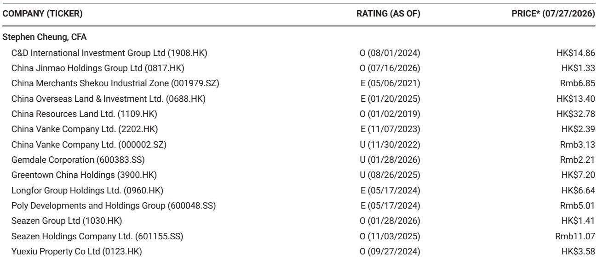
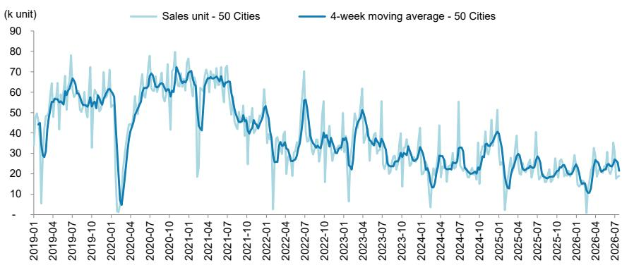

# 中国房地产市场并非全面复苏：一二级市场分化暗示结构性转变，而非周期性反弹

截至7月26日当周的周度数据显示，市场正呈现出两种截然不同的走向。50个城市的新房登记成交量同比下降4%，逆转了前一周3%的温和增长。然而，10个城市的二手房登记成交量同比上升5%，延续了正增长的势头。这并非统计上的偶然现象。这是最新证据，表明中国房地产市场正在进行根本性的再平衡：二手房市场正成为价格发现和交易量的主要场所，而新房市场仍受制于开发商资产负债表压力、购房者对现房的偏好，以及尚未恢复期房销售信心的政策环境。

当周数据还包含一个引人注目的异常现象——去化率。50%的整体数字似乎较前一周的26%有显著改善。但这个总量数据掩盖了巨大的分化：一线城市录得52%的去化率，而前一周仅为4%。这一波动幅度过大，无法仅由真实需求解释。它很可能反映了一线城市少数高端项目集中开盘的影响，开发商通过积极定价和精准营销得以清库存。相比之下，二线城市录得49%的去化率，与前一周的48%几乎持平。二线城市数据的稳定性更能代表市场基本面：需求存在，但并未加速。

50个城市年初至今的新房销售同比为-11%，尽管经历了多轮政策宽松，这一数字并未实质性改善。与此同时，二手房市场年初至今保持了+4%的增长。其含义显而易见：政策刺激在释放现有库存方面比刺激新开工需求更为有效。对于市场观察者和企业战略制定者而言，关键问题已不再是市场是否会复苏，而是哪些板块会率先复苏，哪些会滞后，以及新的均衡状态将是什么样子。

## 一线城市正与全国趋势脱钩，但信号比表面更脆弱

周度追踪中最引人注目的数据点是一线城市新房销售的表现，在经历前一周20%的下降后，当周同比增长13%。这是一个戏剧性的逆转，但不应被解读为一线城市广泛复苏的开始。周度数据的波动性，加上一线市场交易相对数量较小，意味着单周数据可能受到项目特定因素的严重影响：一个豪宅项目开盘、一家国有企业对大量单位提供折扣，或与政策相关的交易登记激增。

更可靠的信号来自二手房市场。一线城市二手房成交量同比增长6%，低于前一周9%的增幅。这是减速，但仍代表积极势头。中原六城二手房挂牌价格跟踪指数从前一周的16.5%降至16.0%，表明价格跌幅继续趋缓。一线城市房产中介指数从52.8升至53.3，表明中介对交易量的看法略趋乐观。综合来看，这些数据点表明一线城市二手房市场正在企稳，而非繁荣。

对于观察者而言，这意味着对一线城市房地产的关注应校准至二手房市场周期，而非新房市场。一线城市的新房销售越来越依赖于少数国有背景开发商的推盘节奏。相比之下，二手房销售反映了真实的终端用户需求和价格发现。在二手房市场有显著敞口的公司——无论是通过经纪、物业管理还是抵押贷款发放——其收入流的可预测性可能高于那些与新房开发利润挂钩的公司。

## 二手房市场正成为主要市场：住房交易模式的结构性转变

二手房相对于新房销售的持续优异表现并非暂时现象。年初至今二手房销售为+4%，而新房销售为-11%。这一差距在过去几个月持续扩大，反映了购房者行为的结构性转变。中国购房者越来越不愿承诺购买期房，因为在开发商违约率仍然较高的环境下，期房存在交付风险。相反，他们倾向于购买二手房市场中已完工、可立即入住的单位，其质量和产权可在付款前核实。

这种转变对开发商、银行和地方政府具有深远影响。对于开发商而言，新房销售下降意味着来自预售的现金流——历史上是行业的命脉——不再是可靠的营运资金来源。无法转向销售现房的开发商将面临日益增长的流动性压力。对于银行而言，向二手房交易的转变改变了抵押贷款风险的性质：二手房抵押贷款以具有可观察价值的现有房产为担保，而新房预售抵押贷款实际上是以未来的交付承诺为担保。随着二手房交易份额上升，抵押贷款组合的风险状况也会发生变化。

地方政府也面临财政挑战。新房土地出让及相关税收一直是市政收入的主要来源。持续向二手房交易的转变会降低土地出让的流转速度及相关税基。一些城市可能会通过限制二手房市场活动来应对——例如，通过限购或提高交易税——但此类措施可能进一步抑制整体市场活动。更可能的结果是，地方政府加速自行购买未售出的新房库存，将其转化为保障性住房或租赁住房，正如在几个二线和三线城市所见。

## 去化率飙升是统计假象，掩盖了停滞的二线市场

50%的整体去化率似乎表明市场在单周内吸收能力几乎弹性较高。这是误导性的。前一周26%的数字异常低，可能反映了新开盘项目较少的一周。当周50%的数字因一线城市的飙升而被抬高。二线城市49%的去化率，与前一周的48%基本持平，是更具参考价值的数据点。

二线城市约50%的去化率意味着每推出两个单位，只有一个在初始营销期内找到买家。这不是一个健康的市场。这表明供应继续超过需求，且开发商的定价不够激进以清库存。该比率周度间的稳定性表明市场已找到暂时的均衡：开发商不愿进一步降价，而买家不愿在当前水平上承诺购买。

对于企业战略制定者而言，这意味着二线市场需要持续的价格调整，交易量才能有意义地增加。在二线市场有大量敞口的开发商应计划延长未售库存的持有期，并考虑将部分项目转为租赁或分期交付模式。另一种选择——等待需求反弹——则面临随着持有成本累积而导致资本进一步受损的风险。

## 驾驭双速市场的决策框架

本周追踪数据可组织成一个简单的决策框架，供观察者和企业规划者参考。该框架有两个轴：市场层级（一线城市与二/三线城市）和交易类型（新房与二手房）。每个象限对战略和风险都有不同的含义。

在一线城市二手房象限，条件最为有利。需求为正，价格跌幅趋缓，中介情绪改善。观察者可考虑增加对一线城市二手房市场中介的关注：物业管理公司、经纪平台和抵押贷款服务机构。风险在于政策收紧——例如重新引入限购——可能逆转趋势，但鉴于政府专注于稳定，短期内似乎不太可能。

在一线城市新房象限，条件波动且因项目而异。13%的周度销售增长令人鼓舞，但并非所有项目都能复制。观察者应将一线城市新房敞口视为战术性、事件驱动的机会，而非战略性配置。主要风险在于单个大型项目开盘可能扭曲数据；潜在趋势仍是买家情绪谨慎。

在二/三线城市二手房象限，条件稳定但未增长。年初至今二手房销售为正，但增长步伐温和。该象限提供防御性特征：稳定的交易量、中介可预测的收费收入，以及来自开发商违约的下行风险有限。机会在于整合：资本充足的二手房市场平台可在小型竞争对手挣扎时获得市场份额。

在二/三线城市新房象限，条件最具挑战性。年初至今新房销售深度为负，去化率停滞。该象限的开发商面临最高的现金流压力和库存减值风险。战略要务是减少敞口：加速降价，将未售库存转为租赁或保障性住房，并避免新的土地收购。观察者应对此象限保持谨慎，除非能具体了解开发商的资产负债表实力和政府支持。

## 中原价格指数确认价格发现仍在进行中

中原六城二手房挂牌价格跟踪指数从前一周的16.5%降至16.0%。该指数衡量六个主要城市挂牌价格的同比跌幅。近几个月来跌幅一直在趋缓，但该指数仍坚定为负。挂牌价格仍在下跌，只是速度放缓。

这与一个正在寻找底部的市场一致。在典型的周期性复苏中，价格在成交量恢复之前企稳。在当前的中国市场，顺序似乎是相反的：二手房市场的成交量首先企稳，而价格继续下跌。这表明卖家仍在向下调整预期以满足买家需求。这个过程尚未完成。

对于买家而言，这创造了一个机会窗口。对于卖家而言，这意味着在短期内等待价格回升很可能是徒劳的。一线城市房产中介指数升至53.3，表明中介看到更多交易，但价格较低。信息很明确：市场正在出清，但仅在显著低于峰值水平的价格上。观察者应假设价格回升将滞后于成交量回升至少6至12个月，并且最终的底部可能低于当前预期。

## 政策环境并未改变潜在需求计算

尽管经历了多轮政策宽松——包括抵押贷款利率下调、首付比例降低以及大多数城市取消限购——新房销售年初至今仍在下降。这表明对需求的制约主要并非监管或财务因素。它们是结构性的：家庭收入增长放缓，就业不确定性仍然较高，且随着房产价值下降，先前房地产周期的财富效应已转为负面。

政策宽松可以降低购买成本，但无法恢复对未来价格上涨的信心。对于大多数中国家庭而言，住房不仅是消费品；它是家庭资产负债表上最大的单一资产。如果家庭认为房价将继续下跌，再多的抵押贷款利率下调也无法促使他们购买。二手房市场之所以运转，是因为买家可以看到他们购买的资产，并且可以在反映当前市场条件的价格上进行交易。新房市场仍然停滞，因为买家无法确定两三年后才能交付的单位价值。

对于观察者而言，这意味着政策公告应根据其改变价格预期轨迹的能力来评估，而非其意图。直接支持二手房市场价格的政策——例如政府购买现有库存或对二手房交易给予税收优惠——可能比那些仅降低新房预售成本的政策更有效。在新房市场能为买家提供与二手房市场相同的价格确定性之前，两者之间的分化将持续存在。

*仅供参考。部分内容可能基于源材料通过AI辅助生成、翻译、总结或编辑，可能存在遗漏或错误。请独立核实。这不构成专业建议。*

仅供参考。部分内容可能基于源材料通过AI辅助生成、翻译、总结或编辑，可能存在遗漏或错误。请独立核实。这不构成专业建议。

