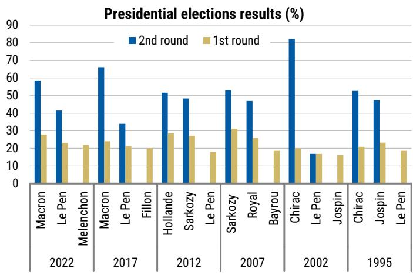
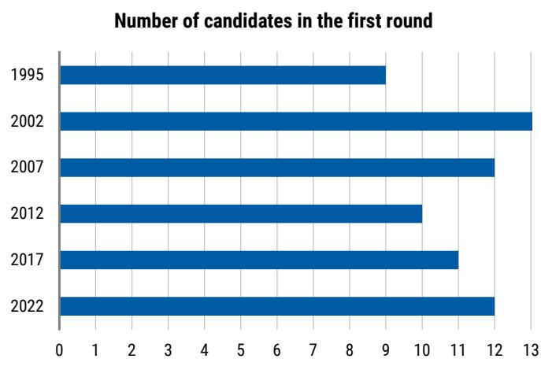
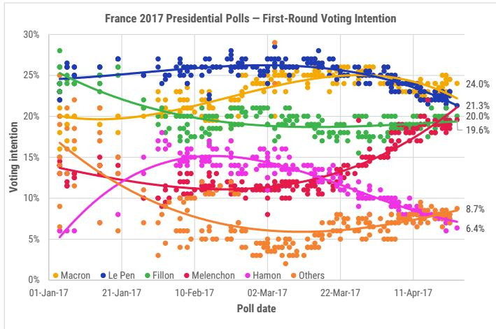
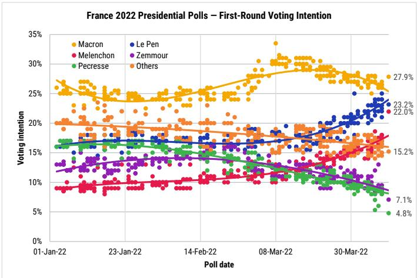
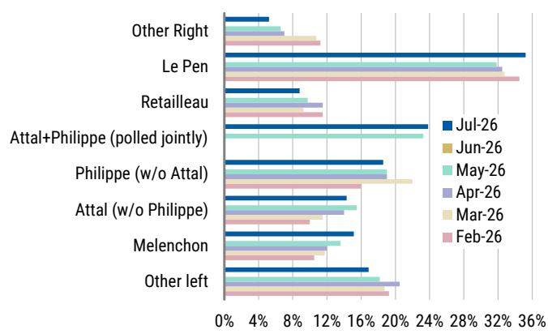
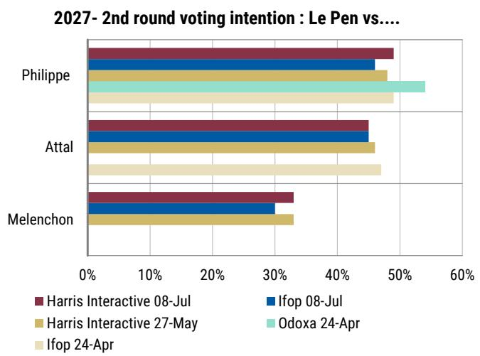

July 28, 2026 04:34 AM GMT

France Economics, Macro & Equity Strategy | Europe

# A Comprehensive Framework Ahead of French Elections

France faces a challenging 12 months with the budget season, presidential election (18 April and 2 May 2027) and perhaps snap parliamentary elections around mid-June 2027. So, we see policy uncertainty remaining elevated for a while. We explore potential implications across economics, equities and macro strategy.

Economics | 2027 elections overview: We highlight that polls can change materially in the final weeks before a French presidential vote and, in 2022, key candidates published their manifestos only close to the election. It is therefore too early to draw any conclusions about the outcome of the next presidential election. That said, we believe the degree of fragmentation on the centre-right is likely to be a key determinant of the first-round outcome. After June 2027, parliamentary arithmetic will determine policy outcomes. Based on the current composition of the national assembly, an outright majority for the next President appears unlikely. Instead, the next Government could face a hung parliament or need to rely on a coalition, with the marginal coalition partner likely to play a pivotal role.

2027 fiscal outlook and beyond: Passing the 2027 Budget Law this autumn will be challenging. We change our baseline and now think it can be adopted if opposition parties conclude that having a budget in place would allow them to implement their own priorities more rapidly after the elections, including through amendments during the summer of 2027. We do not expect this budget to deliver large fiscal consolidation (stable deficit at 5.2% of GDP) and assume the "temporary" surcharge on corporate taxes to remain in that scenario. In the absence of a budget, we think the deficit could increase to 5.9% of GDP next year. Looking further ahead, rising fiscal constraints and a fragmented political landscape suggest limited scope for a meaningful change in France's fiscal trajectory after 2027. Manifestos available so far point to support across a significant part of the political spectrum for repealing the 2023 pension and for higher taxation.

Equity Strategy | All about those tax risks: Our analysis of 90+ presidential elections suggests that French elections should start to get priced 4-6 months before the event, e.g. from about November, during the budget process. From this point, we expect French equities to trade with increased overhang as investors avoid positioning into a period of headline risk around new corporate tax proposals and elevated OAT spreads. Our economist expects the corporate tax surcharge to be extended for a third year into 2027 during the budget process, which is partially priced in, albeit less so for globally oriented stocks. Risks should rise further as parties elaborate on additional corporate tax proposals in the spring – we review the taxes on dividends, buybacks, and revenue-profit mismatches that have been proposed previously. Adding to this, equities tend to see rising OAT spread inverse correlations in periods of political uncertainty. All in, we include a combined screen of stocks that may be most exposed to election-related policy uncertainty (Exhibit 21), and note exposure across much of the index (both domestic and global stocks).

Rates Strategy | Further modest underperformance ahead: We expect French bonds to underperform peers in coming months. The underperformance since 2024 is attributable to a relative macro deterioration; and we believe uncertainty on political outcomes and policy implementation will also contribute going forward. We do not expect large underperformance, however, given still-buoyant risk appetite globally and French bonds already screening cheap in our fair value models, an indication that political uncertainty is partly priced in already.

Credit Strategy | Sovereign spillover underpriced: French corporate credit has not kept pace with the recent widening in OATs, leaving corporate-sovereign yield differentials near decade tights and French risk premia in CDS subdued. We expect historical correlations to reassert themselves, with banks particularly exposed given their higher beta to sovereign spreads and ratings sensitivity. We maintain our preference for buying protection on French bank CDS versus selling protection on iTraxx Senior Financials.

FX Strategy | Hedge political risks with short EUR vs CHF, SEK: EUR may shift from flyer to funder heading into 2027 as investors price in more EUR-negative risk premium associated with the French presidential election, and the ECB shifts from hiking to cutting rates. A basket of CHF and SEK longs vs EUR helps hedge for these two risks while reducing macro exposure to risk assets and oil.

Equity Sector Views | We think French Banks remain vulnerable to political headlines. Key things to look out for are potential taxes on dividends, and in particular buybacks. Separately, we flag that RN is less in favour of the Capital Markets & Banking Union, hence an RN majority could further slow this European project. All in, we have no French banks among our Top Picks, although SocGen is our only Overweight, as we continue to see upside in the strong idiosyncratic story. In Utilities, while we see limited fundamental risks arising from the 2027 presidential elections for Veolia (owing to the nature of its activities), and manageable risk for Engie (except in an RN or LFI absolute majority scenario, which could lead to further control on energy prices), we acknowledge a risk to sentiment and positioning post summer. In Luxury, LVMH, Hermès (\~6% EPS downside), Kering and Richemont are exposed to changes to French corporate tax rates. Current consensus does not incorporate the French tax surcharge post 2026 for LVMH or Hermès. We adjusted our tax rate assumption for LVMH yesterday (here) and adjust the tax rate for Hermès.

## MS EUROPE S.E.+

Jean-Francois Ouvrard
Deputy Chief European Economist
Jean-Francois.Ouvrard@morganstanley.com +49 69-21662813

Jens Eisenschmidt
Chief Europe Economist
Jens.Eisenschmidt@morganstanley.com +49 69-21662817

Marina Zavolock
Equity Strategist
Marina.Zavolock@morganstanley.com +44 20 7425-2318

<table><tr><td colspan="2">Arthur Sitbon, CFA</td></tr>
<tr><td>Equity Analyst</td><td></td></tr>
<tr><td>Arthur.Sitbon@morganstanley.com</td><td>+33 1 42 90 71-03</td></tr>
</table>

MS & CO. INTERNATIONAL PLC+

<table><tr><td colspan="2">Nicolas J Mora</td></tr>
<tr><td colspan="2">Equity Analyst</td></tr>
<tr><td>Nicolas.Mora@morganstanley.com</td><td>+44 20 7677-5376</td></tr>
</table>

Ellie Dann
Strategist
Ellie.Dann@morganstanley.com +44 20 7425-2599

MS does and seeks to do business with companies covered in MS. As a result, investors should be aware that the firm may have a conflict of interest that could affect the objectivity of MS. Investors should consider MS as only a single factor in making their investment decision.

For analyst certification and other important disclosures, refer to the Disclosure Section, located at the end of this report.

+= Analysts employed by non-U.S. affiliates are not registered with FINRA, may not be associated persons of the member and may not be subject to FINRA restrictions on communications with a subject company, public appearances and trading securities held by a research analyst account.

## MS INDIA COMPANY PRIVATE LIMITED+

Yagyesh Modi
Strategist
Yagyesh.Modi@morganstanley.com +91 22 6995-2808

## MS & CO. INTERNATIONAL PLC+

Ned Tidmarsh
Research Associate
Ned.Tidmarsh@morganstanley.com +44 20 7425-0122

Natasha Bonnet
Equity Analyst
Natasha.Bonnet@morganstanley.com +44 20 7677-5723

Equity Analyst
Edouard.Aubin@morganstanley.com +44 20 7425-3160

Leoni Externest, CFA
Equity Strategist
Leoni.Externest@morganstanley.com +44 20 7425-2681

Emily A Woods
Equity Strategist
Emily.Woods@morganstanley.com +44 20 7425-1597

## France 2026-27: Key Events to Watch

## Jean-Francois Ouvrard

A lot will happen in the next 12 months: The next 12 months in France will see a succession of events that are both critical for the country's trajectory and difficult to predict (Exhibit 1). We will keep an eye on the Senate elections in September (see box below), but the first key event is more likely to be the 2027 budget. The initial draft will be prepared by the Government between now and September, and Parliament will begin examining the bill in early October. This will be followed by the presidential elections, with the first round on 18 April and the second on 2 May. In our baseline scenario, snap parliamentary elections are then likely to follow around mid-June, meaning a new government would be fully operational only by the end of June or early July. In the remainder of this section, we summarise our views on these three key events, which we discuss in more detail in the subsequent sections.

Exhibit 1: France – Key dates to watch

<table><tr><td></td><td>Sep-26</td><td>Oct-26</td><td>Nov-26</td><td>Dec-26</td><td>Jan-27</td><td>Feb-27</td><td>Mar-27</td><td>Apr-27</td><td>May-27</td><td>Jun-27</td><td>Jul-27</td></tr>
<tr><td>2027 Budget</td><td></td><td>7 Oct (at the latest); Govt submits draft budget bills to parliament</td><td>ca 26 Nov: Deadline for parliament to adopt the social security budget</td><td>ca 16 Dec: Deadline for parliament to adopt the central govt budget31 Dec: Deadline for passing the budget or adopting a &quot;special law&quot;</td><td></td><td></td><td></td><td></td><td></td><td></td><td></td></tr>
<tr><td>April-27 Presidential Election</td><td></td><td></td><td></td><td></td><td></td><td></td><td>12 March: Candidate filing deadline</td><td>18 April: First round of presidential election</td><td>2 May: 2nd round of presidential election14 May: New presidential term starts</td><td></td><td></td></tr>
<tr><td>(Potentially)Snap parliamentary elections(MS Baseline)</td><td></td><td></td><td></td><td></td><td></td><td></td><td></td><td></td><td>Mid-May: New president likely dissolves the national assembly</td><td>Mid-June: (likely) Parliamentary electionsEnd-June: (likely) New PM and Government appointed</td><td></td></tr>
<tr><td>Other</td><td>27 Sept: Senate partial elections</td><td></td><td></td><td></td><td></td><td></td><td></td><td></td><td></td><td></td><td></td></tr>
</table>

Source: Le Monde, MS

## 2027 budget

Our baseline: A 2027 budget with limited fiscal consolidation: With a split parliament and elections around the corner, passing the budget will be challenging. We assume, however (see our detailed analysis below in Fiscal Outlook: 2027 and Beyond), that there is path for the Government to secure its adoption, essentially because, for all parties hoping to be in power after April, having a 2027 budget law already in place would provide a framework they could subsequently amend. We also highlight a plausible alternative scenario in which the Government implements the budget via ordinances if parliament fails to reach a decision (positive or negative) before December. Even assuming the budget is passed, we expect fiscal consolidation next year to be limited, with a deficit at 5.2% of GDP. Absent a budget, we think France's fiscal position would deteriorate significantly, with the deficit rising towards 5.9% of GDP next year.

Key things to watch: We expect to learn more about the draft budget prepared by the Government in the final weeks of August and early September. If the Government wishes to shorten parliamentary discussions, it could invoke Article 49.3 as early as October, which would likely trigger a vote of no confidence. Alternatively, if it opts to implement the budget via ordinances, this could only happen after the constitutional 70-day deadline has expired, i.e. from mid-December onwards.

## Presidential elections in April

Our baseline: More clarity only in early 2027? The presidential election will be held on 18 April (first round) and 2 May 2027 (second round). President Macron's terms ends on 14 May and that is when the next President will take office, for a five-year term. The first round of the elections is likely to have 10+ candidates (12 in 2022 and 11 in 2017) and the top two candidates will then advance to a runoff held two weeks later. In the next section, we discuss the information available today, the main scenarios and the expected timeline.

Key things to watch: Our review of past elections suggests that patience is required before forming a more precise view on the potential outcome. This may only be possible a couple of weeks before the elections. We highlight, for instance, the very large gaps, in 2017 and 2022, between polling in January-February and the actual first-round results in April. We also note that, in 2022, key candidates (for instance, the two who qualified for the second round) released detailed information on their manifestos only a couple of weeks before the first round.

## Snap parliamentary elections in June?

Our baseline: A fresh start: Following the snap parliamentary elections of June 2024, the mandate of MPs currently sitting in the national assembly runs until 2029. However, parliament is split and the next President, whoever that may be, is unlikely to secure a majority. In that context, observers (see here and here) expect that the new President will dissolve parliament. Under Article 12 of Constitution, dissolving the national assembly is indeed one of the President's constitutional powers and can be exercised at their discretion. Once the national assembly is dissolved, snap legislative elections must be held between 20 days and 40 later. Assuming the dissolution is pronounced as early as mid-May, this would imply elections around mid-June. We discuss potential scenarios in the next section and highlight the significant risk that these elections may still fail to deliver a majority to the president elected in April 2027.

Key things to watch: We would expect candidates to be explicit during the electoral campaign as to whether or not they intend to dissolve parliament. Whether the next president ultimately secures a majority will, however, depend on the political dynamics that unfold after April, which are difficult to anticipate from today's perspective.

## Keep an eye on the Senate elections too, on 27 September 2026

Members of the Senate, the upper chamber of Parliament, are elected for a six-year terms through indirect elections. These are held every three years to renew approximately half of the Senate's 348 seats. The next election will be on 27 September 2026 and cover 178 seats. Senate elections generally receive less attention than National Assembly elections for several reasons.

First, voters do not cast ballots directly. Senators are elected by a college of around 162,000 "grands électeurs", comprising mainly municipal councillors and other local elected officials. As a result, Senate elections primarily reflect the balance of political power at the local level.

Second, the Senate cannot bring down the Government through a vote of no confidence, and, in the event of persistent disagreement between the two chambers of parliament, the National Assembly has the final say on most legislation. However, the Senate plays an active role in amending bills and scrutinising government action; and its approval is required for constitutional reforms.

From that perspective, the 2026 Senate elections are of interest. They will be the first nationwide political vote after the March 2026 municipal elections, and local changes are likely to be reflected in the composition of the upper chamber. Analysts (here) expect the centre-right and right to retain control of the Senate, but they also see a possibility that Rassemblement National (RN) wins enough seats to form its first ever Senate group, giving it greater institutional influence. Ultimately, the Senate elections will provide an early indication of the political landscape ahead of the 2027 presidential campaign, highlighting which parties have succeeded in maintaining or expanding their influence at the local level.

# 2027 Presidential Elections: What to Expect

Jean-Francois Ouvrard

## French presidential election: what you need to know

How does it work? The French presidential election is held over two rounds, scheduled next year on 18 April and 2 May. The first round is open to all candidates. The only requirement is to secure 500 endorsements from elected local officials by the constitutional deadline of 12 March 2027. The second round is a run-off between the two candidates who receive the most votes in the first round. President Macron's term then ends on 14 May, when the next President will take office.

How popular do you need to be? A two-rounds election has a specific dynamic, and there is a saying in French politics (see here for instance) that "In the first round voters choose, in the second round voters eliminate [the candidates they do not want]". Relatively modest vote shares in the first round are typically sufficient to qualify for the run-off, making the first round highly competitive (Exhibit 2). Over the past 30 years (six elections), the threshold for qualifying for the second round (i.e. the vote share of the candidate who finished third) has ranged between 16.2% (2002) and 22.0% (2022), with an average of 19%. And between 1995 and 2022, the elected President received, on average, 25% of the vote in the first round, while the candidate who went on to lose in the second round received, on average, 23%. In short, this is a close race.

How many candidates will there be? The relatively low vote share required to qualify for the second round means that many contenders, even those currently polling relatively low, can still hope to build momentum and secure a place in the run-off. Against this backdrop, the list of potential candidates remains exceptionally long: Le Monde identifies more than 30 potential contenders (here). We would expect this list to narrow to around 10 candidates by the time nominations close, broadly in line with previous elections (Exhibit 3).

Exhibit 2: Since 1995, the bar for qualifying for the second round has stood >19% on average  
  
Source: Ministry of Interior, MS. Note: the chart shows the candidates with the three highest score in the first round.

Exhibit 3: Since 1995, on average there have been 12 candidates in the first round  
  
Source: Ministry of Interior, MS

## Polls

Nothing is done until it's done: Exhibit 4 and Exhibit 5 show polling trends during the 2017 and 2022 presidential elections, from January until the first round in April (23 April 2017 and 10 April 2022, respectively). They illustrate two key points: (i) voting intentions can shift significantly within just a few weeks, and (ii) polls can both underestimate and overestimate candidate outcomes, even very close to election day. In 2022, for instance, Mélenchon was polling below 10% in January but received 22% of the vote in the first round; conversely, Pécresse was polling at around 9% on average in April but received only 4.8% of the vote. In 2017, Mélenchon was polling only slightly above 10% in March before securing 19.6% of the vote in the first round; conversely, Le Pen was polling above 25% throughout most of February and March but ultimately received 21.3% of the vote in the first round.

Exhibit 4: A lot changed between January and April 2017...  
  
Source: Ifop, Ipsos, BVA, Opinion Way, Harris Interactive, Cluster 17, MS. Note: We show the five candidates with the highest score in the first round of the elections on 23 April 2017 (as shown by the labels on the right). Lines show polynomial smoothing of polls across time.

Exhibit 5: ...and again between January and April 2022  
  
Source: Ifop, Ipsos, BVA, Opinion Way, Harris Interactive, Cluster 17, MS. Note: We show the five candidates with the highest score in the first round of the elections on 10 April 2022 (as shown by the labels on the right). Lines show polynomial smoothing of polls across time.

Polls ahead of the 2027 election | Where do we stand? That said, current polls (Exhibit 6 and Exhibit 7) point to three key developments to watch when assessing the likely outcome of the election:

(i) Marine Le Pen is currently polling between 30% and 35% in the first round. This is a historically high level: across the six presidential elections since 1995, the highest first-round score was 31.2% (Sarkozy in 2007).

(ii) Mélenchon is polling at around 15% in July, up from 11% in February. At this stage, however, the list of other left-wing candidates (Communists, Ecologists and Socialists) remains unclear, while these parties together poll around 18%. There is therefore still considerable uncertainty about the distribution of votes across the left, and the support for individual candidates could still move significantly higher or lower.

(iii) When Attal and Philippe are assumed both to be candidates simultaneously, their combined vote share is estimated at above 20%. However, when polls assume only one of them will be a candidate (Attal without Philippe, and vice versa), they tend to poll lower, at around 19% for Philippe in July and 14% for Attal. We also note that Retailleau (Les Républicains) is polling at around 10%. Ultimately, whether the centre and right have three candidates (or more) or just one will likely be a key factor in deciding the threshold for qualifying for the second round. Ultimately, the degree of fragmentation on the centre-right is likely to be one of the key determinants of the threshold for qualifying for the second round.

Exhibit 6: As of today, Le Pen is polling well ahead other candidates in the first round...  
France 2027 Presidential Polls – First-Round Voting Intention  
  
Source: Elabe, Opinion Way, Harris Interactive, Ifop, Ipsos, MS. Note: We show the six candidates with the highest polls as of today.

Exhibit 7: ...and polls suggest she has also a fair chance to win the second round  
  
Source: Ifop, Odoxa, Harris Interactive, MS. Note: The chart shows scores in a face-off with Le Pen in the second round ie if opponents are shown above 50% in that chart they would be elected, while Le Pen would be elected otherwise.

## Post-election scenarios: how to frame the debate?

Presidential election x parliamentary election = many possibilities: The presidential election will very likely be followed by snap parliamentary elections (see the previous section). This significantly expands the range of potential political outcomes, as the final scenario will depend on both the winner of the presidential election and the composition of the new national assembly. The next President could face a hung parliament (as is the case today), secure a parliamentary majority, or find themselves in an intermediate position, without a majority from their own party but able to rely on support from a broader coalition.

Compromises needed? Looking at the current composition of the National Assembly (Exhibit 8), where the largest party, RN, holds only 24% of the seats, it does not seem very likely that any President will secure an outright majority. Instead, the next President will probably have to govern with allies whose policy positions may be more or less closely aligned with their own. In such coalitions, the marginal partner can play a pivotal role, as the governing majority may depend on only a small number of MPs. This would likely require compromises, meaning the next President may not be able to implement their manifesto in full.

Four broad scenarios: Against this backdrop, we identify four broad scenarios from today's perspective, based on the current composition of the National Assembly (Exhibit 8). The first is a hung parliament. Irrespective of who becomes President, this would represent a continuation of the political environment France has experienced since 2024, with a significant risk of the Prime Minister being voted out (France has had three Prime Ministers in the past two years) and limited room for manoeuvre for the Government, as illustrated by the difficulties in passing the 2025 and 2026 budgets. The three other scenarios see a President supported by a parliamentary majority from either the left (ranging from La France Insoumise (LFI) to the Socialists, which formed the Nouveau Front Populaire coalition in 2024), the centre/centre-right (likely from Renaissance to Les Républicains, the bloc currently supporting the Government), or RN (together with its allies, including support from parts of the conservative right, such as the UDR led by Éric Ciotti).

Exhibit 8: Since the June 2024 snap legislative elections, the national assembly has been split

<table><tr><td rowspan="2"></td><td colspan="4">Left (2024 Nouveau Front Populaire): 194</td><td colspan="4">Centre and right (&quot;Socle Commun&quot;): 211</td><td colspan="2">RN and allies:</td><td>Others</td></tr>
<tr><td>LFI</td><td>Ecologists</td><td>Communists Party</td><td>Socialist Party</td><td>Renaissance</td><td>MoDem</td><td>Horizons</td><td>Les Republicains</td><td>UDR</td><td>RN</td><td></td></tr>
<tr><td>Announced candidates for 2027</td><td>Melenchon</td><td>Tondelier</td><td>Roussel</td><td>?</td><td>Attal</td><td>?</td><td>Philippe</td><td>Retailleau</td><td colspan="2">Le Pen</td><td>?</td></tr>
<tr><td>Number of MPs in current National Assembly</td><td>71</td><td>38</td><td>17</td><td>68</td><td>90</td><td>37</td><td>36</td><td>48</td><td>17</td><td>122</td><td>33</td></tr>
</table>

Source: National Assembly, Le Monde, MS

Busy first months domestically... Exhibit 9 shows the key dates through December 2027 for the new Government. Given the fiscal backdrop and the new Government's potential willingness to change policy direction, we expect key decisions to be taken very early in the term. On the domestic front, the focus will be on the 2027 and 2028 budgets. If a 2027 budget law has already been passed, the new Government would be able to amend it during the summer. Previous elections show that such amendments can be adopted as early as August (see box below). In the absence of an adopted 2027 Budget Law, however, the Government would need first to pass one, which would be a much more extensive exercise. We assume this could not be completed before September, or even October. This would then largely overlap with the preparation of the 2028 Budget Law, which the Government would need to draft during the summer before submitting it to Parliament at the beginning of October.

...and at the EU level: At the EU level, we highlight two key deadlines. As part of the EU fiscal surveillance framework, France is required to submit its Draft Budgetary Plan to the European Commission around mid-October. This is, broadly speaking, a by-product of the Budget Law submitted to the French Parliament a couple of weeks earlier and should therefore not be a major issue. More importantly, while the European Commission is aiming to secure a political agreement on the EU Multi-annual Financial Framework (MFF) for 2028-2034 by the end of 2026 – that is, before the French presidential election – we would not rule out negotiations extending until much closer to the end of 2027, as was the case during the previous negotiations in 2020 (see box below).

Exhibit 9: Timeline – a busy end of 2027 after the elections

<table><tr><td></td><td>May-27</td><td>Jun-27</td><td>Jul-27</td><td>Aug-27</td><td>Sep-27</td><td>Oct-27</td><td>Nov-27</td><td>Dec-27</td></tr>
<tr><td>France</td><td>14 May: New President takes office</td><td>mid-June: snap parliamentary electionsend-June: Government formed</td><td></td><td>Potentially: Budget law amending the 2027 budget (if voted before the elections)</td><td>If needed: 2027 budget law to be passed</td><td>Early October: Draft 2028 Budget law submitted to parliament</td><td></td><td>Before end-Dec: 2028 budget adopted</td></tr>
<tr><td>EU fiscal framework</td><td>Spring European Semester: Country-specific recommendations</td><td></td><td></td><td></td><td></td><td>Mid-October: France communicates its draft budgetary plan for 2028</td><td>Autumn European Semester: Country-specific recommendations</td><td></td></tr>
<tr><td>Other EU policies</td><td></td><td colspan="6">Potentially: ongoing negotiations on the EU multi-annual financial framework (MFF) for 2028-2034</td><td>EU budget (Multi-annual Financial Framework 2028-2034) must be agreed</td></tr>
</table>

Source: MS

## Meaningful changes to the fiscal stance already in the summer?

Exhibit 10: Newly elected governments tend to amend the initial budget bill

<table><tr><td>Presidential election</td><td>Prime Minister</td><td>Chang of majority in parliament after the presidential elections ?</td><td>Amending budget initiated by the government</td><td>Amending budget voted in parliament</td></tr>
<tr><td>2007 - Sarkozy</td><td>Fillon</td><td>No</td><td>21-Nov-07</td><td>25-Dec-07</td></tr>
<tr><td>2012 - Hollande</td><td>Ayrault</td><td>Yes</td><td>04-Jul-12</td><td>16-Aug-12</td></tr>
<tr><td rowspan="2">2017 - Macron</td><td rowspan="2">Philippe</td><td rowspan="2">Yes</td><td>02-Nov-17</td><td>01-Dec-17</td></tr>
<tr><td>15-Nov-17</td><td>28-Dec-17</td></tr>
<tr><td rowspan="2">2022 - Macron</td><td rowspan="2">Borne</td><td rowspan="2">No</td><td>07-Jul-22</td><td>16-Aug-22</td></tr>
<tr><td>02-Nov-22</td><td>01-Dec-22</td></tr>
</table>

Source: MS

Exhibit 10 shows that, following two of the past four presidential elections (in 2012 and 2022), the new Government passed an amending budget law as early as August. From today's perspective, the 2012 episode is likely the most relevant (here). The Government adopted a supplementary finance bill aimed at both consolidating the public finances and implementing some of President Hollande's campaign commitments. The bill sought to keep the fiscal deficit on target despite lower-than-expected tax revenues. To offset the revenue shortfall, the Government introduced significant tax increases (around €7bn), mainly through higher taxes on large corporations, banks, financial transactions, and high-income households.

EU Multi-annual Financial Framework 2028-2034: What is the timeline?  
Exhibit 11: A political agreement on the 2021-28 MFF was reached only late in 2021

<table><tr><td>Date</td><td>Institution</td><td>Event</td></tr>
<tr><td>02-May-18</td><td>European Commission</td><td>Formal legislative proposal for the 2021–2027 MFF</td></tr>
<tr><td>20–21 Feb-20</td><td>European Council</td><td>Special summit</td></tr>
<tr><td>27-May-20</td><td>European Commission</td><td>Revised proposal</td></tr>
<tr><td>17–21 July-20</td><td>European Council</td><td>Five-day summit</td></tr>
<tr><td>10-Nov-20</td><td>Parliament &amp; Council</td><td>Political agreement</td></tr>
<tr><td>16-Dec-20</td><td>European Parliament</td><td>Parliament approval</td></tr>
<tr><td>17-Dec-20</td><td>European Council</td><td>Formal adoption</td></tr>
<tr><td>01-Jan-21</td><td>EU</td><td>MFF enters into force</td></tr>
</table>

Source: European Commission (here and here), MS

At the EU level, one key ongoing negotiation concerns the Multi-annual Financial Framework (MFF), i.e. the EU's long-term budget, for the 2028-2034 period.

A recent communication from the European Commission (here) calls for an early political agreement: "Following the European Commission's initial proposals for the 2028-2034 period presented in July and September 2025, an EU agreement on the overall MFF by the end of 2026 would allow for the adoption of legislative acts in 2027. This is necessary to ensure that EU funding reaches beneficiaries without interruption from January 2028."

If EU Heads of State or Government were to reach a formal agreement before the end of 2026, this would likely limit the ability of the next French President to reopen the negotiations. We note, however, that negotiations on the 2021-2027 MFF were concluded only close to the deadline, in the second half of 2020, for a framework entering into force in January 2021. A repeat of that timeline should therefore not be ruled out.

## Manifestos: overview

Before diving into the manifestos already available today (in the next subsection), we look at the timing of publication in 2022, voters preoccupations and the specific issue of the pension reform.

Looking back at 2022: The communication and publication of election manifestos is a key stage of any presidential campaign, and candidates adopt different strategies, as illustrated by the three candidates who finished first in the first round in 2022 (Exhibit 12). Mélenchon, for instance, published a comprehensive manifesto as early as October 2021. By contrast, Macron officially declared his candidacy only in March 2022 and published his manifesto just one month before the first round. In between, Le Pen released several policy booklets and a core document setting out 22 measures over the course of several weeks, complemented by thematic presentations, including press conferences on pensions in February and fiscal policy in March.

Exhibit 12: In 2022, strategies differed across candidate

<table><tr><td>Candidate</td><td>First round score</td><td>Format of manifesto</td><td>Date of communication of the manifesto</td></tr>
<tr><td>Macron</td><td>27.9%</td><td>Booklet - Avec Vous</td><td>17-Mar-22</td></tr>
<tr><td>Le Pen</td><td>23.2%</td><td>Thematic booklets and a core 22-measure document. Thematic presentations</td><td>Pensions : 17-Feb-22Fiscal : 23
