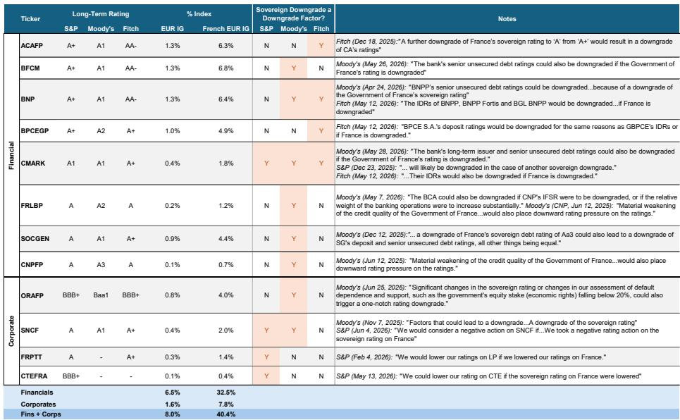
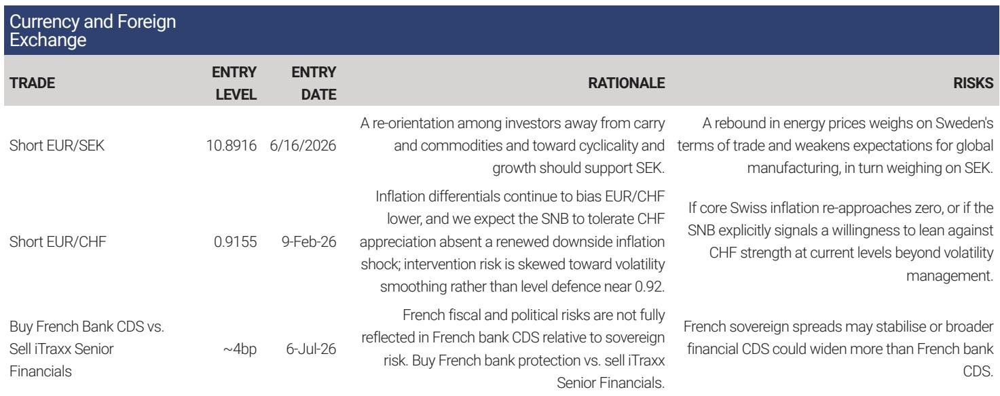
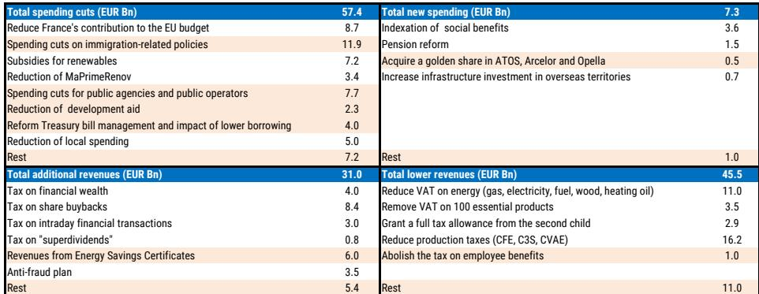

# 法国政治僵局：一个市场正在逐步定价的多资产风险

法国即将进入一个为期12个月的时期，期间三项高风险的重大政治事件——2027年预算通过、2027年4-5月的总统选举，以及可能于6月举行的提前议会选举——将以大多数市场参与者尚未充分预期的方式相互交织。核心矛盾在于：该国面临公共财政状况的挑战、碎片化的政治体制，以及一个迫使财政与选举决策同步进行的日程表。今年秋季的预算过程将是检验政治体系能否在压力下产生治理能力的首次考验，其结果将为法国各类资产（包括权益、利率、信用和外汇）直至2027年的走势设定轨迹。那些将法国政治风险视为单一二元事件（即总统选举）的市场，正在忽略未来一年内将相互放大的、连续的财政、选举和立法不确定性的叠加效应。

一家全球性投资银行于2026年7月发布的一份报告，为应对这一环境提供了一个结构化框架。该分析涵盖了宏观经济、权益策略、利率、信用、外汇以及行业层面的影响。核心信息是：法国政治风险并非尾部事件，而是一个持续性的压制因素，需要跨资产类别的主动组合布局。该报告态度审慎而不危言耸听，其分析基于历史选举数据、财政计算和市场定价异常。以下内容将该分析转化为供机构读者参考的决策框架。

## 2027年预算将成为首个引爆点，其结果决定后续一切财政基线

今年秋季启动的预算过程并非例行公事。它是对法国碎片化的议会在总统大选临近的阴影下，能否形成执政共识的首次约束性考验。报告的基本情景假设预算将获得通过，但财政整顿力度有限——赤字占GDP比重稳定在5.2%而非下降。这是一个重要的假设，因为它意味着被描述为“临时性”的企业附加税将被延长至第三年。另一种情景是预算未能通过，这将导致赤字升至GDP的5.9%，这种恶化将加速侵蚀法国的财政信誉。

使预算得以通过的机制并非两党合作，而是策略性算计。报告认为，反对党可能更倾向于让预算到位，因为这为他们掌权后提供了一个可以修改的法律框架，而非继承一个财政真空。这是一种冷静理性的逻辑，但它依赖于所有党派都相信自己有在2027年4月后掌权的现实路径。如果这一假设不成立——即某个党派或联盟相信自己能直接获胜并更倾向于制造危机——预算则可能失败。读者应关注2026年9月27日的参议院选举，将其作为早期信号。这些选举不会直接决定预算结果，但它们将揭示极右翼政党“国民联盟”能否组建其首个参议院团体，从而获得可用于阻挠财政立法的体制性杠杆。

对于权益读者而言，预算之所以重要，是因为它将确认企业附加税是否会成为法国财政格局的永久特征。报告指出，这一附加税已部分反映在国内公司的定价中，但对于全球化经营的公司而言则较少。这种差异造成了一种选择性风险：具有法国税务敞口的跨国企业可能面临尚未被市场共识捕捉到的盈利修正。预算还将为各党派可能在总统竞选期间公布的、更激进的税收提案（包括对股息、回购以及收入-利润错配征税）奠定基础。这些并非假设；它们在之前的周期中已被提出，并很可能再次浮现。

## 总统选举创造了一个极端不确定性的窗口，这种不确定性直到投票前数周才会消散

总统选举采用两轮投票制。报告的历史分析显示，在过去六次选举中，进入第二轮投票的资格门槛在第一轮的平均得票率仅为19%。民调在最后几周会发生实质性变化，2022年的关键候选人在第一轮投票前仅数周才发布详细政纲。这一模式意味着，读者无法依赖早期民调来为结果布局。竞争将直到2027年3月底或4月初仍保持真正的不确定性，而这种不确定性将抑制对法国权益的风险偏好，并扩大主权债券利差。

报告将中右翼的碎片化程度确定为决定第一轮结果的关键因素。这是一个结构性洞见：碎片化的中右翼增加了两名极端候选人进入第二轮投票的概率，这将产生比温和派与极端派对决更两极分化的结果。读者不应只关注谁赢得总统职位。2027年6月后的议会构成将决定下一任总统能否执政。报告明确指出，根据国民议会的当前构成，下一任总统获得相对多数似乎不太可能。更可能出现的结果是悬浮议会或联合政府，其中边缘联合伙伴将拥有不成比例的权力。

这对政策连续性有直接影响。已公布的政纲显示，政治光谱中相当一部分力量支持废除2023年的养老金改革并支持增税。无论其构成如何，下一届政府都将面临日益严峻的财政约束和有限的操作空间。报告的结论发人深省：2027年后法国财政轨迹发生有意义改变的空间有限。那些期望选举后出现财政清理的读者可能会失望。

## 法国权益面临已部分定价但尚不完整的税收风险，该风险将在竞选期间升级

报告的权益策略分析基于对超过90次总统选举的研究，该研究表明法国权益在投票前四到六个月开始对选举风险进行定价。这一时间线指向2026年11月，即预算过程期间，作为转折点。从那时起，报告预计法国权益将因读者避免在围绕新企业税收提案和OAT利差上升的新闻风险时期建立头寸，而面临日益增加的压制。

税收风险是最具体且可衡量的渠道。企业附加税的延长已部分定价，但报告指出，全球化经营的股票尚未完全调整。这是一个关键区别。大部分收入来自法国国内的法国公司，其交易价格已包含反映更高税收预期的折价。而拥有大量国际收益的出口导向型公司则没有，这使得它们在附加税延长或对股息和回购征收新税的情况下，面临盈利意外下滑的风险。

报告提供了一个综合筛选，列出了对选举相关政策不确定性最敏感的股票，并指出这种敞口遍及指数的大部分，包括国内和全球股票。这不是一个可以通过简单轮动至防御性板块来对冲的特定行业风险。这是一个广泛的压制因素，需要更精确的工具，如单一名称CDS或特定行业布局。报告的行业观点强化了这一点。法国银行被标记为对政治新闻特别脆弱，对股息和回购的潜在税收是关键风险。报告还指出，“国民联盟”获得多数席位可能会减缓资本市场与银行联盟——一个法国银行一直寄望于其增长的欧洲项目。在公用事业领域，风险更多关乎情绪而非基本面，除非出现可能导致对能源价格进一步控制的极端情景。在奢侈品领域，报告量化了爱马仕因法国公司税率变化而面临的每股收益下行风险约为6%，并指出市场共识目前并未将2026年后的附加税纳入路威酩轩或爱马仕的预期中。

## 法国债券已部分定价政治风险，但信用市场尚未跟进

报告中的利率策略是微妙的。自2024年以来，法国债券表现逊于同类，报告将其归因于相对宏观环境的恶化。政治不确定性将导致进一步的表现不佳，但报告预计不会出现大幅利差扩大，因为全球风险偏好依然活跃，且法国债券在公允价值模型中已显得廉价。这表明债券市场已部分定价了政治风险，这限制了进一步的下行空间，但并未消除它。

信用策略识别出一个更危险的不匹配。法国公司信用利差并未跟上近期OAT利差的扩大，使得公司-主权回报表现差接近十年来的最低点，法国CDS的风险溢价也处于低位。报告预计历史相关性将重新确立，这意味着公司信用利差最终将扩大以反映主权压力。银行因其对主权利差和评级敏感性具有更高的贝塔值而成为最脆弱的板块。报告建议买入法国银行CDS保护，同时卖出iTraxx Senior Financials保护，这是一个从主权-公司关联性重新确立中获利的配对交易。

对于信用读者而言，这是报告中最具可操作性的信号。当前的定价假设法国公司信用与主权风险绝缘，这在历史上是反常的。当重新关联发生时，银行板块的反应将最为剧烈，但风险遍及整个公司债券市场。那些在未对冲主权敞口的情况下持有法国公司信用的读者，实际上是在进行一笔杠杆押注，押注政治进程将产生一个良性的结果。

## 外汇市场提供了对冲两大主导风险的最干净工具：政治不确定性与央行政策分化

报告中的外汇策略是多资产框架中最优雅的体现。报告认为，随着读者对法国选举进行定价，以及欧洲央行从加息转向降息，欧元可能从融资货币转变为风险溢价的目标。这两种力量是不同但相互强化的。政治风险溢价是法国特有的，但将对整个欧元构成压力，因为法国是欧元区第二大经济体和货币联盟的核心成员。欧洲央行的政策分化是一个更广泛的宏观因素，影响着欧元相对于那些央行仍在收紧或维持高利率的货币。

报告推荐一篮子瑞士法郎和瑞典克朗多头头寸，作为对欧元的对冲。其逻辑是，瑞郎和瑞典克朗提供了对两种不同风险因素（政治不确定性和利率差异）的敞口，同时减少了对风险资产和石油的宏观敞口。这不是对欧元崩溃的方向性押注。它是一种对冲，旨在防范报告所识别的特定风险组合。对于那些无法或不愿做空法国权益或法国CDS的读者而言，外汇对冲是最具流动性和可扩展性的替代方案。

## 应对未来12个月的决策框架

报告的分析可综合为一个三阶段框架，读者可据此随着事件发展校准其布局。

第一阶段，从现在到2026年11月，是预算阶段。关键问题是预算是否通过，以及它揭示了关于企业税收轨迹的什么信息。读者应关注9月27日的参议院选举，作为“国民联盟”体制影响力的早期指标。如果预算在有限整顿和延长企业附加税的情况下通过，权益风险将从附加税本身转移到各党派在竞选期间将公布的额外税收提案上。如果预算失败，财政恶化将加速，法国资产的风险溢价将立即上升。

第二阶段，从2026年11月到2027年3月，是定价阶段。报告的历史分析表明，这是选举风险开始被纳入权益定价的时期。这种压制在法国银行和全球化经营的奢侈品股票中将最为明显。读者应减少对税收风险尚未定价的股票的敞口，并通过法国银行CDS和做空欧元兑瑞郎/瑞典克朗来增加对冲。债券市场将继续表现逊于同类，但不会大幅恶化，因此信用市场仍是最被错误定价的资产类别。

第三阶段，从2027年4月到6月，是解决阶段。总统选举将产生一位胜者，但6月的议会选举将决定这位胜者能否执政。对市场而言，最危险的结果并非特定候选人赢得总统职位，而是出现一个无法通过立法的分裂政府。在这种情景下，财政僵局持续，赤字保持高位，主权-信用关联性将强力重新确立。最良性的结果是一位能够组建稳定联盟的总统，但报告的分析表明这是最不可能的情景。

贯穿所有三个阶段，报告最重要的洞见是：法国政治风险并非单一事件，而是一系列相互关联的决策和结果。那些将总统选举视为相对少见里程碑的读者，将在今年秋季的预算过程和明年夏天的议会构成问题上措手不及。上述框架提供了一种跨资产类别进行风险评估和头寸规模排序的方法，但它并未消除根本性挑战：法国的政治体制正进入一个近期没有先例的压力时期，而市场才刚刚开始对这一现实进行定价。

*仅供参考。部分内容可能基于源材料通过AI辅助生成、翻译、总结或编辑，可能存在遗漏或错误。请独立核实。本文不构成投资、法律、税务、会计或其他专业建议。*

仅供参考。部分内容可能基于源材料通过AI辅助生成、翻译、总结或编辑，可能存在遗漏或错误。请独立核实。本文不构成投资、法律、税务、会计或其他专业建议。

