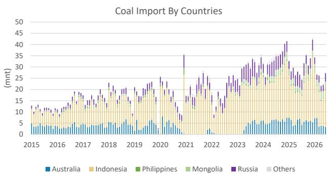

# 煤炭行业周度观察：印尼煤进口套利窗口持续开放

## 核心要点

动力煤价格周环比上涨，焦煤价格保持韧性。

动力煤价格上行：截至7月24日，秦皇岛港5500大卡动力煤价格周环比微涨0.4%至725元/吨。环渤海动力煤价格指数周环比上涨0.3%至715元/吨。CCI 5500指数周环比上涨1.3%至827元/吨。山西大同5800大卡坑口价格周环比上涨0.4%至711元/吨。

海运煤价格小幅上涨：纽卡斯尔港动力煤价格周环比上涨0.8%。

国内焦煤价格保持韧性：柳林4号坑口价格周环比持平于850元/吨。车板价维持在2010元/吨不变。昆士兰焦煤价格周环比下跌1.3%至230美元/吨。

本周图表——印尼煤进口套利窗口持续开放：6月中国动力煤进口量环比增长38.3%。印尼是中国动力煤进口的最大来源国，占当月动力煤进口总量的53.8%，来自印尼的发运量环比激增34.9%。这或反映出市场对电厂需求改善及6月套利空间扩大的预期。7月进口窗口依然开放，可能意味着本月进口量维持高位。

图表1：本周图表——煤炭进口分国别情况  
  
来源：Sxcoal，MS。

图表2：本周数据

|  |  | 7月24日 | 周环比 | 年初至今 | 年初至今均值 | 2025年均值 | 年初至今vs 2025年 |
|---|---|---|---|---|---|---|---|
| **区域** |  |  |  |  |  |  |  |
| 纽卡斯尔港动力煤 | 美元/吨 | 131 | 0.8% | 20.2% | 128 | 106.6 | 20.3% |
| 昆士兰焦煤 | 美元/吨 | 230 | -1.3% | 5.5% | 234 | 189.0 | 23.9% |
| **中国** |  |  |  |  |  |  |  |
| 秦皇岛港5500大卡 | 元/吨 | 725 | 0.4% | 4.3% | 704 | 684 | 3.0% |
| CCI 5500大卡 | 元/吨 | 827 | 1.3% | 21.3% | 777 | 864 | -10.0% |
| 环渤海动力煤价格指数 | 元/吨 | 715 | 0.3% | 2.9% | 697 | 682 | 2.2% |
| 柳林4号坑口 | 元/吨 | 850 | 0.0% | 26.9% | 735 | 641 | 14.5% |
| 柳林4号车板价 | 元/吨 | 2,010 | 0.0% | 27.2% | 1,694 | 1,399 | 21.1% |
| 秦皇岛港库存 | 百万吨 | 6.45 | -5.1% | -7.5% | 6.24 | 6.37 | -2.1% |

注：昆士兰=QLD；秦皇岛=QHD；CCI=中国煤炭指数；BSPI=环渤海动力煤价格指数；FOR=车板价。来源：中国煤炭运销协会（CCTD）、McCloskeys、MS。

MS与报告中涉及的公司有业务往来或寻求业务合作。因此，读者应注意，该公司可能存在影响MS客观性的利益冲突。读者应将MS视为其决策的参考因素之一。

## 分析师认证及其他重要披露

请参阅报告末尾的披露部分。

## 行业覆盖：中国煤炭

| 公司（代码） | 评级（生效日期） | 价格*（2026年7月27日） |
|---|---|---|
| **Hannah Yang, CFA** |  |  |
| 中煤能源（601898.SS） | E（2026年3月16日） | 13.84元 |
| 中煤能源（1898.HK） | O（2026年3月16日） | 10.80港元 |
| 中国神华（1088.HK） | O（2017年11月2日） | 43.06港元 |
| 中国神华（601088.SS） | E（2019年4月4日） | 44.83元 |
| 陕西煤业（601225.SS） | O（2026年3月16日） | 24.56元 |
| 山西焦煤（000983.SZ） | E（2021年10月26日） | 6.36元 |
| 兖煤澳大利亚（3668.HK） | O（2026年3月16日） | 31.48港元 |
| 兖矿能源（1171.HK） | O（2026年3月16日） | 11.62港元 |
| 兖矿能源（600188.SS） | E（2026年3月16日） | 19.97元 |
| **Rachel L Zhang** |  |  |
| 首钢资源（0639.HK） | O（2022年9月15日） | 2.31港元 |

股票评级可能发生变化。请参阅各公司最新研究报告。
*历史价格未经拆股调整。
