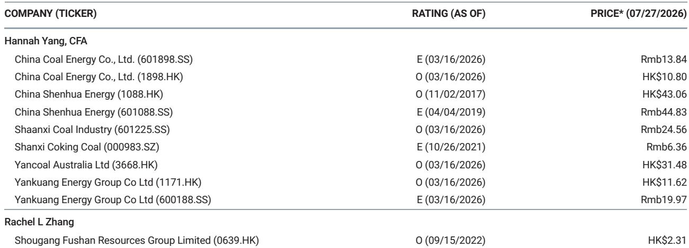

# The Indonesian Coal Arbitrage Window Is Still Open, and It Is Reshaping China's Import Strategy

China imported 38.3% more thermal coal in June than in May, and Indonesia alone accounted for 53.8% of that total. That single statistic captures a strategic shift that goes beyond monthly trade volatility. The import arbitrage window for Indonesian coal, which opened in June, has remained open through July, and the implications extend well beyond the current month's shipping schedules. For coal buyers, power generators, and commodity strategists, the persistence of this window signals a structural recalibration of China's thermal coal sourcing, one that carries consequences for domestic pricing, inventory management, and the competitive position of alternative suppliers such as Australia and Russia.

The numbers from the latest weekly coal update make the pattern unmistakable. Qinhuangdao 5,500 kcal/kg thermal coal inched up only 0.4% week on week to RMB 725 per ton as of July 24, while the Bohai-Rim Steam-Coal Price Index rose just 0.3% to RMB 715. Domestic prices are barely moving. Yet seaborne prices, as measured by the Newcastle benchmark, also posted only a 0.8% weekly gain. The price differential between domestic and Indonesian coal, when factoring in shipping costs and quality adjustments, remains wide enough to keep the arbitrage profitable. This is not a fleeting anomaly. It is the product of converging forces: moderate domestic demand growth, ample global supply, and China's increasingly deliberate import diversification away from single-source dependency.

The strategic question for market participants is not whether the arbitrage window will close, but how long it can stay open and what its persistence means for the rest of 2025. The answer depends on three interrelated dynamics: the behavior of China's power plant procurement, the trajectory of Indonesian production costs and export policy, and the responsiveness of competing seaborne suppliers. Each of these forces is currently aligning in a way that favors continued Indonesian inflows, but the window will eventually narrow. The key is knowing which trigger will close it.

## China's Thermal Coal Imports Are No Longer a Residual; They Are a Deliberate Sourcing Strategy

For years, Chinese coal imports were treated as a swing variable, a buffer to fill gaps when domestic production fell short or when winter heating demand spiked. The June data overturns that old framework. A 38.3% month-on-month surge in thermal coal imports is not a marginal adjustment. It represents a deliberate decision by Chinese utilities and traders to lock in Indonesian cargoes at a time when domestic prices are stable and inventories at Qinhuangdao have fallen 5.1% week on week to 6.45 million tons. The inventory drawdown is modest, but the import surge is not.

What changed is the calculus of relative value. Domestic thermal coal prices, as measured by the CCI 5,500 index, rose 1.3% week on week to RMB 827 per ton, still below the year-to-date average. Indonesian coal, by contrast, is landing in Chinese ports at a cost that undercuts domestic supply even after freight and handling. The import arbitrage is not a theoretical construct; it is a realized margin that has persisted for two consecutive months. Chinese buyers are not importing because they are desperate for volume. They are importing because it is profitable to do so.

The implication for the second half of 2025 is straightforward: as long as the domestic price floor holds near current levels and Indonesian FOB prices remain competitive, Chinese imports will stay elevated. The old assumption that China would revert to domestic supply once seasonal demand peaks is no longer reliable. The market has entered a regime where imports are a structural complement to domestic production, not a temporary substitute.

## Indonesia's Dominance in China's Import Mix Reflects a Pricing Advantage That Rivals Cannot Easily Match

Indonesia supplied 53.8% of China's thermal coal imports in June, with shipments surging 34.9% month on month. That dominance is not accidental. Indonesian coal benefits from shorter shipping distances, lower freight costs, and a calorific value profile that aligns well with China's coastal power plant specifications. But the real driver is price. Indonesian miners, particularly those in Kalimantan, have maintained competitive FOB pricing despite global inflationary pressures on mining inputs. The result is a consistent cost advantage that Australian and Russian suppliers cannot replicate at current market levels.

Australian thermal coal, benchmarked to Newcastle, rose only 0.8% week on week to USD 131 per ton. That is still above the level at which Indonesian coal becomes the clear economic choice for Chinese buyers. Russian coal, meanwhile, faces logistical bottlenecks and sanctions-related friction that add cost and uncertainty. The Indonesian advantage is not just about the headline price; it is about reliability of supply, speed of delivery, and the absence of geopolitical overhang.

This has a second-order implication for global thermal coal trade flows. If China continues to favor Indonesian coal at current volumes, Australian and Russian suppliers will be forced to redirect cargoes to other Asian markets, particularly India, Vietnam, and South Korea. That redistribution will compress margins for non-Indonesian producers and could lead to price softening in those alternative destinations. The Indonesian arbitrage window is not just a China story; it is a reordering of Asian seaborne coal pricing dynamics.

## Coking Coal Prices Are Resilient but Decoupled from Thermal Coal Dynamics, Creating a Two-Track Market

While thermal coal prices drifted marginally higher, coking coal prices held steady. Liulin No. 4 mine-mouth prices were unchanged week on week at RMB 850 per ton, and free-on-rail prices remained at RMB 2,010. The only notable movement was in Queensland coking coal, which fell 1.3% to USD 230 per ton. The contrast between thermal and coking coal is instructive. Coking coal, used in steelmaking, is subject to a different demand driver: industrial production, construction activity, and steel mill utilization rates. Thermal coal, by contrast, is driven by power generation, which is more seasonal and more sensitive to weather, hydro output, and renewable penetration.

The two-track market means that a single coal strategy is no longer sufficient. Companies that produce both thermal and coking coal face divergent pricing environments, and their hedging, inventory, and investment decisions must reflect that. For thermal coal producers, the open arbitrage window with Indonesia is a headwind; they are losing market share in coastal China to cheaper imports. For coking coal producers, the stability of domestic prices suggests that steel demand, while not booming, is not declining either. The two markets are telling different stories, and portfolio managers should treat them as separate asset classes rather than a single coal complex.

The risk for coking coal lies in the second half of the year. If China's property sector recovery stalls and infrastructure spending slows, steel output will decline, and coking coal demand will follow. The current price resilience may be a lagging indicator. Thermal coal, by contrast, faces a different risk: that the arbitrage window closes not because Indonesian prices rise, but because domestic prices fall further. If Chinese power plants reduce procurement due to moderate electricity demand growth or high hydropower output, domestic thermal coal could slide, narrowing the import margin and reducing the incentive for Indonesian cargoes.

## A Decision Framework for Coal Buyers and Strategists: Three Scenarios for the Arbitrage Window

The persistence of the Indonesian import arbitrage window creates a clear decision framework for market participants. Rather than forecasting a single outcome, buyers and strategists should evaluate three scenarios and position accordingly.

Scenario one: the window remains open through the third quarter. This is the base case implied by current data. Indonesian FOB prices stay competitive, Chinese domestic demand remains moderate, and utilities continue to favor imports for cost reasons. In this scenario, Chinese thermal coal imports could exceed June's level, potentially setting a new monthly record. The strategic response for domestic Chinese producers is to focus on cost reduction and contract pricing rather than spot market volume. For international traders, the opportunity is to secure Indonesian cargoes on long-term contracts before the window narrows.

Scenario two: the window closes due to rising Indonesian prices. This could happen if Indonesian miners face production disruptions, export quota constraints, or a sharp increase in domestic Indonesian demand. The trigger could also be a weakening of the Indonesian rupiah against the dollar, which would raise the local-currency cost of mining inputs and force FOB prices higher. In this scenario, Chinese buyers would seek alternative supply, benefiting Australian and Russian exporters. The strategic response is to have pre-negotiated alternative supply agreements in place, particularly with Australian producers who can ramp up volume on shorter notice than Russian suppliers.

Scenario three: the window closes due to falling Chinese domestic prices. This is the most disruptive scenario for the global coal trade. If Chinese thermal coal prices drop below the import parity level, utilities will cancel or delay Indonesian cargoes, leaving Indonesian miners with excess supply that must be diverted to other markets. That diversion would depress seaborne prices globally, compressing margins for all producers. The strategic response is to monitor Chinese power generation data and hydropower output closely. A strong monsoon season in southern China would boost hydroelectric generation, reducing thermal coal demand and pushing domestic prices lower.

Each scenario requires a different positioning on inventory, contract duration, and geographic sourcing. The common thread is that the window will not last indefinitely, and the timing of its closure will determine which players benefit and which are caught offside.

## The Persistence of the Indonesian Arbitrage Window Undermines the Bull Case for Global Thermal Coal Prices

One of the prevailing narratives in commodity markets in early 2025 was that global thermal coal prices would find support from Chinese import demand. The data from June and July complicates that narrative. Chinese imports are indeed rising, but they are rising at prices that are compressing margins for non-Indonesian producers. The demand is there, but it is highly price-sensitive and geographically concentrated. The bullish case for global thermal coal prices depends on Chinese demand pulling up the entire seaborne market. What is actually happening is that Chinese demand is pulling up Indonesian volumes while leaving prices for other grades and origins relatively stagnant.

The year-to-date comparison is revealing. The Newcastle thermal coal benchmark has averaged USD 128 per ton year to date, compared to a 2025 average of USD 106.6. That is a 20.3% premium. But the marginal buyer, China, is not paying that premium. It is buying Indonesian coal at a discount. The premium on the Newcastle index reflects demand from other Asian buyers, particularly Japan and South Korea, who have fewer alternatives and are less price-sensitive. The market is bifurcated: a high-price segment for captive buyers and a low-price segment for Chinese import arbitrage.

For observers and corporate strategists, this bifurcation means that aggregate price indices are misleading. The real action is in the spread between Indonesian FOB and Chinese CFR prices. That spread, not the headline Newcastle or QHD price, is the variable that determines trade flows, inventory decisions, and producer profitability. The open arbitrage window is a signal that the spread is wide enough to incentivize behavior change. When the spread narrows, the window closes, and the market resets.

The critical unknown is how long Indonesian miners can sustain current pricing. If production costs rise due to fuel, labor, or regulatory pressures, the arbitrage window will close from the supply side. If Chinese domestic demand weakens further, it will close from the demand side. Either way, the current equilibrium is temporary. The strategic imperative is to track the spread, not the index, and to position for the inflection point rather than the continuation.

*For informational purposes only. Portions may be generated, translated, summarized, or edited with AI assistance based on source materials and may contain omissions or errors. Please verify independently. This is not professional advice.*

For informational purposes only. Portions may be generated, translated, summarized, or edited with AI assistance based on source materials and may contain omissions or errors. Please verify independently. This is not professional advice.

