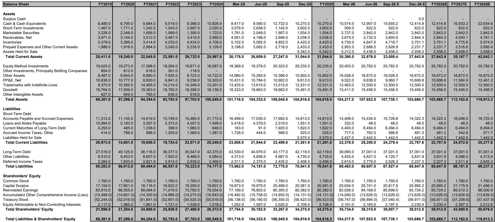
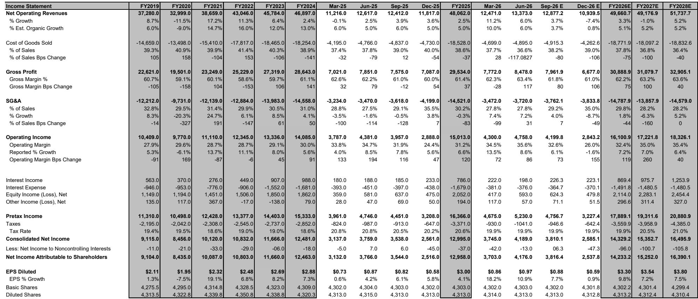
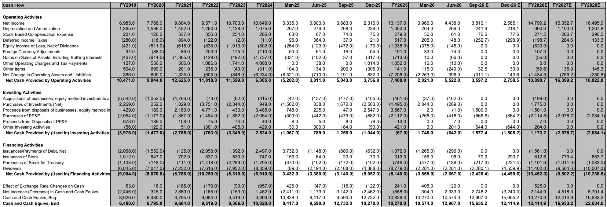

# MS：可口可乐业务与季度数据观察

可口可乐二季度业绩超出市场预期，单位销量增长5%，显著高于市场预期的2.2%和公司过去九个季度平均的1.1%。这份MS研报的核心判断是：可口可乐的有机销售增速（OSG）已与同类大型消费品公司拉开明显差距，且这一差距在可预见的未来可能持续。

二季度7%的有机销售增长（5%单位销量加2%价格/产品组合）高于市场预期的5.0%。公司同时将全年有机销售增长指引上调至5%，处于此前4-5%区间的上沿。报告认为这一指引仍偏保守，因为二季度的增长部分受益于世界杯、欧洲高温天气和美国250周年庆典等一次性因素，但这些因素在7月仍在延续，为三季度提供了可见度。

> **KC评论：** 二季度5%的单位销量增长是核心数据。市场此前预期2.2%，公司自身过去九个季度平均仅1.1%。差距不是边际的，而是倍数级的。报告用“不同层级（different stratosphere）”来描述这种差距，并非修辞。

## 1. Fairlife业务预计为长期有机增长贡献超过100个基点

报告专门拆解了Fairlife对可口可乐整体增长的贡献。Fairlife是可口可乐旗下的高端牛奶品牌，采用专利超滤工艺。二季度Fairlife收入同比增长18%，且产能仍在爬坡中——这意味着当前增速仍受产能约束。

MS的敏感性分析显示：若Fairlife占可口可乐总销售额的4%，且保持20%的年复合增长率，则每年可为公司整体有机销售增长贡献约80个基点。若增长率达到30%，贡献可达120个基点。报告认为Fairlife在高速增长的高端乳制品细分市场中定位良好，叠加可口可乐的分销网络，有望持续获取市场份额。

## 2. 美国零售扫描数据显示可口可乐持续领先同业

报告引用的NielsenIQ数据显示，二季度及三季度至今，可口可乐在美国零售渠道的销售增速比饮料同行高出约400个基点，比大型消费品同行高出近300个基点。美国市场是可口可乐全球最受关注的区域，零售数据的持续领先对读者情绪有直接影响。

报告认为这一优势有望延续，背后有三个支撑：可口可乐自身市场份额仍在增长；Fairlife和Topo Chico（气泡水品牌）产能恢复后将继续贡献增量；碳酸软饮料（CSD）的定价环境保持理性，主要竞争对手百事可乐和Keurig Dr Pepper在各自非核心业务（零食/咖啡）面临不确定性的情况下，仍有动力继续提价。

## 3. 亚太区价格/产品组合下滑9%，但报告认为影响可控

二季度可口可乐整体价格/产品组合增长2%，低于市场预期的2.7%。影响主要来自亚太区，该区域价格/产品组合为-9%，比市场预期低约789个基点。公司给出的解释有三点，幅度大致相当：研究时机选择、针对新消费者的可负担性举措（将继续执行）、以及中国等快速增长市场带来的地理组合稀释。

报告认为亚太区的定价疲软是可控的：部分因素具有过渡性；该区域单位销量仍保持8%的强劲增长；2025财年全年定价为+4%，表现稳健；四季度将迎来更容易的定价对比基数。

> **KC评论：** 亚太区价格/产品组合-9%与单位销量+8%同时出现，说明公司在用价格换量。报告没有回避这一矛盾，但给出了三个具体原因，并指出四季度基数效应将缓解不确定性。这里的关键是判断“研究时机”和“可负担性举措”是短期策略还是长期方向——报告倾向于前者。

## 4. 一个可复用的观察框架：从单位销量与价格/产品组合的背离中识别增长质量

这份报告提供了一个分析消费品公司的实用框架：将有机销售增长拆解为单位销量增长和价格/产品组合增长两个维度，并观察两者的背离方向。

二季度可口可乐的情况是：单位销量增长5%（超预期），价格/产品组合增长2%（低于预期）。这种“量强价弱”的组合，在报告看来并非定价能力减弱，而是公司主动将增长重心从过去几年的“超常规价格/产品组合”向“量价平衡”转移。全年来看，公司预计价格/产品组合约2.5%，单位销量约3.4%，两者趋于均衡。

对于读者而言，关键不是单季度价格/产品组合是否达标，而是单位销量增长能否持续高于同行。如果量价背离是暂时的、有合理解释的，那么增长质量并未受损。如果量价背离持续且无法归因于一次性因素，则需要重新审视定价能力。

For informational purposes only. Portions may be generated,translated,summarized,or edited with AI assistance based on source materials and may contain omissions or errors. Please verify independently. This is not investment,legal,tax,accounting,or other professional advice.

For informational purposes only. Portions may be generated,translated,summarized,or edited with AI assistance based on source materials and may contain omissions or errors. Please verify independently. This is not investment,legal,tax,accounting,or other professional advice.

