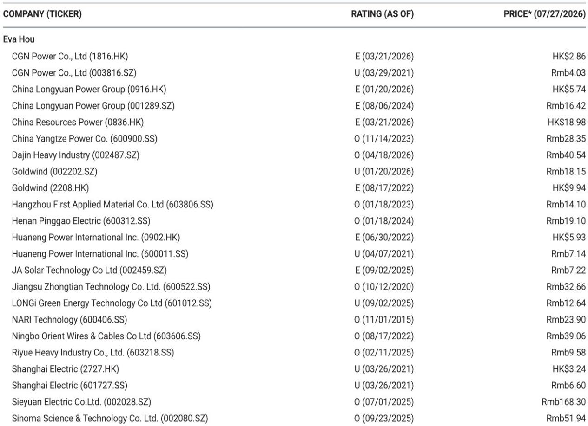
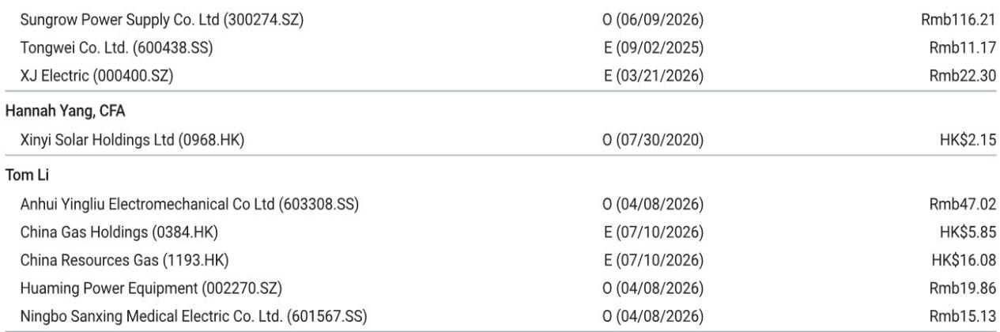

# 2026年6月中国用电需求增速变化：结构转型信号，非周期性波动

2026年6月，中国用电需求同比增速放缓至3.7%，较5月的6.9%有所下降，上半年累计增速为5.3%。表面上看，这似乎反映了宏观环境的变化。但细看增速放缓的构成，可以发现不同之处：放缓几乎完全由居民用电需求驱动，该部分同比下降3.1%，而第三产业服务业上半年仍保持8.0%的增速。真正的信号并非整体需求走弱，而是用电结构正在经历深刻调整。

6月的数据并非异常值，不能简单归因于天气因素。气温较低抑制了居民空调用电负荷，但这属于短期因素。对研究而言，重要的是工业和商业需求的潜在趋势。第二产业用电需求上半年增长5.1%，与五个月数据完全一致，表明制造业活动并未出现明显变化。其中，高技术及装备制造业用电同比增长9.8%，几乎是整体工业增速的两倍。这反映出中国持续的产业升级进程，而非广泛的需求放缓。

上半年数据中最值得关注的变化，是两个细分但具有战略意义的需求领域出现快速增长：充电服务用电同比增长56.9%，包括AI数据中心在内的信息技术服务用电增长44.0%。这些领域代表着中国电气化和数字化进程的前沿。其复合增长率已足够高，开始对整体需求产生影响，这一变化对电网规划、发电结构和设备供应链具有重要参考意义。

## 可再生能源装机量变化：基数效应所致，非政策转向

2026年上半年，中国新增太阳能装机72.1吉瓦、风电38.6吉瓦，同比分别下降66.0%和24.8%。总新增装机158.7吉瓦，较去年同期下降45.9%。这些数字看似显著，但需结合2025年3月至5月的特殊装机高峰来看——当时开发商在电价调整前集中完成项目。2025年上半年属于阶段性峰值，并非可持续节奏。

2026年6月的月度数据表明，装机活动正在回归常态，而非大幅缩减。6月太阳能新增12.5吉瓦、风电新增13.6吉瓦，均高于5月的8.7吉瓦和3.8吉瓦。6月风电装机量更是2025年6月5.1吉瓦的近三倍，显示海上风电和大型陆上项目正在加速。太阳能同比仍低于2025年6月的14.4吉瓦，但差距正在收窄。

对观察者而言，关键信息在于：装机项目储备依然充足，但结构正在变化。过去不计成本大规模部署太阳能的阶段，正转向更注重电网接入、储能配套和项目经济性的阶段。上半年火电新增装机38.4吉瓦，高于去年同期的25.8吉瓦，表明中国并未放弃化石能源作为备用。这是应对可再生能源间歇性的务实安排，而非脱碳目标的转向。

## 风电发电量在装机增长背景下下降，利用效率问题显现

2026年上半年，尽管风电装机容量持续增长，但总发电量同比下降1.9%。这一差异是中国电力研究中容易被忽视的风险点。各类发电机组整体利用小时数同比减少113小时至1392小时，这一变化既反映了可再生能源的弃电问题，也体现了火电机组的低利用率。

风电发电量下降尤其值得关注，因为同期总发电量仍在增长。上半年总发电量同比增长3.5%至4.75万亿千瓦时，风电和太阳能合计发电占比从2025年的16.7%升至18.9%。但太阳能发电增长12.3%，而风电下降，表明风电面临更突出的弃电问题或容量因子下降，原因可能包括选址欠佳、输电瓶颈或不利天气模式。

这一差异对项目经济性有直接影响。在电网基础设施薄弱或渗透率较高地区运营的风电场，可能面临利润空间收窄，即使全国装机目标得以实现。利用数据也提示，下一阶段可再生能源投入应优先考虑电网强化和储能，而非单纯增加发电容量。在电网设备、输电和储能价值链上布局的公司，可能比纯风电开发商更具优势。

## 火电装机扩张：市场低估的双轨策略

2026年上半年火电新增装机38.4吉瓦，同比增长49%，这并非中国气候承诺的倒退。这是对运营现实的理性回应：可再生能源发电占比已达18.9%，对电网稳定性构成挑战。新增火电主要集中在高效超超临界机组和热电联产项目，这些机组比传统燃煤电厂更灵活，可快速调节出力。

这种双轨策略——积极部署可再生能源同时选择性扩张火电——为电力价值链不同环节创造了复杂的风险特征。对于拥有混合机组的独立发电商，火电新增在可再生能源出力不足时提供收益支撑，但在可再生能源充裕时期因利用率下降而限制上行空间。对于设备制造商，火电建设维持了对锅炉、汽轮机和排放控制系统的需求，即使可再生能源设备订单趋于正常化。

对长期观察者而言，中国电力系统不会以线性方式从煤炭转向可再生能源。转型将经历一段并行基础设施投入期，火电机组作为备用容量，可能以递减的负荷率运行。这意味着电力设备的整体市场规模大于纯可再生能源建设情景，但火电相关设备的利润结构将低于高增长的可再生能源领域。

## 中国电力价值链布局的决策框架

2026年上半年数据支持差异化的研究思路，可将电力价值链分为三类不同的风险回报特征。

第一类是结构性增长领域，需求驱动因素持续累积。充电基础设施和AI数据中心用电需求年增长率在44%至57%之间，仍处于早期阶段。这些领域对短期天气模式或装机周期不敏感。应优先关注直接服务于这些负荷的电气设备、电网升级和电力电子相关公司。充电服务56.9%的增长并非一次性波动，而是反映了电动汽车渗透率加速提升，而充电基础设施此前滞后于车辆销售。

第二类是容量周期领域，装机量已见顶但售后和服务收入在增长。太阳能和风电设备制造商在2026年面临装机量同比比较的挑战，但存量装机规模已足够大，可产生持续增长的运维收入。风电和太阳能发电占比达18.9%，意味着电网运营商和项目业主将越来越重视可靠性和运行时间，而非新增容量。拥有差异化服务、数字监控平台或电网接入解决方案的公司，即使新设备订单放缓，也可能受益于这一转变。

第三类是过渡性对冲领域，火电新增提供收益支撑，但结构性因素限制估值空间。上半年38.4吉瓦的火电新增是真实需求，但属于过渡方案而非增长市场。关注这一领域的公司应聚焦于拥有高效机组、长期购电协议以及多元化布局（如可再生能源或天然气资产）的运营商。全发电机组利用小时数减少113小时，是产能过剩风险积累的警示，竞争地位最弱的火电运营商将面临最大压力。

上半年数据最重要的战略启示是：中国电力研究已超越简单的可再生能源装机增长叙事。市场正进入一个由电网整合、需求侧电气化和运营效率决定胜负的阶段。充电和数据中心需求的快速增长提供了此前周期中不存在的需求支撑。将6月增速放缓视为周期性波动并关注这些结构性变化的观察者，将比简单外推月度波动者更具优势。

*仅供参考。部分内容可能基于源材料通过AI辅助生成、翻译、总结或编辑，可能存在遗漏或错误。请独立核实。本文不构成专业建议。*

仅供参考。部分内容可能基于源材料通过AI辅助生成、翻译、总结或编辑，可能存在遗漏或错误。请独立核实。本文不构成专业建议。

