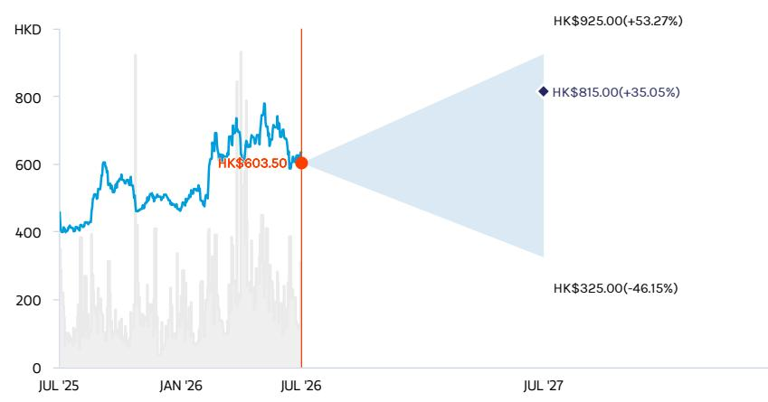
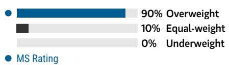
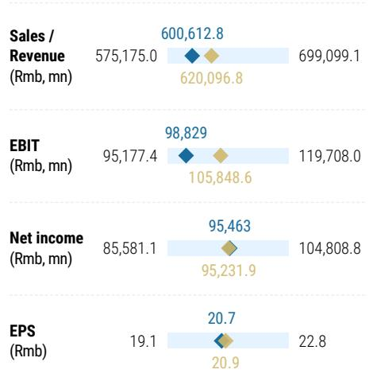
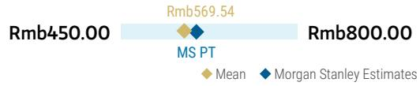
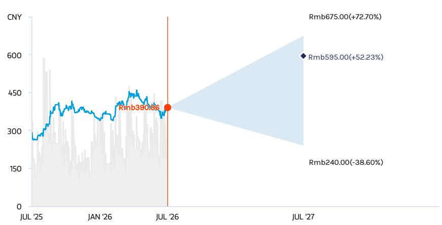
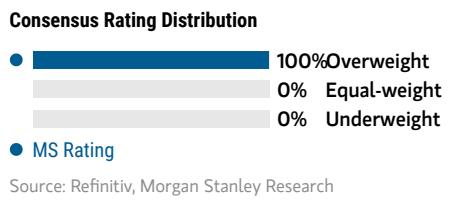
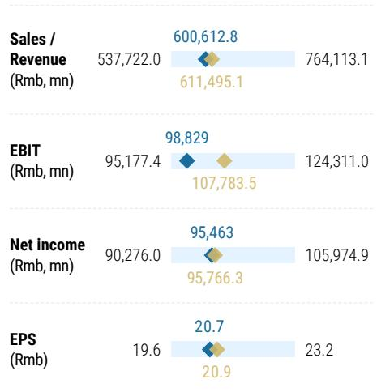
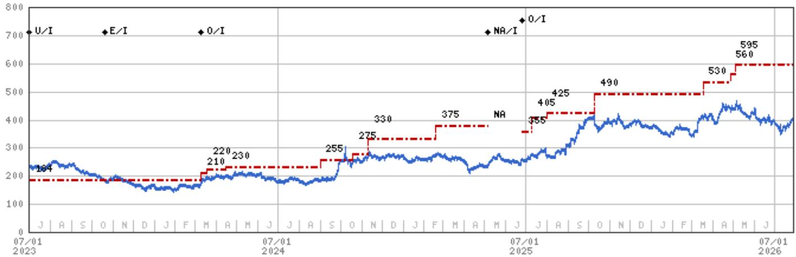
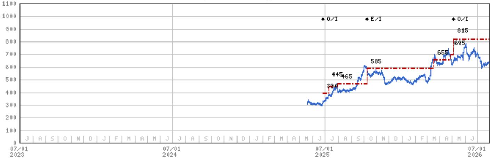

# Contemporary Amperex Technology Co. Ltd. | Asia Pacific

# New Market Share Strategy

WHAT'S CHANGED

<table><tr><td>Contemporary Amperex Technology Co. Ltd. (300750.SZ)</td><td>From</td><td>To</td></tr><tr><td>Top Pick Added</td><td>3750.HK</td><td>300750.SZ</td></tr></table>

CATL is turning more aggressive on share. Accelerating capacity expansion targets new lower-end markets...yet still contributes incremental profits. Overall \$/Wh margin should not be the focus in this deliberate strategic shift – it's mix-driven, not structural erosion for products more broadly.

The dollar-margin softness observed in 1H appears non-structural in nature, primarily driven by product mix volatility and CATL's incremental market share gains in lower-priced segments, rather than any broader erosion in pricing power or a signal of structural margin compression.

Management explicitly addressed the dollar-margin dynamics on the 2Q results call, clarifying that like-for-like product margins remained stable, with ESS product margins even showing improvement in 1H. A greater share of higher-margin overseas volumes should get recognized as revenue in 2H.

CATL's market share strategy has turned notably more aggressive, with management willing to leverage capacity expansion and cost/technology advantages to penetrate previously underserved lower-end market segments. The company's recent market share gains, volume outperformance, and strong beat in the 1Q results (consensus rose materially afterward) demonstrate that sales in these lower-end markets are still generating incremental earnings, even if the associated products carry lower margins than CATL's premium offerings.

Thus, we do not believe the recent softness in blended \$/Wh margin should be the primary focus for investors. Rather, it reflects a deliberate mix shift accompanying share gains and industry consolidation. The more meaningful takeaway is that CATL is successfully converting incremental volume into incremental profit while simultaneously expanding its competitive footprint across a broader addressable market, despite near-term margin dilution from mix effects.

Switch Top Pick to CATL-A from CATL-H: The newly announced substantial share repurchase should support the A-shares' outperformance over the H-shares. The liquidity absorption by AI-related stocks should be also more or less done in the A-share market, in our view. Also, the H-A premium is now 33%. We maintain OWs on both.

MS ASIA LIMITED+

Jack Lu

Equity Analyst

Jack.Lu@morganstanley.com

+852 2848-5044

Kaylee Xu

Equity Analyst
Kaylee.Xu@morganstanley.com +852 2239-1506

## Asia Summer School 2026

China Energy & Chemicals | China

<table><tr><td>Stock Rating</td><td>Overweight</td></tr><tr><td>Industry View</td><td>In-Line</td></tr><tr><td>Price target</td><td>Rmb595.00</td></tr><tr><td>Up/downside to price target (%)</td><td>52</td></tr><tr><td>Shr price, close (Jul 28, 2026)</td><td>Rmb390.86</td></tr><tr><td>52-Week Range</td><td>Rmb468.75-257.72</td></tr><tr><td>Sh out, dil, curr (mn)</td><td>4,564</td></tr><tr><td>Mkt cap, curr (mn)</td><td>Rmb1,875,918</td></tr><tr><td>EV, curr (mn)</td><td>Rmb1,693,175</td></tr><tr><td>Avg daily trading value (mn)</td><td>Rmb12,494</td></tr></table>

<table><tr><td>Fiscal Year Ending</td><td>12/25</td><td>12/26e</td><td>12/27e</td><td>12/28e</td></tr><tr><td>Revenue, net (Rmb mn)</td><td>423,702</td><td>600,613</td><td>764,053</td><td>913,750</td></tr><tr><td>EBITDA (Rmb mn)</td><td>97,874</td><td>133,116</td><td>168,113</td><td>208,320</td></tr><tr><td>EPS, basic (Rmb)*</td><td>15.53</td><td>20.73</td><td>27.17</td><td>33.37</td></tr><tr><td>EPS (Rmb)**</td><td>16.14</td><td>20.73</td><td>27.05</td><td>33.22</td></tr><tr><td>P/E, basic*</td><td>23.7</td><td>18.9</td><td>14.4</td><td>11.7</td></tr><tr><td>P/BV</td><td>5.2</td><td>4.7</td><td>3.9</td><td>3.3</td></tr><tr><td>EV/EBITDA</td><td>16.1</td><td>12.1</td><td>9.0</td><td>6.9</td></tr><tr><td>RNOA (%)</td><td>57.1</td><td>54.4</td><td>90.0</td><td>121.0</td></tr><tr><td>Div yld (%)</td><td>2.2</td><td>2.7</td><td>3.5</td><td>4.7</td></tr><tr><td>FCF yld ratio (%)*</td><td>5.1</td><td>6.9</td><td>7.3</td><td>7.9</td></tr><tr><td>Net income (Rmb mn)*</td><td>72,201</td><td>95,463</td><td>125,140</td><td>153,688</td></tr></table>

Unless otherwise noted, all metrics are based on MS ModelWare framework
\*\* = Based on consensus methodology
\* = GAAP or approximated based on GAAP
e = MS estimates

MS does and seeks to do business with companies covered in MS. As a result, investors should be aware that the firm may have a conflict of interest that could affect the objectivity of MS. Investors should consider MS as only a single factor in making their investment decision.

## For analyst certification and other important disclosures, refer to the Disclosure Section, located at the end of this report.

+= Analysts employed by non-U.S. affiliates are not registered with FINRA, may not be associated persons of the member and may not be subject to FINRA restrictions on communications with a subject company, public appearances and trading securities held by a research analyst account.

## Earnings Estimate Revisions after 2Q

With the new market share strategy, we lower our overall \$/Wh margin forecast but raise our volume assumptions for energy storage given the volume beat in 1H. We raise our 2026 earnings forecast \~1% but trim our 2027 and 2028 forecasts 2.6% and 2.7%, respectively, reflecting the new consumption tax (see here).

Exhibit 1: Earnings estimate revisions

<table><tr><td rowspan="2">(RMB mn)</td><td colspan="4">FY2026E</td><td colspan="4">FY2027E</td><td colspan="4">FY2028E</td></tr><tr><td>New</td><td>Old</td><td>chg%</td><td>yoy%</td><td>New</td><td>Old</td><td>chg%</td><td>yoy%</td><td>New</td><td>Old</td><td>chg%</td><td>yoy%</td></tr><tr><td>EV battery sales (GWh)</td><td>712</td><td>712</td><td>0.0%</td><td>31.7%</td><td>929</td><td>929</td><td>0.0%</td><td>30.4%</td><td>1,142</td><td>1,142</td><td>0.0%</td><td>22.9%</td></tr><tr><td>ESS battery sales (GWh)</td><td>218</td><td>169</td><td>29.1%</td><td>79.8%</td><td>305</td><td>245</td><td>24.5%</td><td>40.2%</td><td>386</td><td>310</td><td>24.6%</td><td>26.6%</td></tr><tr><td>Battery ASP (Rmb/Wh)</td><td>0.59</td><td>0.60</td><td>-3.0%</td><td>2.4%</td><td>0.57</td><td>0.59</td><td>-3.3%</td><td>-3.0%</td><td>0.55</td><td>0.57</td><td>-3.4%</td><td>-2.8%</td></tr><tr><td>Unit COGS (Rmb/Wh)</td><td>0.46</td><td>0.46</td><td>-1.1%</td><td>5.4%</td><td>0.43</td><td>0.44</td><td>-0.7%</td><td>-5.2%</td><td>0.41</td><td>0.42</td><td>-0.7%</td><td>-4.4%</td></tr><tr><td>Battery GP margin (Rmb/Wh)</td><td>0.130</td><td>0.143</td><td>-9.1%</td><td>-6.9%</td><td>0.135</td><td>0.151</td><td>-10.6%</td><td>4.5%</td><td>0.139</td><td>0.155</td><td>-10.6%</td><td>2.4%</td></tr><tr><td>Revenue</td><td>600,613</td><td>584,041</td><td>2.8%</td><td>41.8%</td><td>764,053</td><td>750,418</td><td>1.8%</td><td>27.2%</td><td>913,750</td><td>899,217</td><td>1.6%</td><td>19.6%</td></tr><tr><td>Gross Profit</td><td>147,179</td><td>146,281</td><td>0.6%</td><td>32.2%</td><td>194,325</td><td>200,564</td><td>-3.1%</td><td>32.0%</td><td>240,952</td><td>249,908</td><td>-3.6%</td><td>24.0%</td></tr><tr><td>GP mgn %</td><td>25%</td><td>25%</td><td>-0.5 ppt</td><td>-1.8 ppt</td><td>25%</td><td>27%</td><td>-1.3 ppt</td><td>0.9 ppt</td><td>26%</td><td>28%</td><td>-0.1 ppt</td><td>0.0 ppt</td></tr><tr><td>SG&amp;A</td><td>(48,349)</td><td>(51,104)</td><td>-5.4%</td><td>19.7%</td><td>(61,506)</td><td>(64,161)</td><td>-4.1%</td><td>27.2%</td><td>(73,557)</td><td>(76,883)</td><td>-4.3%</td><td>19.6%</td></tr><tr><td>Adj. EBITDA</td><td>133,116</td><td>129,464</td><td>2.8%</td><td>24.8%</td><td>168,113</td><td>171,617</td><td>-2.0%</td><td>26.3%</td><td>208,320</td><td>213,597</td><td>-2.5%</td><td>23.9%</td></tr><tr><td>EBITDA mgn %</td><td>22%</td><td>22%</td><td>0.0 ppt</td><td>-3.0 ppt</td><td>22%</td><td>23%</td><td>-0.9 ppt</td><td>-0.2 ppt</td><td>23%</td><td>24%</td><td>0.0 ppt</td><td>0.0 ppt</td></tr><tr><td>EBIT</td><td>98,829</td><td>95,177</td><td>3.8%</td><td>39.3%</td><td>132,819</td><td>136,403</td><td>-2.6%</td><td>34.4%</td><td>167,395</td><td>173,025</td><td>-3.3%</td><td>26.0%</td></tr><tr><td>EBIT mgn-%</td><td>16%</td><td>16%</td><td>0.2 ppt</td><td>-0.3 ppt</td><td>17%</td><td>18%</td><td>-0.8 ppt</td><td>0.9 ppt</td><td>18%</td><td>19%</td><td>0.0 ppt</td><td>0.1 ppt</td></tr><tr><td>Financial cost, net</td><td>5,130</td><td>8,131</td><td>-36.9%</td><td>-35.4%</td><td>10,086</td><td>9,906</td><td>1.8%</td><td>96.6%</td><td>10,089</td><td>9,909</td><td>1.8%</td><td>0.0%</td></tr><tr><td>PBT</td><td>118,438</td><td>116,787</td><td>1.4%</td><td>32.3%</td><td>154,783</td><td>158,887</td><td>-2.6%</td><td>30.7%</td><td>190,063</td><td>195,513</td><td>-2.8%</td><td>22.8%</td></tr><tr><td>Net Income</td><td>95,463</td><td>94,572</td><td>0.9%</td><td>32.2%</td><td>125,140</td><td>128,512</td><td>-2.6%</td><td>31.1%</td><td>153,688</td><td>157,988</td><td>-2.7%</td><td>22.8%</td></tr><tr><td>Net mgn-%</td><td>16%</td><td>16%</td><td>-0.3 ppt</td><td>-1.1 ppt</td><td>16%</td><td>17%</td><td>-0.7 ppt</td><td>0.5 ppt</td><td>17%</td><td>18%</td><td>0.0 ppt</td><td>0.0 ppt</td></tr><tr><td>EPS</td><td>20.73</td><td>20.53</td><td>0.9%</td><td>28.4%</td><td>27.05</td><td>27.78</td><td>-2.6%</td><td>30.5%</td><td>33.22</td><td>34.15</td><td>-2.7%</td><td>22.8%</td></tr></table>

Source: CATL, MS estimates

Exhibit 2: Financial Summary

<table><tr><td>Assumptions</td><td>2024</td><td>2025</td><td>2026e</td><td>2027e</td><td>2028e</td></tr><tr><td>Sales - EV battery (GWh)</td><td>381.0</td><td>541.0</td><td>712.4</td><td>929.1</td><td>1,141.9</td></tr><tr><td>Sales - ESS (GWh)</td><td>93.0</td><td>121.0</td><td>217.5</td><td>305.0</td><td>386.0</td></tr><tr><td>ASP - EV battery (Rmb/Wh)</td><td>0.66</td><td>0.59</td><td>0.61</td><td>0.59</td><td>0.57</td></tr><tr><td>ASP - ESS (Rmb/Wh)</td><td>0.62</td><td>0.52</td><td>0.52</td><td>0.51</td><td>0.51</td></tr><tr><td>GP margin - EV battery (%)</td><td>24%</td><td>24%</td><td>22%</td><td>24%</td><td>25%</td></tr><tr><td>GP margin - ESS (%)</td><td>27%</td><td>27%</td><td>21%</td><td>24%</td><td>25%</td></tr></table>

<table><tr><td>Income Statement (Rmb mn)</td><td>2024</td><td>2025</td><td>2026e</td><td>2027e</td><td>2028e</td></tr><tr><td>Net sales</td><td>362,013</td><td>423,702</td><td>600,613</td><td>764,053</td><td>913,750</td></tr><tr><td>Gross profit</td><td>88,494</td><td>111,319</td><td>147,179</td><td>194,325</td><td>240,952</td></tr><tr><td>EBITDA</td><td>79,515</td><td>97,874</td><td>133,116</td><td>168,113</td><td>208,320</td></tr><tr><td>EBIT</td><td>54,577</td><td>70,938</td><td>98,829</td><td>132,819</td><td>167,395</td></tr><tr><td>Net financing cost</td><td>4,132</td><td>7,940</td><td>5,130</td><td>10,086</td><td>10,089</td></tr><tr><td>Pre-tax profit</td><td>63,182</td><td>89,527</td><td>118,438</td><td>154,783</td><td>190,063</td></tr><tr><td>Tax</td><td>(9,175)</td><td>(12,740)</td><td>(16,855)</td><td>(22,027)</td><td>(27,047)</td></tr><tr><td>Minority interest</td><td>(3,262)</td><td>(4,585)</td><td>(6,121)</td><td>(7,617)</td><td>(9,327)</td></tr><tr><td>Net profit</td><td>50,745</td><td>72,201</td><td>95,463</td><td>125,140</td><td>153,688</td></tr><tr><td>MW net income</td><td>50,745</td><td>72,201</td><td>95,463</td><td>125,140</td><td>153,688</td></tr></table>

<table><tr><td>Cash Flow (Rmb mn)</td><td>2024</td><td>2025</td><td>2026e</td><td>2027e</td><td>2028e</td></tr><tr><td>EBITDA</td><td>79,515</td><td>97,874</td><td>133,116</td><td>168,113</td><td>208,320</td></tr><tr><td>-Taxes paid</td><td>(9,175)</td><td>(12,740)</td><td>(16,855)</td><td>(22,027)</td><td>(27,047)</td></tr><tr><td>-Working capital</td><td>14,775</td><td>33,134</td><td>40,033</td><td>41,292</td><td>34,976</td></tr><tr><td>-Others</td><td>(4,811)</td><td>(9,427)</td><td>(7,971)</td><td>(7,971)</td><td>(7,971)</td></tr><tr><td>Operating cash flow</td><td>96,990</td><td>133,220</td><td>175,135</td><td>208,090</td><td>236,654</td></tr><tr><td>-Capex</td><td>(31,180)</td><td>(42,345)</td><td>(44,039)</td><td>(68,542)</td><td>(85,817)</td></tr><tr><td>FCF</td><td>65,810</td><td>90,875</td><td>131,096</td><td>139,549</td><td>150,837</td></tr><tr><td>Investing cash flow</td><td>(48,875)</td><td>(94,503)</td><td>(39,545)</td><td>(64,395)</td><td>(82,053)</td></tr><tr><td>Equity raised</td><td>2,560</td><td>44,814</td><td>-</td><td>-</td><td>-</td></tr><tr><td>Debt raised</td><td>30,540</td><td>39,790</td><td>-</td><td>-</td><td>-</td></tr><tr><td>Dividend</td><td>(25,807)</td><td>(34,923)</td><td>(35,918)</td><td>(47,731)</td><td>(62,570)</td></tr><tr><td>Financing cash flow</td><td>(14,524)</td><td>(6,310)</td><td>(36,174)</td><td>(54,657)</td><td>(70,350)</td></tr><tr><td>Net cash flow</td><td>31,994</td><td>29,743</td><td>99,416</td><td>89,039</td><td>84,251</td></tr></table>

<table><tr><td>Per Share Data (Rmb)</td><td>2024</td><td>2025</td><td>2026e</td><td>2027e</td><td>2028e</td></tr><tr><td>EPS for Consensus</td><td>11.55</td><td>16.14</td><td>20.73</td><td>27.05</td><td>33.22</td></tr><tr><td>DPS</td><td>6.05</td><td>8.03</td><td>10.36</td><td>13.52</td><td>18.27</td></tr><tr><td>BVPS</td><td>62.25</td><td>82.94</td><td>94.15</td><td>111.28</td><td>131.99</td></tr></table>

Source: CATL, MS estimates

<table><tr><td>Profitability Ratios %</td><td>2024</td><td>2025</td><td>2026e</td><td>2027e</td><td>2028e</td></tr><tr><td>ROE</td><td>23%</td><td>25%</td><td>26%</td><td>29%</td><td>30%</td></tr><tr><td>EBITDA margin</td><td>22%</td><td>23%</td><td>22%</td><td>22%</td><td>23%</td></tr><tr><td>EBIT margin</td><td>15%</td><td>17%</td><td>16%</td><td>17%</td><td>18%</td></tr><tr><td>Net profit margin</td><td>14%</td><td>17%</td><td>16%</td><td>16%</td><td>17%</td></tr><tr><td>Net Debt / Equity %</td><td>-61%</td><td>-58%</td><td>-71%</td><td>-77%</td><td>-79%</td></tr><tr><td>Days sales AR outstanding</td><td>127</td><td>119</td><td>119</td><td>119</td><td>119</td></tr><tr><td>Days in inventory</td><td>60</td><td>81</td><td>80</td><td>77</td><td>77</td></tr><tr><td>Days payable outstanding</td><td>245</td><td>266</td><td>262</td><td>259</td><td>255</td></tr><tr><td>Cash conversion cycle</td><td>(57)</td><td>(66)</td><td>(63)</td><td>(63)</td><td>(60)</td></tr></table>

<table><tr><td>Balance Sheet (Rmb mn)</td><td>2024</td><td>2025</td><td>2026e</td><td>2027e</td><td>2028e</td></tr><tr><td>Cash &amp; equivalents</td><td>303,512</td><td>333,513</td><td>432,929</td><td>521,968</td><td>606,219</td></tr><tr><td>Receivables</td><td>126,153</td><td>137,766</td><td>195,289</td><td>248,431</td><td>297,105</td></tr><tr><td>Inventories</td><td>59,836</td><td>94,526</td><td>132,135</td><td>160,451</td><td>191,887</td></tr><tr><td>PP&amp;E</td><td>112,589</td><td>146,401</td><td>151,153</td><td>177,700</td><td>216,593</td></tr><tr><td>Intangible asset</td><td>14,420</td><td>15,264</td><td>15,264</td><td>15,264</td><td>15,264</td></tr><tr><td>Long-term investment</td><td>54,792</td><td>64,884</td><td>64,884</td><td>64,884</td><td>64,884</td></tr><tr><td>Other current asset</td><td>6,286</td><td>12,379</td><td>12,379</td><td>12,379</td><td>12,379</td></tr><tr><td>Other asset</td><td>109,071</td><td>170,094</td><td>176,387</td><td>183,309</td><td>190,924</td></tr><tr><td>Total Assets</td><td>786,658</td><td>974,828</td><td>1,180,421</td><td>1,384,388</td><td>1,595,255</td></tr><tr><td>Payables</td><td>242,585</td><td>308,996</td><td>430,762</td><td>541,242</td><td>639,158</td></tr><tr><td>Borrowings</td><td>135,739</td><td>116,851</td><td>124,675</td><td>124,675</td><td>124,675</td></tr><tr><td>Other current liability</td><td>32,009</td><td>55,457</td><td>68,855</td><td>81,125</td><td>98,295</td></tr><tr><td>Other liabilities</td><td>102,869</td><td>122,497</td><td>122,497</td><td>122,497</td><td>122,497</td></tr><tr><td>Total Liabilities</td><td>513,202</td><td>603,801</td><td>746,789</td><td>869,539</td><td>984,625</td></tr><tr><td>Shareholders equity</td><td>246,930</td><td>337,108</td><td>396,653</td><td>474,061</td><td>565,179</td></tr><tr><td>Minority interest</td><td>26,526</td><td>33,919</td><td>36,979</td><td>40,788</td><td>45,451</td></tr><tr><td>Total Equity</td><td>273,456</td><td>371,026</td><td>433,632</td><td>514,849</td><td>610,631</td></tr></table>

<table><tr><td>Growth %</td><td>2024</td><td>2025</td><td>2026e</td><td>2027e</td><td>2028e</td></tr><tr><td>Battery volume</td><td>22%</td><td>40%</td><td>40%</td><td>33%</td><td>24%</td></tr><tr><td>Battery ASP</td><td>-25%</td><td>-12%</td><td>4%</td><td>-3%</td><td>-3%</td></tr><tr><td>Battery GP per Wh</td><td>-1%</td><td>-12%</td><td>-3%</td><td>3%</td><td>2%</td></tr><tr><td>Sales</td><td>-10%</td><td>17%</td><td>42%</td><td>27%</td><td>20%</td></tr><tr><td>Gross profit</td><td>15%</td><td>26%</td><td>32%</td><td>32%</td><td>24%</td></tr><tr><td>EBITDA</td><td>17%</td><td>23%</td><td>36%</td><td>26%</td><td>24%</td></tr><tr><td>EBIT</td><td>20%</td><td>30%</td><td>39%</td><td>34%</td><td>26%</td></tr><tr><td>Net profit</td><td>15%</td><td>42%</td><td>32%</td><td>31%</td><td>23%</td></tr></table>

<table><tr><td>HK$580.53</td><td>HK$786.43</td><td>HK$947.87</td></tr><tr><td></td><td>MS PT</td><td></td></tr><tr><td></td><td>Mean</td><td>MS Estimates</td></tr></table>

## Risk Reward – Contemporary Amperex Technology Co. Ltd. (3750.HK)

More aggressive on share while also expanding competitive footprint

## PRICE TARGET HK\$815.00

Base case, EV/EBITDA. We use this methodology to remain consistent with the approach taken by our global battery analysts for international peers. We assign a 17.5x EV/EBITDA multiple to 2027E EBITDA, which implies a 25.4x P/E for 2027E. For the CATL H-shares, we assign a 20% H/A premium. Our A-share target multiple is 15x, on par with the five-year average level and in line with global peers' average.

## Consensus Price Target Distribution

Source: Refinitiv, MS

## RISK REWARD CHART

  
Key: — Historical Stock Performance ● Current Stock Price ◆ Price Target

## OVERWEIGHT THESIS

■ CATL is turning more aggressive on share. Accelerating capacity expansion targets new lower-end markets, yet still contributes incremental profits.

\- Overall \$/Wh margin should not be the focus in this deliberate strategic shift – mix-driven, not structural erosion for broader products.

We find it meaningful that CATL is simultaneously expanding its competitive footprint across a broader addressable market, despite near-term margin dilution from mix effects.

■ CATL-H remains rated OW, but the A-shares are now our Top Pick.

## Consensus Rating Distribution

  
Source: Refinitiv, MS

## Risk Reward Themes

<table><tr><td>Electric Vehicles:</td><td>Positive</td></tr><tr><td>Renewable Energy:</td><td>Positive</td></tr><tr><td>Secular Growth:</td><td>Positive</td></tr></table>

View descriptions of Risk Rewards Themes here  
Source: Refinitiv, MS

## BULL CASE

## 20x 2027e EV/EBITDA

## HK\$925.00 BASE CASE

We think CATL will stay on the path of multi-fold R&D investment vs. peers, leading technology iteration, and generating high ROE. Therefore, we think that under this scenario, valuation may jump to 20x EV/EBITDA in 2027, anchoring to LGES's average EV/EBITDA multiple over the past three years.

## 17x 2027e EV/EBITDA

## HK\$815.00 BEAR CASE

We expect EBITDA growth of $\sim 24\%$ in 2026-27, driven by robust ESS demand, electric truck adoption, and market share gains.

## HK\$325.00

## 6x 2027e EV/EBITDA

Battery competition becomes severe owing to technology breakthroughs by Tier 2 battery makers; CATL faces market share loss and margin pressure.

FY Dec 2026e

  
Source: MS Estimate View explanation of regional hierarchies here

## Risk Reward – Contemporary Amperex Technology Co. Ltd. (3750.HK)

## KEY EARNINGS INPUTS

<table><tr><td>Drivers</td><td>Dec 2025</td><td>Dec 2026e</td><td>Dec 2027e</td><td>Dec 2028e</td></tr><tr><td>EV Battery sales volume (GWh)</td><td>541.0</td><td>712.4</td><td>929.1</td><td>1,141.9</td></tr><tr><td>EV Battery ASP (Rmb/Wh)</td><td>0.6</td><td>0.6</td><td>0.6</td><td>0.6</td></tr><tr><td>EV Battery gross margin (%)</td><td>23.8</td><td>22.3</td><td>23.8</td><td>25.0</td></tr></table>

MS ESTIMATES VS. CONSENSUS

## INVESTMENT DRIVERS

• EV penetration (including both PV and CV)

• ESS economics and adoption

• Product mix improvement

\- New technology development

• Market share development

## RISKS TO PT/RATING

## RISKS TO UPSIDE

\- Faster-than-expected EV penetration and ESS application

• Lower geopolitical risks

• Better-than-expected margins

• Higher-than-expected market share gain

## GLOBAL REVENUE EXPOSURE

## MS ALPHA MODELS

2/5 MOST 3 Month Horizon

Source: Refinitiv, FactSet, MS; 1 is the highest favored Quintile and 5 is the least favored Quintile

## RISKS TO DOWNSIDE

\- Weaker EV penetration and ESS application

• Potential threats from other battery makers

\- Geopolitical risks lead to decoupling of battery supply chain

• Stall in market share gain

## OWNERSHIP POSITIONING

<table><tr><td>Inst. Owners, % Active</td><td>64.4%</td></tr></table>

Source: Refinitiv, MS  
◆ Mean ◆ MS Estimates  
Source: Refinitiv, MS

# Risk Reward – Contemporary Amperex Technology Co. Ltd. (300750.SZ) Top Pick

More aggressive on share while also expanding competitive footprint

## PRICE TARGET Rmb595.00

Base case, EV/EBITDA. We use this methodology to remain consistent with the approach taken by our global battery analysts for international peers. We assign a 15x EV/EBITDA multiple to 2027E EBITDA, which implies a 22x P/E for 2027E. 1) This is on par with the five-year average level; and 2) also in line with global peers' average. Our target value implies a 30% discount to our DCF-based NAV, showing our valuation discipline.

Consensus Price Target Distribution

Source: Refinitiv, MS

## RISK REWARD CHART

  
Key: — Historical Stock Performance ● Current Stock Price ◆ Price Target  
Source: Refinitiv, MS

## OVERWEIGHT THESIS

■ CATL is turning more aggressive on share. Accelerating capacity expansion targets new lower-end markets, yet still contributes incremental profits.

\- Overall \$/Wh margin should not be the focus in this deliberate strategic shift – mix-driven, not structural erosion for broader products.

■ We find it meaningful that CATL is simultaneously expanding its competitive footprint across a broader addressable market, despite near-term margin dilution from mix effects.

■ CATL-A is now our Top Pick. We cite the newly announced substantial share buyback, our view that the liquidity absorption by AI-related stocks should be also more or less done in the A-share market, and the substantial H-A premium.

## Risk Reward Themes

View descriptions of Risk Rewards Themes here

## BULL CASE

## Rmb675.00

## 20x 2027e EV/EBITDA

We think CATL will stay on the path of multi-fold R&D investment vs. peers, leading technology iteration, and generating high ROE. Therefore, we think that under this scenario, valuation may jump to 20x EV/EBITDA in 2027e, anchoring to LGES's average EV/EBITDA multiple over the past three years.

## BASE CASE

## Rmb595.00

## 15x 2027e EV/EBITDA

We expect EBITDA growth of $\sim 24\%$ in 2026-27, driven by robust ESS demand, electric truck adoption, and market share gains.

## BEAR CASE

## Rmb240.00

## 6x 2027e EV/EBITDA

Battery competition becomes severe owing to technology breakthroughs by Tier 2 battery makers; CATL faces market share loss and margin pressure.

FY Dec 2026e

## Risk Reward – Contemporary Amperex Technology Co. Ltd. (300750.SZ)

## KEY EARNINGS INPUTS

<table><tr><td>Drivers</td><td>Dec 2025</td><td>Dec 2026e</td><td>Dec 2027e</td><td>Dec 2028e</td></tr><tr><td>EV Battery sales volume (GWh)</td><td>541.0</td><td>712.4</td><td>929.1</td><td>1,141.9</td></tr><tr><td>EV Battery ASP (Rmb/Wh)</td><td>0.6</td><td>0.6</td><td>0.6</td><td>0.6</td></tr><tr><td>EV Battery gross margin (%)</td><td>23.8</td><td>22.3</td><td>23.8</td><td>25.0</td></tr></table>

## INVESTMENT DRIVERS

• EV penetration (including both PV and CV)

• ESS economics and adoption

• Product mix improvement

\- New technology development

• Market share development

## GLOBAL REVENUE EXPOSURE

  
Source: MS Estimate View explanation of regional hierarchies here

## MS ALPHA MODELS

Source: Refinitiv, FactSet, MS; 1 is the highest favored Quintile and 5 is the least favored Quintile

## RISKS TO PT/RATING

## RISKS TO UPSIDE

\- Faster-than-expected EV penetration and ESS application

• Lower geopolitical risks

• Better-than-expected margins

• Higher-than-expected market share gain

## RISKS TO DOWNSIDE

\- Weaker EV penetration and ESS application • Potential threats from other battery makers - Geopolitical risks lead to decoupling of battery supply chain

• Stall in market share gain

## OWNERSHIP POSITIONING

<table><tr><td>Inst. Owners, % Active</td><td>95.8%</td></tr></table>

Source: Refinitiv, MS

MS ESTIMATES VS. CONSENSUS  
  
◆ Mean ◆ MS Estimates  
Source: Refinitiv, MS

## Risk Reward Reference links

1. View explanation of Options Probabilities methodology -

Options\_Probabilities\_Exhibit\_Link.pdf

2. View descriptions of Risk Rewards Themes - RR\_Themes\_Exhibit\_Link.pdf

3. View explanation of regional hierarchies - GEG\_Exhibit\_Link.pdf

4. View explanation of Theme/Exposure methodology -

ESG\_Sustainable\_Solutions\_External\_Link.pdf

5. View explanation of HERS methodology - ESG\_HERS\_External\_Link.pdf

## Disclosure Section

The information and opinions in MS were prepared or are disseminated by MS Asia Limited (which accepts the responsibility for its contents) and/or MS Asia (Singapore) Pte. (Registration number 199206298Z) and/or MS Asia (Singapore) Securities Pte Ltd (Registration number 200008434H), regulated by the Monetary Authority of Singapore (which accepts legal responsibility for its contents and should be contacted with respect to any matters arising from, or in connection with, MS), and/or MS Taiwan Limited and/or MS & Co International plc, Seoul Branch, and/or MS Australia Limited (A.B.N. 67 003 734 576, holder of Australian financial services license No. 233742, which accepts responsibility for its contents), and/or MS Wealth Management Australia Pty Ltd (A.B.N. 19 009 145 555, holder of Australian financial services license No. 240813, which accepts responsibility for its contents), and/or MS India Company Private Limited having Corporate Identification No (CIN) U22990MH1998PTC115305, regulated by the Securities and Exchange Board of India ("SEBI") and holder of licenses as a Research Analyst (SEBI Registration No. INH000001105); Stock Broker (SEBI Stock Broker Registration No. INZ000244438), Merchant Banker (SEBI Registration No. INM000011203), and depository participant with National Securities Depository Limited (SEBI Registration No. IN-DP-NSDL-567-2021) having registered office at Altimus, Level 39 & 40, Pandurang Budhkar Marg, Worli, Mumbai 400018, India; Telephone no. +91-22-61181000; Compliance Officer Details: Mr. Tejarshi Hardas, Tel. No.: +91-22-61181000 or Email: tejarshi.hardas@morganstanley.com; Grievance officer details: Mr. Tejarshi Hardas, Tel. No.: +91-22-61181000 or Email: msic-compliance@morganstanley.com which accepts the responsibility for its contents and should be contacted with respect to any matters arising from, or in connection with, MS, and their affiliates (collectively, "MS"). MS India Company Private Limited (MSICPL) may use AI tools in providing research services. All recommendations contained herein are made by the duly qualified research analysts.

For important disclosures, stock price charts and equity rating histories regarding companies that are the subject of this report, please see the MS Disclosure Website at www.morganstanley.com/eqr/disclosures/webapp/generalresearch, or contact your investment representative or MS at 1585 Broadway, (Attention: Research Management), New York, NY, 10036 USA.

For valuation methodology and risks associated with any recommendation, rating or price target referenced in this research report, please contact the Client Support Team as follows: US/Canada +1 800 303-2495; Hong Kong +852 2848-5999; Latin America +1 718 754-5444 (U.S.); London +44 (0)20-7425-8169; Singapore +65 6834-6860; Sydney +61 (0)2-9770-1505; Tokyo +81 (0)3-6836-9000. Alternatively you may contact your investment representative or MS at 1585 Broadway, (Attention: Research Management), New York, NY 10036 USA.

## Analyst Certification

The following analysts hereby certify that their views about the companies and their securities discussed in this report are accurately expressed and that they have not received and will not receive direct or indirect compensation in exchange for expressing specific recommendations or views in this report: Jack Lu; Kaylee Xu.

## Global Research Conflict Management Policy

MS has been published in accordance with our conflict management policy, which is available at www.morganstanley.com/institutional/research/conflictpolicies. A Portuguese version of the policy can be found at www.morganstanley.com.br

## Important Regulatory Disclosures on Subject Companies

As of June 30, 2026, MS beneficially owned 1% or more of a class of common equity securities of the following companies covered in MS: China Oilfield Services Ltd., Contemporary Amperex Technology Co. Ltd., PetroChina, Shandong Sinocera Functional Material, Shenzhen Senior Technology Material Co, Sunresin New Materials Co Ltd.

Within the last 12 months, MS managed or co-managed a public offering (or 144A offering) of securities of Contemporary Amperex Technology Co. Ltd..

Within the last 12 months, MS has received compensation for investment banking services from Contemporary Amperex Technology Co. Ltd..

In the next 3 months, MS expects to receive or intends to seek compensation for investment banking services from China Petroleum & Chemical Corp., CNOOC, Contemporary Amperex Technology Co. Ltd., EVE Energy Co Ltd, Hengli Petrochemical Co Ltd, Ningbo Ronbay New Energy Technology, REPT Battero Energy Co, Rongsheng Petrochemical Co Ltd, Shanghai Putailai New Energy Tech Co Ltd, Shenzhen Senior Technology Material Co, Wanhua Chemical, Yunnan Energy New Material Co Ltd, Zhejiang NHU Co. Ltd..

Within the last 12 months, MS has received compensation for products and services other than investment banking services from China Petroleum & Chemical Corp., CNOOC, PetroChina, Wanhua Chemical.

Within the last 12 months, MS has provided or is providing investment banking services to, or has an investment banking client relationship with, the following company: China Petroleum & Chemical Corp., CNOOC, Contemporary Amperex Technology Co. Ltd., EVE Energy Co Ltd, Hengli Petrochemical Co Ltd, Ningbo Ronbay New Energy Technology, REPT Battero Energy Co, Rongsheng Petrochemical Co Ltd, Shanghai Putailai New Energy Tech Co Ltd, Shenzhen Senior Technology Material Co, Wanhua Chemical, Yunnan Energy New Material Co Ltd, Zhejiang NHU Co. Ltd..

Within the last 12 months, MS has either provided or is providing non-investment banking, securities-related services to and/or in the past has entered into an agreement to provide services or has a client relationship with the following company: China Petroleum & Chemical Corp., CNOOC, PetroChina, Wanhua Chemical.

The equity research analysts or strategists principally responsible for the preparation of MS have received compensation based upon various factors, including quality of research, investor client feedback, stock picking, competitive factors, firm revenues and overall investment banking revenues. Equity Research analysts' or strategists' compensation is not linked to investment banking or capital markets transactions performed by MS or the profitability or revenues of particular trading desks.

MS and its affiliates do business that relates to companies/instruments covered in MS, including market making, providing liquidity, fund management, commercial banking, extension of credit, investment services and investment banking. MS sells to and buys from customers the securities/instruments of companies covered in MS on a principal basis. MS may have a position in the debt of the Company or instruments discussed in this report. MS trades or may trade as principal in the debt securities (or in related derivatives) that are the subject of the debt research report.
Certain disclosures listed above are also for compliance with applicable regulations in non-US jurisdictions.

## STOCK RATINGS

MS uses a relative rating system using terms such as Overweight, Equal-weight, Not-Rated or Underweight (see definitions below). MS does not assign ratings of Buy, Hold or Sell to the stocks we cover. Overweight, Equal-weight, Not-Rated and Underweight are not the equivalent of buy, hold and sell. Investors should carefully read the definitions of all ratings used in MS. In addition, since MS contains more complete information concerning the analyst's views, investors should carefully read MS, in its entirety, and not infer the contents from the rating alone. In any case, ratings (or research) should not be used or relied upon as investment advice. An investor's decision to buy or sell a stock should depend on individual circumstances (such as the investor's existing holdings) and other considerations.

## Global Stock Ratings Distribution

## (as of June 30, 2026)

The Stock Ratings described below apply to MS's Fundamental Equity Research and do not apply to Debt Research produced by the Firm.

For disclosure purposes only (in accordance with FINRA requirements), we include the category headings of Buy, Hold, and Sell alongside our ratings of Overweight, Equal-weight, Not-Rated and Underweight. MS does not assign ratings of Buy, Hold or Sell to the stocks we cover. Overweight, Equal-weight, Not-Rated and Underweight are not the equivalent of buy, hold, and sell but represent recommended relative weightings (see definitions below). To satisfy regulatory requirements, we correspond Overweight, our most positive stock rating, with a buy recommendation; we correspond Equal-weight and Not-Rated to hold and Underweight to sell recommendations, respectively.

<table><tr><td></td><td colspan="2">Coverage Universe</td><td colspan="3">Investment Banking Clients (IBC)</td><td colspan="2">Other Material Investment ServicesClients (MISC)</td></tr><tr><td>Stock RatingCategory</td><td>Count</td><td>% of Total</td><td>Count</td><td>% of Total IBC</td><td>% of RatingCategory</td><td>Count</td><td>% of Total OtherMISC</td></tr><tr><td>Overweight/Buy</td><td>1544</td><td>42%</td><td>453</td><td>49%</td><td>29%</td><td>757</td><td>44%</td></tr><tr><td>Equal-weight/Hold</td><td>1577</td><td>43%</td><td>390</td><td>42%</td><td>25%</td><td>769</td><td>44%</td></tr><tr><td>Not-Rated/Hold</td><td>3</td><td>0%</td><td>1</td><td>0%</td><td>33%</td><td>1</td><td>0%</td></tr><tr><td>Underweight/Sell</td><td>544</td><td>15%</td><td>89</td><td>10%</td><td>16%</td><td>204</td><td>12%</td></tr><tr><td>Total</td><td>3,668</td><td></td><td>933</td><td></td><td></td><td>1731</td><td></td></tr></table>

Data include common stock and ADRs currently assigned ratings. Investment Banking Clients are companies from whom MS received investment banking compensation in the last 12 months. Due to rounding off of decimals, the percentages provided in the "% of total" column may not add up to exactly 100 percent.

## Analyst Stock Ratings

Overweight (O). The stock's total return is expected to exceed the average total return of the analyst's industry (or industry team's) coverage universe, on a risk-adjusted basis, over the next 12-18 months.

Equal-weight (E). The stock's total return is expected to be in line with the average total return of the analyst's industry (or industry team's) coverage universe, on a risk-adjusted basis, over the next 12-18 months.

Not-Rated (NR). Currently the analyst does not have adequate conviction about the stock's total return relative to the average total return of the analyst's industry (or industry team's) coverage universe, on a risk-adjusted basis, over the next 12-18 months.

Underweight (U). The stock's total return is expected to be below the average total return of the analyst's industry (or industry team's) coverage universe, on a risk-adjusted basis, over the next 12-18 months.

Unless otherwise specified, the time frame for price targets included in MS is 12 to 18 months.

## Analyst Industry Views

Attractive (A): The analyst expects the performance of his or her industry coverage universe over the next 12-18 months to be attractive vs. the relevant broad market benchmark, as indicated below.

In-Line (I): The analyst expects the performance of his or her industry coverage universe over the next 12-18 months to be in line with the relevant broad market benchmark, as indicated below. Cautious (C): The analyst views the performance of his or her industry coverage universe over the next 12-18 months with caution vs. the relevant broad market benchmark, as indicated below. Benchmarks for each region are as follows: North America - S&P 500; Latin America - relevant MSCI country index or MSCI Latin America Index; Europe - MSCI Europe; Japan - TOPIX; Asia - relevant MSCI country index or MSCI sub-regional index or MSCI AC Asia Pacific ex Japan Index.

## Stock Price, Price Target and Rating History (See Rating Definitions)

Price Target History: 6/25/25 : 390; 7/9/25 : 445; 7/31/25 : 465; 10/9/25 : 585; 3/18/26 : 655; 4/27/26 : 695; 5/4/26 : 815

Source: MS Date Format: MM/DD/YY Price Target No Price Target Assigned (NA)
Stock Price (Not Covered by Current Analyst) Stock Price (Covered by Current Analyst)
Stock and Industry Ratings (abbreviations below) appear as ♦ Stock Rating/Industry View
Stock Ratings: Overweight (O) Equal-weight (E) Underweight (U) Not-Rated (NR) No Rating Available (NA)
Industry View: Attractive (A) In-line (I) Cautious (C) No Rating (NR)

Contemporary Amperex Technology Co. Ltd. (300750.SZ) - As of 07/28/26 GMT in CNY  
Industry : China Energy & Chemicals  
  
Stock Rating History: 7/1/21 : U/A; 8/18/22 : U/I; 1/30/23 : E/I; 6/7/23 : U/I; 10/20/23 : E/I; 3/10/24 : O/I; 5/5/25 : NA/I; 6/25/25 : O/I

Price Target History: 9/2/20 : 139.44; 11/16/21 : 203.33; 4/11/22 : 210; 5/3/22 : 180.56; 5/5/22 : 155.56; 9/2/22 : 161.11;

11/3/22 : 172.22; 1/18/23 : 194.44; 1/30/23 : 227.78; 2/22/23 : 211.11; 3/14/23 : 213.89; 6/7/23 : 180; 6/21/23 : 184; 3/10/24 : 210;

Effective January 13, 2014, the stocks covered by MS Asia Pacific will be rated relative to the analyst's industry (or industry team's) coverage.

Effective January 13, 2014, the industry view benchmarks for MS Asia Pacific are as follows: relevant MSCI country index or MSCI sub-regional index or MSCI AC Asia Pacific ex Japan Index.

Contemporary Amperex Technology Co. Ltd. (3750.HK) - As of 07/28/26 GMT in HKD Industry : China Energy & Chemicals  
  
Stock Rating History: 6/25/25 : 0/I; 10/9/25 : E/I; 5/4/26 : 0/I  
Stock Price (Not Covered by Current Analyst) — Stock Price (Covered by Current Analyst)  
Stock and Industry Ratings (abbreviations below) appear as ♦ Stock Rating/Industry View  
Stock Ratings: Overweight (O) Equal-weight (E) Underweight (U) Not-Rated (NR) No Rating Available (NA)  
Industry View: Attractive (A) In-line (I) Cautious (C) No Rating (NR)  
Effective January 13, 2014, the stocks covered by MS Asia Pacific will be rated relative to the analyst's industry (or industry team's) coverage.  
Effective January 13, 2014, the industry view benchmarks for MS Asia Pacific are as follows: relevant MSCI country index or MSCI sub-regional index or MSCI AC Asia Pacific ex Japan Index.

## Important Disclosures for MS Smith Barney LLC Customers

Important disclosures regarding any material conflict of interest that can reasonably be expected to have influenced MS Smith Barney LLC's choice of a third-party research provider or the subject company of a third-party research report, are available on the MS Wealth Management disclosure website at www.morganstanley.com/online/researchdisclosures. For MS specific disclosures, you may refer to https://www.morganstanley.com/eqr/disclosures/webapp/generalresearch.

Each MS report is reviewed and approved on behalf of MS Smith Barney LLC. This review and approval is conducted by the same person who reviews the research report on behalf of MS. This could create a conflict of interest.

## Other Important Disclosures

MS policy is to update research reports as and when the Research Analyst and Research Management deem appropriate, based on developments with the issuer, the sector, or the market that may have a material impact on the research views or opinions stated therein. In addition, certain Research publications are intended to be updated on a regular periodic basis (weekly/monthly/quarterly/annual) and will ordinarily be updated with that frequency, unless the Research Analyst and Research Management determine that a different publication schedule is appropriate based on current conditions.

MS is not acting as a municipal advisor and the opinions or views contained herein are not intended to be, and do not constitute, advice within the meaning of Section 975 of the Dodd-Frank Wall Street Reform and Consumer Protection Act.

MS produces an equity research product called a "Tactical Idea." Views contained in a "Tactical Idea" on a particular stock may be contrary to the recommendations or views expressed in research on the same stock. This may be the result of differing time horizons, methodologies, market events, or other factors. For all research available on a particular stock, please contact your sales representative or go to Matrix at http://www.morganstanley.com/matrix.

MS is provided to our clients through our proprietary research portal on Matrix and also distributed electronically by MS to clients. Certain, but not all, MS products are also made available to clients through third-party vendors or redistributed to clients through alternate electronic means as a convenience. For access to all available MS, please contact your sales representative or go to Matrix at http://www.morganstanley.com/matrix.

Any access and/or use of MS is subject to MS's Terms of Use (http://www.morganstanley.com/terms.html). By accessing and/or using MS, you are indicating that you have read and agree to be bound by our Terms of Use (http://www.morganstanley.com/terms.html). In addition you consent to MS processing your personal data and using cookies in accordance with our Privacy Policy and our Global Cookies Policy (http://www.morganstanley.com/privacy\_pledge.html), including for the purposes of setting your preferences and to collect readership data so that we can deliver better and more personalized service and products to you. To find out more information about how MS processes personal data, how we use cookies and how to reject cookies see our Privacy Policy and our Global Cookies Policy (http://www.morganstanley.com/privacy\_pledge.html). Please use the provided link to review the Terms and Conditions and Most Important Terms and Conditions for MS India Company Private Limited (https://www.morganstanley.com/assets/pdfs/about-us-global-offices/india/Terms\_and\_conditions.pdf) and the following link to review the audit report (https://ny.matrix.ms.com/eqr/research/webapp/researchdocs/MSICPL\_Morgan\_Stanley\_Research\_Audit\_Report.pdf).

If you do not agree to our Terms of Use and/or if you do not wish to provide your consent to MS processing your personal data or using cookies please do not access our research. MS does not provide individually tailored investment advice. MS has been prepared without regard to the circumstances and objectives of those who receive it. MS recommends that investors independently evaluate particular investments and strategies, and encourages investors to seek the advice of a financial adviser. The appropriateness of an investment or strategy will depend on an investor's circumstances and objectives. The securities, instruments, or strategies discussed in MS may not be suitable for all investors, and certain investors may not be eligible to purchase or participate in some or all of them. MS is not an offer to buy or sell or the solicitation of an offer to buy or sell any security/instrument or to participate in any particular trading strategy. The value of and income from your investments may vary because of changes in interest rates, foreign exchange rates, default rates, prepayment rates, securities/instruments prices, market indexes, operational or financial conditions of companies or other factors. There may be time limitations on the exercise of options or other rights in securities/instruments transactions. Past performance is not necessarily a guide to future performance. Estimates of future performance are based on assumptions that may not be realized. If provided, and unless otherwise stated, the closing price on the cover page is that of the primary exchange for the subject company's securities/instruments.

The fixed income research analysts, strategists or economists principally responsible for the preparation of MS have received compensation based upon various factors, including quality, accuracy and value of research, firm profitability or revenues (which include fixed income trading and capital markets profitability or revenues), client feedback and competitive factors. Fixed Income Research analysts', strategists' or economists' compensation is not linked to investment banking or capital markets transactions performed by MS or the profitability or revenues of particular trading desks.

The "Important Regulatory Disclosures on Subject Companies" section in MS lists all companies mentioned where MS owns 1% or more of a class of common equity securities of the companies. For all other companies mentioned in MS, MS may have an investment of less than 1% in securities/instruments or derivatives of securities/instruments of companies and may trade them in ways different from those discussed in MS. Employees of MS not involved in the preparation of MS may have investments in securities/instruments or derivatives of securities/instruments of companies mentioned and may trade them in ways different from those discussed in MS. Derivatives may be issued by MS or associated persons.

With the exception of information regarding MS, MS is based on public information. MS makes every effort to use reliable, comprehensive information, but we make no representation that it is accurate or complete. We have no obligation to tell you when opinions or information in MS change apart from when we intend to discontinue equity research coverage of a subject company. Facts and views presented in MS have not been reviewed by, and may not reflect information known to, professionals in other MS business areas, including investment banking personnel.

MS personnel may participate in company events such as site visits and are generally prohibited from accepting payment by the company of associated expenses unless pre-approved by authorized members of Research management.

MS may make investment decisions that are inconsistent with the recommendations or views in this report.

To our readers based in Taiwan or trading in Taiwan securities/instruments: Information on securities/instruments that trade in Taiwan is distributed by MS Taiwan Limited ("MSTL"). Such information is for your reference only. The reader should independently evaluate the investment risks and is solely responsible for their investment decisions. MS may not be distributed to the public media or quoted or used by the public media without the express written consent of MS. Any non-customer reader within the scope of Article 7-1 of the Taiwan Stock Exchange Recommendation Regulations accessing and/or receiving MS is not permitted to provide MS to any third party (including but not limited to related parties, affiliated companies and any other third parties) or engage in any activities regarding MS which may create or give the appearance of creating a conflict of interest. Information on securities/instruments that do not trade in Taiwan is for informational purposes only and is not to be construed as a recommendation or a solicitation to trade in such securities/instruments. MSTL may not execute transactions for clients in these securities/instruments.

Certain information in MS was sourced by employees of the Shanghai Representative Office of MS Asia Limited for the use of MS Asia Limited. MS is not incorporated under PRC law and the research in relation to this report is conducted outside the PRC. MS does not constitute an offer to sell or the solicitation of an offer to buy any securities in the PRC. PRC investors shall have the relevant qualifications to invest in such securities and shall be responsible for obtaining all relevant approvals, licenses, verifications and/or registrations from the relevant governmental authorities themselves. Neither this report nor any part of it is intended as, or shall constitute, provision of any consultancy or advisory service of securities investment as defined under PRC law. Such information is provided for your reference only.

MS is disseminated in Brazil by MS C.T.V.M. S.A. located at Av. Brigadeiro Faria Lima, 3600, 6th floor, São Paulo - SP, Brazil; and is regulated by the Comissão de Valores Mobiliários; in Mexico by MS México, Casa de Bolsa, S.A. de C.V which is regulated by Comision Nacional Bancaria y de Valores. Paseo de los Tamarindos 90, Torre 1, Col. Bosques de las Lomas Floor 29, 05120 Mexico City; in Japan by MS MUFG Securities Co., Ltd. and, for Commodities related research reports only, MS Capital Group Japan Co., Ltd; in Hong Kong by MS Asia Limited (which accepts responsibility for its contents) and by MS Bank Asia Limited; in Singapore by MS Asia (Singapore) Pte. (Registration number 199206298Z) and/or MS Asia (Singapore) Securities Pte Ltd (Registration number 200008434H), regulated by the Monetary Authority of Singapore (which accepts legal responsibility for its contents and should be contacted with respect to any matters arising from, or in connection with, MS) and by MS Bank Asia Limited, Singapore Branch (Registration number T14FC0118); in Australia to "wholesale clients" within the meaning of the Australian Corporations Act by MS Australia Limited A.B.N. 67 003 734 576, holder of Australian financial services license No. 233742, which accepts responsibility for its contents; in Australia to "wholesale clients" and "retail clients" within the meaning of the Australian Corporations Act by MS Wealth Management Australia Pty Ltd (A.B.N. 19 009 145 555, holder of Australian financial services license No. 240813, which accepts responsibility for its contents; in Korea by MS & Co International plc, Seoul Branch; in India by MS India Company Private Limited having Corporate Identification No (CIN) U22990MH1998PTC115305, regulated by the Securities and Exchange Board of India ("SEBI") and holder of licenses as a Research Analyst (SEBI Registration No. INH000001105); Stock Broker (SEBI Stock Broker Registration No. INZ000244438), Merchant Banker (SEBI Registration No. INM000011203), and depository participant with National Securities Depository Limited (SEBI Registration No. IN-DP-NSDL-567-2021) having registered office at Altimus, Level 39 & 40, Pandurang Budhkar Marg, Worli, Mumbai 400018, India; Telephone no. +91-22-61181000; Compliance Officer Details: Mr. Tejarshi Hardas, Tel. No.: +91-22-61181000 or Email: tejarshi.hardas@morganstanley.com; Grievance officer details: Mr. Tejarshi Hardas, Tel. No.: +91-22-61181000 or Email: msic-compliance@morganstanley.com. MS India Company Private Limited (MSICPL) may use AI tools in providing research services. All recommendations contained herein are made by the duly qualified research analysts; in Canada by MS Canada Limited; in Germany and the European Economic Area where required by MS Europe S.E., authorised and regulated by Bundesanstalt fuer Finanzdienstleistungsaufsicht (BaFin) under the reference number 149169; in the US by MS & Co. LLC, which accepts responsibility for its contents. MS & Co. International plc, authorized by the Prudential Regulation Authority and regulated by the Financial Conduct Authority and the Prudential Regulation Authority, disseminates in the UK research that it has prepared, and research which has been prepared by any of its affiliates, only to persons who (i) are investment professionals falling within Article 19(5) of the Financial Services and Markets Act 2000 (Financial Promotion) Order 2005 (as amended, the "Order"); (ii) are persons who are high net worth entities falling within Article 49(2)(a) to (d) of the Order; or (iii) are persons to whom an invitation or inducement to engage in investment activity (within the meaning of section 21 of the Financial Services and Markets Act 2000, as amended) may otherwise lawfully be communicated or caused to be communicated. RMB MS Proprietary Limited is a member of the JSE Limited and A2X (Pty) Ltd. RMB MS Proprietary Limited is a joint venture owned equally by MS International Holdings Inc. and RMB Investment Advisory (Proprietary) Limited, which is wholly owned by FirstRand Limited. The information in MS is being disseminated by MS Saudi Arabia, regulated by the Capital Market Authority in the Kingdom of Saudi Arabia, and is directed at Sophisticated investors only.

MS Hong Kong Securities Limited is the liquidity provider/market maker for securities of China Petroleum & Chemical Corp., Contemporary Amperex Technology Co. Ltd., PetroChina listed on the Stock Exchange of Hong Kong Limited. An updated list can be found on HKEx website: http://www.hkex.com.hk.

The information in MS is being communicated by MS & Co. International plc (DIFC Branch), regulated by the Dubai Financial Services Authority (the DFSA) or by MS & Co. International plc (ADGM Branch), regulated by the Financial Services Regulatory Authority Abu Dhabi (the FSRA), and is directed at Professional Clients only, as defined by the DFSA or the FSRA, respectively. The financial products or financial services to which this research relates will only be made available to a customer who we are satisfied meets the regulatory criteria of a Professional Client. A distribution of the different MS Research ratings or recommendations, in percentage terms for Investments in each sector covered, is available upon request from your sales representative.

The information in MS is being communicated by MS & Co. International plc (QFC Branch), regulated by the Qatar Financial Centre Regulatory Authority (the QFCRA), and is directed at business customers and market counterparties only and is not intended for Retail Customers as defined by the QFCRA.

As required by the Capital Markets Board of Turkey, investment information, comments and recommendations stated here, are not within the scope of investment advisory activity. Investment advisory service is provided exclusively to persons based on their risk and income preferences by the authorized firms. Comments and recommendations stated here are general in nature. These opinions may not fit to your financial status, risk and return preferences. For this reason, to make an investment decision by relying solely to this information stated here may not bring about outcomes that fit your expectations.

The trademarks and service marks contained in MS are the property of their respective owners. Third-party data providers make no warranties or representations relating to the accuracy, completeness, or timeliness of the data they provide and shall not have liability for any damages relating to such data. The Global Industry Classification Standard (GICS) was developed by and is the exclusive property of MSCI and S&P.

MS, or any portion thereof may not be reprinted, sold or redistributed without the written consent of MS.

Indicators and trackers referenced in MS may not be used as, or treated as, a benchmark under Regulation EU 2016/1011, or any other similar framework.

The issuers and/or fixed income products recommended or discussed in certain fixed income research reports may not be continuously followed. Accordingly, investors should regard those fixed income research reports as providing stand-alone analysis and should not expect continuing analysis or additional reports relating to such issuers and/or individual fixed income products. MS may hold, from time to time, material financial and commercial interests regarding the company subject to the Research report.

Registration granted by SEBI and certification from the National Institute of Securities Markets (NISM) in no way guarantee performance of the intermediary or provide any assurance of returns to investors. Investment in securities market are subject to market risks. Read all the related documents carefully before investing.

## INDUSTRY COVERAGE: China Energy & Chemicals

<table><tr><td>COMPANY (TICKER)</td><td>RATING (AS OF)</td><td>PRICE* (07/28/2026)</td></tr><tr><td>China Oilfield Services Ltd. (2883.HK)</td><td>E (03/28/2026)</td><td>HK$7.02</td></tr><tr><td>China Oilfield Services Ltd. (601808.SS)</td><td>U (03/28/2026)</td><td>Rmb12.02</td></tr><tr><td>China Petroleum &amp; Chemical Corp. (600028.SS)</td><td>E (08/19/2024)</td><td>Rmb5.18</td></tr><tr><td>China Petroleum &amp; Chemical Corp. (0386.HK)</td><td>O (07/29/2025)</td><td>HK$4.31</td></tr><tr><td>CNOOC (0883.HK)</td><td>O (03/17/2021)</td><td>HK$22.98</td></tr><tr><td>Contemporary Amperex Technology Co. Ltd. (300750.SZ)</td><td>O (06/25/2025)</td><td>Rmb390.86</td></tr><tr><td>Contemporary Amperex Technology Co. Ltd. (3750.HK)</td><td>O (05/04/2026)</td><td>HK$603.50</td></tr><tr><td>EVE Energy Co Ltd (300014.SZ)</td><td>E (05/31/2022)</td><td>Rmb54.08</td></tr><tr><td>Gotion High Tech Co Ltd (002074.SZ)</td><td>E (04/17/2023)</td><td>Rmb27.04</td></tr><tr><td>Guangzhou Tinci Materials Technology Co (002709.SZ)</td><td>E (01/08/2026)</td><td>Rmb37.29</td></tr><tr><td>Hengli Petrochemical Co Ltd (600346.SS)</td><td>++</td><td>Rmb16.35</td></tr><tr><td>Ningbo Ronbay New Energy Technology (688005.SS)</td><td>U (10/27/2025)</td><td>Rmb26.59</td></tr><tr><td>Ningxia Baofeng Energy Group Co., Ltd. (600989.SS)</td><td>E (04/15/2026)</td><td>Rmb22.94</td></tr><tr><td>PetroChina (601857.SS)</td><td>O (08/19/2024)</td><td>Rmb11.10</td></tr><tr><td>PetroChina (0857.HK)</td><td>O (03/17/2021)</td><td>HK$9.84</td></tr><tr><td>REPT Battero Energy Co (0666.HK)</td><td>E (10/20/2025)</td><td>HK$9.88</td></tr><tr><td>Rongsheng Petrochemical Co Ltd (002493.SZ)</td><td>E (07/29/2025)</td><td>Rmb11.73</td></tr><tr><td>Shanghai Putailai New Energy Tech Co Ltd (603659.SS)</td><td>U (10/27/2025)</td><td>Rmb23.96</td></tr><tr><td>Shenzhen Senior Technology Material Co (300568.SZ)</td><td>E (01/08/2026)</td><td>Rmb11.97</td></tr><tr><td>Yunnan Energy New Material Co Ltd (002812.SZ)</td><td>O (10/27/2025)</td><td>Rmb52.32</td></tr><tr><td colspan="3">Kaylee Xu</td></tr><tr><td>Jiangsu Cnano Technology Co Ltd (688116.SS)</td><td>U (03/10/2025)</td><td>Rmb32.00</td></tr><tr><td>Jiangsu Yangnong Chemical (600486.SS)</td><td>O (06/12/2026)</td><td>Rmb55.15</td></tr><tr><td>Shandong Sinocera Functional Material (300285.SZ)</td><td>E (03/23/2026)</td><td>Rmb56.42</td></tr><tr><td>Shenzhen Capchem Technology Co Ltd (300037.SZ)</td><td>O (07/14/2026)</td><td>Rmb58.78</td></tr><tr><td>Sunresin New Materials Co Ltd (300487.SZ)</td><td>E (10/25/2024)</td><td>Rmb60.34</td></tr><tr><td>Wanhua Chemical (600309.SS)</td><td>O (04/10/2026)</td><td>Rmb74.20</td></tr><tr><td>Zhejiang NHU Co. Ltd. (002001.SZ)</td><td>E (01/26/2026)</td><td>Rmb29.19</td></tr></table>

Stock Ratings are subject to change. Please see latest research for each company.  
\* Historical prices are not split adjusted.

## © 2026 MS