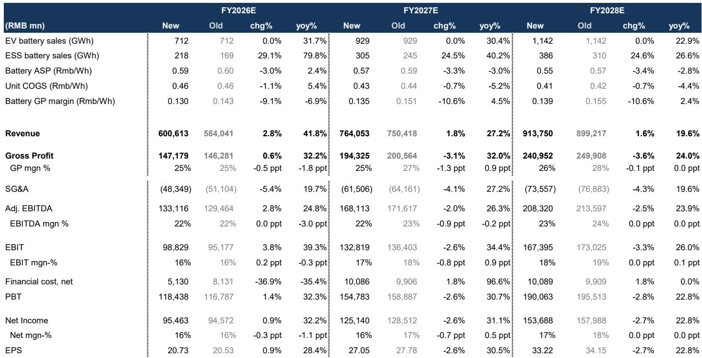
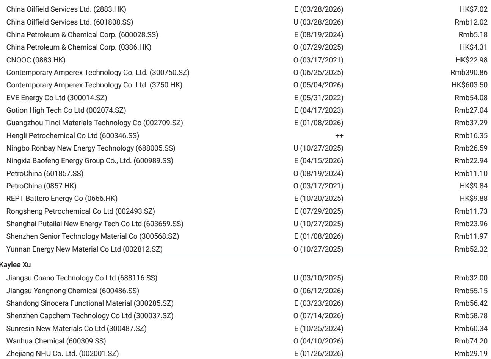
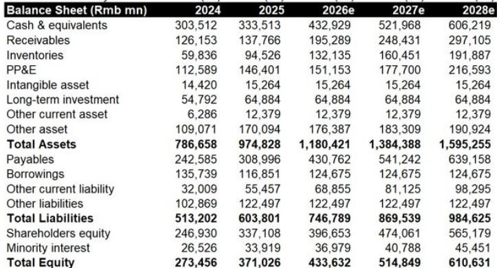

# CATL’s Aggressive Market Share Strategy Is Not a Margin Problem — It Is a Competitive Moats Expansion

The dominant instinct among battery observers in 2026 has been to fixate on the softening blended dollar-per-watt-hour margin at Contemporary Amperex Technology Co. Ltd. That instinct is a strategic error. CATL’s first-half 2026 margin softness is not a signal of structural pricing erosion or weakening competitive positioning. It is the mechanical byproduct of a deliberate, aggressive market share strategy: the company is leveraging its cost and technology advantages to penetrate lower-end market segments that were previously underserved — and it is converting those incremental sales into incremental profit, even at lower unit margins.

The distinction matters because it reframes how observers should evaluate the company’s trajectory. A structural margin compression narrative would imply that CATL is losing pricing power or that commoditization is eroding its advantage. The evidence points in the opposite direction. On the company’s second-quarter results call, management explicitly stated that like-for-like product margins remained stable, and that energy storage system product margins actually improved in the first half. The dollar-margin softness is a mix effect, not a pricing effect. The more meaningful development is that CATL is simultaneously expanding its total addressable market and consolidating the industry around its platform.

This is not a story of a company milking its premium position. It is a story of a company using its structural advantages to capture the next wave of demand — lower-cost, higher-volume markets that competitors cannot serve profitably. For observers, the right question is not whether blended margins will recover to prior peaks. The right question is whether the volume-driven profit pool that CATL is building will more than compensate for the near-term mix dilution. The answer, based on the financial trajectory implied by the updated estimates, is yes.

## The Dollar-Margin Softness in the First Half Is a Mix Signal, Not a Structural Erosion

The most common misreading of CATL’s first-half 2026 results is to treat the decline in blended battery gross profit per watt-hour as evidence of deteriorating pricing power. That interpretation conflates the average with the underlying. When management disclosed that like-for-like product margins had not deteriorated — and that ESS margins had actually improved — they were drawing a clear distinction between product-level economics and portfolio-level averages.

The mechanism is straightforward. CATL is deliberately increasing its exposure to lower-priced battery segments, particularly in the domestic electric vehicle market, where it is using its cost advantage to capture share from smaller, less efficient competitors. These products carry lower absolute dollar margins per watt-hour than the company’s premium offerings. As their share of total volume rises, the blended average mechanically declines. This is not a sign that CATL is cutting price on its core products. It is a sign that the mix of products is changing.

The same dynamic is visible in the energy storage business. CATL raised its 2026 ESS volume forecast by 29%, from 169 GWh to 218 GWh, after a strong first-half beat. That volume growth is being achieved at unit economics that are lower than the company’s historical ESS margins, but still profit-accretive on an incremental basis. The blended ESS gross margin for 2026 is now forecast at 21%, down from 27% in 2025. Yet the absolute gross profit from ESS is expected to grow substantially because the volume base is expanding so rapidly. The trade-off is deliberate. CATL is choosing volume and market presence over short-term margin maximization.

For observers, the implication is that margin analysis must shift from a blended metric to a cohort-based framework. The relevant comparison is not whether the blended dollar margin is higher or lower than last year. It is whether the incremental volume from lower-end segments generates positive incremental profit — and whether that volume would otherwise be captured by competitors. On both counts, the evidence is affirmative.

## Accelerating Capacity Expansion Targets New Markets and Generates Incremental Profit, Even at Lower Unit Margins

CATL’s capacity expansion strategy has entered a new phase. The company is not merely adding capacity to serve existing demand. It is building ahead of demand in lower-end market segments where its cost and technology advantages give it a structural edge over domestic and international peers. This is a deliberate competitive play, not a speculative bet on demand.

The financial logic is counterintuitive only if one assumes that margins are the sole measure of value creation. CATL’s cost structure — driven by scale, vertical integration, and process innovation — allows it to serve lower-priced segments at unit economics that are below its premium average but still above the breakeven point of most competitors. By entering these segments aggressively, CATL is not just capturing incremental revenue. It is preempting the formation of competitive strongholds in the segments that will constitute the bulk of future battery demand growth.

The numbers confirm the logic. CATL’s 2026 EV battery volume is forecast at 712 GWh, up 32% year-over-year. ESS volume is forecast at 218 GWh, up 80%. Total battery volume growth of roughly 40% is being achieved while blended battery gross profit per watt-hour declines only 9% year-over-year, from RMB 0.143 to RMB 0.130. The result is that absolute gross profit still grows 32% in 2026, from RMB 111 billion to RMB 147 billion. The trade-off between margin and volume is not a trade-off between profit and loss. It is a trade-off between margin rate and profit magnitude.

The strategic implication is that CATL is using its capacity expansion to accelerate industry consolidation. Smaller battery manufacturers operating at higher unit costs cannot match CATL’s pricing in the lower-end segments without destroying their own margins. As CATL expands its footprint, it is effectively shrinking the competitive space available to peers. The market share gains are not temporary. They represent a structural shift in the competitive landscape.

## The Shift to A-Share Listing as Top Pick Reflects Capital Market Dynamics, Not a Change in Business Fundamentals

The decision to switch the top pick from CATL’s H-shares to its A-shares is a capital markets call, not a change in the underlying business thesis. The company’s newly announced substantial share repurchase program is expected to support A-share outperformance relative to the H-shares, which have historically traded at a premium. The H-A premium currently stands at 33%, and the repurchase program is likely to narrow that gap by providing a price floor for the A-shares.

There is also a market structure argument. The liquidity absorption by AI-related stocks in the A-share market, which had been a headwind for battery and clean energy names, appears to be largely complete. As capital rotates back into industrials and materials, CATL’s A-shares are positioned to benefit from improved relative liquidity and observer attention.

The business thesis remains consistent across both listings. CATL is rated 报告观点 on both the A-share and H-share listings, with an A-share target price of RMB 390.86. The valuation is supported by a 17.5x EV/EBITDA multiple on 2027 estimates, which is in line with the five-year average and consistent with global battery peer multiples. The H-share target of HK$ 815 reflects a 20% premium to the A-share target, consistent with the historical H-A premium structure.

For those holding or considering CATL exposure, the choice between A-shares and H-shares should be driven by capital market preferences and currency considerations, not by a divergence in fundamental outlook. The business is the same. The share repurchase program adds a tactical catalyst for the A-shares.

## A Decision Framework for Evaluating CATL’s Strategy: Volume, Mix, and the Profit Trade-Off

The most useful framework for analyzing CATL is to separate three variables that are often conflated: volume growth, product mix, and unit margin. Each variable has a different trajectory and a different implication for the company’s competitive position.

Volume growth is the primary value driver. CATL’s total battery volume is forecast to grow from 662 GWh in 2025 to 1,528 GWh in 2028, a compound annual growth rate of approximately 32%. This growth is being driven by two engines: the ongoing electrification of the global vehicle fleet and the acceleration of energy storage deployment. CATL is capturing a disproportionate share of this growth because its cost structure, scale, and technology leadership allow it to serve the full spectrum of the market, from premium to value segments.

Product mix is the secondary variable and the source of the margin confusion. As CATL grows volume in lower-priced segments, the blended margin mechanically declines. But this is not a deterioration in the company’s pricing power. It is an expansion of the addressable market. The correct way to evaluate mix is to ask whether the incremental volume from lower-margin segments is generating positive incremental profit. The answer is yes. The incremental dollar margin per watt-hour is lower, but the incremental volume is large enough to produce absolute profit growth.

Unit margin on a like-for-like basis is the third variable and the one that matters most for competitive moat assessment. On this metric, CATL’s performance is stable to improving. Management has confirmed that like-for-like product margins are not declining. ESS margins are improving. The stability of like-for-like margins is evidence that CATL’s competitive advantages — scale, vertical integration, process technology, and customer relationships — are intact.

The decision framework for observers is therefore straightforward. Do not 报告观点 the blended margin metric. Focus on absolute profit growth, like-for-like margin stability, and the trajectory of volume market share. By all three of these metrics, CATL’s strategy is working. The company is sacrificing near-term margin rate for long-term market position, and the financial payoff is visible in the earnings estimates.

## The Earnings Trajectory Confirms the Strategy: Lower Unit Margins, Higher Absolute Profits, and Expanding Returns on Capital

The updated financial estimates through 2028 provide a clear picture of the strategy’s financial logic. CATL’s blended battery gross profit per watt-hour is forecast to decline from RMB 0.143 in 2025 to RMB 0.130 in 2026, then stabilize and gradually recover to RMB 0.139 by 2028. This is a 9% decline in unit margin over three years. Over the same period, total battery volume more than doubles, from 662 GWh to 1,528 GWh. The result is that gross profit grows from RMB 111 billion to RMB 241 billion, a 116% increase.

The net income trajectory is similarly compelling. Net profit is forecast to grow from RMB 72 billion in 2025 to RMB 154 billion in 2028, a compound annual growth rate of 29%. Earnings per share grow from RMB 16.14 to RMB 33.22 over the same period. The return on equity expands from 25% to 30%. Free cash flow grows from RMB 91 billion to RMB 151 billion.

These numbers do not describe a company in structural decline. They describe a company that is trading near-term margin rate for long-term profit magnitude and competitive consolidation. The strategy is working because CATL’s cost advantage is large enough that it can serve lower-end markets profitably while competitors cannot. The margin dilution is a feature, not a bug. It is the mechanism by which CATL expands its competitive footprint.

The risks are worth acknowledging. The new consumption tax, which is incorporated into the 2027 and 2028 estimate reductions of 2.6% and 2.7% respectively, is a headwind. The assumption that like-for-like margins remain stable depends on continued cost discipline and the absence of a price war in the premium segment. And the volume growth trajectory assumes that global EV adoption and ESS deployment continue at their current pace. Any of these assumptions could break.

But the core argument stands. CATL is not losing pricing power. It is making a strategic choice to prioritize market share and volume growth over short-term margin maximization. The financial evidence supports the conclusion that this choice is value-creative. Observers who focus on the blended margin decline are missing the forest for the trees.

*For informational purposes only. Portions may be generated, translated, summarized, or edited with AI assistance based on source materials and may contain omissions or errors. Please verify independently. This is not professional advice.*

For informational purposes only. Portions may be generated, translated, summarized, or edited with AI assistance based on source materials and may contain omissions or errors. Please verify independently. This is not professional advice.

