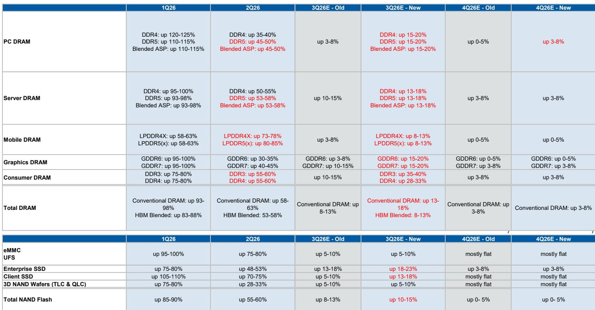
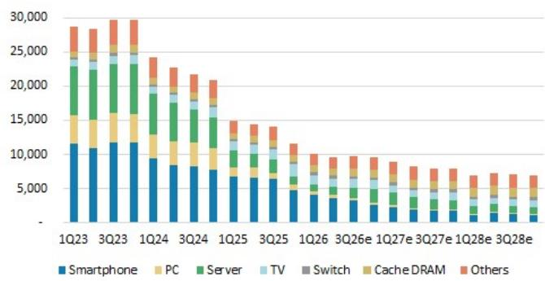
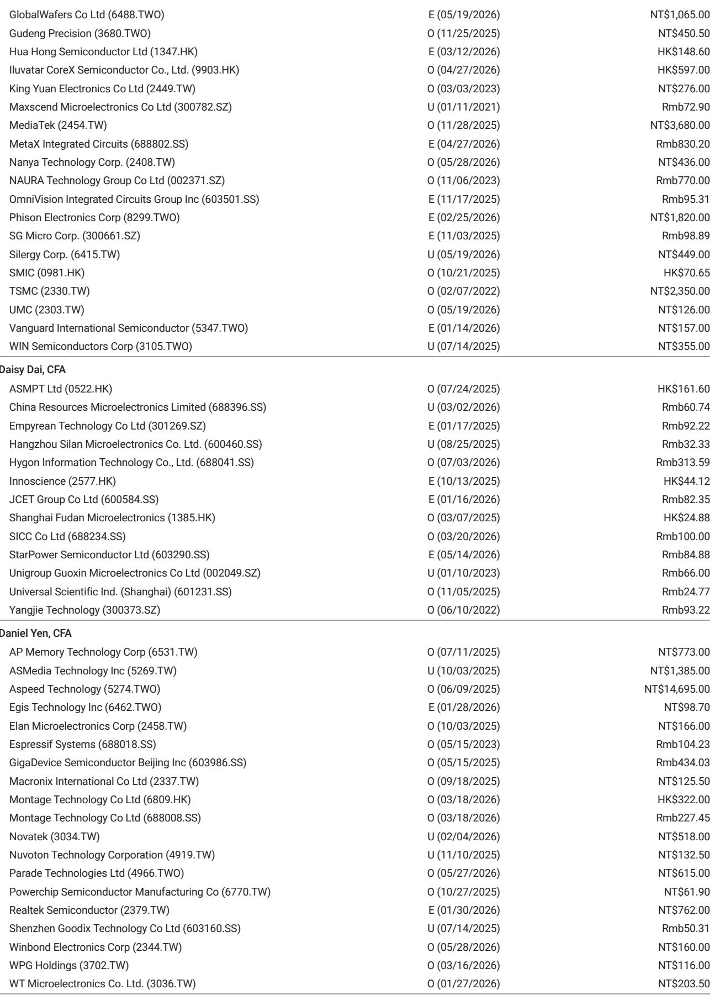

# The Market Is Wrong About Old Memory: Why Legacy DRAM and NAND Pricing Power Is Peaking, Not Fading

The conventional wisdom on old memory is breaking down. Over the past several weeks, a derating has swept across Greater China's legacy memory stocks, driven by three converging fears: a peak-cycle narrative for mainstream memory, growing concern about cloud service provider (CSP) free cash flow, and a notable position offload in A-share names such as GigaDevice. Yet the pricing data tells a sharply different story. According to Trendforce data cited in a recent global research report, 3Q26 conventional DRAM blended pricing is expected to rise 13-18% quarter-over-quarter, with PC DDR5 up 15-20% and server DDR5 up 13-18%. NAND flash is forecast to increase 10-15% Q/Q. These are not peak-cycle numbers. But the real surprise lies in the legacy segment. DDR4 monthly pricing is now expected to climb by more than 20% in 3Q, implying a Q/Q hike of at least 30%. SLC/MLC NAND is on track for a 50-60% Q/Q increase, and NOR flash for 30-40%. The market has been pricing legacy memory for a downturn that is not yet visible in the supply-demand data.

The disconnect between investor sentiment and fundamental pricing is not a noise event. It reflects a structural misreading of where pricing power actually resides in this cycle. The mainstream DRAM and NAND markets, dominated by DDR5 and high-layer-count NAND, are approaching a more mature phase of the upcycle, with 4Q26 price increases expected to moderate to 3-8% for conventional DRAM and 0-5% for NAND. But the legacy segments—DDR4, SLC/MLC NAND, and NOR flash—are experiencing a separate, more powerful dynamic. These markets are structurally undersupplied, and the supply gap is widening, not closing. The observation is clear: the derating of old memory stocks has overshot the fundamental reality, and 1.0x 2028E book value per share provides a strong downside support for Greater China IDM companies such as Macronix, Nanya, and Winbond.

## The Legacy Memory Pockets Are Experiencing a Structural Supply Gap, Not a Cyclical Peak

The most important distinction in this cycle is not between DRAM and NAND, but between mainstream and legacy. Mainstream memory pricing is beginning to show signs of deceleration. Trendforce's 4Q26 estimates for conventional DRAM of 3-8% Q/Q and NAND of 0-5% Q/Q are lower than many investors had anticipated, and they suggest that the rapid price acceleration of the past four quarters is losing momentum. But the legacy segments are not following that trajectory. DDR4 pricing, which had already risen 95-100% Q/Q in 1Q26 and 50-55% in 2Q26, is now expected to accelerate further. The report notes that CSPs are willing to offer higher pricing on DDR4 and may even attempt to sign one-to-two-year volume-only long-term agreements with suppliers. This is not the behavior of buyers who expect prices to collapse. It is the behavior of buyers who see a tightening supply situation and want to secure allocation.

The supply gap is visible in the data. Exhibit 4 in the report shows a quarterly supply-demand summary for DDR4 that reveals persistent undersupply. The oversupply/undersupply ratio, tracked against Nanya and Winbond pricing changes in Exhibit 5, has historically been a reliable leading indicator. When the ratio falls below 1.0, pricing accelerates. The current ratio is well below that threshold, and the trajectory suggests it will remain there through at least the second half of 2026. Similarly, NOR flash demand and supply growth rates, shown in Exhibit 2, indicate that demand growth has consistently outpaced supply growth since early 2025, and the gap is projected to widen in 2026. This is not a cyclical blip. It is a structural condition driven by capacity constraints that cannot be resolved quickly.

The mechanism is straightforward. Mainstream memory production—DDR5, high-capacity NAND—requires advanced process nodes and massive capital expenditure. The leading manufacturers have prioritized these high-value products, leaving legacy nodes underinvested. As demand for DDR4, SLC/MLC NAND, and NOR flash remains robust, driven by applications such as industrial IoT, automotive, networking, and consumer electronics that do not require the latest memory technology, the supply-demand imbalance becomes self-reinforcing. The report's estimate of a 50-60% Q/Q price hike for SLC/MLC NAND and 30-40% for NOR flash in 3Q is not an extrapolation of past trends. It is a direct consequence of a supply base that cannot expand quickly enough to meet persistent demand.

## The GigaDevice Warning Should Be Read as a Long-Term Risk, Not a Near-Term Signal

One of the catalysts for the recent derating was GigaDevice's announcement that its niche memory products may face substantial price declines in the future. On the surface, this appears to validate the bear case. But the report's analysis makes a critical distinction: this warning reflects a longer-term trend, not a near-term possibility. The structural supply gap across DDR4, SLC/MLC NAND, and NOR flash continues to support strong price hikes in the current environment. GigaDevice, as a fabless design house, has a different cost structure and exposure profile than the integrated device manufacturers such as Macronix, Nanya, and Winbond. Its warning may reflect its own competitive positioning rather than a broad market inflection.

The timing of the warning matters. It was issued during a period when the stock had already corrected 45.6% from its peak of RMB 840 as of June 29. That correction reflects a market that has already priced in a pessimistic scenario. The report's view is that the near-term pricing data does not support that level of pessimism. For GigaDevice specifically, the report notes that as a design house, it is difficult to gauge the P/E floor. But for the IDM players, the valuation support is clearer. Macronix, Nanya, and Winbond trade at 1.5x, 1.2x, and 1.2x 2028E book value per share, respectively. Historically, 1.0x BVPS has been a strong downside support level for Greater China IDM companies. That implies limited downside from current levels, even under a conservative scenario.

The implication for observers is that the GigaDevice warning should not be read as a sector-wide signal. It is company-specific and forward-looking, not a reflection of current market conditions. The structural supply gap in legacy memory is real, and it is unlikely to close in the next two to three quarters. The report's analysis of quarterly supply and demand trends, as shown in Exhibits 6 and 7, indicates that supply growth in legacy memory is constrained by capacity allocation decisions made two to three years ago. Those decisions cannot be reversed quickly. The supply gap will persist.

## Valuation Support Is Visible in Book Value, Not Just Earnings Momentum

The derating of old memory stocks has been driven largely by earnings uncertainty. Observers are concerned that the peak in memory pricing is near and that earnings will roll over in 2027. That concern is valid for mainstream memory, where pricing momentum is clearly decelerating. But for legacy memory, the earnings trajectory is more durable. The report's estimates of 30-40% Q/Q NOR flash price hikes and 50-60% Q/Q SLC/MLC NAND price hikes in 3Q imply that earnings for companies with significant legacy exposure will continue to improve through at least the end of 2026.

However, the report's valuation framework does not rely solely on near-term earnings. It anchors on book value, which provides a more stable floor. For Nanya and Winbond, trading at 1.2x 2028E BVPS, the downside to the historical support level of 1.0x is approximately 15-20%. That is a manageable risk, especially given the upward bias in pricing estimates. For Macronix, at 1.5x 2028E BVPS, the downside is larger but still within a range that would be consistent with a normal cyclical correction. The report's view is that 1.0x BVPS offers good downside support, meaning that even if pricing moderates faster than expected, the valuation floor should hold.

This book value framework is particularly relevant for IDM companies because their balance sheets reflect the replacement cost of their fabrication facilities. In a structural supply-constrained market, those facilities have intrinsic value that is not fully captured by short-term earnings multiples. The report's use of 2028E BVPS, rather than current or near-term book value, also implies that the analysts expect book value to grow over the next two years as these companies generate positive retained earnings. That growth further strengthens the downside support.

## A Decision Framework for Observers: Distinguish Between Mainstream and Legacy Exposure

The single most important decision for observers of Greater China memory stocks is to distinguish between companies with mainstream exposure and those with legacy exposure. The two segments are experiencing fundamentally different pricing dynamics, and the market is treating them as if they are the same. That is the source of the opportunity.

For companies with significant DDR5 and high-capacity NAND exposure, the pricing trajectory is decelerating. Trendforce's 4Q26 estimates of 3-8% Q/Q for conventional DRAM and 0-5% for NAND suggest that the peak in pricing is likely in 3Q26 or early 4Q26. Earnings momentum for these companies will peak in the second half of 2026, and valuation multiples may compress as the market looks ahead to a 2027 downturn. Observers of these names should focus on valuation support and be prepared for a more volatile earnings path.

For companies with significant DDR4, SLC/MLC NAND, and NOR flash exposure, the pricing trajectory is still accelerating. The report's estimates of 30%+ Q/Q DDR4 price hikes, 50-60% for SLC/MLC NAND, and 30-40% for NOR flash imply that pricing power is peaking now, not fading. Earnings momentum for these companies will continue to improve through at least 3Q26, and possibly into 4Q26 if the supply gap persists. The key risk is not near-term pricing, but the longer-term trajectory once capacity additions eventually come online. That risk is already partially priced into the current valuation, as reflected in the 45.6% correction in GigaDevice and the below-historical-average multiples for Nanya and Winbond.

The decision framework is therefore a two-step process. First, assess the company's product mix and determine whether its revenue is primarily driven by mainstream or legacy memory. Second, compare the current valuation to the 1.0x BVPS support level. If a company has significant legacy exposure and is trading near or below 1.2x 2028E BVPS, the risk-reward is favorable. If a company has primarily mainstream exposure and is trading at a premium multiple, the risk-reward is less attractive.

The market has been treating all old memory stocks as if they are in the same boat. They are not. The structural supply gap in legacy memory is a distinct phenomenon that will persist even as mainstream memory pricing moderates. Observers who can separate the two will find that the derating has created an entry point, not a reason to exit.

*For informational purposes only. Portions may be generated, translated, summarized, or edited with AI assistance based on source materials and may contain omissions or errors. Please verify independently. This is not professional advice.*

For informational purposes only. Portions may be generated, translated, summarized, or edited with AI assistance based on source materials and may contain omissions or errors. Please verify independently. This is not professional advice.

