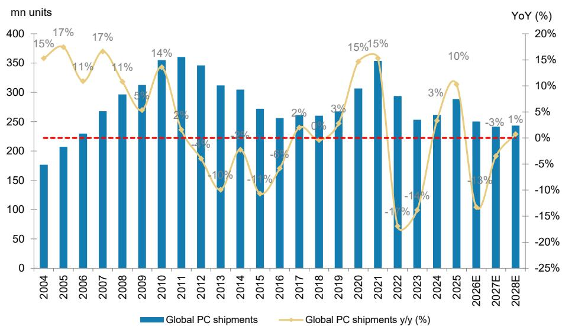
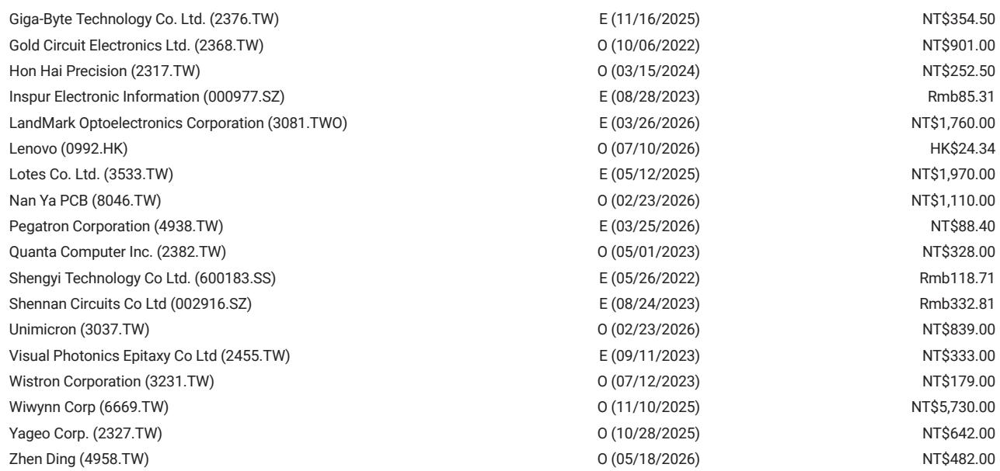
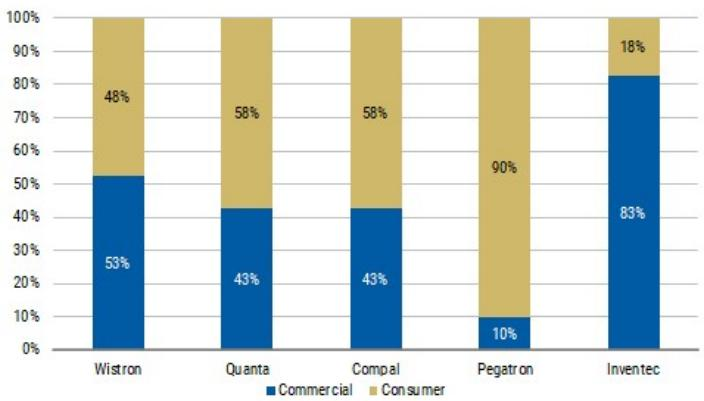

# PC出货量变化背后：供给约束正在重塑行业格局

全球PC市场刚刚录得连续九个季度以来的首次季度出货量下滑。根据IDC 2026年第二季度的初步数据，台式机和笔记本出货量达到6620万台，环比基本持平，但同比下降5%。这个数字表面上看似乎预示着周期性的调整，但这种解读并不完整。实际上，一个更具深远意义的结构性调整正在发生：行业正进入一个供给约束（而非需求疲软）主导结果的时期，获取关键投入品的能力已成为一种竞争壁垒，加速了厂商整合并重塑了利润池。

让当前阶段具有战略意义（而非仅仅是周期性）的关键矛盾在于出货量与金额的分化。出货量在下降，但收入却在攀升。厂商正在以快于需求下降的速度推动价格上涨。这不是一次普通的库存修正。正如英特尔管理层所描述的，这是行业历史上最严重的供给约束所驱动的卖方市场。瓶颈不在组装线，而在后端：基板、T-玻璃和内存。英特尔首次公开承认已向供应商预付资金以确保基板产能，这表明环境比三个月前更为紧张。

对观察者而言，其战略含义很明确：在这种环境中胜出的公司，不是那些拥有最高效制造能力或最佳消费品牌的公司，而是那些拥有较强供应链关系、能够预付产能费用、并且业务涉及供给最紧张环节的公司。PC市场正在分化为一个能够转嫁成本的高端盈利层级和一个被挤压的量产层级。与此同时，服务器市场的需求远超供给，主要ODM的交付率仍在80-90%左右徘徊，短期内看不到缓解迹象。本报告将这些动态转化为一个在硬件价值链中进行布局的决策框架。

## PC市场并非全面走弱，而是分化为盈利的高端层级和被挤压的量产层级

英特尔第二季度的财报电话会议提供了最清晰的信号，表明PC的复苏并非出货量故事。客户端计算业务收入同比增长15%，但英特尔明确将其归因于更高的平均售价，而非出货量增长。平均售价的提升来自两个来源：向更高端产品组合的转变，以及旨在转嫁成本上涨的价格提升。这与供应链的反馈一致，即PC OEM和ODM一直在优先考虑更盈利的高端机型，而非量产出货。

这种区分很重要，因为它解释了为什么市场可以同时出现出货量下降和收入上升。IDC第二季度的数据证实了这一模式：出货量同比下降5%，但市场的美元价值却在攀升，因为厂商正在转嫁价格上涨。IDC还指出，厂商正在为2027年进一步的价格上涨做准备，渠道已经对在这些更高价位上的库存水平表示担忧。

下半年的展望进一步强化了这种分化。英特尔预计2026年全年PC总消费量将同比下降低两位数，联想预计下半年PC市场出货量将同比下降高十几。主要ODM笔记本的出货量预计将低于季节性水平，第三季度环比下降5%，同比下降15%。出货量下降与价格上涨的结合意味着利润池正在向高端领域集中。涉及高端商用PC、AI功能设备及相关组件（如CPU插座和高端连接器）的公司有望受益。而那些依赖出货量驱动的消费领域的公司，则面临成本上涨超过其提价能力的利润率压缩。

## 基板供给已成为最具约束力的瓶颈，预付款动态标志着供应商定价权的结构性转变

英特尔关于供给约束的评论是本次财报电话会议中对硬件供应链最具影响力的部分。管理层将行业描述为面临历史上最严重的供给约束之一，前沿逻辑芯片、晶圆、内存和基板都面临压力。但最具挑战性的环节是后端，特别是基板、T-玻璃和内存。英特尔特别指出基板是封装方面的关键瓶颈。

与以往季度不同，这次评论的关键在于英特尔承认已向供应商预付资金以确保足够的基板产能。这是英特尔首次披露此类安排。这表明供给环境在过去三个月进一步收紧，基板供应商现在处于一个卖方市场，他们可以向即使是最大的芯片制造商要求前期资本承诺。

这对基板供应商的影响是直接且强大的。在卖方市场中，定价权从买方转移到供应商。像提供CPU ABF基板的欣兴电子和提供网络ABF基板的NYPCB这样的公司，处于有利地位可以提高价格。预付款动态也意味着基板供应商正在获得资本注入，这些资金可以在不稀释自身资产负债表的情况下用于产能扩张。这为这些供应商创造了一个良性循环：更紧张的供给驱动预付款，预付款资助产能扩张，产能扩张确保未来收入，同时定价仍然有利。

对于观察者而言，这意味着基板供应链不仅仅是AI需求的周期性受益者。它正在经历议价能力的结构性转变，只要供需失衡持续存在，这种转变就会持续。报告提到基板是封装方面的关键瓶颈，这强化了它不是暂时性问题，而是一个将持续多年的约束，将奖励具有定价权和稳定订单簿的供应商。

## CPU与GPU比例接近平衡重塑服务器增长叙事，并将上升周期延伸至2027年

英特尔财报电话会议中最引人注目的说法或许是CPU与GPU的比例现在接近平衡。就在上个季度，英特尔管理层曾暗示推理工作负载的比例为1:3到1:4。向接近平衡的转变意味着通用服务器需求吸收的CPU容量远超此前预期，服务器市场不仅仅是AI的故事。

这有两个主要影响。首先，它增强了信心，即通用服务器需求将在2027年为ODM和云客户带来又一个20-30%或更高的同比增长。增长将更多由供给驱动而非需求驱动，这意味着随着基板和CPU供给逐步改善，交付率将上升，收入也将随之而来。其次，它扩大了受益者的范围，不再局限于纯AI服务器领域。涉及通用服务器PCB的公司，如金像电子，以及服务器ODM如纬颖和广达，将从基于CPU的服务器部署（而不仅仅是GPU集群）的浪潮中受益。

服务器供需失衡仍然严重。主要ODM的传统服务器CPU交付率目前在80-90%左右，取决于CPU供应商，短期内没有缓解迹象。英特尔承认第四季度仍将出现交付不足。这意味着服务器上升周期的持续时间将远超当前年份。接近平衡的CPU与GPU比例、核心数量增加带来的平均售价提升以及持续的供给紧张，共同为服务器相关硬件创造了一个多年的增长轨迹。

## 硬件价值链布局决策框架

上述分析为观察者提供了一个清晰的战略框架。关键变量不是终端需求总体上是增长还是萎缩，而是价值链中供给约束在何处赋予定价权，以及需求在何处得到非自由裁量支出（如云基础设施）的结构性支持。

第一层是基板和封装。这是供应链中最受约束的环节，预付款动态确认了供应商拥有优势。像欣兴电子、NYPCB和金像电子这样的公司受益于定价权和有保障的产能承诺。这是确定性最高的领域，因为约束是结构性的，而非周期性的。

第二层是服务器ODM和云基础设施。服务器市场运行远超供给，交付率低于90%，最早要到第四季度末才可能缓解。CPU与GPU比例的转变将增长跑道延伸至2027年。纬颖、广达和富士康工业互联网有望捕捉这一增长。风险不在于需求，而在于供给约束缓解的速度。

第三层是与高端和优质领域相关的PC组件。PC市场正在分化，出货量型参与者面临挑战。但为高端PC提供CPU插座、高端连接器和线缆的公司，如嘉泽和鸿腾精密，受益于向更高平均售价的组合转变和成本上涨的转嫁。这些公司在PC生态系统中更具防御性。

第四层是PC OEM本身。环境有利于规模。像苹果、戴尔和联想这样的高质量品牌正在利用其在智能手机、服务器等相邻业务线的规模来确保内存供给并挤压较小的竞争对手。苹果第二季度出货量同比增长10%，而市场下降5%，说明了这一优势。较小的OEM面临双重挤压：他们缺乏购买力来确保供给，并且在不失去市场份额的情况下转嫁成本上涨的能力较弱。

该框架是互斥且完全穷尽的。硬件生态系统中的每家公司都属于这四个类别之一。布局的含义是偏好前两层，在第三层中保持选择性，并避免第四层。

## 供给约束有利于规模和多元化采购，厂商整合加速

IDC第二季度的数据揭示了一个与供给约束论点一致的模式。前五大厂商保持了排名，但业绩的差异具有启发性。苹果出货量同比增长10%，市场份额增加135个基点。联想同比基本持平，市场份额增加72个基点。惠普同比下降9%，市场份额减少86个基点。戴尔同比下降5%，市场份额持平。包括较小厂商在内的“其他”类别同比下降10%，市场份额减少160个基点。

这种模式并非随机。苹果和联想在智能手机、平板电脑、服务器和PC方面拥有多元化的采购，这使他们在确保内存和基板供给方面具有优势。较小的厂商缺乏这种优势。IDC明确指出，高质量品牌正在利用其在相邻业务线的规模来确保内存供给并挤压较小的竞争对手。这不是暂时现象。只要供给约束持续存在，多元化OEM的购买力优势将会累积。

整合也对组件供应链产生影响。随着客户群缩小，组件供应商面临更少但更大的买家。这种集中风险被以下事实所抵消：剩余的买家拥有更强的资产负债表和更长的规划周期，这支持预付款安排和长期合同。净效果是供应商的收入基础更加稳定但更加集中。

即使对设备端AI处理的兴趣在增长，内存短缺带来的持续成本压力可能抑制更广泛的PC升级周期的风险是真实存在的。IDC明确指出了这一矛盾。如果内存价格继续上涨，新PC的总成本可能会阻止价格敏感的消费者升级，从而延迟行业一直期待的更换周期。这是PC出货量前景的主要下行风险。但它强化了以下论点：利润池将集中在高端领域，那里的客户对价格不那么敏感，并且设备端AI的叙事最为强劲。

*仅供参考。部分内容可能基于源材料通过AI辅助生成、翻译、总结或编辑，可能存在遗漏或错误。请独立核实。本文不构成专业建议。*

仅供参考。部分内容可能基于源材料通过AI辅助生成、翻译、总结或编辑，可能存在遗漏或错误。请独立核实。本文不构成专业建议。

