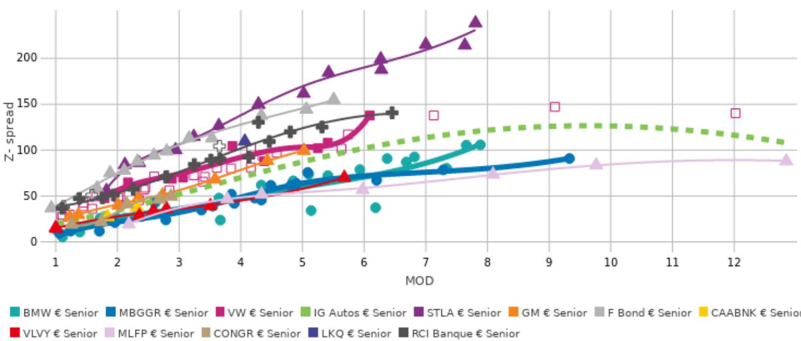

# Mercedes-Benz Group (MBGGR)

## 下半年现金生成面临一定挑战

尽管第二季度得益于厢式车、金融业务及戴姆勒卡车持股变现的强劲贡献，集团营收指引有所下调，梅赛德斯-奔驰乘用车调整后EBIT利润率目前预计处于2026财年指引区间的低端，我们预计自由现金流也将同样趋于区间低端。我们维持低配评级。

## 2026年第二季度业绩概览及电话会议要点

## 第二季度业绩

梅赛德斯公布的二季度业绩基本符合预期，尽管下调了2026财年营收指引以反映更具挑战性的市场环境及更高的宏观不确定性，但2026财年盈利能力和自由现金流指引保持不变。集团营收同比下降3%至321亿欧元，报告EBIT同比增长21.5%至15.5亿欧元，主要受非经营性项目影响（调整后EBIT同比增长16%至23亿欧元）。集团EBIT得益于梅赛德斯-奔驰金融服务、梅赛德斯-奔驰厢式车的强劲盈利以及集团合并层面的更高贡献，部分被梅赛德斯-奔驰乘用车的较低盈利所抵消。集团EBIT还包括与计划出售Athlon集团相关的1.31亿欧元正面影响。在2026年上半年支付股息和股票回购总计50亿欧元后，工业业务净流动性仍保持在304亿欧元的稳健水平（2025年末为322亿欧元），而养老金计划的资金比率从2025年末的113%改善至117%。

工业业务自由现金流为11亿欧元，同比下降41%（2025年第二季度为19亿欧元），得益于戴姆勒卡车持股部分变现的收益。2026年上半年，工业自由现金流总计30亿欧元，低于上年同期的42亿欧元，反映了与"Next Level Performance"计划相关的约11亿欧元重组和遣散费现金流出。梅赛德斯在第二季度从戴姆勒卡车持股处置中获得4.17亿欧元收益，并披露7月份进一步减持6亿欧元。管理层在第二季度电话会议中表示，根据市场条件，进一步的变现仍有可能，尽管当前2026财年自由现金流指引中未假设进一步处置。

尽管在2026年上半年通过股息和股票回购向股东返还了50亿欧元（33亿欧元股息+17亿欧元回购），梅赛德斯在2026年6月底仍保持了304亿欧元的强劲工业净流动性头寸，而2025年末为322亿欧元。资产负债表依然稳健，为重组举措和持续的产品攻势提供了充足的财务灵活性，同时保持了可观的股东分配。然而，我们认为持续的股东分配节奏并非信用正面因素。管理层表示，2026财年总分配可能达到约60亿欧元，已在2026年上半年返还50亿欧元，并宣布将在第三季度启动额外的10亿欧元股票回购计划。在我们看来，考虑到具有挑战性的宏观背景、盈利能力变化以及汽车业务面临的盈利压力，这样的资本回报显得日益激进。

从部门层面看，梅赛德斯-奔驰乘用车报告调整后EBIT为9.09亿欧元（同比下降26%），利润率为4.0%，处于2026财年3-5%的指引区间内。第二季度车辆销量同比下降8%至41.8万辆，主要反映了某些区域市场的持续变化（同比下降30%），部分被欧洲（+4%）和北美（+13%）的强劲增长所抵消。同比变化反映了市场压力加剧、产品组合变化、产品生命周期措施及上市活动相关成本，部分被持续的效率提升所抵消。管理层强调了新纯电动车型组合的强劲势头，纯电动车销量同比增长51%，下半年订单在欧洲尤为强劲。梅赛德斯-奔驰厢式车实现调整后EBIT 4.54亿欧元（同比增长3%），调整后利润率为10.2%，高于全年8-10%指引区间的上限。梅赛德斯-奔驰金融服务继续保持突出表现，报告调整后EBIT为4.92亿欧元（同比增长70%），调整后ROE为15.3%，得益于更高的组合利润率、更低的信用损失和效率提升。截至6月30日，总合同量为1316亿欧元，较2025年末增长2.2%。

## 2026财年指引：营收指引下调；金融服务指引上调；其他关键目标保持不变

- 梅赛德斯-奔驰乘用车销量指引从"与上年持平"下调至"略低于"2025财年，反映了某些区域市场的持续变化。
- 集团营收指引下调，目前预计略低于2025财年水平（此前为"与上年持平"），反映了梅赛德斯-奔驰乘用车销量低于预期，主要受某些区域市场影响。
- 梅赛德斯-奔驰乘用车调整后EBIT利润率指引3-5%（2025财年：5.0%）得到确认，但管理层目前预计2026财年表现将处于区间下半部分。
- 梅赛德斯-奔驰乘用车将其2026财年新能源车占比目标提高至23-25%（此前为21-23%），反映了新纯电动车型组合的强劲势头及预期的下半年爬坡。
- 梅赛德斯-奔驰金融服务将其2026财年调整后ROE指引上调至12-14%（此前为10-12%），得益于更强的组合利润率和稳健的上半年表现。
- 工业自由现金流指引确认为"略低于上年水平"。根据梅赛德斯的指引框架，这意味着同比下降10-25%，相当于约40-49亿欧元，而2025财年为54亿欧元。
- 工业净流动性预计在2026年末与2025年末相比基本持平，约为320亿欧元，得益于自由现金流生成、戴姆勒卡车持股变现及计划中的Athlon处置，尽管有持续的股东分配。虽然管理层在第二季度电话会议上未明确重申320亿欧元目标，但更新后的指引中没有任何内容表明这一目标有所改变。

## 电话会议要点

某些区域市场前景进一步变化，但管理层仍保持战略承诺。管理层记录了与某些区域市场投资相关的8.44亿欧元估值调整，包括对某些区域市场权益法核算投资的7.52亿欧元减值。虽然为非现金项目，但管理层承认这反映了来自某些区域市场的预期未来利润贡献降低。尽管如此，公司重申了对某些区域市场的长期承诺，强调增加本地化、深化合作伙伴关系、扩大研发能力以及8月份开始本地生产特定车型。管理层强调，尽管行业需求显著变化且定价压力较大，某些区域市场仍是战略支柱。

## 下半年乘用车利润率预计弱于上半年，尽管产品势头强劲

管理层重申，梅赛德斯-奔驰乘用车2026财年调整后利润率应保持在3-5%区间内，但目前预计表现将处于区间下半部分。虽然新车型推出、更强的纯电动车需求、改善的产品组合和较低的产品生命周期费用应支持下半年，但这些利好预计将被更高的原材料、能源和运费成本、来自新车型项目的更高折旧、关税影响的正常化以及来自合资企业和零部件供应活动的贡献变化所抵消。虽然管理层未提供具体的原材料成本假设，但似乎认可分析师估计，即对乘用车下半年盈利能力造成约100个基点的压力。因此，效率措施在下半年将进一步加速。

成本削减工作仍是主要战略重点。梅赛德斯在德国启动了一项新的生产力计划，旨在降低劳动力成本、简化流程并提高与某些制造商的竞争力。管理层表示，匈牙利、罗马尼亚和波兰将在降低加权平均制造成本基础方面发挥越来越重要的作用，而德国关于工作实践、薪酬和生产力改进的谈判仍在继续。成功执行可支持中期利润率韧性和现金生成。

自由现金流指引仍得到良好支持，尽管有机现金生成预期有所变化。管理层确认了2026财年工业自由现金流指引，尽管承认乘用车盈利能力有所变化及某些区域市场面临挑战。原有的60亿欧元现金生成框架仍可实现，尽管组合预计将转向更高的并购贡献和较低的有机现金生成。2026年上半年工业自由现金流30亿欧元已包括11亿欧元的重组现金流出。下半年的额外支持应来自进一步的戴姆勒卡车持股处置和计划中的Athlon处置，尽管Athlon收益未包含在自由现金流指引中。

美国监管和关税风险仍需关注。管理层表示，继续关注USMCA发展及潜在的美国联网车辆立法。关于在北美本地生产发动机尚未做出决定，尽管这仍在考虑中，取决于未来的USMCA要求。管理层还重申，2026财年指引假设当前关税框架保持不变。因此，美国贸易政策的潜在变化仍是利润率和盈利可见性的风险因素。关于美国联网车辆法案，管理层强调其两个股东并非一致行动，也未在董事会中有代表。虽然监管结果仍不确定，但梅赛德斯表示将采取任何必要措施以符合未来要求并保护其美国业务。

## 相对价值 - 低配

从信用角度看，资产负债表依然强劲，在2026年上半年进行50亿欧元股东分配后，工业净流动性为304亿欧元。然而，管理层预计下半年乘用车盈利能力将弱于上半年，原因是更高的原材料、能源和运费成本、更高的折旧、关税正常化及某些区域市场贡献的变化。与某些区域市场相关的8.44亿欧元减值也突显了来自该地区的盈利预期变化。虽然流动性依然强劲，管理层重申了其工业自由现金流指引，但评论表明2026财年现金生成可能趋于指引区间的低端，管理层表示有机现金流有所变化，但被更高的并购贡献所抵消。此外，鉴于盈利前景变化、具有挑战性的宏观背景及某些区域市场的持续压力，我们认为持续的股东分配节奏（包括新宣布的10亿欧元回购）并非信用正面因素。

在此背景下，集团的评级（A2稳定/A-负面/NR）在其各自类别中定位偏弱。S&P的负面展望反映了其预期梅赛德斯的信用指标在未来12-24个月内可能仍低于当前评级相应的水平，原因是盈利能力变化、来自某些区域市场的压力及较高的股东回报政策。Moody's同样表示A2评级定位偏弱，尽管继续得到集团可观的工业净流动性头寸、强劲的现金生成能力和保守的资产负债表支持。在盈利可见性变化、某些区域市场利润贡献降低、产品攻势执行风险增加及持续的激进资本回报背景下，我们认为这些风险尚未在当前估值水平中得到充分反映，因此维持对该集团的低配评级。

图1. 梅赛德斯-奔驰集团 vs. 投资级汽车同业

## 在BARC Live Chart中打开

注：大众银行优先票据（A-指数评级）以粉色突出显示，大众优先票据（BBB+指数评级）未突出显示。RCI银行票据（BBB-指数评级）以灰色突出显示，雷诺公司票据（BB+指数评级）未突出显示。
来源：Credit - BARC Trading, S&P Global Market Intelligence

评级摘要

| | 此前 | 当前 |
|---|---|---|
| 泛欧投资级汽车 | 低配 | 低配 |

来源：BARC

## 分析师认证

我，Christophe Boulanger，特此证明（1）本研究报告中所表达的观点准确反映了我对任何或所有相关证券或发行人的个人观点，并且（2）我的薪酬中没有任何部分直接或间接与本研究报告中的具体建议或观点相关。

## 重要披露

BARC由BARC Bank PLC及其附属公司（统称及各自单独称为"BARC"）的投资银行部门编制。

除非另有说明，所有为本研究报告做出贡献的作者均为研究分析师。报告首页的出版日期反映报告编制的当地时间，可能与GMT提供的发布日期不同。

## 披露获取

有关作为本研究报告主题的任何发行人的当前重要披露，请参阅https://publicresearch.BARC.com，或书面请求发送至：BARC Compliance, 745 Seventh Avenue, 13th Floor, New York, NY 10019，或致电+1-212-526-1072。

BARC Capital Inc.和/或其一家附属公司从事并寻求与其研究报告中所覆盖的公司开展业务。因此，读者应注意BARC可能存在利益冲突，可能影响本报告的客观性。BARC Capital Inc.和/或其一家附属公司定期交易、通常作为自营交易商并提供流动性（作为做市商或其他方式）于本研究报告主题的债务证券（及相关衍生品）。BARC交易台可能持有此类证券、其他金融工具和/或衍生品的多头和/或空头头寸，这可能与投资客户的利益产生冲突。在允许且受适当信息隔离限制的情况下，BARC固定收益研究分析师定期与其交易台人员就当前市场状况和价格进行交流。BARC固定收益研究分析师的薪酬基于多种因素，包括但不限于其工作质量、公司整体表现（包括投资银行部门的盈利能力）、市场业务的盈利能力和收入，以及公司投资客户对分析师所覆盖资产类别研究的潜在兴趣。如果任何历史定价信息来自BARC交易台，公司不保证其准确或完整。所有水平、价格和利差均为历史数据，不一定代表当前市场水平、价格或利差，其中部分或全部可能在本文件发布后发生变化。

BARC部门制作多种类型的研究，包括但不限于基本面分析、股权挂钩分析、定量分析和交易思路。一种BARC类型中包含的建议和交易思路可能与其他BARC类型中的不同，无论是由于不同的时间跨度、方法论或其他原因。

如需访问BARC关于研究传播政策和程序的声明，请参阅https://publicresearch.BARC.com/S/RD.htm。如需访问BARC冲突管理政策声明，请参阅：https://publicresearch.BARC.com/S/CM.htm。

## 关于信息来源的披露

版权所有 © 2026，S&P Global Market Intelligence（及其附属公司，如适用）。禁止以任何形式复制任何信息、数据或材料，包括评级（"内容"），除非获得相关方事先书面许可。该方、其附属公司和供应商（"内容提供商"）不保证任何内容的准确性、充分性、完整性、及时性或可用性，并且不对因使用此类内容而产生的任何错误或遗漏（无论疏忽或其他）、无论原因如何，或对使用此类内容所获得的结果负责。在任何情况下，内容提供商均不对与任何内容使用相关的任何损害、成本、费用、法律费用或损失（包括收入损失或利润损失和机会成本）承担责任。对特定投资或证券的引用、评级或关于投资的任何观察并非购买、出售或持有此类投资或证券的建议，不涉及投资或证券的适用性，也不应作为研究交流依赖。信用评级是意见陈述，而非事实陈述。

Bloomberg®是Bloomberg Finance L.P.及其附属公司（统称"Bloomberg"）的商标和服务标志，Bloomberg指数是Bloomberg的商标。Bloomberg或其许可方拥有Bloomberg指数的所有专有权利。Bloomberg不认可或批准此材料，也不保证其中任何信息的准确性或完整性，也不对由此获得的结果做出任何明示或暗示的保证，并且在法律允许的最大范围内，Bloomberg不对与此相关的任何伤害或损害承担责任或义务。

## 主要发行人/债券

梅赛德斯-奔驰金融北美有限责任公司，低配，CD/J/K/M/N

估值方法：在盈利可见性变化、某些区域市场利润贡献降低、产品攻势执行风险增加及持续的激进资本回报背景下，我们认为这些风险尚未在当前估值水平中得到充分反映。鉴于债券交易价格相对于公允价值偏高，我们认为将高运营表现趋势置于风险之中的负面基本面因素尚未被定价，因此我们持低配观点。

可能阻碍评级实现的风险：上行风险：如果市场环境改善速度快于预期并转化为运营利润率上升，且不利因素消退，导致评级动能正面。

代表债券：MBGGR 1 1/2 07/03/29（欧元95.27，2026年7月27日）

所有定价信息仅供参考。除非另有说明，价格来源于LSEG Data & Analytics，反映相关交易市场的收盘价，可能不是发布时的最新可用价格。

## 披露图例

A：BARC Bank PLC和/或附属公司在过去12个月内曾担任发行人公开披露证券发行的牵头经办人或联合牵头经办人。

B：BARC PLC的员工或非执行董事是该发行人的董事。

CD：BARC Bank PLC和/或附属公司是该发行人发行的债务证券的做市商。

CE：BARC Bank PLC和/或附属公司是该发行人发行的股权证券的做市商。

CH：BARC Bank PLC和/或其集团公司将就该发行人的证券（定义见香港证监会《行为准则》第16.2(k)条）做市。

D：BARC Bank PLC和/或附属公司在过去12个月内已从该发行人处获得投资银行服务报酬。

E：BARC Bank PLC和/或附属公司预计在未来3个月内将从该发行人处寻求或打算寻求投资银行服务报酬。

FA：BARC Bank PLC和/或附属公司实益拥有该发行人一类股权证券的1%或以上，按美国法规计算。

FB：BARC Bank PLC和/或附属公司实益拥有该发行人一类股权证券的多头头寸超过0.5%，按欧盟法规计算。

FC：BARC Bank PLC和/或附属公司实益拥有该发行人一类股权证券的空头头寸超过0.5%，按欧盟法规计算。

FD：BARC Bank PLC和/或附属公司实益拥有该发行人一类股权证券的1%或以上，按韩国法规计算。

FE：BARC Bank PLC和/或其集团公司与该发行人存在财务利益关系，且此类利益合计等于或超过该发行人市值的1%，按香港法规计算。

GD：基本面信用覆盖团队的一名研究分析师（和/或其家庭成员）持有该发行人普通股证券的多头头寸。

GE：基本面股权覆盖团队的一名研究分析师（和/或其家庭成员）持有该发行人普通股证券的多头头寸。

H：该发行人实益拥有BARC PLC任何一类普通股证券的5%以上。

I：BARC Bank PLC和/或附属公司与该发行人签订了向BARC Bank PLC和/或附属公司提供金融服务的协议。

J：BARC Bank PLC和/或附属公司是该发行人证券和/或任何相关衍生品的流动性提供者和/或定期交易。

K：BARC Bank PLC和/或附属公司在过去12个月内已从该发行人处获得非投资银行相关报酬（包括经纪服务报酬，如适用）。

L：该发行人是或在过去12个月内曾是BARC Bank PLC和/或附属公司的投资银行客户。

M：该发行人是或在过去12个月内曾是BARC Bank PLC和/或附属公司的非投资银行客户（证券相关服务）。

N：该发行人是或在过去12个月内曾是BARC Bank PLC和/或附属公司的非投资银行客户（非证券相关服务）。

O：未使用。

P：未使用。

Q：BARC Bank PLC和/或附属公司是该发行人的企业经纪商。

R：未使用。

S：该发行人是BARC PLC的企业经纪商。

T：BARC Bank PLC和/或附属公司正在为该发行人提供读者参与服务。

## BARC企业信用行业评级体系说明

## 超配（OW）：

对于对标彭博美国信用指数、彭博泛欧信用指数、彭博新兴市场亚洲美元高等级信用指数或彭博新兴市场美元企业和准主权指数的行业，分析师预计该行业六个月的超额收益将超过相关指数的六个月超额收益。

对于对标彭博美国高收益2%发行人上限信用指数、彭博泛欧高收益3%发行人上限信用指数（不含金融）、彭博泛欧高收益金融指数或彭博新兴市场亚洲美元高收益企业信用指数的行业，分析师预计该行业六个月的总体收益将超过相关指数的六个月总体收益。

## 标配（MW）：

对于对标彭博美国信用指数、彭博泛欧信用指数、彭博新兴市场亚洲美元高等级信用指数或彭博新兴市场美元企业和准主权指数的行业，分析师预计该行业六个月的超额收益将与相关指数的六个月超额收益一致。

对于对标彭博美国高收益2%发行人上限信用指数、彭博泛欧高收益3%发行人上限信用指数（不含金融）、彭博泛欧高收益金融指数或彭博新兴市场亚洲美元高收益企业信用指数的行业，分析师预计该行业六个月的总体收益将与相关指数的六个月总体收益一致。

## 低配（UW）：

对于对标彭博美国信用指数、彭博泛欧信用指数、彭博新兴市场亚洲美元高等级信用指数或彭博新兴市场美元企业和准主权指数的行业，分析师预计该行业六个月的超额收益将低于相关指数的六个月超额收益。

对于对标彭博美国高收益2%发行人上限信用指数、彭博泛欧高收益3%发行人上限信用指数（不含金融）、彭博泛欧高收益金融指数或彭博新兴市场亚洲美元高收益企业信用指数的行业，分析师预计该行业六个月的总体收益将低于相关指数的六个月总体收益。

## 行业定义：

美国高等级研究中的行业使用彭博美国信用指数的行业定义，并对照彭博美国信用指数进行评级。

美国高收益研究中的行业使用彭博美国高收益2%发行人上限信用指数的行业定义，并对照彭博美国高收益2%发行人上限信用指数进行评级。

欧洲高等级研究中的行业使用彭博泛欧信用指数的行业定义，并对照彭博泛欧信用指数进行评级。

欧洲高收益研究中的工业和公用事业行业使用彭博泛欧高收益3%发行人上限信用指数（不含金融）的行业定义，并对照彭博泛欧高收益3%发行人上限信用指数（不含金融）进行评级。

欧洲高收益研究中的金融行业使用彭博泛欧高收益金融指数的行业定义，并对照彭博泛欧高收益金融指数进行评级。

亚洲高等级研究中的行业在BARC Live上定义，并对照彭博新兴市场亚洲美元高等级信用指数进行评级。

亚洲高收益研究中的行业在BARC Live上定义，并对照彭博新兴市场亚洲美元高收益企业信用指数进行评级。

欧非中东和拉丁美洲研究中的行业在BARC Live上定义，并对照彭博新兴市场美元企业和准主权指数进行评级。这些行业可能同时包含高等级和高收益发行人。

要查看亚洲、欧非中东和拉丁美洲研究的行业定义和月度行业回报，请访问BARC Live上的https://live.barcap.com/go/research/EMSectorReturns。

有关亚洲、欧非中东和拉丁美洲信用行业定义的重要信息，请访问BARC Live上的https://live.barcap.com/go/publications/link?contentPubID=FC2786307&restriction=DEBT。

## BARC企业信用评级体系说明

对于美国、欧洲或亚洲的所有高等级发行人，以及拉丁美洲和欧非中东的所有发行人，信用评级体系基于分析师对发行人指数合格企业债务证券*在六个月内的预期超额收益相对于报告中指定的相关行业预期超额收益的看法。

超配（OW）：分析师预计发行人指数合格企业债务证券六个月的超额收益将超过相关行业的六个月预期超额收益。

标配（MW）：分析师预计发行人指数合格企业债务证券六个月的超额收益将与相关行业的六个月预期超额收益一致。

低配（UW）：分析师预计发行人指数合格企业债务证券六个月的超额收益将低于相关行业的六个月预期超额收益。

评级暂停（RS）：由于市场事件导致覆盖不可行，或为遵守适用法规和/或公司政策（包括在BARC Bank PLC投资银行部门就涉及该公司的合并或战略交易担任顾问角色时），评级已暂时暂停。

覆盖暂停（CS）：该发行人的覆盖已暂时暂停。

未覆盖（NC）：BARC的基本面信用研究团队不对此发行人提供正式、持续的覆盖，也未对该发行人或其债务证券分配评级。对未覆盖发行人或其债务证券提供的任何分析、意见或交易建议仅在本报告发布之日有效，不应期望此后会发布有关未覆盖发行人或其债务证券的额外报告。

对于所有高收益发行人（不包括欧非中东或拉丁美洲覆盖的发行人），信用评级体系基于分析师对评级债务证券在六个月内的预期总体收益相对于报告中指定的相关行业预期总体收益的看法。

超配（OW）：分析师预计受此评级的债务证券六个月的总体收益将超过相关行业的六个月预期总体收益。

标配（MW）：分析师预计受此评级的债务证券六个月的总体收益将与相关行业的六个月预期总体收益一致。

低配（UW）：分析师预计受此评级的债务证券六个月的总体收益将低于相关行业的六个月预期总体收益。

评级暂停（RS）：由于市场事件导致覆盖不可行，或为遵守适用法规和/或公司政策（包括在BARC Bank PLC投资银行部门就涉及该公司的合并或战略交易担任顾问角色时），评级已暂时暂停。

覆盖暂停（CS）：该发行人的覆盖已暂时暂停。

未覆盖（NC）：BARC的基本面信用研究团队不对此发行人提供正式、持续的覆盖，也未对该发行人或其债务证券分配评级。对未覆盖发行人或其债务证券提供的任何分析、意见或交易建议仅在本报告发布之日有效，不应期望此后会发布有关未覆盖发行人或其债务证券的额外报告。

如果建议是在发行人层面做出的，则不适用于任何受制裁证券，即根据适用法律（包括制裁法律和法规）禁止交易此类证券的情况。

*在欧非中东和拉丁美洲（以及在其他地区的某些有限情况下），分析师可能偶尔会对不属于彭博美国信用指数、彭博泛欧信用指数、彭博新兴市场亚洲美元高等级信用指数或彭博新兴市场美元企业和准主权指数的发行人进行评级。在这种情况下，评级将反映分析师对发行人企业债务证券在六个月内的预期超额收益相对于报告中指定的相关行业预期超额收益的看法。

## BARC企业信用研究在发行人层面的评级分布：

27%被分配超配评级，出于强制性监管披露目的，该评级被归类为报告评级；此评级类别中57%的发行人是公司的投资银行客户；此评级中69%的发行人已获得公司的金融服务。

52%被分配标配评级，出于强制性监管披露目的，该评级被归类为持有评级；此评级类别中62%的发行人是公司的投资银行客户；此评级中76%的发行人已获得公司的金融服务。

21%被分配低配评级，出于强制性监管披露目的，该评级被归类为报告评级；此评级类别中60%的发行人是公司的投资银行客户；此评级中74%的发行人已获得公司的金融服务。

## BARC FICC研究制作的研究交流类型：

除了BARC正式评级系统下分配的任何评级外，本出版物可能包含由FICC研究分析师以交易思路、主题筛选、评分卡或组合建议形式制作的研究交流。由非信用研究团队（包括可持续投资）制作的任何此类研究交流将保持开放，直至在未来的研究报告中随后修订、再平衡或关闭。信用因子观点保持开放，直至在未来的研究报告中定期修订或随后关闭。由信用研究团队制作的任何其他研究交流在当前市场条件下有效，否则不得依赖。

## BARC FICC研究制作的其他研究交流披露：

BARC FICC研究可能已在过去12个月内就本研究报告中推荐的相同证券/工具发布了其他研究交流。要查看BARC FICC研究在过去12个月内发布的所有研究交流，请参阅https://live.barcap.com/go/research/Recommendations。

BARC不对资产支持证券分配评级。BARC Capital Inc.和/或其一家附属公司可能曾担任其证券化研究报告中以交易思路方式推荐的任何资产支持证券公开发行的承销商。

## 参与制作BARC的法律实体：

BARC Bank PLC (BARC, UK)
BARC Capital Inc. (BCI, US)
BARC Bank Ireland PLC, Frankfurt Branch (BBI, Frankfurt)
BARC Bank Ireland PLC, Paris Branch (BBI, Paris)
BARC Bank Ireland PLC, Milan Branch (BBI, Milan)
BARC Securities Japan Limited (BSJL, Japan)
BARC Bank PLC, Hong Kong Branch (BARC Bank, Hong Kong)
BARC Bank Mexico, S.A. (BBMX, Mexico)
BARC Capital Casa de Bolsa, S.A. de C.V. (BCCB, Mexico)
BARC Securities (India) Private Limited (BSIPL, India)
BARC Bank PLC, Singapore Branch (BARC Bank, Singapore)
BARC Bank PLC, DIFC Branch (BARC Bank, DIFC)

## 免责声明：

本出版物由BARC Bank PLC和/或其一家或多家附属公司（统称及各自单独称为"BARC"）投资银行部门的BARC部门制作。

本出版物是为机构读者而非零售读者准备的。已由下文列出的一个或多个BARC附属法律实体或由独立且非关联的第三方实体（可能由该第三方实体在与您的沟通中向您传达）分发。本出版物仅供参考，BARC不作任何明示或暗示的保证，并明确否认对其中包含的任何数据的适销性或特定用途适用性的所有保证。BARC可向某些不使用本出版物进行投资目的的接收者类别提供研究，包括覆盖行业中的公共和私营公司、媒体组织、监管机构和学术机构，这些机构将此类研究用于其自身的内部信息、新闻收集、监管或学术目的。如果本出版物在首页声明其面向机构读者且不受美国FINRA规则2242下为零售读者准备的债务研究报告适用的独立性和披露标准约束，则其为"机构债务研究报告"，严禁分发给零售读者。媒体组织被禁止重新发布任何BARC机构债务研究报告中包含的关于债务发行人或债务证券的意见或建议。任何不希望继续接收BARC机构债务研究报告的接收者应联系debtresearch@BARC.com。除非客户已同意按照美国FINRA规则2242的要求接收"机构债务研究报告"，否则他们将不会收到任何可能由非债务研究分析师合著的此类报告。符合条件的客户可通过联系debtresearch@BARC.com获取此类跨资产报告。BARC不会将本报告的未经授权接收者视为其客户，并且不对其使用可能不适合其个人用途的内容承担任何责任。所示价格为指示性价格，BARC不提供买卖任何金融工具的要约，也不征求买卖任何金融工具的要约。

在不限制前述规定且在法律允许的范围内，BARC、任何附属公司或其各自的高级职员、董事、合伙人或员工均不对以下情况承担任何责任：(a) 任何特殊、惩罚性、间接或后果性损害；或 (b) 任何利润损失、收入损失、预期储蓄损失或机会损失或其他财务损失，即使已被告知此类损害的可能性，因使用本出版物或其内容而产生。

除与BARC相关的披露外，本出版物中包含的信息（包括第三方数据）来自BARC认为可靠的来源，但BARC不声明或保证其准确或完整。第三方数据，包括第三方预测和预测，仅供参考，未经BARC采纳或认可，不代表BARC的观点或意见。第三方演讲者演示：第三方演讲者在BARC主办的活动期间表达的任何观点或意见仅代表演讲者本人，不代表BARC的观点或意见。BARC不对任何第三方演讲者的任何书面、电子、音频或视频演示中包含的信息或意见负责，也不作任何保证，此类演示未经BARC采纳或认可，不代表BARC的观点或意见。第三方演示的内容仅供参考，未经BARC独立验证其准确性或完整性。

本出版物中的观点仅为署名分析师的观点，如有变更，BARC无义务更新其意见或本出版物中的信息。除非本文另有披露，撰写本报告的分析师在过去12个月内未从主题公司获得任何报酬。如果本出版物包含建议，则这些建议是独立于任何其他利益（包括BARC和/或其附属公司以及/或主题公司的利益）而准备的一般性建议。本出版物不包含个人研究交流或投资意见，也未考虑接收客户的个人财务状况或投资目标。BARC不是本出版物任何接收者的受托人。本文讨论的证券和其他投资可能不适合所有读者，且可能无法在所有司法管辖区购买。美国对某些公司实施了制裁（https://ofac.treasury.gov/sanctions-programs-and-country-information/chinese-military-companies-sanctions），这可能限制美国人购买这些公司发行的证券。读者必须独立评估本文讨论的投资的优点和风险，包括可能适用的任何制裁限制，咨询其认为必要的任何独立顾问，并就任何投资决策做出独立判断。任何投资的价值和收入可能因相关经济市场（包括市场流动性变化）的变化而逐日波动。本文信息不旨在预测实际结果，实际结果可能与反映的结果存在重大差异。过往表现不一定预示未来结果。所提供的信息不构成财务基准，不应作为确定财务基准的提交或输入数据贡献。

本出版物不属于1940年美国投资公司法第270.24(b)条定义的投资公司销售文献，也不旨在构成对作为本报告主题的证券、产品或发行的要约、推广或推荐，也不应被视为营销（包括但不限于为英国另类投资基金经理条例2013 (SI 2013/1773) 或 AIFMD (指令2011/61) 的目的）或预营销（包括为指令 (EU) 2019/1160 的目的）。

第三方分发：本通讯中表达的任何观点均为BARC的观点，未经任何第三方分发者采纳或认可。

英国：本文件仅由授权人员（BARC Bank PLC）分发或经其批准分发，且面向并针对 (a) 在英国具有投资相关事务专业经验且属于《2000年金融服务和市场法（金融促进）令2005》（"该法令"）第19(5)条定义的"投资专业人士"的人士；或 (b) 该法令第49(2)条所述的高净值公司、非法人协会和合伙企业以及高价值信托的受托人；或 (c) 可合法接收本通讯的其他人士（所有此类人士均为"相关人士"）。本通讯所涉及的任何投资或投资活动仅面向相关人士，且仅与相关人士进行。任何其他收到本通讯的人士不应依赖或依据本通讯行事。BARC Bank PLC由审慎监管局授权，受金融行为监管局和审慎监管局监管，是伦敦证券交易所成员。

欧洲经济区（"EEA"）：本材料由BARC Bank Ireland PLC分发给位于受限EEA国家的任何"授权用户"。受限EEA国家包括奥地利、保加利亚、爱沙尼亚、芬兰、匈牙利、冰岛、列支敦士登、立陶宛、卢森堡、马耳他、葡萄牙、罗马尼亚、斯洛伐克和斯洛文尼亚。对于位于欧洲经济区任何其他国家的任何"授权用户"，本材料由BARC Bank PLC分发。BARC Bank Ireland PLC是一家由爱尔兰中央银行授权的银行，注册办事处位于爱尔兰都柏林2区Molesworth街1号。BARC Bank PLC未在法国金融市场管理局或审慎监管局注册。授权用户指客户通知BARC并授权使用研究服务的与客户相关的每个个人。受限EEA国家将根据需要修订。

芬兰：尽管芬兰是受限EEA国家，但在其跨境许可证条款允许的情况下，研究服务也可由BARC Bank PLC提供。

美洲：BARC Bank PLC的投资银行部门以其全资子公司BARC Capital Inc.（FINRA和SIPC成员）的名义在美国开展证券业务。BARC Capital Inc.是一家在美国注册的经纪/交易商，在美国分发本材料，并因此接受对其内容的负责。任何希望就本文讨论的任何证券进行交易的美国人应仅通过联系BARC Capital Inc.在纽约的代表进行，地址为745 Seventh Avenue, New York, New York 10019。

非美国人应联系并通过其所在司法管辖区的BARC Bank PLC分行或附属公司进行交易，除非当地法规另有规定。

本材料在加拿大由BARC Capital Canada Inc.分发，该公司是一家注册投资交易商，是加拿大投资监管组织（www.ciro.ca）的交易商成员，也是加拿大读者保护基金（CIPF）的成员。

本材料在墨西哥由BARC Bank Mexico, S.A.和/或BARC Capital Casa de Bolsa, S.A. de C.V.分发。本材料在开曼群岛和巴哈马由BARC Capital Inc.分发，该公司未在这些司法管辖区注册或获得许可从事业务，也未在这些司法管辖区从事业务，且未向这些司法管辖区的任何监管机构提交本材料。

日本：本材料由BARC Securities Japan Limited分发给日本的机构读者。BARC Securities Japan Limited是一家在日本注册的股份公司，注册办事处位于日本东京都港区六本木6-10-1，邮编106-6131。它是BARC Bank PLC的子公司，是一家由日本金融厅监管的注册金融工具公司。注册号：关东财务局长（金商）第143号。

亚太地区（不包括日本）：BARC Bank PLC香港分行作为受香港金融管理局监管的授权机构在香港分发本材料。注册办事处：香港皇后大道中2号长江集团中心41楼。

BARC投资银行制作的所有印度证券相关研究及其他股权研究由BARC Securities (India) Private Limited (BSIPL) 在印度分发。BSIPL是一家根据1956年公司法注册的公司，CIN为U67120MH2006PTC161063。BSIPL在印度证券交易委员会（SEBI）注册并受其监管，作为研究分析师：INH000001519；组合经理：INP000002585；股票经纪商：INZ000269539（NSE和BSE成员）；与国家证券存管有限公司（NSDL）合作的存管参与者：DP ID: IN-DP-NSDL-478-2020；投资顾问：INA000000391。BSIPL还注册为共同基金顾问，AMFI ARN号为53308。BSIPL的注册办事处位于印度孟买Goregaon（东）Western Express Highway旁B-6座9楼Nirlon Knowledge Park，邮编400063。电话：+91 22 61754000 传真：+91 22 61754099。BARC投资银行制作的任何其他报告由BARC Bank PLC印度分行在印度分发，该分行是BSIPL在印度的关联公司，根据1949年银行监管法规定在印度储备银行（RBI）注册为银行公司（注册号BOM43），并在SEBI注册为商人银行家（注册号INM000002129）以及发行银行家（注册号INBI00000950）。BARC Investments and Loans (India) Limited（在RBI注册为非银行金融公司，注册号RBI CoR-07-00258）和BARC Wealth Trustees (India) Private Limited（在公司注册处注册，CIN U93000MH2008PTC188438）是BSIPL在印度的关联公司，未被授权分发BARC投资银行制作的任何报告。

本材料由BARC Bank PLC新加坡分行分发，该分行是新加坡金融管理局许可的新加坡银行。关于本材料的事项，新加坡的接收者可联系BARC Bank PLC新加坡分行，其注册地址为10 Marina Boulevard, #23-01 Marina Bay Financial Centre Tower 2, Singapore 018983。

本材料
