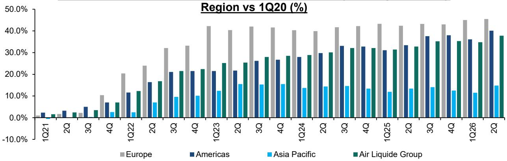
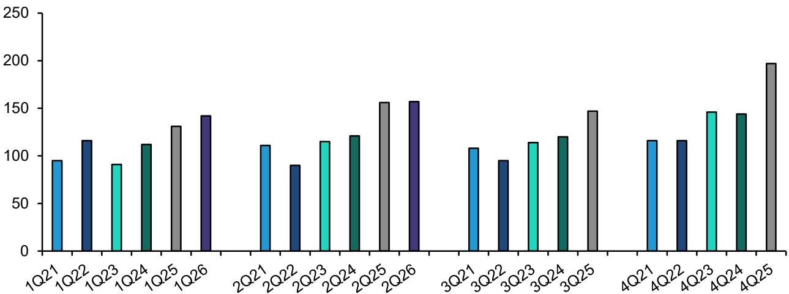
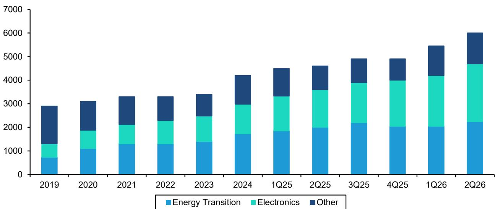

# Air Liquide 上半年观察：订单积压揭示的真相，比季度数据更值得关注

Air Liquide 发布了上半年业绩，市场将其解读为一个短期波动。可比增长表现温和，利润率面临一些因素影响，公司报价也随之调整。然而，在季度数据的表象之下，公司的订单积压已达到创纪录的60亿欧元，环比增加5亿欧元。这个单一数字——而非盈利表现——才是更能反映业务走向的可靠信号。

一个表现平平的半年度与一个持续增强的项目储备之间的张力，构成了当前研究讨论的核心。关注前者的观察者，可能会错过后者。问题不在于上半年是否令人失望——确实如此——而在于这种失望反映的是结构性变化，还是暂时的压缩，并将在订单积压转化为收入、利润率恢复提升后得到扭转。

证据有力地指向第二种解读。Air Liquide 的电子业务持续以8-9%的速度增长，工业商售定价保持稳定，公司的效率提升计划在相对数值上也在加强。上半年主要的影响因素是氦气——这是一个地缘政治导致的供应中断，而非需求问题。氦气是一个暂时的因素，当它恢复正常时，利润率的故事将重新显现。

这是一个经典案例：市场过度关注短期数据，而低估了前瞻性指标。对于战略性观察者而言，上半年的疲软创造了一个进入点，这家公司潜在的增长轨迹、创纪录的订单积压以及利润率扩张潜力依然完好。

## 创纪录的订单积压证实：需求并未减弱——只是延后了

Air Liquide 的订单积压在第二季度达到60亿欧元，单季增加了5亿欧元。这不是一个边际增长；而是在市场质疑增长之际，项目获取速度的加快。订单积压是衡量已签约但尚未确认收入的未来收入的前瞻性指标。当它以这样的速度增长时，意味着客户正在签署长期照付不议协议，而非推迟决策。

订单积压的构成与总量同样重要。电子和工业商售是主要驱动力，这与半导体制造、电池生产和先进材料的结构性需求相一致。这些不是可以无限期推迟的周期性项目。它们与工厂建设时间表和监管承诺紧密相连。订单积压的增长表明，Air Liquide 的客户正在当前宏观环境下进行投入，而非退缩。

对观察者而言，其含义很直接：原本预期在上半年实现的收入并未消失。它已被推迟到未来几个季度。订单积压的转化周期意味着，表现平平的上半年之后，下半年会更强，而创纪录的订单积压将这种可见性延伸至2027年及以后。市场对上半年的失望是一个时间问题，而非需求问题。

## 氦气是近期利润率的主要影响因素，且其性质是暂时的

压低 Air Liquide 上半年利润率的最大单一因素是氦气。根据报告，公司的氦气采购来源过度集中于卡塔尔——超过三分之一的供应来自该地区。该地区的地缘政治事件中断了卡塔尔的氦气供应，虽然生产已经重启，但在卡塔尔能够通过霍尔木兹海峡自由出口液化天然气之前，供应量无法恢复到先前水平。

这是一个供应链约束，而非需求失败。氦气对于半导体制造、医疗成像和航空航天至关重要。终端用户需求并未崩溃；只是暂时供应不足。报告估计，氦气的影响将持续数个季度，但也明确将其描述为暂时的。恢复正常只是时间问题，而非是否可能的问题。

其战略含义是，Air Liquide 上半年的利润率轨迹被人为压低，原因在于管理层无法控制且将会逆转的因素。公司潜在的利润率改善——由效率计划、定价纪律和业务组合转变驱动——仍在继续。报告显示，效率提升的相对数值在增加，即使同比增长率在第二季度有所放缓。当氦气因素恢复正常时，被其掩盖的利润率改善将变得可见。

观察者可以将 Air Liquide 的氦气敞口与其美国同行进行比较。报告指出，Air Liquide 的氦气影响更大，这也是分析师目前相对更关注林德和空气化工的原因之一。但对于更长周期的观察者而言，Air Liquide 更高的氦气敏感性也意味着，当约束解除时，会有更大的恢复空间。这个因素今天是相对表现的一个来源；明天将成为相对表现的一个优势。

## 电子和工业商售提供了大型工业无法比拟的结构性增长基础

报告将下半年的可比增长预测上调了40个基点，这完全是由电子和工业商售板块的上调所驱动。电子业务预计将维持8-9%的增长，与管理层指引一致。工业商售业务预计将环比改善50个基点，得益于氦气供应约束的缓解和稳定的季度定价。

这两个板块在结构上不同于大型工业，报告对后者保持保守态度。大型工业服务于钢铁、炼油和化工等周期性终端市场。它是资本密集型、长周期且对工业生产指数敏感的。相比之下，电子和工业商售服务于半导体晶圆厂、医疗保健、食品加工和专业制造——这些终端市场具有与GDP相关性较低的长期增长驱动力。

这种差异对于组合构建很重要。Air Liquide 的增长特征正越来越偏向于具有结构性优势的板块，而订单积压证实项目储备也集中于此。报告决定上调这些板块的预测，同时维持对大型工业的保守态度，这是一个信号，表明公司的增长构成正在向更高质量的方向转变。将 Air Liquide 视为一个单一的工业气体公司来分析的观察者，会错过这种内部转变。

利润率的影响同样重要。电子和工业商售的平均利润率通常高于大型工业。随着这些板块增长更快、在收入中占比更大，整体利润率结构将机械性地改善。报告预测下半年利润率将同比环比改善120个基点，这与氦气影响的缓解以及向高利润率业务的转变相一致。

## 观察者的决策框架：区分周期性因素与结构性因素

上半年的结果提出了一个经典的分析挑战：区分什么是周期性和暂时的，什么是结构性和持久的。一个严谨的框架要求观察者从三个维度评估每个因素——持续时间、影响程度和可逆性。

氦气是周期性因素最清晰的例子。其持续时间以季度计，而非年。其影响程度足以显著压低利润率。并且它是完全可逆的——当出口路线正常化时，供应就会恢复。正确的应对方式是看穿它。

大型工业的疲软也是周期性的，但特征不同。它与工业生产相关，后者可能恢复得更慢。报告对大型工业的保守态度是恰当的，但该板块在整体组合中的占比正在缩小。它对总增长的贡献在下降，这降低了其对整体的影响。

订单积压、电子业务增长和利润率效率计划是结构性因素。它们不依赖于宏观环境的恢复。它们由客户投入周期、技术采用和管理层执行所驱动。它们是持久的、复合的，并且独立于季度噪音。

因此，决策框架是：在形成判断时，对结构性因素赋予更高权重，对周期性因素赋予较低权重。报告中的观点，恰恰反映了这种权衡。它给予订单积压转化和利润率恢复的权重，高于氦气事件的影响。

对于应用这一框架的观察者而言，上半年的价格调整是一个重新平衡的机会。市场已经定价了影响因素，但尚未定价恢复。十月的资本市场日可能是这种重新定价的一个催化剂，届时管理层将有机会强化订单积压的叙事和利润率轨迹。在此之前，已有的数据——创纪录的订单积压、工业商售稳定的定价以及8-9%的电子业务增长——提供了足够的依据。

*仅供参考。部分内容可能基于源材料通过AI辅助生成、翻译、总结或编辑，可能包含遗漏或错误。请独立核实。这不构成任何专业建议。*

仅供参考。部分内容可能基于源材料通过AI辅助生成、翻译、总结或编辑，可能包含遗漏或错误。请独立核实。这不构成任何专业建议。

