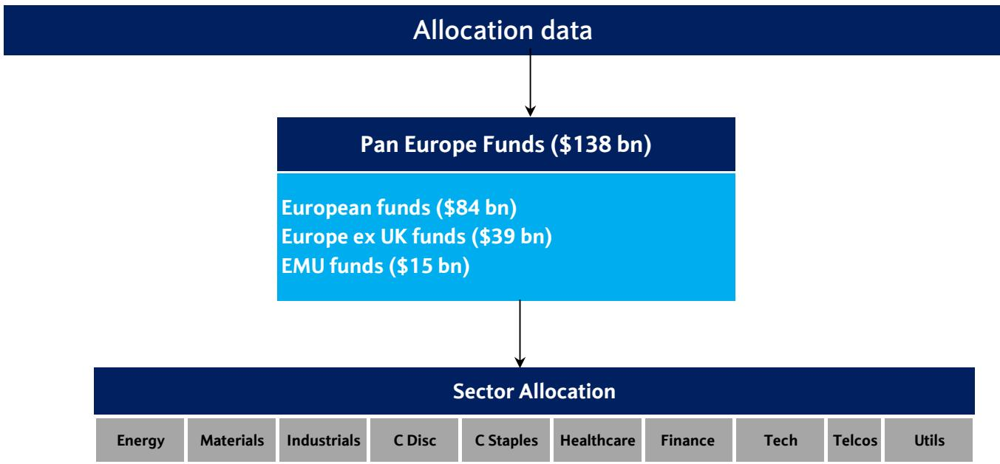
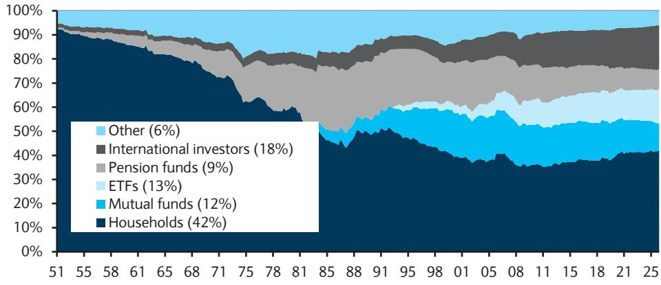
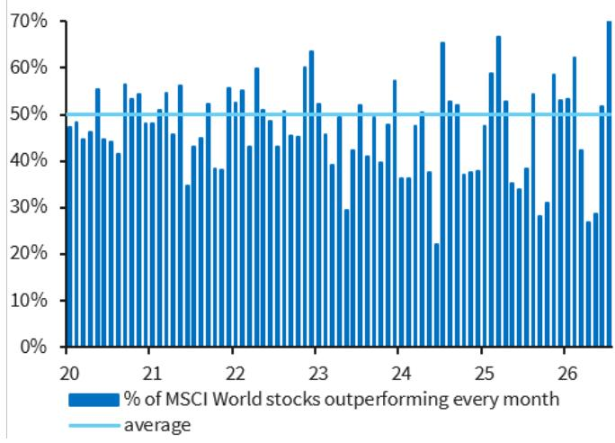

# 市场定价趋于充分，缓冲空间已收窄

全球市场在8月初呈现出表面强劲但内部存在潜在脆弱性的格局。7月份，仅做多的资金流入达到1290亿美元，推动年初至今的流入总额创下6590亿美元的纪录。对冲基金和系统性策略在经历6月小幅减仓后，重新建立了多头仓位，使整体持仓水平接近高点。然而，情绪指标却呈现出不同图景。AAII牛熊价差已降至均值下方一个标准差，恐惧与贪婪指数也明显回落。散户参与度有所下降。资金流向与情绪信号之间的这种分歧并非噪音，而是当前市场格局中一种结构性的张力。

核心观点是：市场受到强劲的企业盈利以及跨资产偏好（股票优于债券和现金）的支撑，但同时也缺乏足够的持仓缓冲。创纪录的资金流入、延展的对冲基金和CTA多头、较低的共同基金现金水平以及日益收窄的宏观利好因素，意味着市场已消化了大量积极信息。剩余的风险并非基本面突然恶化，而是市场吸收冲击的能力已接近极限。进行对冲的策略性理由充分，并非因为崩盘在即，而是因为结果的不对称性已决定性地转向不利于未对冲的多头仓位。

## 创纪录资金流入与延展的系统性多头使市场缺乏持仓缓冲

2026年市场的资金流入规模前所未有。年初至今全球资金流入达6590亿美元，创历史新高。仅7月就有1290亿美元的仅做多资金流入，尽管这一数字受到中国创纪录资金流入的影响。问题不在于资金流入本身，而在于它们对市场结构造成的影响。资产管理公司的净期货持仓仍接近高点。NAAIM主动管理经理人股票敞口指数虽有所回落，但仍处高位。对冲基金和多空股票敞口同样接近高点。CTA股票多头在6月小幅削减后再度回升。风险平价股票敞口仍接近高点，而国债敞口低于平均水平，尽管差距正在迅速缩小。

当几乎所有类别的读者持仓都接近其历史区间顶部时，市场便失去了在不引发显著价格波动的情况下吸收抛售的能力。当前价格与被迫抛售之间通常存在的缓冲空间已被压缩。这并非对即将发生崩盘的预测，而是对当前配置脆弱性的结构性观察。一个缺乏余地的市场可以容忍小幅意外，但无法承受复合冲击。美联储意外鹰派、油价飙升或季节性流动性事件都可能触发连锁反应，而推动此轮上涨的持仓结构本身将放大这种反应。

## 强劲盈利支撑跨资产偏好，但宏观背景正在收紧

市场持续吸引的资金流入超过债券和现金，这有其合理原因。第二季度盈利表现远超预期。每股收益修正保持健康。企业基本面提供支撑。跨资产动态清晰：读者偏好股票，因为盈利故事依然完整，且在当前的利率环境下，固定收益领域缺乏有吸引力的替代选择。

然而，宏观背景正在发生值得警惕的变化。金融状况正在收紧。美联储加息预期走高。美国实际回报表现正接近历史上对市场构成阻力的水平。央行宽松周期接近尾声，降息央行数量正在减少。此前为市场提供强劲支撑的流动性支持正在消退。

债券市场已反映出这一转变。CTA已转为做空美国国债。投机者在长端增加了空头头寸。短端和长端国债的仅做多资金流向持续分化，这一模式现在也出现在投资级信用债领域。来自大型科技公司的创纪录债券发行过度集中于长端，可能挤占需求。实际回报表现上升、美元走强以及央行流动性消退的组合，创造了一个对市场不那么宽容的宏观环境，即使盈利依然强劲。

## 读者未对油价冲击做好准备，夏季季节性因素构成阻力

当前持仓最显著的特征之一是对通胀风险（尤其是能源领域）的自满情绪。尽管美伊冲突再度紧张，原油空头头寸却在增加。TIPS资金流持续回落。读者实际上是在押注通胀问题已解决，且石油不会成为破坏性力量。这是一个具有不对称下行风险的押注。

石油是一个不确定因素，原因有几点。石油波动率升高恰逢夏季流动性减弱，这会放大任何价格重估。市场已在应对央行鹰派重定价，而油价飙升将加剧这一压力。能源价格上涨与金融状况收紧的组合对市场尤为不利，因为它会同时冲击估值端（通过提高贴现率）和盈利端（通过提高投入成本）。

夏季季节性因素也是阻力。VIX指数通常在8月至10月间上升。市场在美国中期选举前历史上倾向于横盘整理。共同基金现金水平接近十年区间底部。基金股票配置接近高点。当流动性稀薄且现金缓冲不足时，市场更容易因温和的消息面出现剧烈波动。进行对冲的策略性理由并非预测特定触发因素，而是认识到当前配置使市场暴露于一系列未被定价的负面结果。

## 资金正从美国科技集中板块轮动，利好欧洲及价值导向板块

资金流向中最重要的结构性转变是远离以美国为中心、科技股集中的持仓。美国市场资金流入已放缓至3月以来最低水平。全球指数中跑赢美国市场的比例持续改善。对世界其他地区资产的需求正在回升。美国本土读者已转为净卖出美国股票，并买入世界其他地区资产。欧洲市场正出现资金流入的初步迹象，尤其是来自美国读者的资金，其中外围市场优于核心的德国和法国。

这种轮动并非随机。它由动量策略的平仓和市场参与度的扩大所驱动。7月，超过70%的全球股票跑赢其所在指数，这是自新冠疫情以来最好的广度改善。动量策略在欧洲经历了第二大回撤。价值风格持续获得关注。读者资金已转向与AI关联度较低的板块，如医疗保健和可选消费。银行板块仍显拥挤，是欧洲表现的关键支撑。保险板块则出现新的买盘。

这对投资组合构建的意义是明确的。简单做多科技、做多美国的时代暂时结束。向欧洲、价值和非科技板块的轮动得到了资金流向和表现数据的双重支持。这并非暂时的策略性转变，而是反映了在利率更高、盈利增长更广泛、集中度降低的格局下，对回报驱动因素的根本性重新评估。

## 低缓冲、高轮动格局下的持仓决策框架

来自资金流向、持仓和宏观条件的证据指向一个延展但未破裂的市场，基本面提供支撑但易受冲击。读者面临的策略性问题是，如何在一个上行空间受持仓限制、下行风险因低现金缓冲和延展的系统性多头而被放大的格局中进行布局。

该框架包含三个组成部分。第一，评估缓冲空间。当前持仓几乎没有容错余地。适当的应对措施并非完全回避市场，而是减少对最拥挤交易的敞口：美国科技、动量以及AI集中型标的。这些领域一旦出现平仓，痛苦程度最高，因为拥挤度最大。

第二，识别轮动方向。资金流向数据指向欧洲、价值和非科技板块。盈利数据支持这一轮动，因为盈利增长正在扩大。医疗保健和可选消费跑赢AI和科技并非一个月的异常现象，而是格局转变的开始，只要利率预期保持高位且动量策略持续承压，这一转变将持续。

第三，对冲尾部风险。未被定价的具体风险包括油价飙升、美联储进一步鹰派重定价以及夏季淡季的流动性事件。对冲工具无需昂贵或复杂。波动率期权、对最拥挤标的的策略性空头头寸以及降低净多头敞口就足够了。目标不是预测触发因素，而是确保投资组合能够承受市场出现两到三个标准差波动的情景，而无需被迫进行抛售。

这一框架并不要求对市场持悲观看法。它要求对当前的持仓格局有现实的认识。市场已消化了大量积极信息。问题在于，它是否已消化了可能来自石油、利率或流动性的负面信息。证据表明尚未如此。这种不对称性是当前环境下核心的研究挑战。

*仅供参考。部分内容可能基于源材料通过AI辅助生成、翻译、总结或编辑，可能存在遗漏或错误。请独立核实。这不构成投资、法律、税务、会计或其他专业建议。*

仅供参考。部分内容可能基于源材料通过AI辅助生成、翻译、总结或编辑，可能存在遗漏或错误。请独立核实。这不构成投资、法律、税务、会计或其他专业建议。

