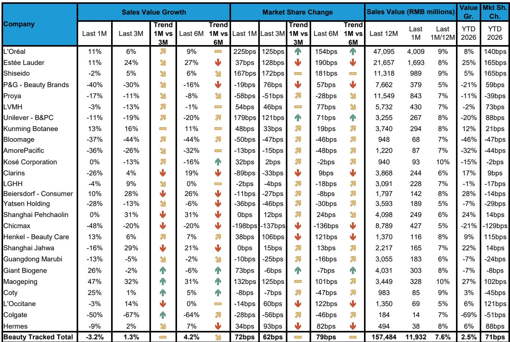
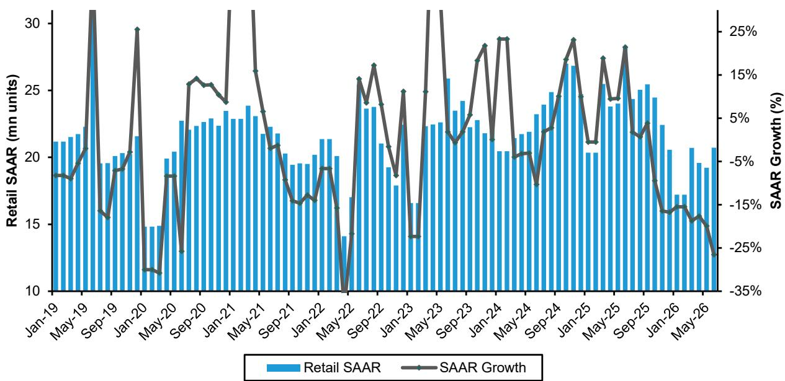
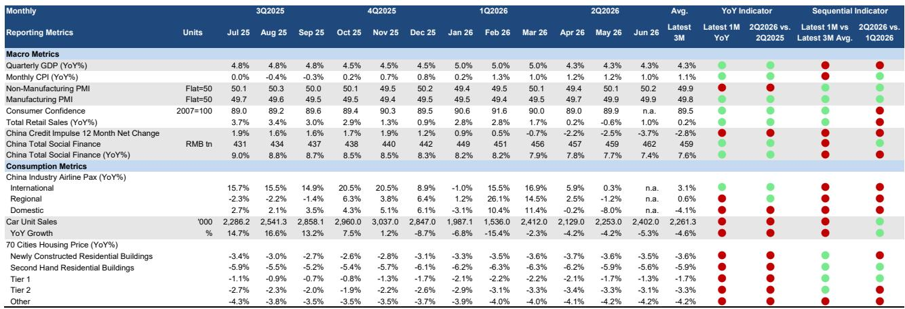

# Bernstein：研究主题与行业变化观察

中国消费市场在2026年第二季度呈现出一个清晰的分化格局。Bernstein最新发布的季度消费追踪报告显示，尽管消费者信心指标较2025年末有所改善，CPI同比约1%也缓解了价格变化担忧，但整体零售销售增速已节奏变化至同比仅增长0.2%，GDP增速从一季度的5.0%回落至4.3%。在这一背景下，高端和奢侈品细分领域成为相对亮点，而大件商品和汽车销售则持续仍在调整。

这份报告覆盖了服装、运动服饰、酒类、美妆、旅游、奢侈品和汽车等多个消费领域，并特别分析了日本消费品牌在中国市场的表现。核心判断是：消费复苏呈现K型分化，高端消费韧性明显，但大众消费和可选消费的恢复仍面临阻力。

## 1. 高端白酒与啤酒市场出现分化复苏

白酒市场的高端品种表现突出。Bernstein数据显示，茅台飞天批发价在二季度继续上行，较前期低点已上涨13%，其他高端品种涨幅在17%至30%之间。茅台年内已实施第二次出厂价上调，反映出需求端的支撑仍然稳固。啤酒市场整体动销价值环比改善，二季度同比增长2%，而一季度为下降1%。餐饮渠道的动销尤为健康，同比增长2%，非即饮渠道也环比改善至增长1%。

> **KC评论：** 飞天批价的连续上涨和第二次提价动作，说明高端白酒的需求并非整体消费仍在调整所能解释。但啤酒的改善更多是基数效应和渠道补库的结果，而非需求端的根本性好转。这两个细分领域的复苏节奏和驱动力并不相同。

## 2. 运动服饰线上增长强劲但线下仍显疲态

服装和运动服饰继续跑赢整体零售，主要驱动力来自线上渠道。报告显示，二季度第三方平台线上销售同比增长10%，而整体线上零售增速仅为2%。线下渠道则持续仍在调整，宝胜国际线下销售同比下降3%，整体线下零售下降1%。耐克在中国市场的终端销售实现3%的正增长，较此前几个季度有所改善，新产品获得市场认可且库存正在清理。但Bernstein预计，由于未来几个季度批发渠道的进货量将大幅缩减，耐克的总销售额仍将保持负增长。阿迪达斯则表现强劲，同比增长32%，凭借产品和品牌共鸣持续扩大市场份额。露露乐蒙因PFAS争议出现中个位数的市场下滑，但报告认为这一影响应很快会恢复正常。

## 3. 豪华酒店与奢侈品市场呈现K型复苏

酒店行业在二季度继续恢复，RevPAR增长在高端和宏观环境型两端最为强劲，中间价位段则持续承压。Bernstein认为，考虑到高端市场的韧性以及供给增速节奏变化，若无额外的宏观冲击，复苏趋势有望延续至下半年。奢侈品市场方面，需求正在企稳但尚未重新加速。价值意识和持续的K型分化仍是市场的核心特征。已公布业绩的公司多数呈现稳定或改善趋势，但广泛复苏的证据仍然不足。增长集中在特定品类（尤其是珠宝）、高收入消费群体以及少数品牌自身的反转案例（如博柏利）。中国消费者继续在境内、香港、日本和韩国之间进行套利，根据汇率和相对定价优势优化购买地点，同时倾向于购买感知价值更强、工艺更精湛、更具稀缺性和专属感的产品。

## 4. 汽车销售大幅下滑，电动车渗透率突破60%

中国汽车市场在二季度表现仍在调整。Bernstein数据显示，乘用车销量同比下降20%，较一季度17%的降幅进一步扩大。报告将下滑归因于全国性以旧换新补贴到期以及高基数效应。电动车（BEV和PHEV）销量同比下降7%，但渗透率从一季度的42.9%跃升至59.9%。豪华品牌汽车销售进一步出现变化，二季度同比下降16%，而一季度仅下降1%。奥迪、宝马、奔驰的销量分别同比下降31%、30%和26%，保时捷销量下降41%。比亚迪以98.3万辆的销量位居乘用车榜首，但同比下降37%；吉利集团以95.9万辆位列第二，同比下降10%。

> **KC评论：** 电动车渗透率在二季度突破60%，但这是在整体市场大幅下滑的背景下实现的。这意味着电动车的相对销量并未显著增长，而是燃油车市场的调整更快。豪华品牌的下滑幅度远超大众市场，反映出高净值人群的消费行为也在发生变化，而非简单的“消费降级”可以概括。

## 5. 日本消费品牌在中国处于不同发展阶段

Bernstein特别分析了日本消费品牌在中国市场的差异化表现。优衣库中国正处于“拆旧建新”阶段，门店网络从约1000家缩减至900家以下，这一过程已接近完成，以不变汇率计算的单店产出在2026年终于由负转正。无印良品的中国门店数量稳定在约500家，东亚地区的销售增长更多来自单店效率提升、电商和汇率利好，而非新店扩张。亚瑟士在中国实现高速增长，2026年大部分时间单店产出的增速都快于新店增速，表明其仍处于中国增长曲线的早期阶段。寿司郎在中国的开店速度已加快至超过110家，其扩张的节奏和质量将是判断能否在中国市场站稳脚跟的关键指标。

这份报告揭示的核心图景是：中国消费市场并未进入全面复苏，而是在总量偏弱的背景下，高端细分、特定品牌和线上渠道展现出结构性韧性。对于读者而言，识别这些分化信号比判断整体消费趋势更为重要。

For informational purposes only. Portions may be generated,translated,summarized,or edited with AI assistance based on source materials and may contain omissions or errors. Please verify independently. This is not investment,legal,tax,accounting,or other professional advice.

For informational purposes only. Portions may be generated,translated,summarized,or edited with AI assistance based on source materials and may contain omissions or errors. Please verify independently. This is not investment,legal,tax,accounting,or other professional advice.

