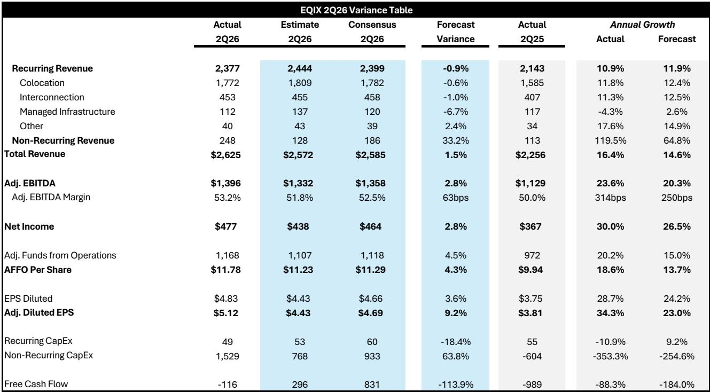
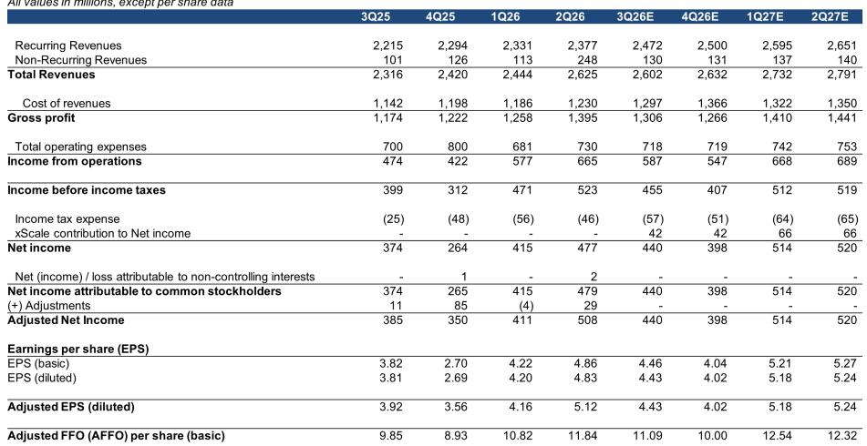
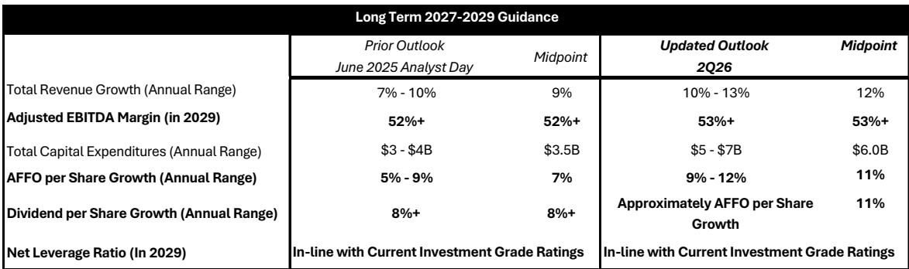

# Equinix 的战略升级：9-12% 长期增长指引背后的结构性逻辑

Equinix 近期发布了2026年第二季度报告，其中包含多项重要调整。公司将其长期年度AFFO每股增长指引从5-9%上调至9-12%（覆盖至2029年），年度资本支出计划近乎弹性较高至50-70亿美元，同时实现了创纪录的53%调整后EBITDA利润率。这并非一次渐进式更新，而是公司增长轨迹的结构性重估，其驱动力来自AI工作负载需求、互联扩展以及一项旨在重新夺回市场份额的战略布局。

许多市场参与者首先会关注资本支出数字。从每年30-40亿美元跃升至50-70亿美元，对于资本密集度直接影响可分配现金流的REIT结构而言，确实引人注目。但关键信息在于，Equinix正以约25%的开发回报表现部署这些资本，这一水平远超数据中心领域的同行。约80%的支出投向公司已运营的25个核心市场，这意味着它是在现有生态系统中进行密度提升，而非承担绿地开发风险。投资与稳定资产现金流之间存在三到四年的时滞，但公司核心市场正处于历史性的紧张状态，且在可预见的未来将保持结构性供应不足。

Equinix并非仅仅搭乘AI浪潮。它正利用AI需求作为催化剂，来解决其最持久的战略问题：在总市场供应中份额的下降。从2020年到2025年，Equinix在数据中心供应中的隐含份额从约8%降至5%。新的建设计划，结合待定的atNorth收购，旨在扭转这一趋势。公司仅在2026年第四季度就将超过7000个机柜从2027年提前部署，这表明管理层理解抓住当前由超大规模云服务商和其他供应商满足的需求的紧迫性。

本文探讨为何此次指引上调具有可信度、风险所在，以及市场参与者应如何评估作为长期复合型公司的Equinix。

## 指引上调基于三个结构性驱动因素，而非炒作

Equinix更新的2027-2029年长期指引建立在三个相互强化的支柱之上，每个支柱都在第二季度业绩中有所体现。首先，定价能力正在增强，尤其是在互联业务方面。互联收入在标准化基础上同比增长9%，达到4.53亿美元，季度净新增互联数创纪录地达到9700个。Cloud Router预订量同比增长约170%。互联是Equinix产品组合中利润率最高的收入流，其增长并非周期性，而是由多云网络的长期复杂性、AI推理工作负载对低延迟连接的需求以及主权数据要求所驱动，这些因素使Equinix的生态系统优于公共云替代方案。

其次，AI工作负载需求正变得更加结构性嵌入，涵盖四个不同的用例：用于私有基础设施上开放模型的堆栈部署、用于合规驱动部署的主权AI、用于AI工厂的批处理，以及用于代理应用的延迟敏感型工作负载。管理层指出，前十大AI模型提供商中的8家和前十大新云服务商中的8家已在Equinix上运行关键网络工作负载。这并非推测，而是正在扩大范围和规模的现有收入。公司的生态系统规模约为其最大竞争对手的两倍，形成了难以复制的网络效应。

第三，实现创纪录的53%调整后EBITDA利润率的成本纪律并非一次性事件。剔除xScale租赁费用，利润率仍同比扩大约150个基点。管理层指引到2029年实现53%以上的利润率，这意味着即使公司扩大资本支出规模，运营杠杆仍将持续。定价能力、高利润率互联增长和成本纪律的结合创造了复合效应，使得9-12%的AFFO每股增长目标在建设计划按计划执行的前提下具有可行性。

## 资本支出激增可控，因其集中且部分已预售

对Equinix新指引最常见的质疑是，每年50-70亿美元的资本支出范围将压低资本回报率并给资产负债表带来压力。仔细审视资金分配和融资计划后，这种担忧可能被夸大了。约80%的资本支出投向Equinix已有设施的25个核心市场。这些并非投机性建设，而是对现有园区的扩展，公司了解当地需求动态、许可时间表和客户关系。投资组合中194个已稳定运营的资产整体利用率为82%，在总物业、厂房和设备上产生了27%的现金回报率。开发管道正被构建到相同的需求环境中。

Equinix也提供了明确的融资参数。公司无需发行股权来为该计划融资。到2029年底，增量债务将限制在不到一个杠杆倍数，使净杠杆率与当前投资级评级保持一致。这并非投机性的资产负债表扩张，而是将留存现金流和适度的债务能力，有节制地部署到Equinix认为比一年前明显更强的机会集合中。

资本支出与稳定现金流之间三到四年的时滞是关键风险。在此期间，相对于部署的资本，调整后的运营资金将受到抑制。但反论点是，Equinix的核心市场非常紧张，并将持续数十年。公司实质上是在预先承诺产能，而这些产能将被创纪录的积压订单和总销售活动同比增长30%所体现的企业和AI需求所吸收。如果说有风险，那可能是Equinix相对于需求轨迹而言建设速度仍然过慢。

## 互联是利润率扩张和收入持久性被低估的引擎

Equinix常被归类为数据中心REIT，但其最有价值的资产类别并非托管机柜，而是互联网络。本季度互联收入达到4.53亿美元，标准化基础上同比增长9%，其利润率远高于托管业务。季度净新增9700个互联创下纪录，反映了企业构建网络方式的结构性转变。多云策略、需要低延迟连接的AI推理工作负载以及主权数据要求，都在推动对绕过公共互联网的私有直接连接的需求。

Fabric Cloud Router产品预订量同比增长170%，是一个领先指标。它允许客户在Equinix全球平台上动态配置虚拟连接，无需物理安装延迟。该产品实质上将原本离散的互联购买转化为可重复的、可扩展的收入流。随着企业越来越多地将网络架构视为软件定义功能，Equinix的互联平台变得更加嵌入且难以替代。

客户流失率保持在1.8%，低于指引范围，管理层预计2026年下半年将趋向2-2.5%目标范围的低端。在快速扩张期保持低流失率是客户满意度和转换成本的信号。在Equinix生态系统中部署了关键工作负载和互联链路的企业，在转向替代供应商时面临显著障碍。这种粘性是公司长期收入可见性的基础。

## 决策框架：如何评估作为长期AI基础设施公司的Equinix

对于试图评估Equinix当前约25倍远期AFFO每股估值是否合理的市场参与者而言，相关框架并非简单的与其他REIT的市盈率比较，而是一个多年复合模型，需权衡以下变量：

首先，收入增长的基本情况现在是到2029年每年10-13%，高于此前的7-10%。这由定价能力、互联扩展以及加速建设计划带来的新增产能共同驱动。关键问题是这一增长率在2029年后是否可持续。考虑到AI工作负载部署仍处于早期阶段，且企业托管需求具有持久性和粘性，答案很可能是肯定的，但随着基数扩大，增长率将放缓。

其次，利润率轨迹正在改善。本季度53%的调整后EBITDA利润率是创纪录的，管理层指引到2029年达到53%以上。这意味着运营杠杆将抵消更高资本支出计划带来的折旧和摊销拖累。互联业务组合的转变是主要驱动力，因为互联收入增长快于托管业务且利润率更高。

第三，资产负债表风险可控。3.6倍的净杠杆率（按年化调整后EBITDA计算）处于投资级范围内，公司拥有约77亿美元的可用流动性。不发行股权的决定很重要，这意味着AFFO每股增长指引不会被股份数量扩张所稀释。任何股权发行都会改变这一计算，但管理层已明确排除。

第四，xScale合资企业代表了基本情况中未完全反映的潜在上行空间。Equinix在一个150亿美元的超大规模基金中持有25%的股份。虽然其回报状况在增长方面不太可能匹配超大规模数据中心市场，但该市场本身正在快速增长，Equinix已看到早期进展。报告模型显示，到2030年，xScale将贡献约5亿美元的净收入，届时将为AFFO增加约每股5美元。

该框架的风险在于执行。Equinix历史上相对于市场需求建设不足，新计划需要在建设速度和租赁率方面实现阶跃式变化。公司将7000个机柜从2027年提前到2026年第四季度，这是一个积极信号，但更广泛的计划涉及33个市场的52个重大项目。任何在许可、设备可用性或客户承诺方面的延迟都可能压缩回报。此外，2026年剩余零售产能扩张中约30%已预售，这提供了一定可见性，但也意味着剩余70%必须在竞争环境中被吸收。

第二个风险是AI需求可能更具周期性而非结构性。如果随着模型训练效率提高或企业转向更小、更有针对性的部署，当前AI基础设施投资浪潮放缓，Equinix可能在特定市场面临供应过剩时期。然而，公司对互联和企业托管的关注提供了缓冲。AI工作负载是顺风，而非全部逻辑。企业托管的基础需求由数字化转型、边缘计算和监管要求驱动，具有持久性和粘性。

*仅供参考。部分内容可能基于源材料通过AI辅助生成、翻译、总结或编辑，可能存在遗漏或错误。请独立核实。本文不构成专业建议。*

仅供参考。部分内容可能基于源材料通过AI辅助生成、翻译、总结或编辑，可能存在遗漏或错误。请独立核实。本文不构成专业建议。

