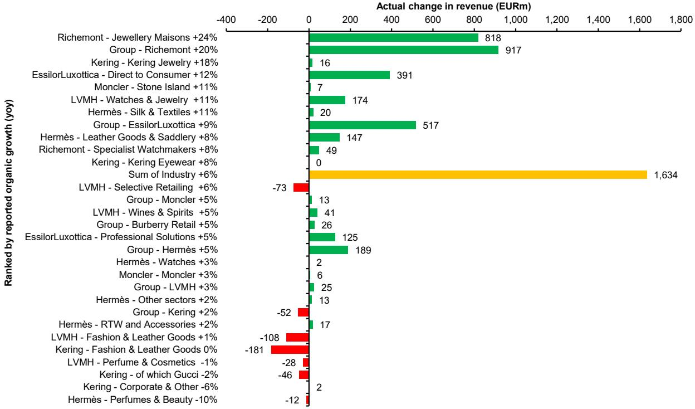

# Bernstein：爱马仕业务与近期数据观察

爱马仕在2026年第二季度及上半年财报中交出了一份看似平淡但内部结构值得拆解的成绩单。集团有机销售增长6.7%，与市场预期完全一致，较第一季度的5.6%略有加速。真正超出预期的部分是利润率：上半年EBIT利润率达到41.1%，比市场共识高出约70个基点，主要受毛利率提升驱动。这份财报发布时，爱马仕报价在过去12个月已下跌约29%，估值从高位回落后，市场对任何增量信号都更为敏感。

> **KC评论：** 6.7%的有机增长在奢侈品行业当前环境下并不算突出，但41.1%的EBIT利润率才是爱马仕区别于同行的核心指标。市场对营收数字已有充分预期，利润率超预期才是这份财报中真正的新信息。

## 1. 区域表现分化，法国与日本成为增长引擎

从区域看，爱马仕的增长动力呈现明显的地理分化。法国市场第二季度有机增长6.2%，大幅超出市场预期的3.3%，较第一季度的-2.8%显著反弹。日本市场增长12.3%，同样高于预期的10.6%。这两个区域的表现是整体增速从第一季度的5.6%回升至6.7%的主要驱动力。

亚太地区（除日本）增长2.5%，略低于预期的3.3%，延续了该区域增速节奏变化的趋势。美洲市场增长13.7%，与预期的14.1%基本持平。值得注意的是，其他区域（包括中东等）虽然相对值下降2.4%，但大幅好于市场预期的-7.4%，说明部分新兴市场的表现可能被低估。

区域数据揭示了一个关键结构：爱马仕的增长韧性更多来自欧洲本土市场和日本，而非过去几年驱动行业增长的中国市场。这种区域轮动对理解奢侈品消费的地理迁移有直接意义。

## 2. 品类表现差异：皮革制品稳健，香水业务承压

分品类看，核心的皮革制品与马具部门第二季度有机增长10.2%，略低于预期的10.8%，但仍保持双位数增长。丝绸与纺织品增长12.2%，大幅超出预期的7.4%，成为本季度增速最快的品类。手表业务增长4.4%，而市场预期为下降0.4%，同样出现正向偏差。

香水与美容业务是主要影响项，同比下降9.5%，远低于预期的-2.9%。这一表现与行业趋势一致：高端香水市场在经历疫情后的爆发式增长后进入调整期，爱马仕的香水线面临更激烈的竞争和消费者支出转移。

成衣与配饰增长3.6%，与预期基本一致，但增速远低于皮革制品。这反映出爱马仕的产品矩阵中，核心硬奢品类（皮革、手表）的护城河依然稳固，而软奢品类（成衣、香水）面临更大的市场不确定性。

## 3. 汇率影响与利润率韧性：一个常被忽视的观察维度

报告明确指出，汇率波动对上半年收入造成3.6亿欧元的影响，第二季度影响为7000万欧元，影响有机增长约1.9个百分点。在如此显著的汇率变化下，爱马仕仍能实现41.1%的EBIT利润率，说明其定价能力和成本控制机制在发挥作用。

对比来看，爱马仕上半年EBIT利润率41.1%，略低于去年同期的41.4%，但高于2025年下半年的40.7%。毛利率从70.7%提升至71.1%，是利润率超预期的直接来源。在奢侈品行业普遍面临成本上升和折扣不确定性时，爱马仕的毛利率改善值得关注。

> **KC评论：** 汇率影响是理解奢侈品公司财报时必须拆解的因素。爱马仕的利润率在汇率变化中仍能超预期，说明其提价能力和产品组合优化在起作用。但读者需要区分哪些是结构性改善，哪些是一次性因素。

## 4. 行业对比：爱马仕在奢侈品板块中的相对位置

Bernstein报告同时提供了奢侈品行业2026年第二季度的横向对比数据。在主要奢侈品集团中，历峰集团整体有机增长20%，珠宝部门增长24%，表现最为突出。路威酩轩集团整体增长3%，其中时装与皮革制品仅增长1%。开云集团增长2%，古驰则下降2%。

爱马仕5%的有机增长（按报告货币计算）处于行业中游偏上位置。但若考虑其41.1%的利润率水平，爱马仕在盈利质量上仍显著领先于同行。历峰集团和路威酩轩均未披露同等口径的利润率数据，但从业务结构看，爱马仕的利润率优势是明确的。

Bernstein分析师在报告中提到，爱马仕正在向上拓展高端产品线并加速新品推出，这可能是未来几个季度值得跟踪的变量。当前估值水平（2026年预期市盈率约38.6倍）已较历史高点明显回落，但市场仍在等待更清晰的增长信号。

For informational purposes only. Portions may be generated,translated,summarized,or edited with AI assistance based on source materials and may contain omissions or errors. Please verify independently. This is not investment,legal,tax,accounting,or other professional advice.

For informational purposes only. Portions may be generated,translated,summarized,or edited with AI assistance based on source materials and may contain omissions or errors. Please verify independently. This is not investment,legal,tax,accounting,or other professional advice.

