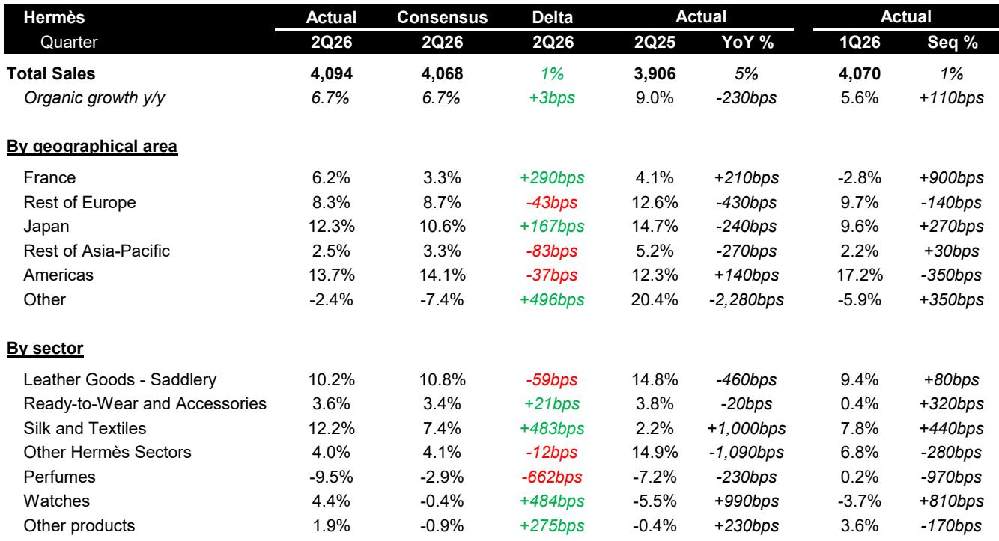
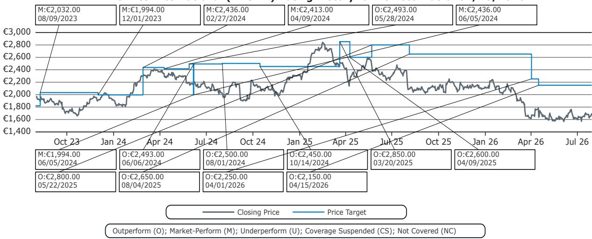

# Hermès Is Not Immune to the Slowdown, But Its Strategic Ascent Into Ultra-Luxury Creates a Distinctive Path Forward

Hermès reported second-quarter 2026 organic sales growth of 6.7 percent, exactly matching consensus expectations and representing a slight acceleration from the 5.6 percent recorded in the first quarter. The headline number appears unremarkable for a company that has routinely delivered double-digit growth in recent years. Yet beneath this surface-level deceleration lies a more consequential story. The company posted an EBIT margin of 41.1 percent, beating consensus by 70 basis points, driven entirely by gross margin expansion. In a luxury environment where most peers are fighting to maintain profitability amid shifting demand, Hermès is demonstrating that pricing power and product mix can still deliver margin upside. The stock has de-rated 20 percent year-to-date, and at 38.6 times forward earnings, the market is pricing in a prolonged normalization. But the report signals something more nuanced: Hermès is not merely riding out the cycle — it is actively restructuring its business model toward the highest end of luxury, a move that could redefine its growth trajectory even as the broader industry cools.

The regional dispersion in the second-quarter results reveals where the pressure is concentrated and where it is not. Asia-Pacific excluding Japan grew only 2.5 percent on a constant-currency basis, missing consensus expectations of 3.3 percent. This marks the fourth consecutive quarter of single-digit or low-single-digit growth in the region, confirming that Chinese demand normalization is not a temporary blip but a structural recalibration. France, by contrast, grew 6.2 percent, nearly doubling the consensus estimate of 3.3 percent, while Japan expanded 12.3 percent against a 10.6 percent consensus. The Americas grew 13.7 percent, marginally below the 14.1 percent expected but still robust. The pattern is clear: Western markets and Japan are compensating for Asian weakness, but the real story is not geographic rotation. It is the internal reallocation of Hermès’s production capacity and marketing focus toward the ultra-high-end customer, a strategy that is beginning to show in the margin structure and in the performance of specific product categories.

The most instructive data point in the report is not the top-line beat but the 99-basis-point gross margin expansion in the first half of 2026, reaching 71.1 percent. This occurred despite a 1.9 percentage-point negative currency drag in the second quarter and a 360 million euro negative currency impact on first-half revenue. Gross margin expansion in a currency headwind environment signals that Hermès is achieving higher average selling prices, better product mix, or both. The company is not simply passing through cost increases; it is shifting its product architecture upward. Leather Goods and Saddlery, the core profit engine, grew 10.2 percent organically, slightly below the 10.8 percent consensus, but this category now represents 46.7 percent of total sales. The margin expansion suggests that within leather goods, the mix is tilting toward higher-margin, higher-price-point items such as exotic-skin bags and limited-edition pieces. This is consistent with the strategic direction outlined in the firm’s recent research note, “Hermès: Stretching upwards,” which argued that the company is deliberately accelerating its push into the uppermost tier of luxury.

## Silk and Textiles Grew 12.2 Percent, Beating Consensus by Nearly 500 Basis Points — A Signal That Hermès Is Monetizing Its Heritage Categories Differently

The Silk and Textiles division posted organic growth of 12.2 percent, far exceeding the 7.4 percent consensus estimate. This is a category that many luxury observers had written off as mature or even declining, given the shift toward casual dressing and the diminishing relevance of silk scarves as a status signal. The result suggests that Hermès is successfully repositioning these products as collectible, high-margin accessories rather than functional items. The 1,000-basis-point year-over-year acceleration from 2.2 percent growth in the second quarter of 2025 indicates that something structural has changed, not just a one-off comp effect. The likely driver is a combination of limited-edition drops, price increases, and tighter distribution that creates scarcity. For a house that has historically been cautious about category expansion, the silk performance is evidence that Hermès can reinvigorate legacy categories without resorting to volume-driven growth. This is a critical capability in a shifting market, where the temptation to chase revenue through broader distribution or lower price points would destroy the very exclusivity that underpins the brand’s pricing power.

Watches grew 4.4 percent organically, beating the consensus expectation of negative 0.4 percent by 484 basis points. This is a notable reversal after several quarters of decline. The watch division has been a strategic priority for Hermès, but it operates in a segment dominated by specialist players with deep horological credibility. The beat suggests that Hermès is gaining traction with its higher-end watch offerings, likely those priced above 10,000 euros, where the brand’s design language and craftsmanship can compete more effectively. The watch category is a natural extension of the “stretching upwards” thesis: it allows Hermès to capture a share of the ultra-luxury timepiece market without diluting the core leather goods franchise. The 810-basis-point sequential acceleration from negative 3.7 percent in the first quarter to positive 4.4 percent in the second quarter is too sharp to be dismissed as noise. It reflects a deliberate product and marketing push that is gaining momentum.

Perfumes declined 9.5 percent, missing the consensus estimate of negative 2.9 percent by 662 basis points. This is the one clear weak spot in the portfolio. The perfume category is inherently more accessible and less exclusive than Hermès’s core categories, and it is more exposed to the mass-market dynamics of the beauty industry. The decline may reflect a strategic choice to reduce distribution or marketing spend in a category that does not reinforce the ultra-luxury positioning. Alternatively, it could indicate that Hermès is facing competitive pressure in a segment where smaller, niche players are gaining share. Either way, the perfume result is a reminder that not every category can be stretched upward. The company’s decision to underinvest in perfumes relative to leather goods, silk, and watches is rational if the strategic goal is to concentrate resources on the highest-margin, most exclusive segments. Observers should not expect a turnaround in perfumes; the category will likely remain a drag until Hermès either reforms its approach or accepts it as a lower-priority business.

## A Decision Framework for Observers: How to Evaluate Hermès in the Current Cycle

The second-quarter results provide a useful framework for assessing Hermès’s resilience and optionality. The framework has three dimensions: pricing power, category mix, and geographic diversification.

Pricing power is the most important variable. Hermès demonstrated in the first half of 2026 that it can expand gross margins even when currency is a headwind and when overall sales growth is decelerating. This is the hallmark of a brand that has pricing power not just in its iconic Birkin and Kelly bags but across a broader portfolio. Observers should monitor the gross margin trajectory as a leading indicator of brand strength. If gross margins remain above 71 percent in the second half of 2026, it would confirm that the “stretching upwards” strategy is gaining traction. If gross margins compress, it would signal that the company is having to offer more value to maintain volumes, which would be a negative for the thesis.

Category mix is the second dimension. The outperformance in silk and watches, combined with the resilience in leather goods, suggests that Hermès is successfully rotating its product portfolio toward higher-margin, more exclusive categories. The underperformance in perfumes is acceptable as long as it remains a small part of the revenue base. The key risk is that the company tries to accelerate growth in lower-margin categories to compensate for slower leather goods growth. The second-quarter results show no evidence of this happening, but observers should watch for any shift in strategy that prioritizes revenue growth over margin quality.

Geographic diversification is the third dimension. The weakness in Asia-Pacific excluding Japan is a concern, but it is being offset by strength in Japan, Europe, and the Americas. The Japanese market grew 12.3 percent, benefiting from inbound tourism and a weak yen, which makes Hermès products more affordable for Chinese and Southeast Asian visitors. This is a cyclical tailwind that could reverse if currency conditions change. The Americas grew 13.7 percent, driven by resilient demand from high-net-worth individuals in the United States. The risk is that the U.S. economy slows in the second half of 2026, which would remove a key support pillar. Observers should assess whether Hermès can maintain mid-single-digit global growth if both Asia and the Americas decelerate simultaneously.

The valuation argument for Hermès rests on the premise that the company is not a cyclical luxury stock but a compounder with structural pricing power. At 38.6 times forward earnings, the stock is trading at a significant premium to the broader luxury sector, but that premium has compressed from the mid-40s multiples seen in 2024 and early 2025. The de-rating reflects genuine growth deceleration, but it also creates an entry point for those who believe the “stretching upwards” strategy will sustain margin expansion and eventually re-accelerate revenue growth. The 27 percent u earnings power. The second-quarter results support that view, but only if the company can maintain its current trajectory.

The most significant risk to the thesis is not a demand shock but a strategic misstep. Hermès has historically been disciplined about capacity, refusing to chase volume even when demand far exceeds supply. The temptation to increase production of iconic bags to capture short-term revenue is always present, but it would destroy the scarcity that underpins the brand’s pricing power. The second-quarter results show no sign of such a misstep. The leather goods growth of 10.2 percent is consistent with gradual capacity expansion, not a volume push. The margin expansion confirms that the company is prioritizing value over volume. Observers should remain vigilant for any change in this behavior, as it would be the clearest signal that the strategy is shifting.

The second-quarter report also highlights a less-discussed source of resilience: Hermès’s exposure to the ultra-high-net-worth segment, which is less sensitive to economic cycles than the aspirational luxury consumer. The “stretching upwards” strategy is essentially a bet that the top end of the luxury market will continue to grow even as the middle segment stagnates. The second-quarter results provide early evidence that this bet is paying off. The outperformance in silk and watches, both categories where Hermès is introducing higher-priced, limited-edition products, suggests that the ultra-wealthy customer is responding positively to the brand’s elevation. This is a structural advantage that most luxury peers do not have. Companies like LVMH and Kering are more exposed to the aspirational consumer, who is more likely to trade down or defer purchases in a slowdown. Hermès’s customer base is less price-sensitive and more loyal, which provides a natural buffer against demand fluctuations.

The company’s ability to generate 41.1 percent EBIT margins in a period of currency headwinds and regional weakness is a testament to its business model resilience. But observers should not confuse resilience with immunity. The 2.5 percent growth in Asia-Pacific excluding Japan is a real concern, and the perfume decline is a reminder that not every category benefits from the halo effect of the core brand. The stock’s 20 percent year-to-date decline reflects genuine uncertainty about the growth trajectory. The second-quarter results do not resolve that uncertainty, but they do provide a clearer picture of the strategy that will determine the outcome. Hermès is choosing to bet on the ultra-luxury customer, to reinvest in heritage categories, and to maintain pricing discipline. If that strategy works, the current valuation will look attractive in hindsight. If it fails, the downside could be significant, because the premium multiple leaves little room for error.

The next catalyst for the stock will be the second-half 2026 results, which will show whether the first-half margin expansion was sustainable or a one-off driven by favorable product mix. Observers should also watch for any commentary on capacity expansion plans, particularly in leather goods. If Hermès announces a significant increase in production capacity, it would signal a shift toward volume growth, which would be a negative for the thesis. If the company maintains its current approach, the case for owning the stock rests on the belief that ultra-luxury demand will remain resilient even as the broader economy slows. The second-quarter results support that belief, but they do not prove it. The evidence is accumulating, but the verdict is not yet in.

*For informational purposes only. Portions may be generated, translated, summarized, or edited with AI assistance based on source materials and may contain omissions or errors. Please verify independently. This is not professional advice.*

For informational purposes only. Portions may be generated, translated, summarized, or edited with AI assistance based on source materials and may contain omissions or errors. Please verify independently. This is not professional advice.

