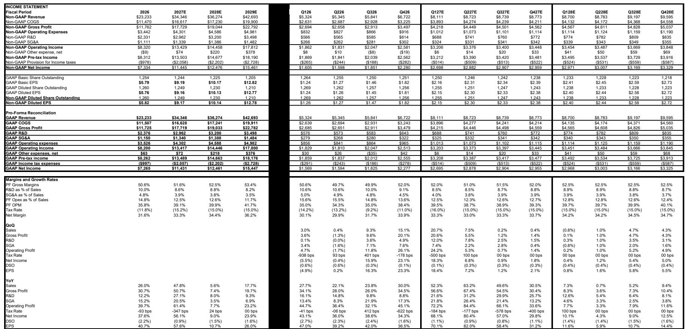
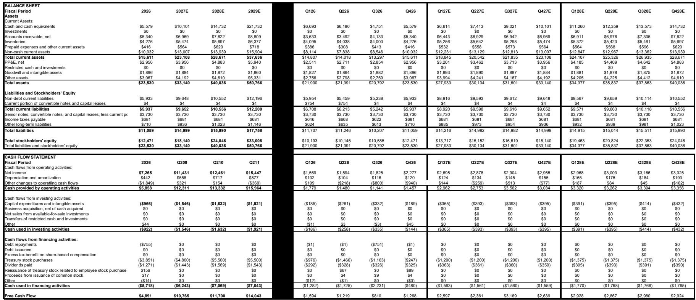
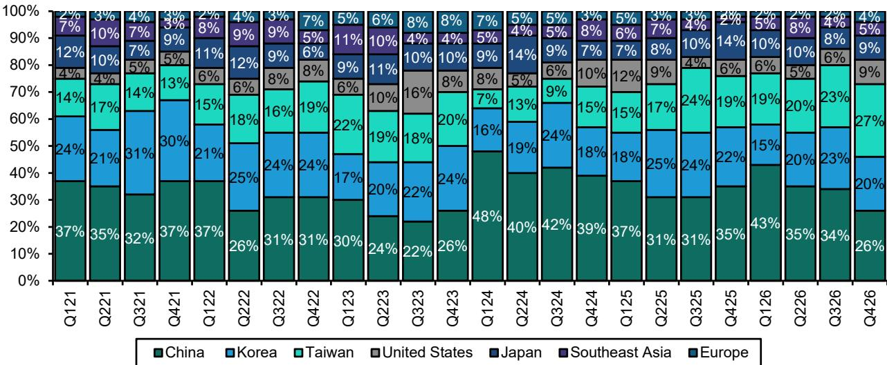

# Lam Research 交出近年来最佳季度成绩，结构性逻辑持续强化

Lam Research 公布的 2026 财年第四季度业绩在营收、毛利率和每股收益方面均超出市场预期。营收为 67.2 亿美元，高于市场预期的 66.8 亿美元；非 GAAP 每股收益 1.82 美元，超出预期 0.12 美元。这一超预期表现主要由客户支持业务集团（CSBG）创纪录的营收推动，该业务收入达到 24.7 亿美元，环比增长 17%，同比增长 43%。比季度本身更重要的是管理层对未来一年的展望：2027 财年第一季度指引为营收 81 亿美元、每股收益 2.15 美元——营收较市场共识高出约 10 亿美元，每股收益高出 0.31 美元。毛利率指引为 52%，远高于市场预期的 50.6%。这家公司并非仅仅受益于周期性顺风。Lam 在运营层面展现出结构性重塑其利润率格局的能力，而需求环境才刚刚开始反映未来两年将定义行业格局的约束条件。

核心逻辑简单而有力：Lam 在一个强劲的晶圆制造设备（WFE）市场中实现超越行业增速，同时提升其长期盈利目标。管理层将 2026 日历年度 WFE 展望从此前的 1400 亿美元区间上调至 1500 亿美元区间低端。虽然未给出具体的 2027 日历年度数字，但管理层将明年描述为“相当不错”的一年，预计所有细分领域均实现环比增长。公司今年仍受洁净室产能限制，这意味着需求受限于可用制造空间而非客户意愿。这些限制预计将在 2027 年和 2028 年开始缓解，使 Lam 能够在支出水平上升时获取更多收入。再加上公司在关键技术转折点——环绕栅极（GAA）晶体管、先进封装、高带宽内存（HBM）、NAND 升级和新建晶圆厂——的有利布局，持续超预期表现的理由变得充分。

## 季度业绩揭示：公司正在创造价值，而不仅仅是扩大规模

本季度最具说明意义的数据点并非营收超预期本身，而是超预期的构成以及伴随的利润率表现。系统营收为 42.5 亿美元，虽然环比增长 14%，但低于市场预期的 44.3 亿美元。超预期部分来自 CSBG，该业务超出市场预期超过 3 亿美元。这一点至关重要，因为 CSBG 收入——包括升级、服务、备件和 Reliant 系统——利润率更高，且比新系统销售更具经常性特征。创纪录的 CSBG 季度表明，随着客户升级现有工具以支持先进制程节点，Lam 的安装基础正在产生越来越大的价值，而不仅仅是购买新设备。

毛利率达到 52.0%，是公司 20 年来的最高水平，环比提升 220 个基点，远高于市场共识和管理层预期的 50.5%。管理层将这一改善归因于定价策略、运营和规模效率以及有利的产品组合。营业利润率 38.4% 也超出预期近 170 个基点。这些并非一次性效应。管理层将长期毛利率目标从此前的 50%+ 上调至 55% 左右区间，长期营业利润率目标从 35%+ 上调至 45% 左右区间。此前在 2025 年 2 月读者日设定的目标已提前数年实现，这一事实有力表明公司的成本结构和定价能力正在经历结构性转变。

各终端市场的需求构成强化了复苏的广度。NAND 营收环比飙升 118%，受客户升级至超过 256 层设备的推动。逻辑营收环比增长 63%。DRAM 营收环比下降 3%，但相对金额持平，支出主要投向晶圆产能增加以及 1-alpha、1-beta 和 1-gamma 节点的技术迁移。代工营收环比下降 7%，原因是中国成熟节点支出放缓，但部分被 3nm 和 2nm 节点以及先进封装的投资所抵消。地域变化同样值得关注：中国收入占比从上一季度的 34% 降至 26%，环比减少约 2.4 亿美元。管理层预计这一趋势将持续，跨国企业支出增加，而中国国内客户支出下降。

## 指引确认：需求周期仍有空间

2027 财年第一季度指引异常强劲，但最重要的信号是管理层对当季之后发展轨迹的评论。81 亿美元的营收指引意味着环比增长超过 20%，管理层明确表示预计 9 月季度之后营收将持续环比增长。毛利率指引为 52%，环比持平，考虑到 6 月季度已创 20 年新高，这一表现令人印象深刻。管理层还将 2026 日历年度 WFE 展望从此前的 1400 亿美元上调至 1500 亿美元区间低端，并将增长归因于客户找到更好利用现有洁净室空间的方法，而非增加新产能。

2027 日历年度的评论尤为积极。虽然管理层未提供具体的 WFE 数字，但将明年描述为“相当不错”的一年，并对该时期持续环比增长表示有信心。驱动因素广泛：管理层预计所有细分领域均将增长，其中 DRAM 增速最快，其次是代工和逻辑，然后是 NAND。预计明年将有约 8 到 10 座新晶圆厂投产，这将为设备支出提供显著支撑。管理层还表示有信心 Lam 在 2027 日历年度将超越 WFE 行业增速，正如其在 2026 日历年度可能实现的那样。

这种信心并非空泛之谈。Lam 在扩大其可服务市场（SAM）方面取得了可衡量的进展。公司的 SAM 已从 WFE 的 30% 左右区间提升至 38% 左右区间，管理层表示 Lam 可能已占据约 36% 的份额。这一扩张得益于在关键转折点——尤其是先进封装——中获取更多价值。管理层上调了 2026 日历年度的先进封装收入预期，目前预计同比增长超过 70%。结构性逻辑令人信服：每一代先进封装都需要更多的再分布层、更密集的铜互连、更高的结构以及日益复杂的供电网络。这些要求每一项都契合 Lam 在刻蚀和沉积方面的优势。

## 观察框架：未来 12 至 18 个月应关注什么

强劲的执行力、不断上升的利润率以及有利的需求转折点，为观察者提供了一套清晰的战略关注点。以下框架将报告的关键信号转化为具体、可监测的指标。

**第一，追踪洁净室约束的缓解情况。** 影响 Lam 2027 年和 2028 年收入轨迹的最重要变量是制造产能上线的速度。管理层已明确表示，今年 WFE 支出受限于可用洁净室空间，而非客户需求。2027 日历年度预计投产的 8 到 10 座新晶圆厂将是缓解这一约束的主要机制。应关注新晶圆厂建设启动的公告，尤其是在前沿逻辑、DRAM 和 NAND 领域。如果新晶圆厂公告步伐加快，Lam 2027 年和 2028 年的收入增长轨迹可能会高于当前预期。

**第二，监测 NAND 升级周期的节奏。** 6 月季度 NAND 营收环比增长 118%，受升级至超过 256 层设备的推动。这是一个多年周期，而非单一季度现象。向更高层数的过渡需要每片晶圆更多的刻蚀和沉积步骤，这直接有利于 Lam 的单工具价值量。如果 NAND 客户继续加快升级时间表，NAND 细分领域可能成为 Lam 收入结构中比当前 23% 占比更显著、更持续的贡献来源。

**第三，关注毛利率相对于新长期目标的轨迹。** 管理层已将长期毛利率目标上调至 55% 左右区间，营业利润率目标上调至 45% 左右区间。6 月季度毛利率 52% 以及 9 月季度指引 52% 表明公司已接近新目标区间的低端。如果毛利率通过定价策略、规模效率以及向高利润率 CSBG 收入的结构性转变而持续改善，公司可能比预期更早超越 55% 左右的目标。在当前收入水平下，毛利率每提升 100 个基点，相当于每股收益增加约 0.15 至 0.20 美元。

**第四，评估 CSBG 增长的可持续性。** CSBG 收入在 6 月季度达到创纪录的 24.7 亿美元，管理层预计 9 月季度大致持平。这并非疲软信号，而是反映了 CSBG 增长固有的不规律性，受客户升级决策时机驱动。安装基础庞大且不断增长，随着客户转向更复杂的架构，每台工具的升级强度也在增加。如果 CSBG 收入在 9 月季度暂停后恢复上升趋势，将验证经常性收入流正成为整体业务更大、更可预测的贡献来源这一观点。

**第五，评估中国敞口的地缘风险。** 中国收入在 6 月季度降至总收入的 26%，低于上一季度的 34% 以及此前超过 40% 的水平。管理层预计这一趋势将持续，跨国企业支出增加，中国国内客户支出下降。这是一把双刃剑。较低的中国敞口降低了出口管制或贸易中断导致收入突然冲击的风险。但这也意味着 Lam 正在失去一个高增长收入来源。应监测中国收入下降的速度与其他地区增长的对比。如果下降速度慢于预期，或者中国收入稳定在高于管理层当前预测的水平，收入前景将有所改善。

## 近期回调后，估值更具支撑性

Lam Research 股价在过去几周经历了显著回调，较 52 周高点下跌约 39%。这一回调使估值达到更有利于基本面前景的水平。按当前价格 252.35 美元计算，该股对应 2027 财年预估每股收益 9.17 美元的市盈率约为 27.5 倍，对应 2028 财年预估每股收益的市盈率约为 24.9 倍。

市盈率从 40 倍压缩至 35 倍反映了拖累半导体资本设备公司的更广泛行业不确定性。但基本逻辑并未削弱。事实上，6 月季度业绩和 9 月季度指引进一步强化了 Lam 的执行力足以支撑溢价估值的观点。公司在一个强劲的 WFE 市场中实现超越行业增速，结构性扩大利润率，并定位自身以受益于将推动未来数年需求的技术转折点。限制今年支出的洁净室约束将在 2027 年和 2028 年新晶圆厂产能上线时成为顺风。

这份报告最重要的启示是：Lam 并非仅仅是强劲 WFE 周期的周期性受益者。公司正在证明，它能够从每一美元 WFE 支出中获取更多价值，其成本结构正在可持续基础上改善，并且其在最重要的技术转折点——GAA、先进封装、HBM 和 NAND 升级——的布局既广泛又深入。2025 年 2 月读者日设定的利润率目标已提前数年实现，管理层已上调目标。9 月季度的收入指引比市场共识高出约 10 亿美元。2026 日历年度 WFE 展望已上调。管理层有信心认为 2027 日历年度将持续环比增长。

这不是一家需要宏观环境配合的公司。这是一家通过执行力、技术定位和定价纪律创造自身顺风的公司。近期股价回调创造了一个使估值与基础业务实力相匹配的入场时机。未来 12 至 18 个月将由洁净室约束的缓解、NAND 和先进封装升级的节奏以及毛利率向新长期目标的轨迹所定义。在这三个方面，本季度的证据都指向同一个方向：更高。

*仅供参考。部分内容可能基于源材料通过 AI 辅助生成、翻译、总结或编辑，可能存在遗漏或错误。请独立核实。本文不构成专业建议。*

仅供参考。部分内容可能基于源材料通过 AI 辅助生成、翻译、总结或编辑，可能存在遗漏或错误。请独立核实。本文不构成专业建议。

