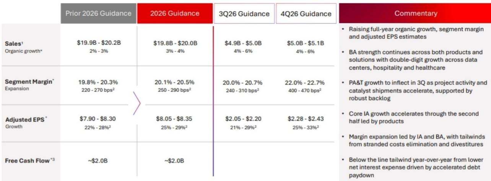
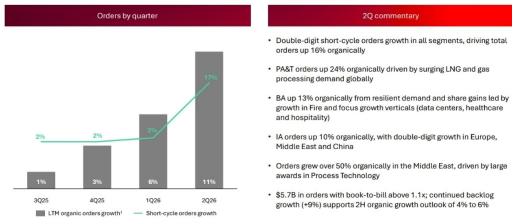
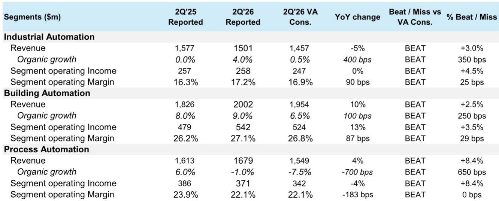

# Bernstein：霍尼韦尔业务与季度数据观察

霍尼韦尔2026年第二季度财报让此前持怀疑态度的分析师开始重新评估。Bernstein在最新报告中指出，这家工业巨头在读者日上提出的增长与利润率展望，正在被实际数据支撑。二季度有机收入同比增长4%，显著高于市场预期的持平水平；调整后每股收益1.95美元，超出共识约7%。三个业务板块——建筑自动化、过程自动化、工业自动化——的有机增长均优于预期，板块营业利润率也普遍高出市场预测20至30个基点。

这份报告的核心判断是：霍尼韦尔的“展示给我看”故事正变得可信。Bernstein此前对该公司能否兑现增长目标持相对怀疑态度，但二季度数据改变了这一看法。如果未来几个季度能延续这一表现，市场定价可能出现重新调整。

## 1. 下半年增长指引隐含保守空间，实际表现可能更高

管理层给出的下半年有机增长指引为4%至6%。Bernstein认为这一数字偏保守，包含了一定程度的应急缓冲。报告分析称，建筑自动化板块已持续录得中个位数增长，且没有结构性节奏变化的理由；过程自动化业务的管理层对增长表现出高度信心；短周期工业的拐点也将支撑工业自动化板块的表现。综合来看，有机增长有望触及甚至超过管理层指引的上限。

> **KC评论：** Bernstein将下半年增长指引的保守性视为一个关键观察点。如果后续季度实际增长持续高于指引，市场对管理层可信度的评估将进一步提升。这一判断的核心依据是订单数据——二季度总订单有机增长16%，各板块均实现两位数增长，订单出货比超过1.1倍。

## 2. 工业自动化利润率扩张路径清晰，市场疑虑可能过度

工业自动化板块的利润率目标是市场关注焦点。管理层计划在2026年第四季度将板块利润率提升至22%，中期目标为25%。Bernstein将这一扩张拆分为两个阶段：近期从当前水平到22%，中期从22%到25%。近期扩张中，约一半来自剥离低利润率的PSS和WWS业务，另一半来自运营杠杆和自身改善。短周期工业的复苏也为这一目标提供了支撑。报告认为，市场对这一利润率目标的怀疑可能过度，管理层的信心有实际运营数据作为基础。

## 3. 过程自动化短期承压，但天然气和催化剂需求提供结构性支撑

过程自动化板块二季度有机增长为-1%，虽然好于市场预期的-7.5%，但仍处于负增长区间。Bernstein分析认为，这一板块的短期表现将受到项目交付稀释和Johnson Matthey整合带来的利润率不确定性。但管理层对下半年实现高个位数有机增长表现出高度信心，主要驱动力来自催化剂出货量的恢复，而液化天然气订单的强劲增长将在未来两年提供结构性支撑。报告预计过程自动化板块利润率在2026年剩余时间内将偏弱，拐点可能在2027年下半年或2028年初出现。

## 4. 估值视角：剔除Quantinuum持股后，当前定价更为合理

Bernstein认为，当前市场对霍尼韦尔的市盈率读数存在失真。报告指出，公司持有的Quantinuum股权价值约每股39美元，剔除这一部分后，核心工业业务的估值更为合理。基于更新后的盈利预测，Bernstein采用20倍远期市盈率（与之前一致），加上Quantinuum持报价值。这一估值倍数被报告描述为保守，暗示如果增长叙事持续兑现，市场定价仍有上行空间。

二季度财报提供了三个关键信号：收入增长超预期、利润率改善路径清晰、订单增长强劲。这些数据正在将霍尼韦尔的增长故事从“承诺”转化为“可验证的事实”。接下来的几个季度将是检验这一趋势能否持续的关键窗口。

For informational purposes only. Portions may be generated,translated,summarized,or edited with AI assistance based on source materials and may contain omissions or errors. Please verify independently. This is not investment,legal,tax,accounting,or other professional advice.

For informational purposes only. Portions may be generated,translated,summarized,or edited with AI assistance based on source materials and may contain omissions or errors. Please verify independently. This is not investment,legal,tax,accounting,or other professional advice.

