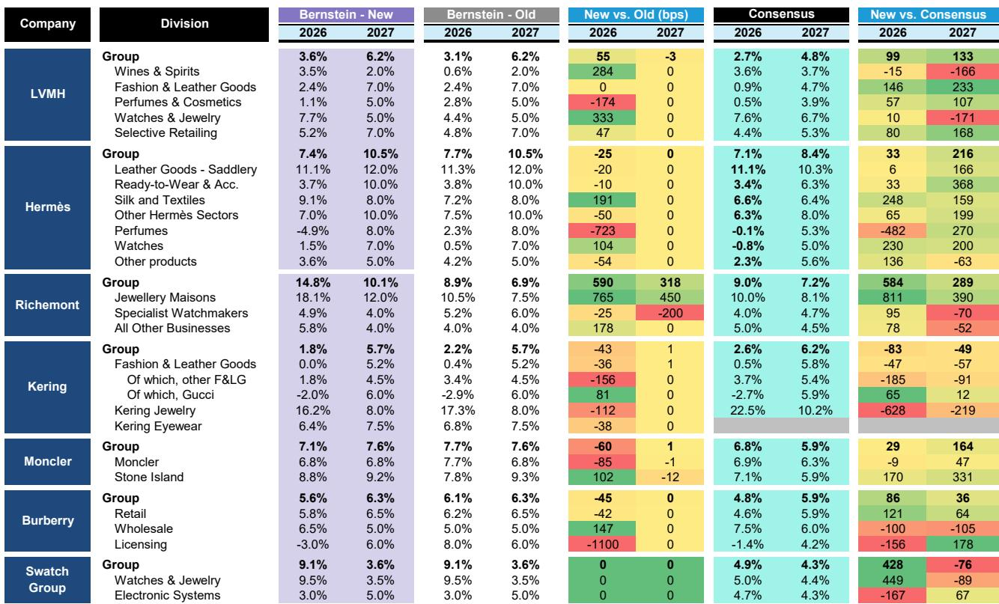
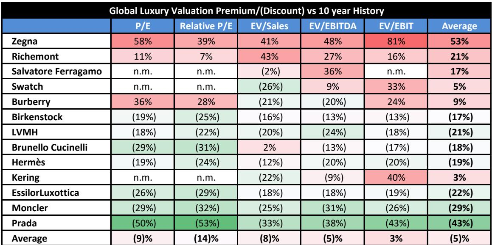
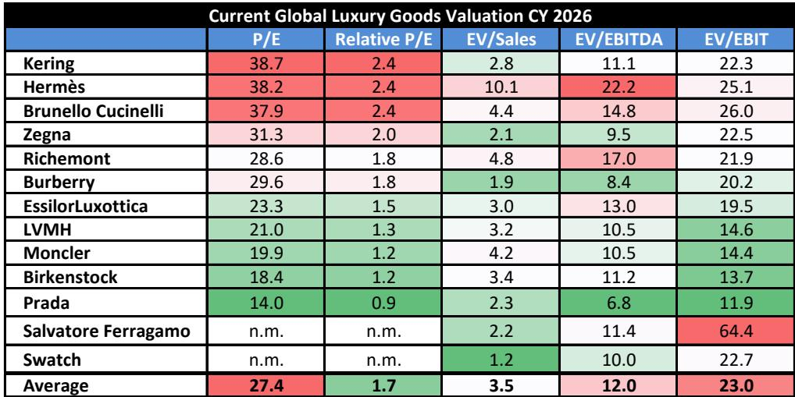

# Hermès的皮具增长谜题并非关键：真正的故事在于品类扩展与定价纪律

当Hermès发布2026年上半年业绩时，市场聚焦于一个短语。管理层澄清，公司长期以来的+6%皮具增长目标指的是生产工时，而非单位产量。结合2027财年同店定价将低于2026财年的信号，公司股价大幅下跌，年初至今跌幅扩大至近30%。读者将这一组合解读为指引下调，以及Hermès增长引擎正在减速的信号。

这种解读并不完整，且可能具有误导性。市场对价格和产量目标的过度关注，掩盖了一个更重要的战略现实：Hermès正在悄然将其增长模式转向品类扩展，而不仅仅是单位产出。公司的皮具产能已锁定至本十年末，计划到2030年每年开设一家新工坊。如果市场担心Hermès会生产过多而稀释稀缺性，实际风险恰恰相反——公司会生产更多，并通过品类组合来消化，从而在不损害品牌价值的前提下维持收入增长。

增长与 exclusivity 之间的张力对Hermès而言并不新鲜。但当前时刻有所不同。公司远期市盈率超过38倍，这一估值已包含了法拉利式的稀缺性和复合增长预期。任何可能削弱这些预期的信号都会引发不成比例的反应。对读者而言，问题在于这种反应是否理性，抑或它是否创造了重新评估Hermès增长算法实际效果的机会。

本文认为，市场错误地定价了产能扩张、品类优化与定价纪律之间的相互作用。上半年电话会议的证据表明，公司正在精准地管理这些杠杆，而非从增长中退缩。对于长期读者而言，当前的估值重置可能是一个机会——前提是他们理解Hermès战略的实际运作方式。

## 皮具增长算法并未放缓；它正在为品类组合重新校准

管理层明确重申了2026财年皮具增长算法：约11%的总增长，大致分为6%来自产量和5%来自定价。澄清6%指的是生产工时而非单位产量，是一个技术性区分，而非下调。生产工时是衡量产能利用率的更准确指标，并且一直是内部指标。市场将其解读为指引下调，反映了对Hermès生产模式的误解。

公司正在Loupes开设第25家皮具工坊，并计划于2027年在Charleville-Mézières、2028年在Colombelles、2030年在Les Andelys增设新址。每家工坊创造约300个就业岗位。这一节奏——大约每年一家新工坊——并非新事。多年来一直是公司既定的目标。发生变化的是市场愿意相信Hermès能够在不打折或稀释品牌的情况下消化产出。

答案在于品类组合。管理层已表示愿意在皮具领域向上延伸，这意味着公司可以将更多生产分配给该品类中价格更高、利润率更高的产品。这将吸收额外的产能，同时为收入增长算法增添动力——这是一举两得的益处，同时解决了产能过剩和长期增长的担忧。上半年的证据支持这一点：管理层表示几乎所有皮具产品都已售出，而Cliquetis、Kelly Hobo和Double Longe等新系列推动了需求。

所谓增长算法的放缓根本不是放缓。这是一次优先考虑品类组合而非产量的重新校准，而市场尚未正确为此定价。

## 定价纪律依然稳固，即使逆风因素正在消退

市场焦虑的第二个来源是，2027财年同店定价将略低于2026财年的迹象。表面上看，这听起来像是一种让步。但在具体背景下，这是纪律的体现。

Hermès历来利用定价来抵消两项特定成本：汇率波动和生产成本通胀。管理层明确表示，这些成本压力正在减弱。如果投入成本降低，公司就无需大幅提价以维持利润率。在此背景下，较低的定价并非需求疲软的信号；而是对通胀环境减弱的机械调整。

这一区分很重要，因为市场往往将任何价格涨幅放缓视为负面需求信号。对Hermès而言，证据指向相反方向。公司上半年毛利率达到71.1%，同比上升40个基点，尽管面临约100个基点的汇率逆风。营业利润率为41.0%，尽管受到近2亿欧元的汇率影响，仅下降40个基点。这些并非一家失去定价能力的公司的数据。

Hermès的定价故事并非关于价格涨幅的相对水平。而是关于公司跨周期维持定价能力的能力。管理层能够在不损害利润率的情况下发出价格涨幅降低的信号，这是实力的体现，而非弱点。关注定价同比变化的读者，正在错过Hermès相对于奢侈品行业所有同行所拥有的结构性优势。

## 非皮具品类提供了被低估的增长方向

皮具叙事主导了读者的注意力，但Hermès的战略日益多元化。公司的高级珠宝、高级定制时装和家居系列都在向上扩展，其财务影响正变得显著。

高级珠宝是上半年的亮点。第九个系列“Into the Horsescape”在全球获得热烈反响，管理层表示7月的高级珠宝活动显著超出预期。这并非边缘业务。高级珠宝的利润率结构上高于皮具，并提供了一条以更独特的产品服务最有价值客户的途径。

成衣在第二季度显著改善，得益于强劲的系列和重大品牌活动，包括2026秋冬女装系列发布、洛杉矶章节活动以及东京男装秀。丝绸和纺织品加速增长，第二季度固定汇率增长12.2%，得益于创意和产品创新。管理层特别指出丝绸是中国表现较强的品类之一。

甚至家居品类也在做出贡献。公司在米兰家具展的展示吸引了约36,000名参观者，家居和餐具的新产能计划于2027年投产。这些品类目前尚未对集团收入产生重大影响，但它们从较小的基数增长，并承载着与皮具相同的品牌溢价。

对于担心Hermès是单一品类故事的读者而言，上半年的证据表明并非如此。公司正在系统性地构建多个增长引擎，每一个都强化而非稀释品牌的 exclusivity。

## 地域多元化提供了抵御区域波动的缓冲

Hermès上半年的区域表现说明了为何单一公司风险对该业务而言低于大多数奢侈品同行。尽管中国依然低迷，中东因地缘政治不确定性而受扰，其他区域正在加速。

美洲在第二季度实现了13.7%的固定汇率增长，成为公司较强的主要区域。管理层描述增长在各国家和品类间均衡，进入下半年美国趋势无重大变化。持续的分销投资——包括在威廉斯堡、曼哈顿、芝加哥和布鲁克林开设新店——表明管理层将美国视为长期增长驱动力，而非周期性机会。

日本在第二季度加速至12.3%的固定汇率增长，得益于忠诚的本地客户和健康的客流量。日本业务是Hermès本地客户优先战略的典范，公司继续在那里投资店铺翻新和扩张。欧洲其他地区实现了8.3%的增长，意大利、德国、希腊和英国表现尤为强劲。伦敦新邦德街Maison被强调为一项重要的运营和沟通里程碑。

中国仍是一个问号。管理层描述市场正在稳定，但尚未实质性改善。消费者信心受到房地产低迷和高储蓄率的制约。然而，管理层指出中国客户主要在国内市场购买，珠宝、美妆和丝绸等品类表现良好。财富创造渠道——房地产和市场的复苏——仍是反弹的关键催化剂，Hermès已做好准备，在时机到来时抓住机会。

地域图景并非普遍疲软。它是一个投资组合，其中强势区域弥补了弱势区域，而公司的投资周期正在增长潜力最大的领域加速。

## 读者的决策框架：上半年数据实际意味着什么

读者需要一个框架来从Hermès上半年结果中区分信号与噪音。以下三部分框架捕捉了战略逻辑。

首先，通过品类组合而非仅产量的视角评估增长算法。6%的生产工时增长是产能约束，而非需求约束。只要Hermès能够向上调整其产品组合——进入更高价的皮具、高级珠宝和高级定制时装——收入增长率就可以超过生产增长率。上半年的证据支持这一点：几乎所有皮具产品都已售出，新系列推动了需求。

其次，在成本投入的背景下评估定价，而非作为独立的需求信号。Hermès的定价是汇率和生产成本通胀的函数。当这些成本下降时，定价自然会缓和。毛利率扩大且营业利润率在汇率逆风中保持稳定，证实了公司并未失去定价能力。它只是在适应一个通胀较低的环境。

第三，将目光投向皮具之外的新兴增长方向。高级珠宝、成衣、丝绸和家居都在扩张，且它们的利润率至少与皮具一样有吸引力。公司对这些品类的产能投资——包括2027年在Couzeix新建的家居和餐具工厂——表明管理层将其视为长期利润中心，而非试验。

应用于当前估值，这一框架表明市场正在贴现一种情景，即Hermès的增长永久性减速。上半年的数据并不支持这一情景。它们支持的情景是，增长因汇率逆风和中国疲软而暂时放缓，随后随着品类扩展和新品类发力而重新加速。以38倍的远期市盈率计算，该股定价了法拉利式的稀缺溢价，这可能是合理的——但前提是市场正确理解Hermès增长模式的实际运作方式。

## 资产负债表创造了市场尚未定价的选择权

Hermès的财务状况增加了一层在增长辩论中很少被讨论的选择权。自2025财年以来，公司持有超过120亿欧元的净现金。这并非小缓冲。这是一项战略资产，管理层可以多种方式部署。

随着现金积累，特别股息变得更有可能。公司无需为运营目的保留如此水平的流动性。特别股息将为股价提供底部支撑，并表明管理层对业务现金生成能力的信心。它还将迫使市场重新评估估值，因为该股将基于盈利增长和资本回报的组合而非仅盈利增长进行交易。

现金头寸还提供了收购选择权。Hermès历来在并购方面保持纪律，但当前环境——许多奢侈品牌陷入困境，估值压缩——创造了机会。公司可以以有吸引力的价格收购较小品牌、产能或房地产，而不会拉伸其资产负债表。

对读者而言，资产负债表是下行保护和上行选择权的来源。在增长令人失望的情景中，现金缓冲支持股息和回购。在增长加速的情景中，现金可用于放大回报。市场尚未为这一选择权赋予任何价值，这意味着该股当前估值纯粹是增长博弈。这可能过于保守。

*仅供参考。部分内容可能基于源材料通过AI辅助生成、翻译、总结或编辑，可能包含遗漏或错误。请独立核实。这不构成投资、法律、税务、会计或其他专业建议。*

仅供参考。部分内容可能基于源材料通过AI辅助生成、翻译、总结或编辑，可能包含遗漏或错误。请独立核实。这不构成投资、法律、税务、会计或其他专业建议。

