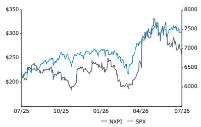
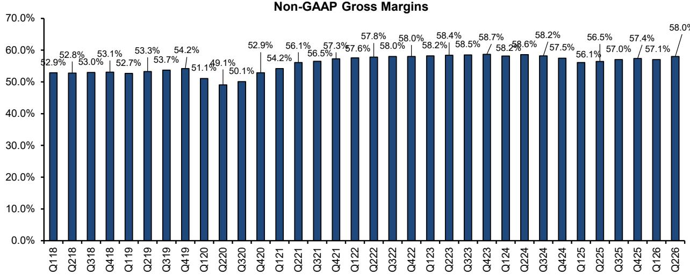
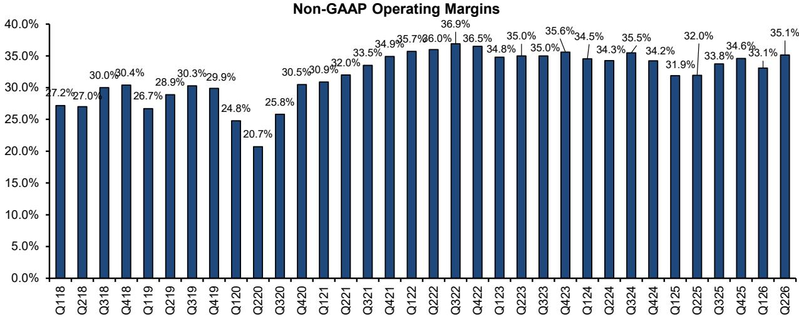
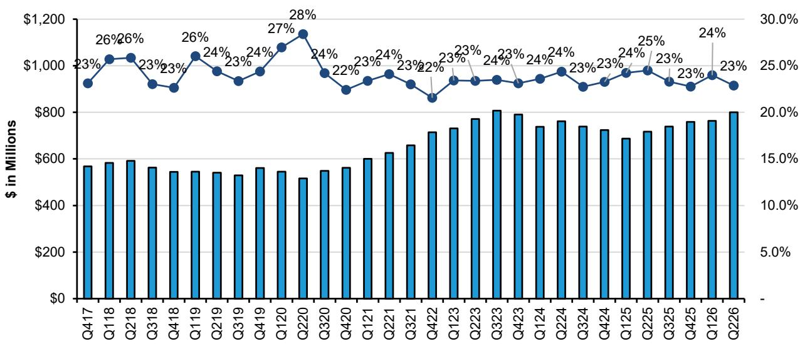
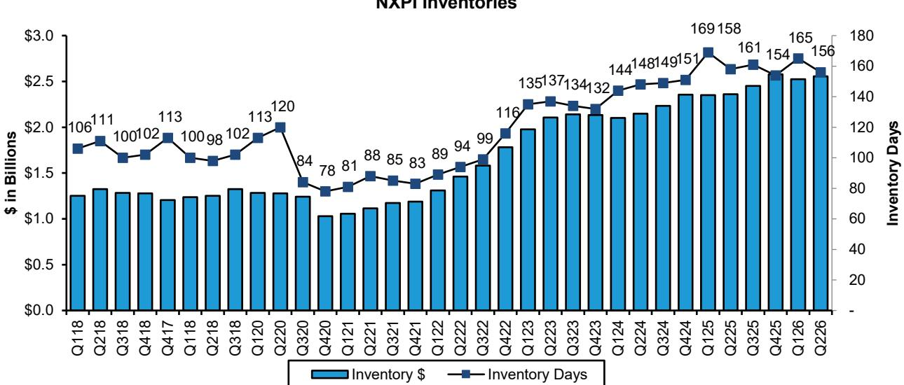
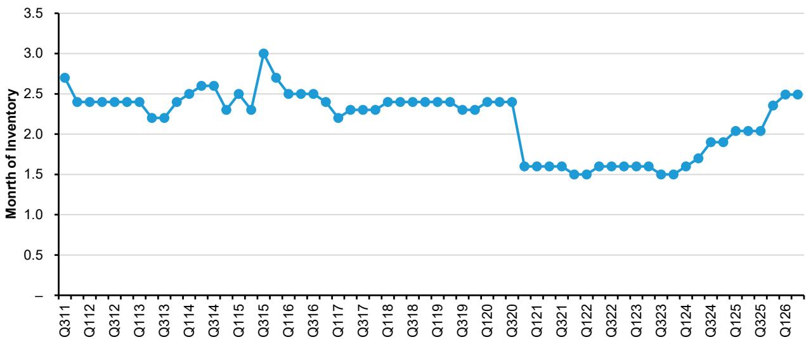
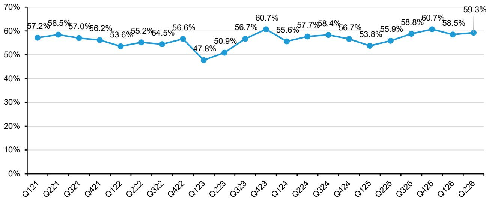
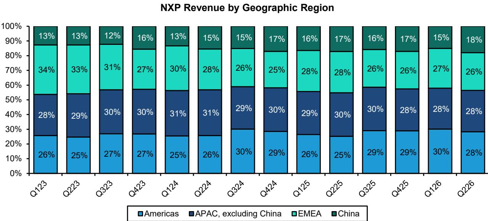
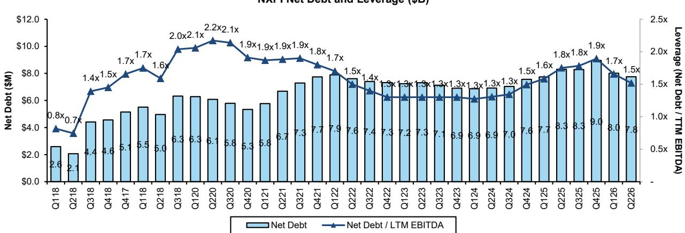

# NXP Semiconductors (NXPI): Q226 Recap - Observations on Valuation

## Rating

Market-Perform

## Price Target

NXPI

290.00 USD (270.00 OLD)

Stacy A. Rasgon, Ph.D.
+1 213 559 5917
stacy.rasgon@bernsteinsg.com

Alrick Shaw
+1 917 344 8454
alrick.shaw@bernsteinsg.com

Arpad von Nemes
+1 917 344 8461
arpad.vonnemes@bernsteinsg.com

Eva Zhang
+1 212 845 7839
eva.zhang@bernsteinsg.com

# NXP Semiconductors (NXPI): Q226 Recap - Observations on Valuation

NXPI's Q226 results were solid, with revenue and EPS slightly above expectations and gross margin in line ($3,496M/58.0%/$3.61 vs Street $3,463M/58.0%/$3.54). All segments exceeded expectations, with Communications and Industrial/IoT driving most of the outperformance, while Mobile and Auto were slightly above consensus. Channel inventory remained stable sequentially at approximately 11 weeks.

Guidance was also solid, slightly above the Street on revenue and EPS, and in line to marginally below on gross margin ($3,750M/58.5%/$4.11 vs Street $3,706M/58.6%/$4.01). Communications is expected to exceed expectations, with Industrial/IoT in line to slightly above, Auto roughly in line, and Mobile slightly below. Management continues to observe strong demand signals (improved compared to 90 days ago), with strength in both core businesses and company-specific growth drivers across segments.

Once again, the results were relatively clean, and while perhaps not as robust as some recent peer reports, company execution remains solid, with the analog recovery across industrial and, increasingly, automotive continuing. We acknowledge a degree of ambivalence regarding the shares. On one hand, NXPI has more idiosyncratic (internally-driven) growth drivers in traditional analog spaces, potential margin improvement (over a multi-year horizon), and a more moderate valuation compared to most peers, which may become increasingly appealing amid the current sector adjustment. On the other hand, we remain somewhat uncertain about automotive upside given observable trends in the end market, and the company has a less significant data center presence (~$500M, approximately 3% of revenue) compared to many peers.

On balance, estimates should trend upward at least modestly, and the company's valuation is becoming more accessible, which may begin to attract greater attention. We raise estimates and roll our valuation horizon forward from FY27 to the average of FY27/28; we adjust our price target to $290 (16x, unchanged, on new FY27/28 EPS of $18.63). We maintain our Market-Perform rating.

## Research Observations

NXPI (MP, $290): The pace and composition of recovery remains a topic for discussion, though company execution is solid and valuation is becoming more moderate.

Price Performance, 1YR

<table><tr><td>Adjusted EPS</td><td>F25A</td><td>F26E</td><td>F27E</td></tr><tr><td>NXPI (USD)</td><td>11.81</td><td>15.02</td><td>16.85</td></tr><tr><td>OLD</td><td>--</td><td>14.58</td><td>16.45</td></tr></table>

Source: Bloomberg, Bernstein estimates and analysis.

<table><tr><td>Close Date</td><td>28 Jul 2026</td></tr><tr><td>NXPI Close Price (USD)</td><td>259.12</td></tr><tr><td>Price Target (USD)</td><td>290.00</td></tr><tr><td>Upside/(Downside)</td><td>12%</td></tr><tr><td>52-Week Range</td><td>339.95/183.00</td></tr><tr><td>SPX</td><td>7,428.78</td></tr><tr><td>FYE</td><td>Dec</td></tr><tr><td>Div Yield</td><td>1.6%</td></tr><tr><td>Market Cap (USD) (M)</td><td>65,420</td></tr><tr><td>EV (USD) (M)</td><td>73,783</td></tr></table>

Source: Bloomberg, Bernstein estimates and analysis.

<table><tr><td>Performance</td><td>YTD</td><td>1M</td><td>6M</td><td>12M</td></tr><tr><td>Absolute (%)</td><td>19.4</td><td>(6.5)</td><td>8.0</td><td>13.4</td></tr><tr><td>SPX (%)</td><td>8.5</td><td>1.0</td><td>6.5</td><td>16.3</td></tr><tr><td>Relative (%)</td><td>10.9</td><td>(7.5)</td><td>1.5</td><td>(2.9)</td></tr></table>

<table><tr><td>Financials</td><td>F25A</td><td>F26E</td><td>F27E</td><td>CAGR</td></tr><tr><td>EBIT (M)</td><td>2,952</td><td>5,037</td><td>5,046</td><td>--</td></tr><tr><td>FCF (M)</td><td>2,425</td><td>3,632</td><td>4,208</td><td>--</td></tr><tr><td>Revenues (M)</td><td>12,269</td><td>14,229</td><td>15,687</td><td>--</td></tr></table>

<table><tr><td>Valuation Metrics</td><td>F25A</td><td>F26E</td><td>F27E</td></tr><tr><td>Adjusted P/E (x)</td><td>21.9</td><td>17.2</td><td>15.4</td></tr></table>

## DETAILS

Please click here for our most recent NXPI model: model

NXPI's Q226 results were solid, with revenue and EPS slightly above expectations and gross margin in line ($3,496M/58.0%/$3.61 vs Street $3,463M/58.0%/$3.54). At the segment level, all segments exceeded expectations, with Communications and Industrial/IoT driving most of the outperformance, while Mobile and Auto were slightly above consensus. Channel inventory remained stable sequentially at approximately 11 weeks (as expected), and on-book inventory dollars increased quarter-over-quarter while days declined.

- NXPI's Q2 sales were $3,496M, above consensus at $3,463M and guidance of $3,450M (Exhibit 1).

• PF Gross Margin of 58.0% was in line with consensus (58.0%) and guidance (58.0%) (Exhibit 2).

• PF Operating Margin of 35.1% was above consensus (34.7%) (Exhibit 3).

- PF Opex of $800M was slightly below consensus ($808M) (Exhibit 4).

- Share count was approximately 254M, higher than consensus (252M).

- Pro-forma EPS was $3.61, above consensus at $3.54 and guidance at $3.50 (Exhibit 1).

- By segment, Auto was $1,938M, slightly above Bloomberg consensus at $1,933M. Industrial/IoT came in at $755M, above consensus at $744M. Mobile was $351M, slightly above Bloomberg consensus at $346M. Communication Infrastructure / Other was $452M, above Bloomberg consensus at $437M (Exhibit 5, Exhibit 6).

- Inventories on the balance sheet rose approximately 1% sequentially on a dollar basis to $2,557M, up $34M versus Q1 at $2,523M, with days declining by 9 to 156 days compared to 165 last quarter (Exhibit 7).

- Distribution channel inventory was stable at approximately 11 weeks (as expected) and remains at their long-term target (Exhibit 8).

• Sales through distribution rose slightly quarter-over-quarter to 59.3% of total revenues (Exhibit 9).

- China revenue exposure (by HQ location) rose sequentially to 18% of sales from 15% in Q1, with the Americas declining from 30% to 28%. APAC mix was flat at 28% and EMEA declined slightly from 27% to 26% (Exhibit 10).

- Net Leverage declined slightly to approximately 1.5x, below the company's target of 2.0x (Exhibit 11).

- The company repurchased $104M in shares during the quarter, and has bought back an additional $32M after the end of Q2 as of July 24th.

Guidance was also solid, slightly above the Street on revenue and EPS, and in line to marginally below on gross margin ($3,750M/58.5%/$4.11 vs Street $3,706M/58.6%/$4.01). Communications is expected to exceed expectations, with Industrial/IoT in line to slightly above, Auto roughly in line, and Mobile slightly below. Management continues to observe strong demand signals (improved compared to 90 days ago), with strength in both core businesses and company-specific growth drivers across segments.

- Q326 Revenues were guided to $3,750M at the midpoint, slightly above consensus at $3,706M (Exhibit 12), and in line to slightly above pre-COVID seasonality (Exhibit 13).

- Automotive is expected to be up mid-single-digit percent quarter-over-quarter and up low-double-digit percent year-over-year, in line with consensus expectations. Adjusting for the sale of the MEMS sensor business, Auto is guided up high-teens percent year-over-year. Management indicated that accelerated growth drivers within automotive grew 22% year-over-year in Q2, representing approximately 47% of the auto business, consistent with their prior comments on anticipating it reaching approximately 50% in 2026 (Exhibit 14).

- Industrial/IoT is guided up mid-single-digit percent quarter-over-quarter and up high-30s percent year-over-year, in line to slightly above consensus on both core industrial and strength from their accelerated growth drivers (approximately 36% of Industrial/IoT and grew approximately 40% year-over-year in Q2).

- Mobile is expected to be up mid-teens percent quarter-over-quarter and down mid-single-digit percent year-over-year, below consensus expectations as memory dynamics affect the market.

- Communications Infrastructure and other is guided up high-single-digit percent quarter-over-quarter and up approximately 50% year-over-year, meaningfully above consensus expectations.

- The Q3 guide assumes channel inventory remaining flat at 11 weeks (i.e., remaining at target levels).

- Gross margins were guided to 58.5%, in line to marginally below the Street (58.6%), and up approximately 50 basis points quarter-over-quarter given higher revenue levels and continued utilization improvements. Management reiterated their plan to bring utilization to mid-80s with a gross margin framework leading to approximately 100 basis points of improvement for every incremental approximately $1B of revenue. Over the longer term, management believes gross margin should trend upward, particularly into 2028 as VSMC comes online, adding an incremental approximately 200 basis points as it ramps into production.

- PF Opex was guided to approximately $813M, below consensus at approximately $825M.

- Interest expense was guided to approximately $85M, above consensus at $81M.

- Share count was guided to approximately 254M; tax rate to approximately 18.0%, non-controlling interest to approximately $15M, and equity contribution from investees at approximately $5M. SBC is expected to come in at $115M and capex is expected at approximately 3% of revenue.

- PF EPS was guided to $4.11, above Street at $4.01 (Exhibit 12).

Once again, the results were relatively clean, and while perhaps not as robust as some recent peer reports, company execution remains solid, with the analog recovery across industrial and, increasingly, automotive continuing. We acknowledge a degree of ambivalence regarding the shares. On one hand, NXPI has more idiosyncratic (internally-driven) growth drivers in traditional analog spaces, potential margin improvement (over a multi-year horizon), and a more moderate valuation compared to most peers, which may become increasingly appealing amid the current sector adjustment. On the other hand, we remain somewhat uncertain about automotive upside given observable trends in the end market, and the company has a less significant data center presence (~$500M, approximately 3% of revenue) compared to many peers. On balance, estimates should trend upward at least modestly, and the company's valuation is becoming more accessible, which may begin to attract greater attention.

- Once again, the results were relatively clean, and while perhaps not quite as robust as some recent peer reports (TXN guided next quarter approximately 5% above Street estimates for example versus NXP at approximately 1%), company execution remains solid as the industry recovery across industrial and, increasingly, automotive continues.

• We acknowledge a degree of ambivalence regarding the shares.

- On one hand, NXPI has more idiosyncratic (internally-driven) growth drivers in traditional analog spaces. They may have some gross margin improvement potential (over a multi-year horizon as new lower-cost JV capacity ramps and new products enter the fold). And valuation is much more moderate compared to most analog and mixed-signal peers (Exhibit 15), which may make it increasingly appealing amid the current sector adjustment.

- On the other hand, we remain somewhat uncertain about automotive upside given observable trends in the end market. And the company has a less significant data center presence (~$500M this year, approximately 3% of revenue) compared to many peers.

- On balance, estimates should trend upward at least modestly, and the company's valuation is becoming more accessible, which may begin to attract greater attention.

## Other Observations:

- NXPI's net debt was $7.8B and TTM adjusted EBITDA was approximately $5.1B, resulting in a Net Debt/EBITDA ratio of 1.5x (Exhibit 11).

- The company repurchased $104M in shares and paid $256M in dividends during the quarter.

We update our model, raising estimates, and roll our valuation horizon forward from FY27 to the average of FY27/28 as we are midway through the year. We adjust our price target to $290 (16x, unchanged, on average FY27/28 EPS of $18.63). We maintain our Market-Perform rating.

- We update our model and raise estimates, as well as roll our valuation horizon forward from FY27 to the average of FY27/FY28 as we are midway through the year.

- We raise our 2026 revenue estimate from $14.0B to $14.2B, 2027 from $15.3B to $15.7B, and FY2028 from $16.6B to $16.9B.

- We raise our 2026 non-GAAP EPS estimate from $14.58 to $15.02, 2027 from $16.45 to $16.85, and FY2028 from $19.69 to $20.41.

- We maintain our multiple at approximately 16x, and raise our target price to $290 (approximately 16x, unchanged, on the average of our FY27/FY28 non-GAAP EPS of approximately $18.63).

• We maintain our Market-Perform rating.

EXHIBIT 1: NXPI's Q2 results were above on revenue and EPS, and in line on gross margin

<table><tr><td colspan="2">$ in millions, ex EPS</td><td colspan="2">Estimates</td><td colspan="2">Delta</td></tr><tr><td>Results</td><td>Actual</td><td>Street</td><td>Bernstein</td><td>Street</td><td>Bernstein</td></tr><tr><td>Sales</td><td>$3,496</td><td>$3,463</td><td>$3,450</td><td>$33.0</td><td>$46.0</td></tr><tr><td>PF Gross Profit</td><td>$2,028</td><td>$2,010</td><td>$2,001</td><td>$17.8</td><td>$27.0</td></tr><tr><td>PF GM %</td><td>58.0%</td><td>58.0%</td><td>58.0%</td><td></td><td></td></tr><tr><td>PF EBIT</td><td>$1,228</td><td>$1,202</td><td>$1,197</td><td>$25.9</td><td>$31.0</td></tr><tr><td>PF OPM %</td><td>35.1%</td><td>34.7%</td><td>34.7%</td><td></td><td></td></tr><tr><td>EPS</td><td>$3.61</td><td>$3.54</td><td>$3.50</td><td>$0.07</td><td>$0.11</td></tr></table>

Bloomberg consensus as of 7/27/26  
Source: Company reports, Bloomberg, Bernstein estimates and analysis

EXHIBIT 2: Gross margin rose approximately 90 basis points in the quarter to 58.0% and was in line with consensus  
  
Source: Company reports, Bernstein analysis

EXHIBIT 3: Operating margins rose approximately 200 basis points to 35.1% in the quarter, above consensus  
  
Source: Company reports, Bernstein analysis

EXHIBIT 4: PF Opex rose sequentially, and was down year-over-year as a percentage of sales at approximately 23%  
  
Source: Company reports, Bernstein analysis

EXHIBIT 5: Automotive and Mobile were slightly above consensus, with Industrial/IoT and Communications driving the outperformance versus consensus

<table><tr><td>Q226</td><td>Actual</td><td>Bernstein</td><td>Diff.</td><td>Consensus</td><td>Diff.</td></tr><tr><td>Automotive</td><td>$1,938</td><td>$1,925</td><td>$13</td><td>$1,933</td><td>$5</td></tr><tr><td>Industrial/IoT</td><td>$755</td><td>$747</td><td>$8</td><td>$744</td><td>$11</td></tr><tr><td>Mobile</td><td>$351</td><td>$344</td><td>$7</td><td>$346</td><td>$5</td></tr><tr><td>Communication Infra &amp; Other</td><td>$452</td><td>$434</td><td>$18</td><td>$437</td><td>$15</td></tr><tr><td>Total</td><td>$3,496</td><td>$3,450</td><td>$46</td><td>$3,463</td><td>$33</td></tr></table>

Source: Company reports, Bloomberg, Bernstein estimates and analysis

<table><tr><td>QoQ Growth</td><td>Q122</td><td>Q222</td><td>Q322</td><td>Q422</td><td>Q123</td><td>Q223</td><td>Q323</td><td>Q423</td><td>Q124</td><td>Q224</td><td>Q324</td><td>Q424</td><td>Q125</td><td>Q225</td><td>Q325</td><td>Q425</td><td>Q126</td><td>Q226</td></tr><tr><td>Total NXP revenue</td><td>3.2%</td><td>5.6%</td><td>4.0%</td><td>(3.9%)</td><td>(5.8%)</td><td>5.7%</td><td>4.1%</td><td>(0.3%)</td><td>(8.6%)</td><td>0.0%</td><td>3.9%</td><td>(4.3%)</td><td>(8.9%)</td><td>3.2%</td><td>8.4%</td><td>5.1%</td><td>(4.6%)</td><td>9.9%</td></tr></table>

EXHIBIT 6: All segments except Mobile grew quarter-over-quarter and year-over-year, while Mobile declined sequentially and grew year-over-year

<table><tr><td>Segment Revenue</td><td>Q122</td><td>Q222</td><td>Q322</td><td>Q422</td><td>Q123</td><td>Q223</td><td>Q323</td><td>Q423</td><td>Q124</td><td>Q224</td><td>Q324</td><td>Q424</td><td>Q125</td><td>Q225</td><td>Q325</td><td>Q425</td><td>Q126</td><td>Q226</td></tr><tr><td>Automotive</td><td>$1,557</td><td>$1,713</td><td>$1,804</td><td>$1,805</td><td>$1,828</td><td>$1,866</td><td>$1,891</td><td>$1,899</td><td>$1,804</td><td>$1,728</td><td>$1,829</td><td>$1,790</td><td>$1,674</td><td>$1,729</td><td>$1,837</td><td>$1,876</td><td>$1,782</td><td>$1,938</td></tr><tr><td>QoQ Growth</td><td>0.6%</td><td>10.0%</td><td>5.3%</td><td>0.1%</td><td>1.3%</td><td>2.1%</td><td>1.3%</td><td>0.4%</td><td>(5.0%)</td><td>(4.2%)</td><td>5.8%</td><td>(2.1%)</td><td>(6.5%)</td><td>3.3%</td><td>6.2%</td><td>2.1%</td><td>(5.0%)</td><td>8.8%</td></tr><tr><td>YoY Growth</td><td>26.7%</td><td>35.7%</td><td>24.0%</td><td>16.7%</td><td>17.4%</td><td>8.9%</td><td>4.8%</td><td>5.2%</td><td>(1.3%)</td><td>(7.4%)</td><td>(3.3%)</td><td>(5.7%)</td><td>(7.2%)</td><td>0.1%</td><td>0.4%</td><td>4.8%</td><td>6.5%</td><td>12.1%</td></tr><tr><td>Industrial &amp; IoT</td><td>$682</td><td>$713</td><td>$713</td><td>$605</td><td>$504</td><td>$578</td><td>$607</td><td>$662</td><td>$574</td><td>$616</td><td>$563</td><td>$516</td><td>$508</td><td>$546</td><td>$579</td><td>$640</td><td>$628</td><td>$755</td></tr><tr><td>QoQ Growth</td><td>3.2%</td><td>4.5%</td><td>-</td><td>(15.1%)</td><td>(16.7%)</td><td>14.7%</td><td>5.0%</td><td>9.1%</td><td>(13.3%)</td><td>7.3%</td><td>(8.6%)</td><td>(8.3%)</td><td>(1.6%)</td><td>7.5%</td><td>6.0%</td><td>10.5%</td><td>(1.9%)</td><td>20.2%</td></tr><tr><td>YoY Growth</td><td>19.4%</td><td>24.9%</td><td>17.5%</td><td>(8.5%)</td><td>(26.1%)</td><td>(18.9%)</td><td>(14.9%)</td><td>9.4%</td><td>13.9%</td><td>6.6%</td><td>(7.2%)</td><td>(22.1%)</td><td>(11.5%)</td><td>(11.4%)</td><td>2.8%</td><td>24.0%</td><td>23.6%</td><td>38.3%</td></tr><tr><td>Mobile</td><td>$401</td><td>$388</td><td>$410</td><td>$408</td><td>$260</td><td>$284</td><td>$377</td><td>$406</td><td>$349</td><td>$345</td><td>$407</td><td>$396</td><td>$338</td><td>$331</td><td>$430</td><td>$485</td><td>$391</td><td>$351</td></tr><tr><td>QoQ Growth</td><td>7.2%</td><td>(3.2%)</td><td>5.7%</td><td>(0.5%)</td><td>(36.3%)</td><td>9.2%</td><td>32.7%</td><td>7.7%</td><td>(14.0%)</td><td>(1.1%)</td><td>18.0%</td><td>(2.7%)</td><td>(14.6%)</td><td>(2.1%)</td><td>29.9%</td><td>12.8%</td><td>(19.4%)</td><td>(10.2%)</td></tr><tr><td>YoY Growth</td><td>15.9%</td><td>11.8%</td><td>18.8%</td><td>9.1%</td><td>(35.2%)</td><td>(26.8%)</td><td>(8.0%)</td><td>(0.5%)</td><td>34.2%</td><td>21.5%</td><td>8.0%</td><td>(2.5%)</td><td>(3.2%)</td><td>(4.1%)</td><td>5.7%</td><td>22.5%</td><td>15.7%</td><td>6.0%</td></tr><tr><td>Communications Infra &amp; Other</td><td>$496</td><td>$498</td><td>$518</td><td>$494</td><td>$529</td><td>$571</td><td>$559</td><td>$455</td><td>$399</td><td>$438</td><td>$451</td><td>$409</td><td>$315</td><td>$320</td><td>$327</td><td>$334</td><td>$380</td><td>$452</td></tr><tr><td>QoQ Growth</td><td>8.5%</td><td>0.4%</td><td>4.0%</td><td>(4.6%)</td><td>7.1%</td><td>7.9%</td><td>(2.1%)</td><td>(18.6%)</td><td>(12.3%)</td><td>9.8%</td><td>3.0%</td><td>(9.3%)</td><td>(23.0%)</td><td>1.6%</td><td>2.2%</td><td>2.1%</td><td>13.8%</td><td>18.9%</td></tr><tr><td>YoY Growth</td><td>17.8%</td><td>19.7%</td><td>14.1%</td><td>8.1%</td><td>6.7%</td><td>14.7%</td><td>7.9%</td><td>(7.9%)</td><td>(24.6%)</td><td>(23.3%)</td><td>(19.3%)</td><td>(10.1%)</td><td>(21.1%)</td><td>(26.9%)</td><td>(27.5%)</td><td>(18.3%)</td><td>20.6%</td><td>41.3%</td></tr><tr><td>Total NXP Revenue</td><td>$3,136</td><td>$3,312</td><td>$3,445</td><td>$3,312</td><td>$3,121</td><td>$3,299</td><td>$3,434</td><td>$3,422</td><td>$3,126</td><td>$3,127</td><td>$3,250</td><td>$3,111</td><td>$2,835</td><td>$2,926</td><td>$3,173</td><td>$3,335</td><td>$3,181</td><td>$3,496</td></tr></table>

<table><tr><td>YoY Growth</td><td>Q122</td><td>Q222</td><td>Q322</td><td>Q422</td><td>Q123</td><td>Q223</td><td>Q323</td><td>Q423</td><td>Q124</td><td>Q224</td><td>Q324</td><td>Q424</td><td>Q125</td><td>Q225</td><td>Q325</td><td>Q425</td><td>Q126</td><td>Q226</td></tr><tr><td>Total NXP revenue</td><td>22.2%</td><td>27.6%</td><td>20.4%</td><td>9.0%</td><td>(0.5%)</td><td>(0.4%)</td><td>(0.3%)</td><td>3.3%</td><td>0.2%</td><td>(5.2%)</td><td>(5.4%)</td><td>(9.1%)</td><td>(9.3%)</td><td>(6.4%)</td><td>(2.4%)</td><td>7.2%</td><td>12.2%</td><td>19.5%</td></tr></table>

Source: Company reports, Bernstein analysis

EXHIBIT 7: NXPI's inventory days declined quarter-over-quarter in Q2, remaining at elevated levels, with inventory dollars up quarter-over-quarter  
  
Source: Company reports, Bernstein analysis

EXHIBIT 8: Channel inventory was stable versus last quarter at approximately 11 weeks  
NXPI Distribution Channel Inventory  
  
Source: Company reports, Bernstein analysis

EXHIBIT 9: NXP sales through the distribution channel rose to 59.3% in the quarter  
NXP % of Sales through the Distribution Channel  
  
Source: Company reports, Bernstein analysis

EXHIBIT 10: NXP China revenue mix rose to 18% while Americas declined to 28%  
  
As of December 31, 2025, and applied retrospectively for all the periods presented, the Company revised its methodology for attributing revenue to geographic areas to reflect the location where sales originate, which represents where critical commercial decisions are made. Source: Company reports, Bernstein analysis

EXHIBIT 11: NXP's net leverage declined sequentially to 1.5x as net debt also declined  
  
Source: Company reports, Bloomberg, Bernstein analysis

EXHIBIT 12: Q3 guidance was above the Street on revenue and EPS, while in line to slightly below on gross margin

<table><tr><td rowspan="2"></td><td colspan="3">Q226A</td><td colspan="2">Variance</td><td colspan="3">Q326E</td><td colspan="2">Variance</td></tr><tr><td>Actual</td><td>Bernstein</td><td>Consensus</td><td>Bernstein</td><td>Consensus</td><td>Guide</td><td>Bernstein</td><td>Consensus</td><td>Bernstein</td><td>Consensus</td></tr><tr><td>Sales</td><td>$3,496</td><td>$3,
