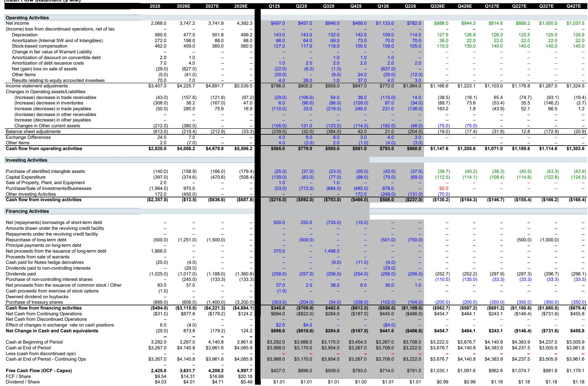
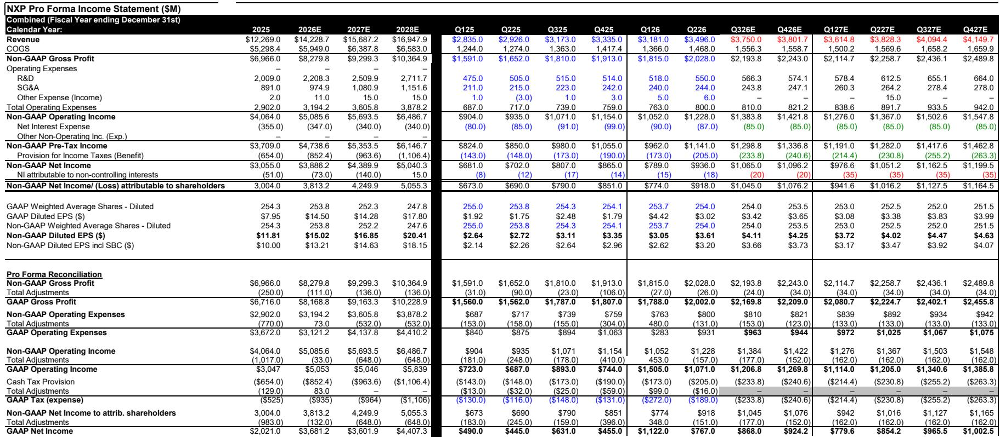
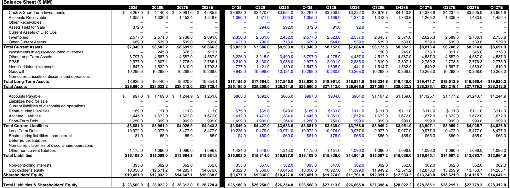

# NXP的估值折价背后：汽车市场复苏的结构性观察

NXP半导体第二季度业绩超出预期，第三季度指引稳健，营收34.96亿美元，每股收益3.61美元，略高于市场预期的34.63亿美元和3.54美元。各业务板块均表现良好，其中通信基础设施和工业/物联网板块表现突出。管理层表示，需求信号比90天前更为积极，汽车领域的加速增长驱动因素同比增长22%，约占汽车业务的47%。从表面看，这是一个典型的模拟半导体周期性复苏案例。

然而，该公司股价约为远期收益的17倍，低于多数模拟和混合信号同行，而半导体板块的调整进一步扩大了这一差距。问题不在于NXP的执行力——其表现确实出色——而在于市场是否正确定价其最大终端市场所蕴含的风险。本报告认为，NXP的估值折价并非耐心观察者的机会，而是对其汽车业务结构性挑战的理性反映，这些挑战是公司特定增长驱动因素无法完全抵消的，同时其收入结构也缺乏数据中心业务来缓冲终端市场波动。

## 汽车市场复苏真实但范围有限，中国因素日益凸显

第二季度汽车业务收入达到19.38亿美元，环比增长8.8%，同比增长12.1%，略高于市场预期的19.33亿美元。管理层预计第三季度汽车业务环比增长中个位数，同比增长低两位数，符合市场预期。剔除MEMS传感器业务出售的影响，汽车业务预计同比增长高两位数。这些数据并不疲弱。

问题在于表面增长之下的结构。中国乘用车零售量同比下降20%，管理层承认了这一数据但未在指引中量化。按总部所在地计算，NXP的中国收入占比从上一季度的15%上升至第二季度的18%。公司汽车业务中的加速增长驱动因素——与电动化、高级驾驶辅助系统和车辆架构整合相关的产品——第二季度同比增长22%，并有望在2026年达到汽车收入的约50%。这一内部增长动力是真实的，但它正叠加在一个最大单一国家市场明显收缩的终端市场之上。

风险在于，NXP的汽车增长越来越成为一个结构性故事：公司在一个缩小的市场中获取份额，而非受益于广泛的复苏。如果中国汽车需求继续变化，加速增长驱动因素将需要更加努力才能维持该板块的平稳。第三季度汽车业务指引大致持平，表明管理层并未看到即将到来的加速，而11周的目标渠道库存水平也几乎没有补货空间。汽车市场复苏正在发生，但其持久性可能不如表面数字所显示的那样。

## 工业和通信是真正的引擎，但难以独自支撑全局

工业/物联网收入达到7.55亿美元，高于市场预期的7.44亿美元，第三季度指引为环比增长中个位数，同比增长高30%以上。通信基础设施收入达到4.52亿美元，远高于市场预期的4.37亿美元，第三季度指引为环比增长高个位数，同比增长约50%。这两个板块合计约占公司总收入的35%，是盈利超预期的主要驱动力。

工业复苏范围广泛，核心工业和加速增长驱动因素（约占工业/物联网的36%）第二季度同比增长约40%。通信受益于无线基础设施和企业网络的周期性升级。两个板块均表现良好，管理层对需求信号的评论明显比90天前更为积极。

然而，规模问题显而易见。工业/物联网和通信第二季度合计贡献约12亿美元收入，而汽车业务为19亿美元。即使工业和通信继续以两位数增长，也无法完全弥补汽车业务的持续调整。公司的数据中心业务约5亿美元，仅占收入的3%，与同行相比微不足道——后者从超大规模支出中获得10%至20%或更多的收入。NXP本质上是对传统模拟复苏的押注——工业、汽车和通信基础设施——而这一复苏正在不均衡地展开。增长最快的板块也是规模最小的。

## 利润率扩张真实但偏后期，60%毛利率路径依赖VSMC

第二季度毛利率为58.0%，符合市场预期和指引，环比上升约90个基点。第三季度毛利率指引为58.5%，再上升50个基点，得益于更高的收入和持续的产能利用率改善。管理层重申，每增加10亿美元收入，毛利率约提升100个基点，产能利用率正朝着80%中段迈进。

长期利润率故事取决于VSMC——NXP与合作伙伴共同建设的合资晶圆厂。管理层认为，一旦VSMC投产（可能在2028年），将为毛利率增加约200个基点。这是一个重要的积极因素，但距离实现还有数年时间，且取决于合资企业能否实现其成本和良率目标。短期内，毛利率受到当前晶圆厂产能利用率（仍低于最优水平）以及加速增长驱动因素中低利润率产品结构变化的制约。

利润率轨迹积极但渐进。NXP并非一个在未来两到四个季度会带来意外惊喜的利润率扩张故事。这是一个需要多年才能实现的稳步改善过程，而这一时间线在VSMC投产前若宏观环境发生变化则存在风险。观察者不应将第二季度的利润率改善外推为快速攀升至60%或以上。

## 估值折价反映风险特征，而非市场误判

NXP股价约为远期收益的17倍，低于多数模拟和混合信号同行。过去12个月，该股表现落后于标普500指数约3个百分点，而半导体板块的调整进一步扩大了估值差距。从简单的市盈率角度看，该股看似便宜。

但便宜本身并非催化剂。这一折价反映了三个不太可能迅速解决的结构性因素。首先，NXP的汽车业务敞口高于多数同行，约占收入的55%，而终端市场在中国——全球最大的汽车市场——显示出明显变化。其次，公司缺乏数据中心增长引擎来抵消汽车和工业的周期性波动。第三，利润率扩张故事偏后期，且依赖于一个尚未投产的单一制造合资企业。

市场并未误判NXP。它正在定价一家在困难终端市场中执行良好的公司，其上行催化剂有限，仅限于工业和汽车需求的逐步复苏。Bernstein对其远期收益应用的16倍市盈率与这一风险特征一致。估值上调需要中国汽车需求出现明显改善、VSMC利润率提升快于预期，或数据中心收入轨迹改变收入结构。这些条件目前似乎都不太可能立即出现。

## 观察框架：估值上调的三个条件

对于考虑当前水平NXP的观察者，决策框架应关注三个可能支撑更高估值的条件。首先，中国汽车需求必须企稳或改善。乘用车零售量同比下降20%是NXP汽车收入的领先指标，在这一趋势逆转之前，汽车板块将面临结构性挑战，加速增长驱动因素只能部分抵消。观察者应关注中国月度汽车销售数据和NXP的季度中国收入披露。

其次，工业复苏必须超出当前轨迹。工业/物联网第二季度同比增长38%，但这一增长是在较低基数上实现的。第三季度同比增长高30%以上的指引表明复苏仍在继续，但环比增速正在放缓。如果工业收入增长减速至个位数，盈利动力将完全转向通信和汽车，两者均具有较高的周期性风险。

第三，VSMC必须按计划推进并控制成本。2028年200个基点的毛利率提升是长期盈利能力的关键组成部分。任何延迟或成本超支都将把利润率拐点推得更远，并降低盈利的复合年增长率。观察者应跟踪合资企业的建设时间表、管理层对产能利用率目标的评论，以及公司长期财务框架中隐含的毛利率轨迹。

如果三个条件均满足，NXP的盈利能力可能支撑更高的估值倍数。如果任何一个条件出现变化，当前的折价可能会持续或扩大。该股并非价值陷阱，但也非隐藏的瑰宝。它是一家在周期性行业中管理良好的公司，具有市场已正确识别的特定风险。

*仅供参考。部分内容可能基于源材料通过AI辅助生成、翻译、总结或编辑，可能存在遗漏或错误。请独立核实。本文不构成任何专业建议。*

仅供参考。部分内容可能基于源材料通过AI辅助生成、翻译、总结或编辑，可能存在遗漏或错误。请独立核实。本文不构成任何专业建议。

