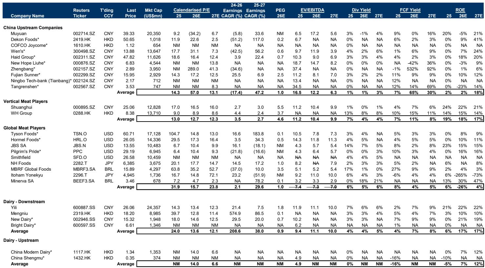
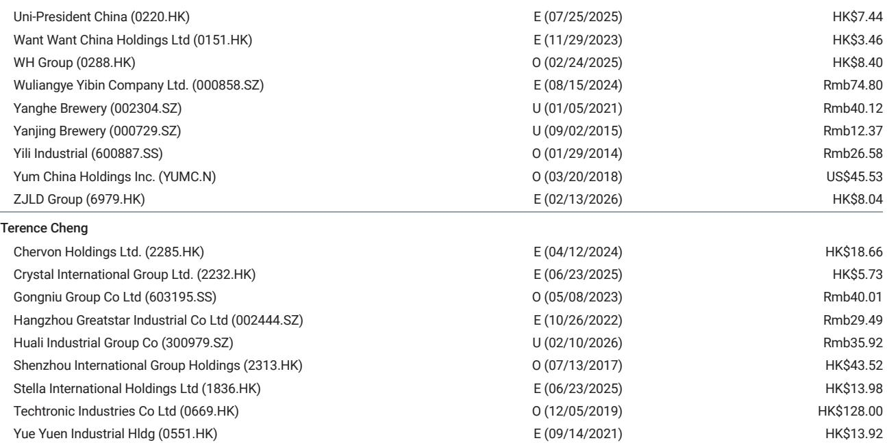
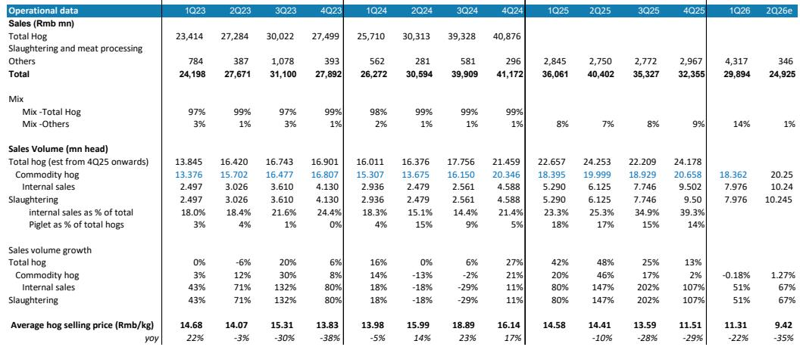

# MS：研究主题与行业变化观察

中国生猪养殖行业的产能出清速度比市场此前预期的更慢。MS在最新报告中指出，尽管行业已连续数月处于亏损状态，但生产效率提升抵消了能繁母猪存栏下降对供给的影响，导致猪价反弹时点被进一步推后。该机构预计2026年行业生猪均价为每公斤11元，同比下降23%，而更明显的价格回升可能要等到2027年三季度。

这份报告的核心变化在于时间轴的重新校准。此前市场普遍认为2026年下半年将迎来周期性拐点，但MS现在将季节性猪价反弹的预期推迟到2026年三季度，并将整个周期性复苏的假设前提推后至2027年。这一判断基于一个关键事实：2026年二季度猪价表现持续弱于预期，现货价格一度跌破每公斤10元，即便近期反弹至约10.1元，行业仍处于亏损区间。

## 1. 生产效率提升延缓了供给收紧

能繁母猪存栏下降并未直接转化为出栏量的减少。报告指出，行业平均每头母猪年提供出栏猪数（MSY）的提升，在很大程度上抵消了母猪存栏削减对最终产量的影响。这意味着传统的“去产能-供给变化-价格上涨”传导链条在当前周期中被拉长。

MS测算，2026年行业生猪均价约为每公斤11元，2027年小幅回升至13.6元，同比增幅约23%。更实质性的价格反弹预计出现在2027年三季度。这一时间表比该机构此前的预测晚了大约一个季度。

> **KC评论：** 生产效率提升是这轮周期中容易被忽视的变量。当行业从散养向规模化养殖过渡时，MSY的提升是结构性趋势。报告隐含的意思是，即便能繁母猪存栏数据下降，实际猪肉供给可能并不会同步减少，这解释了为何猪价在亏损期仍持续处于调整状态。

## 2. 牧原股份的成本优势在周期底部依然有效

尽管行业整体承压，MS仍将牧原股份视为结构性成本优势最明显的龙头企业。报告数据显示，牧原的MSY约为25，显著高于行业平均的20。这一差距意味着牧原在同样的母猪存栏规模下，能够获得更高的出栏量，从而摊薄单位成本。

该机构预计牧原2026年完全生猪养殖成本约为每公斤11.5元。按照当前猪价水平，这一成本线意味着牧原在2026年仍将处于微亏或盈亏平衡附近。报告将2026年生猪养殖毛利润预测从此前的218亿元大幅下调至14亿元，2027年从344亿元下调至279亿元。单位毛利润方面，2026年预计仅为每公斤0.1元，2027年回升至每公斤2.9元。

## 3. 估值框架已反映更长的去库存周期

MS调整了估值方法，将牧原股份的估值倍数从2026年预期市盈率18倍下调至2027年预期市盈率13倍。这一调整的逻辑是：更长的去库存周期需要更保守的估值基准。报告指出，13倍的估值水平大致与以往去库存周期后期的估值区间一致，略低于2018年以来的历史平均交易倍数。

基于新的盈利预测和估值倍数，2026年每股盈利预测从此前的2.63元下调至亏损0.72元，2027年每股盈利预测下调22%至3.68元。

## 4. 2026年上半年业绩指引显示亏损仍在扩大

牧原股份发布的2026年上半年业绩预告显示，预计净亏损在57亿至67亿元之间，主要原因是生猪平均售价同比下降约28%，降至约每公斤10.4元。按照MS的全年预测推算，这一指引意味着2026年下半年公司有望实现15亿至25亿元的净利润。

报告认为，下半年需要关注两个关键变量：一是公司自身的去库存进程以及三季度消费旺季对猪价的拉动作用；二是牧原的成本效率能否在饲料成本高企的环境下继续优化。

> **KC评论：** 下半年能否扭亏，取决于猪价反弹幅度和成本控制能力。报告给出的下半年净利润预测区间并不宽裕，说明即便旺季到来，行业盈利修复的弹性可能仍然有限。牧原的成本优势在周期底部是防御性的，但真正决定报价空间的，是行业供给出清的速度。

For informational purposes only. Portions may be generated,translated,summarized,or edited with AI assistance based on source materials and may contain omissions or errors. Please verify independently. This is not investment,legal,tax,accounting,or other professional advice.

For informational purposes only. Portions may be generated,translated,summarized,or edited with AI assistance based on source materials and may contain omissions or errors. Please verify independently. This is not investment,legal,tax,accounting,or other professional advice.

