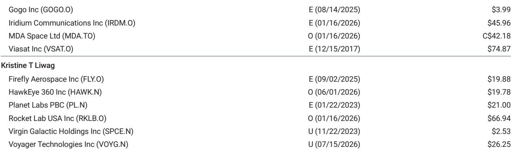
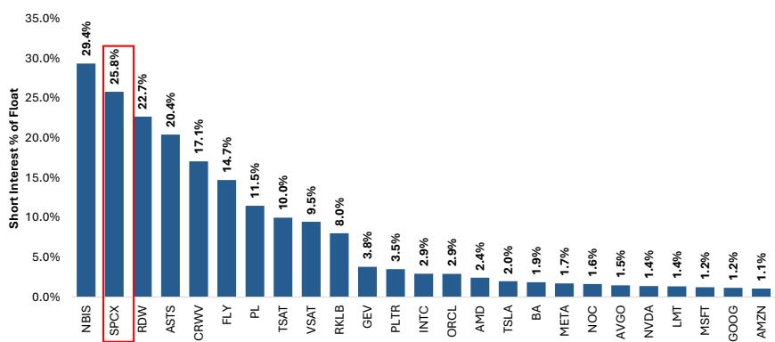
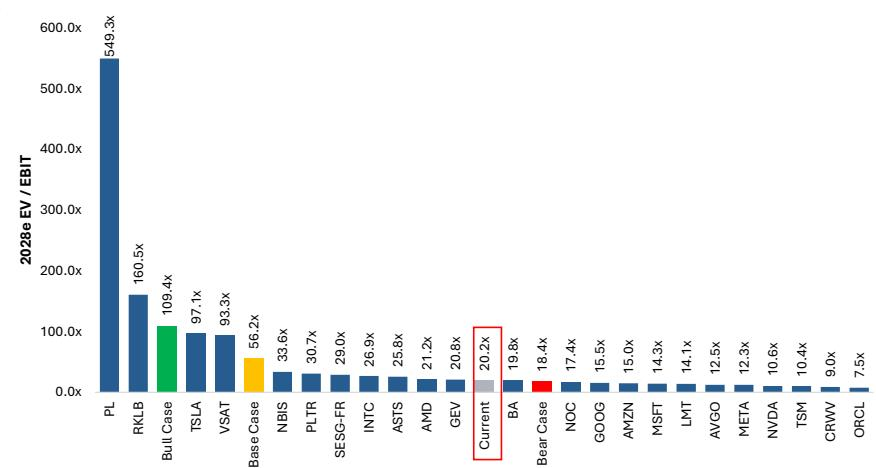

# MS：SpaceX北美业务与季度数据观察

上市后的第一份季度财报即将公布，但MS分析师认为，SpaceX 当前报价的核心矛盾并非基本面，而是技术性因素。自高点下跌近50%、较IPO发行价低约20%之后，超过9.3亿股公司将在8月6日解禁，对应市值约1000亿美元。这是8批解禁中的第一批，总计近40亿股将在2027年1月前陆续进入市场。报告用火箭发射中的“最大动压”来比喻这一时刻——空气密度与速度平方共同决定结构承受的极限应力，而SpaceX公司正在经历类似的不确定性测试。

## 1. 二季度业绩本身难以改变报价方向

MS预计二季度收入约67.5亿美元，略低于市场共识的69.2亿美元；调整后EBITDA约20.2亿美元，同样略低于共识的21.1亿美元。分业务看，连接业务收入约40.3亿美元，AI业务约18.8亿美元，航天业务约8.3亿美元。消费者星链用户数约1195万，ARPU约65.5美元，均与市场预期接近。

报告认为，这些数字既不会显著改变短期共识预期，也不会改变长期故事。管理层在会议上的评论和整体基调，可能比季度数字本身对报价的影响更大。多数读者并不期待任何改变故事走向的重大公告。

> **KC评论：** 这份报告的核心判断是，二季度财报本身可能不是关键变量。真正影响短期报价走势的是8月6日开始的锁定期解禁，以及读者对AI业务估值框架的持续分歧。报告将注意力从季度数字转向了技术面结构和市场情绪。

## 2. 读者情绪偏向谨慎，多空分歧明显

报告通过近期与读者的交流发现，超过三分之二的与会者对SpaceX年底前的报价表现持谨慎态度。看空者的信心在逐步增强，而看多者则倾向于等待首批解禁过后再行动，以避免潜在的抛售不确定性。市场情绪基本跟随报价走势。

多数读者将星舰第14次试飞视为第一个具体的潜在上行催化剂——预计在8月底或9月初进行，届时公司将尝试捕获星舰上级，以展示可重复使用能力的进展。在AI业务方面，多数读者对Grok和Cursor的价值显著打折，认为AI业务本质上是一个“新型云服务”，其宏观环境模型尚不清晰。报告指出，“AI业务是什么、该给什么倍数”是未来一年报价方向的首要问题。许多读者对AI业务赋予零甚至负价值，理由是相对于航天和连接业务的高资本开支需求、不确定的宏观环境性以及管理层投入的大量时间。

## 3. 估值隐含AI业务被定价为零

报告做了一个直观的对比：如果SpaceX报价跌至100美元，其2028年EV/EBIT约为18倍，2028年市盈率约16倍。这意味着AI业务的价值被完全忽略，甚至为负值，而航天和连接业务的业绩需要显著低于当前预期才能支撑这一估值水平。作为参照，沃尔玛2028年市盈率约33倍，TJX约26.5倍。SpaceX在100美元价位上的估值折扣超过50%。

连接业务128美元，X与Grok业务12美元，企业AI业务152美元。其中企业AI业务因执行不确定性被给予50%的估值折扣。这一框架本身说明，AI业务的估值分歧是当前定价的核心变量。

## 4. 值得关注的潜在超预期与不及预期因素

报告列出了几个可能改变市场预期的方向。上行方面：管理层若提出明年新增计算部署超过2吉瓦的计划，每个增量吉瓦对应约100至500亿美元的AI年化收入；新的重大云服务合同；Grok在Cursor平台上的使用趋势显示出相对于其他前沿模型的市场份额实质性增长；Cursor年化收入从6月初报告的40亿美元加速增长。

节奏变化方面：2026年资本开支指引显著高于报告模型假设的约500亿美元；管理层暗示年底前需要额外融资；计划提前终止或重新谈判现有云服务合同；星链用户数据显示出增速节奏变化迹象。

报告认为，管理层最可能提供的明确指引是全年资本开支（报告预计480亿美元）和年底计算部署规模（预计2吉瓦），以及对未来星舰试飞时间表、计算部署节奏、v3卫星部署和Grok/Cursor模型发布的高层展望。

For informational purposes only. Portions may be generated,translated,summarized,or edited with AI assistance based on source materials and may contain omissions or errors. Please verify independently. This is not investment,legal,tax,accounting,or other professional advice.

For informational purposes only. Portions may be generated,translated,summarized,or edited with AI assistance based on source materials and may contain omissions or errors. Please verify independently. This is not investment,legal,tax,accounting,or other professional advice.

