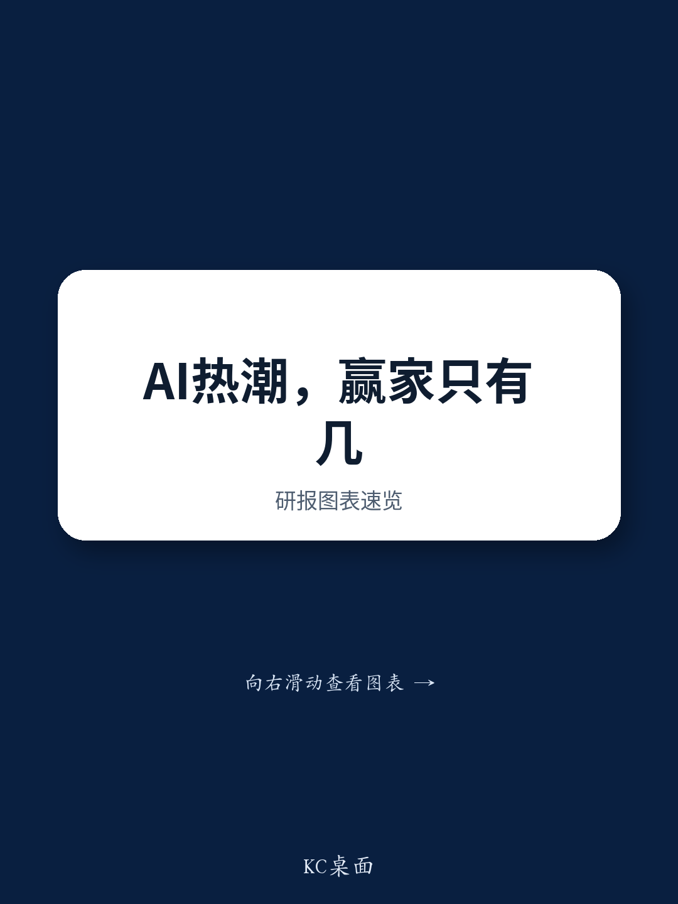

# 中国区域发展的K型分化正在加剧，或推动财政体制改革而非全面刺激

中国宏观增长已不再是一个单一的数字。2026年上半年，全国实际GDP同比增速从2025年的5.0%降至4.7%。这一整体数据背后，隐藏着更深层次的结构性分化。少数七个“智慧”城市——包括三个一线城市和四个精选二线城市——其加权平均增速从5.4%加快至5.6%，而占全国GDP约83%的其他地区，增速则从4.9%明显下降至4.5%。这种分化并非边际现象，而是一种地理上的K型分化，且正在加剧。

这一模式之所以重要，是因为它改变了宏观政策的逻辑。当增长广泛但放缓时，教科书式的应对是全面刺激。当增长日益集中在少数城市中心，而大部分经济体增速放缓时，政策考量也随之改变。不能简单地向系统注入需求，而不加剧正在产生K型分化的失衡。地理不平等加剧的证据，可能会推动中国加快财政体制改革，赋予地方政府更稳固、更自主的税基，而非依赖中央主导的支出计划。

这七个智慧城市目前贡献了全国GDP增长的20%，是至少二十年来的最高份额。这种集中并非周期性偶然，而是由人工智能驱动的投资和产业升级所产生的结果，这些活动本身具有地理集聚性。上半年，北京和上海的固定资产投资分别增长3.0%和6.8%，而全国固定资产投资则收缩了5.7%。资本配置的分化是K型分化的机械驱动力。其他地区不仅增长较慢，而且正在被剥夺推动未来生产力的投资。

## 人工智能热潮是地理集中器，而非全国性提振

对K型分化最直观的解释是，与人工智能相关的经济活动本质上是城市化和技能密集型的。报告中的固定资产投资数据是最清晰的信号。2026年上半年，全国固定资产投资同比下降5.7%，但北京和上海却实现了3.0%和6.8%的正增长。这并非几个城市具有韧性的故事，而是资本从广泛经济体中流出，涌入少数城市核心区的故事。

这与人工智能驱动增长的性质一致。人工智能基础设施——数据中心、研究实验室、半导体制造、云计算中心——需要深厚的工程人才储备、靠近大学、完善的物流网络和监管支持。这些条件在中国少数城市得到满足，而非全国范围。七个智慧城市正在收获一波绕过大部分经济体的技术浪潮的回报。结果是赢家从中位数中脱颖而出，而非所有地区都水涨船高。

第二个层面的含义是，其他地区面临双重困境。它们不仅增长较慢，而且正在失去可能帮助它们追赶的投资。全国固定资产投资5.7%的收缩并非均匀分布，而是集中在缺乏智慧城市生态系统的地区。这些地区不仅在GDP增长上落后，而且在决定未来增长能力的资本存量上也在落后。K型分化是自我强化的。

## K型分化自然限制了全面刺激的理由

传统的放缓会引发财政和货币扩张。但K型分化创造了一个政策悖论。如果推出激进的全国性刺激——例如广泛的减税、普遍的基础设施支出或全面的信贷宽松——大部分新增需求将流向已经过热的智慧城市，因为生产性产能、熟练劳动力和金融中介都集中在那里。刺激措施会放大K型分化，而非纠正它。

报告明确指出：K型经济自然限制了激进、全面刺激的理由。这对观察者和政策制定者来说是一个关键见解。这意味着对增长放缓的政策反应不会重复2008-2009年的超级刺激或2015-2016年的信贷扩张。那些是对同步低迷的反应。当前情况是结构性分化的，政策工具也必须同样差异化。

更可能采取的做法是在2026年下半年加大有针对性的政策力度——向落后地区进行财政转移、支持地方政府财政，以及试图将人工智能相关投资扩展到当前集群之外的产业政策。但这些措施在规模和速度上固有局限性。它们无法迅速逆转K型分化，因为背后的力量——集聚经济、人力资本筛选以及技术基础设施的地理粘性——是强大且缓慢变化的。

## 财政改革而非财政扩张是结构性要求

K型分化最深层的含义是，中国的财政体系需要根本性改革，而不仅仅是周期性调整。报告指出，地理不平等加剧可能会推动中国加快财政改革，为地方政府提供更稳固的税基。这是将数据与前瞻性观点联系起来的战略论点。

中国地方政府长期以来依赖土地销售和预算外融资工具来支持支出。随着房地产市场收缩和债务负担上升，这种模式正在瓦解。K型分化使问题恶化，因为落后地区的土地市场最弱，财政压力最大。它们无法通过借贷摆脱放缓，也无法通过征税摆脱困境，因为其经济基础正在萎缩。

改革方向是明确的：更正式的政府间转移支付体系、更广泛的地方税基（如消费税或房产税），以及地方政府在管理自身收入和支出方面更大的财政自主权。这些是政治上困难的变革，因此进展缓慢。但K型分化创造了新的紧迫性。如果智慧城市与其他地区之间的差距继续扩大，不作为的社会和政治成本将会上升。

从观察者角度看，这意味着中国的财政政策叙事正在从“会支出多少”转向“将如何重构地方政府的收入端”。后者是一个更缓慢、更不确定的过程，但正是它将决定K型分化最终是稳定还是继续加深。

## 解读中国增长分化的决策框架

对于观察者和策略师而言，K型分化不仅是一个描述性观察，更是一个理解政策信号、行业配置和区域敞口的框架。从数据中可以得出以下决策逻辑：

第一，追踪智慧城市与全国平均水平的增长差异。如果差距进一步扩大，表明人工智能驱动的投资周期仍在集中，全面刺激不太可能。如果差距缩小，表明财政转移或产业政策开始更均匀地传播增长，这将降低结构性改革紧迫性的理由。

第二，关注城市和省级层面的固定资产投资数据，而不仅仅是全国总量。当全国固定资产投资整体收缩5.7%，同时北京和上海实现正增长时，全国数字具有误导性。真正的信号在于投资的离散程度。离散程度扩大强化了K型分化；离散程度缩小表明政策正在发挥作用。

第三，关注财政改革公告而非刺激头条。新一轮地方政府债券发行或基础设施审批是周期性反应。中央与地方政府之间税收分享安排的改变，或新地方税的引入，是结构性反应。后者是K型分化所要求的，也是将当前周期与以往周期区分开来的关键。

第四，通过地理视角评估行业敞口。大部分收入来自智慧城市的公司，尤其是在人工智能相关服务、高端房地产和技术基础设施领域，可能会看到有韧性或加速的需求。对全国其他地区有广泛敞口的公司，则面临增长放缓、投资减弱和地方政府预算收紧的逆风。

第五，认识到K型分化降低了系统性危机的概率，但增加了落后地区长期停滞的概率。同步崩溃不太可能，因为智慧城市提供了缓冲。但双速经济意味着国家政策将被拉向矛盾的方向——支持赢家同时试图缓冲输家——这会产生模糊和渐进的结果，而非大胆、清晰的举措。

K型分化并非暂时异常。它是一个经济体从投资主导的追赶型增长向技术驱动的赢家通吃型增长转型的结构性标志。地理维度是这一转型最明显的体现，并将塑造中国未来多年的宏观政策、财政架构和观察格局。

*仅供参考。部分内容可能基于源材料通过人工智能辅助生成、翻译、总结或编辑，可能存在遗漏或错误。请独立核实。本文不构成专业建议。*
