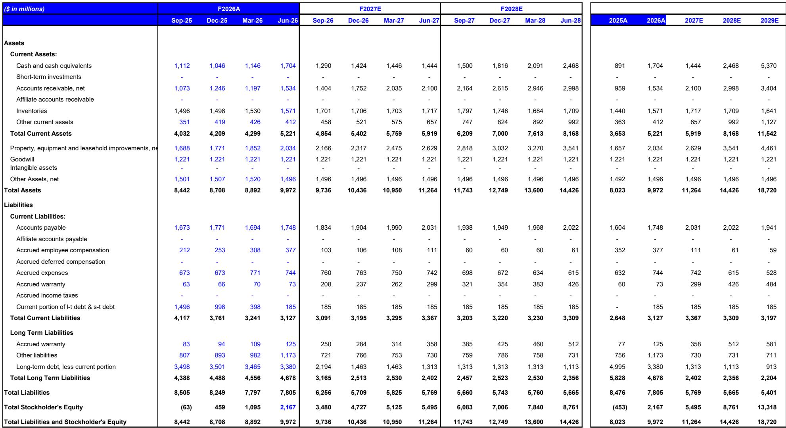
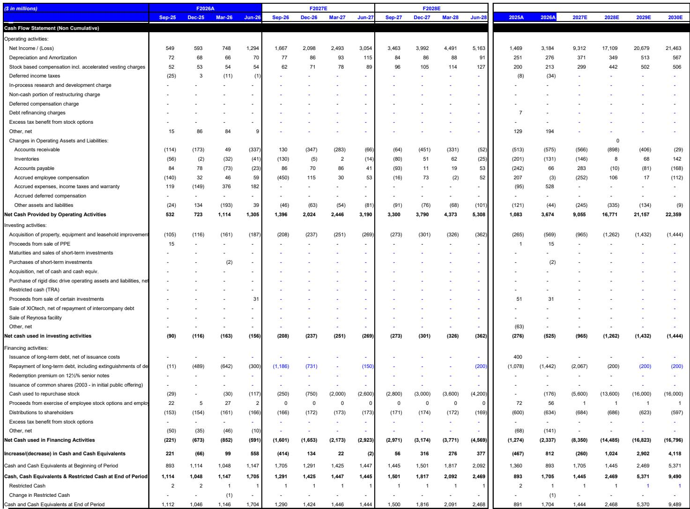
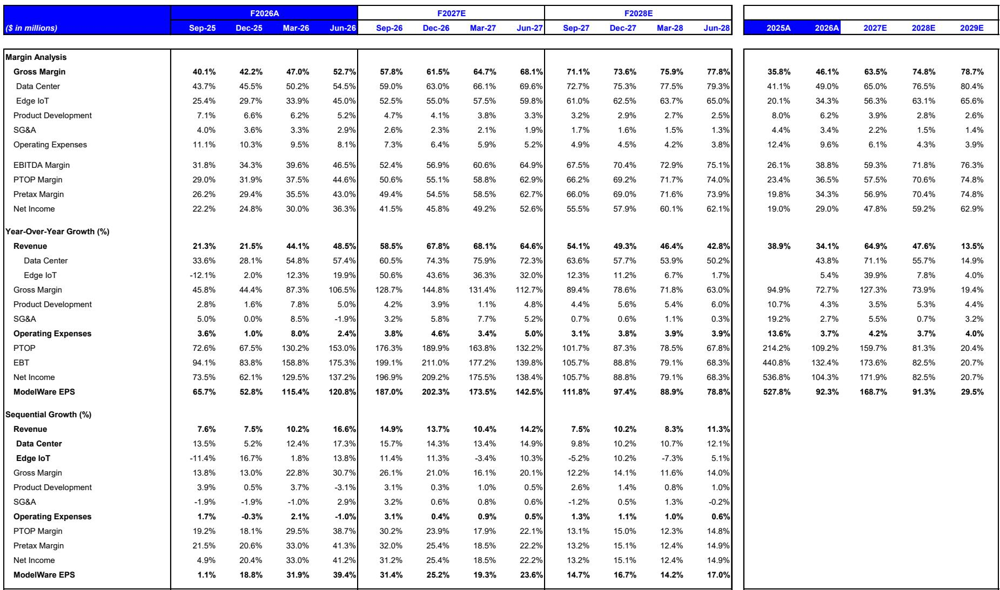

# MS：Seagate定价与需求可见性持续增强-F4Q26财报

这份由MS发布的Seagate Technology财报分析，核心判断是：硬盘驱动器（HDD）正从AI基础设施研究中展现出与其他细分市场不同的定价韧性和需求持续性。报告基于F4Q26（2026年6月季度）业绩和F1Q27（2026年9月季度）指引，认为定价是驱动收入、利润率、每股收益和自由现金流超预期的主要因素，且这一趋势尚未见顶。

报告特别指出，在AI资本支出相关板块普遍面临利率方向、信用利差和回报表现率质疑的背景下，HDD正表现出差异化特征。需求不仅呈现清晰的持续性信号，还在加速增长，这使Seagate有别于其他AI基础设施主题公司。

## 1. 需求可见性从时间与客户两个维度同时扩展

报告显示，Seagate的需求可见性正在发生两个方向的变化。时间维度上，公司已将其近线硬盘的大部分产能分配至2028年，而上一季度仅为“贯穿2027年”。部分客户正尝试将规划周期延伸至2029年及以后。客户维度上，需求来源正在拓宽：除了已有的云和企业基础设施，还出现了来自数据留存与复用、代理型AI工作负载、以及来自新云服务商、模型开发者、机器人/自主系统等物理AI应用的增量需求。

报告认为，AI正在成为更大的需求驱动因素，其特点是产生更多非结构化数据，这些数据随时间推移被创建、存储、复用并变现。供应端，Seagate未上调其混合驱动的25%近线EB年复合增长率指引，但强调该目标可在不增加单位产能的前提下实现。

> **KC评论：** 需求可见性从“贯穿2027年”延伸到“2028年”，这一变化虽看似只是时间推移，但结合客户类型从传统云向新云、模型开发者、机器人等领域的扩展，意味着HDD的需求基础正在从单一的数据中心建设周期，转向更广泛的数据生成与存储结构变化。

## 2. 定价成为季度超预期的主要驱动力

定价是本次财报最关键的变量。报告显示，Seagate的毛利率从上一季度的47.0%提升至6月季度的52.7%，而9月季度指引隐含毛利率约57.5%。管理层将这一改善归因于有利的定价、更强的产品组合、执行改善以及产品过渡期间的成本/良率表现。

报告特别澄清，9月季度的定价提升并非主要来自某一优惠客户HAMR价格到期的一次性收益——该部分在6月季度的量极小。更大的驱动力是广泛的需求强度，合同中的季度环比定价递增条款在增强，非近线产品的定价也在贡献，尤其是在与NAND价格上涨竞争的较低容量产品领域。

管理层重申，其定价策略在过去12-13个季度保持一致，但供需缺口正在扩大，增量产出正以有吸引力的价格被定价，客户在“追逐”额外容量。如果供需缺口继续扩大，Seagate预计将继续执行同样的向上偏好的定价策略。

## 3. 资本结构优化与股东回报框架正在重新排序

报告详细描述了Seagate的资本配置节奏。公司计划在9月季度减少约12亿美元债务，其中包括已在7月清偿的10亿美元高收益优先票据和剩余1.86亿美元可转债。管理层还指出，近期内还有一笔高息票据需要处理，可能在F2Q27或F3Q27完成。

更关键的是，管理层明确表示，一旦高成本债务工作基本完成，几乎所有自由现金流都将通过股息和回购返还给股东，其中“绝大部分”可能分配给回购。Seagate已在9月季度加大回购力度，并暗示读者应在F2H27看到进一步增加。与此同时，FY27的资本支出应保持在收入的4-6%模型内，季度运营支出保持约3亿美元水平，管理层预计全年将实现连续的利润率和现金流改善。

> **KC评论：** 资本配置的排序——先降杠杆、后加大回购——是理解Seagate未来几个季度股东回报节奏的关键。一旦高成本债务清理完毕，自由现金流几乎全部流向股东，这一框架意味着公司对自身现金流生成能力有较高信心。

## 4. 一个可复用的观察框架：从定价、需求可见性与利润率三个维度跟踪HDD周期

这份报告提供了一个可复用的分析框架。对于HDD行业，读者可以关注三个核心维度：定价趋势（季度环比定价递增幅度、合同条款变化）、需求可见性（产能分配覆盖的时间长度、客户类型多样性）、以及利润率结构（毛利率水平、增量利润率变化）。

报告显示，Seagate的增量利润率已从上一季度的72%提升至83%，毛利率从47.0%升至52.7%，9月季度指引进一步指向约57.5%。这些数字本身并不构成判断，但将它们与需求可见性扩展、定价趋势加速放在一起，可以形成一个关于周期持续性的观察框架。报告认为，一旦更广泛的市场担忧和AI资本支出板块的去杠杆化消退，HDD可能率先获得资金关注。

For informational purposes only. Portions may be generated,translated,summarized,or edited with AI assistance based on source materials and may contain omissions or errors. Please verify independently. This is not investment,legal,tax,accounting,or other professional advice.

For informational purposes only. Portions may be generated,translated,summarized,or edited with AI assistance based on source materials and may contain omissions or errors. Please verify independently. This is not investment,legal,tax,accounting,or other professional advice.

