# 中国互联网与新媒介

2026年7月29日

权益研究：互联网与新媒介

## 月度应用追踪 – 2026年6月

## 跨境电子商务在欧洲面临政策门槛提升

2026年6月，中国月度活跃智能手机用户同比增长1.2%，总月度使用时长同比增长10.1%  
2026年6月，中国月度活跃智能手机用户数同比增长1.2%至12.8亿。近几个月来，中国月度活跃智能手机用户数保持稳定。6月总月度使用时长同比增长8.6%，较2026年5月10.1%的同比增速有所放缓。

## 从面向消费者的AI聊天机器人转向企业级智能体

根据Questmobile数据，豆包（字节跳动旗下，未上市）在AI原生聊天机器人这一竞争激烈的领域中似乎进一步扩大了领先优势，其日活跃用户数环比增长6%，同比增长3.3倍，达到1.67亿。DeepSeek（未上市）排名第二，日活跃用户数为3240万，环比增长6%，同比增长1%。紧随其后的是阿里巴巴（BABA US，买入）的通义千问应用（同比增长84倍，环比增长5%，达到2930万）。据Questmobile数据，通义千问55%的用户似乎是轻度用户（日均使用时长<1分钟），6月该群体数量同比增长168倍。通义千问的重度用户（日均使用时长>1分钟）在6月占比45%，低于一年前的72%，该群体数量同比增长52倍。相比之下，豆包和DeepSeek的重度用户占比在6月分别为85%和81%，与一年前水平基本持平。因此，通义千问的每用户日均使用时长远低于豆包和DeepSeek。在中国AI原生聊天机器人中，DeepSeek在2026年6月实现了最高的每用户日均使用时长，为16.67分钟，同比增长65%。

随着中国主要AI平台将重心从面向消费者的AI转向面向企业的AI解决方案，我们预计AI聊天机器人领域的竞争将进一步降温，随之而来的是主要AI聊天机器人发布商的用户参与度增速放缓以及营销投入的减少。

## 腾讯元宝在企业级AI智能体平台中保持领先

根据第三方研究机构易观分析的数据，截至2026年6月，腾讯（700 HK，买入）的元宝仍是中国最受欢迎的桌面AI智能体平台，月度访问量激增至2100万（3月为885万）。字节跳动的TRAE IDE（国内版）排名第二，月度访问量为1279万（3月为334万），阿里巴巴的QoderWork紧随其后，访问量为788万（3月为215万）。

这表明，现阶段互联网巨头正利用其生态优势主导AI智能体平台市场。例如，它们的超级应用——包括办公和商业应用——作为即时通讯平台，可以无缝调用上述AI智能体，提升了用户的可及性。

在传统办公应用中，根据Questmobile数据，飞书（字节跳动旗下）在2026年6月展现出较强的日活跃用户增长，增幅达51%，这在一定程度上可能得益于其较小的用户基数——其日活跃用户数约为钉钉（阿里巴巴旗下）和企业微信（腾讯旗下）的12%-13%。此外，企业微信在6月保持了10%的稳健日活跃用户增长，进一步缩小了与钉钉的差距，后者日活跃用户同比持平。

## 抖声声与点平的日活跃用户差距正在缩小

2月，抖音生活服务推出了独立的本地生活服务应用“抖声声”。得益于抖音的流量支持，抖声声与点平应用（美团旗下，3690 HK，买入）之间的日活跃用户差距正在缩小。根据QuestMobile数据，点平应用的日活跃用户在6月环比下降2%至3200万，而抖声声的日活跃用户环比增长32%至2100万，相当于点平6月水平的65%，高于3月的15%。但在每用户日均使用时长方面，点平应用为8.3分钟（环比下降3%），远高于抖声声的4.5分钟（环比下降3%），这表明点平可能仍享有更高的用户参与度。

## 中国跨境电子商务平台在主要海外市场增速放缓

根据Sensor Tower数据，Temu（拼多多旗下，PDD US，中性）的全球月度活跃用户在2026年6月同比转为下降2%（2026年5月为同比增长2%），主要受拉丁美洲和欧洲月度活跃用户表现减弱所驱动，这抵消了其在美国的强劲增长（因一年前美国关税上调及进口政策变化导致的低基数）。QuestMobile数据也印证了这一趋势，显示Temu卖家端的日活跃用户在2026年6月同比下降11%。

类似地，Shein的全球月度活跃用户在2026年6月同比增速放缓至5%（2026年5月为同比增长14%），巴西和印度的强劲用户增长抵消了欧洲的下滑。

总体来看，Temu和Shein的全球用户基础似乎趋于稳定，但两者近期在欧洲市场均出现用户下降，该地区针对进口商品的监管收紧——包括取消低价值跨境商品的免税待遇以及引入额外关税——已于2026年7月1日正式生效。我们将密切关注这些中国跨境电子商务平台将如何平稳应对这些市场环境的变化。

## 中国主要应用概览

2026年6月，大部分流量由字节跳动、腾讯、百度（BIDU US，买入）和阿里巴巴旗下的应用主导。特别是，根据QuestMobile数据，字节跳动的应用在6月占据了月度活跃用户和时长份额前20名中的五个席位。腾讯的微信单月占据中国移动用户使用时长的19.3%份额，领先于紧随其后的两个应用——抖音和抖音极速版（均为字节跳动旗下，未上市），其时长份额分别为19%和6.3%。

图1：中国前20大应用，按月度活跃用户和时长划分 – 6月

<table><tr><td colspan="5">月度活跃用户前20大应用：月度活跃用户变化及渗透率</td></tr><tr><td>应用名称</td><td>排名 环比变化</td><td>渗透率</td><td>渗透率 同比</td><td>渗透率 环比</td></tr><tr><td>微信</td><td>-</td><td>90.0%</td><td>2.9ppt</td><td>0.0ppt</td></tr><tr><td>抖音</td><td>-</td><td>80.3%</td><td>8.1ppt</td><td>-0.1ppt</td></tr><tr><td>淘宝</td><td>-</td><td>76.7%</td><td>-0.6ppt</td><td>-0.4ppt</td></tr><tr><td>支付宝</td><td>-</td><td>74.3%</td><td>0.6ppt</td><td>0.7ppt</td></tr><tr><td>高德地图</td><td>-</td><td>71.2%</td><td>0.3ppt</td><td>-1.2ppt</td></tr><tr><td>拼多多</td><td>-</td><td>54.9%</td><td>-2.8ppt</td><td>-0.9ppt</td></tr><tr><td>搜狗输入法</td><td>-</td><td>54.5%</td><td>4.1ppt</td><td>0.1ppt</td></tr><tr><td>京东</td><td>-</td><td>52.7%</td><td>2.4ppt</td><td>2.0ppt</td></tr><tr><td>百度</td><td>-</td><td>50.0%</td><td>-5.3ppt</td><td>-0.7ppt</td></tr><tr><td>QQ</td><td>-</td><td>48.9%</td><td>-1.6ppt</td><td>-0.4ppt</td></tr><tr><td>百度地图</td><td>-</td><td>44.1%</td><td>-1.9ppt</td><td>-0.7ppt</td></tr><tr><td>美团</td><td>-</td><td>40.7%</td><td>0.3ppt</td><td>-0.3ppt</td></tr><tr><td>百度输入法</td><td></td><td>38.7%</td><td>-0.5ppt</td><td>0.0ppt</td></tr><tr><td>微博</td><td></td><td>38.6%</td><td>-0.3ppt</td><td>0.0ppt</td></tr><tr><td>快手</td><td>-</td><td>34.4%</td><td>-1.9ppt</td><td>-0.9ppt</td></tr><tr><td>豆包</td><td></td><td>29.8%</td><td>18.7ppt</td><td>1.0ppt</td></tr><tr><td>今日头条</td><td></td><td>29.1%</td><td>-2.2ppt</td><td>-0.8ppt</td></tr><tr><td>红果免费短剧</td><td>-</td><td>28.7%</td><td>12.0ppt</td><td>0.8ppt</td></tr><tr><td>QQ浏览器</td><td>-</td><td>26.1%</td><td>-7.4ppt</td><td>-0.7ppt</td></tr><tr><td>抖音极速版</td><td>-</td><td>25.7%</td><td>3.0ppt</td><td>-0.3ppt</td></tr></table>

来源：QuestMobile，NOM

<table><tr><td colspan="5">6月中国移动应用前20大时长份额</td></tr><tr><td>应用名称</td><td>排名 环比变化</td><td>时长份额</td><td>时长份额 同比</td><td>时长份额 环比</td></tr><tr><td>微信</td><td>-</td><td>19.3%</td><td>-1.3ppt</td><td>0.3ppt</td></tr><tr><td>抖音</td><td>-</td><td>19.0%</td><td>2.7ppt</td><td>0.3ppt</td></tr><tr><td>抖音极速版</td><td>-</td><td>6.3%</td><td>1.0ppt</td><td>0.0ppt</td></tr><tr><td>红果免费短剧</td><td>-</td><td>4.5%</td><td>2.5ppt</td><td>0.5ppt</td></tr><tr><td>快手</td><td>-</td><td>3.8%</td><td>-1.0ppt</td><td>-0.1ppt</td></tr><tr><td>搜狗输入法</td><td>-</td><td>3.1%</td><td>-0.1ppt</td><td>0.0ppt</td></tr><tr><td>今日头条</td><td>-</td><td>2.7%</td><td>-0.5ppt</td><td>-0.1ppt</td></tr><tr><td>小红书</td><td></td><td>2.3%</td><td>-0.1ppt</td><td>0.1ppt</td></tr><tr><td>快手极速版</td><td></td><td>2.3%</td><td>-0.4ppt</td><td>0.0ppt</td></tr><tr><td>拼多多</td><td></td><td>2.2%</td><td>-0.1ppt</td><td>-0.1ppt</td></tr><tr><td>番茄免费小说</td><td></td><td>1.9%</td><td>0.0ppt</td><td>0.0ppt</td></tr><tr><td>百度输入法</td><td></td><td>1.9%</td><td>-0.4ppt</td><td>-0.2ppt</td></tr><tr><td>微博</td><td></td><td>1.8%</td><td>-0.2ppt</td><td>-0.1ppt</td></tr><tr><td>淘宝</td><td>-</td><td>1.7%</td><td>-0.1ppt</td><td>-0.1ppt</td></tr><tr><td>哔哩哔哩</td><td>-</td><td>1.7%</td><td>0.0ppt</td><td>0.0ppt</td></tr><tr><td>百度</td><td></td><td>1.5%</td><td>-0.6ppt</td><td>-0.1ppt</td></tr><tr><td>新浪新闻</td><td></td><td>1.4%</td><td>-0.1ppt</td><td>-0.2ppt</td></tr><tr><td>支付宝</td><td></td><td>1.2%</td><td>0.1ppt</td><td>0.1ppt</td></tr><tr><td>王者荣耀</td><td></td><td>1.2%</td><td>0.1ppt</td><td>-0.1ppt</td></tr><tr><td>腾讯新闻</td><td>-</td><td>1.0%</td><td>-0.2ppt</td><td>-0.1ppt</td></tr></table>

在前50大应用中（占6月中国移动总使用时长的约93%），我们注意到字节跳动阵营的时长份额同比有所增长，从2025年6月的33.3%上升至2026年6月的40.1%，超过了腾讯阵营的29.7%。环比来看，字节跳动的时长份额上升了0.9个百分点。

图2：中国前50大应用中各互联网阵营的时长份额  
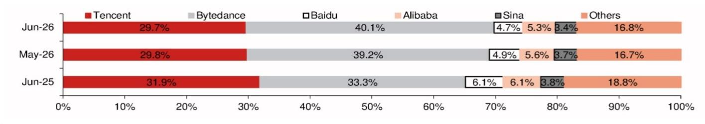  
来源：QuestMobile，NOM

## 长剧与短剧

长视频应用在6月表现平稳。腾讯视频（腾讯旗下）6月的总使用时长同比下降34%，受日活跃用户下降25%和每用户日均使用时长下降12%的影响。优酷（阿里巴巴旗下）/芒果TV（300413 CH，未评级）/爱奇艺（IQ US，中性）的总使用时长同比分别下降47%/3%/11%，主要受日活跃用户分别下降34%/9%/16%的影响。

领先的短剧应用——红果免费短剧（字节跳动旗下）——保持了强劲的增长趋势，总使用时长同比增长145%，得益于日活跃用户增长106%和每用户日均使用时长增长19%。

图3：长剧与短剧应用的日活跃用户  
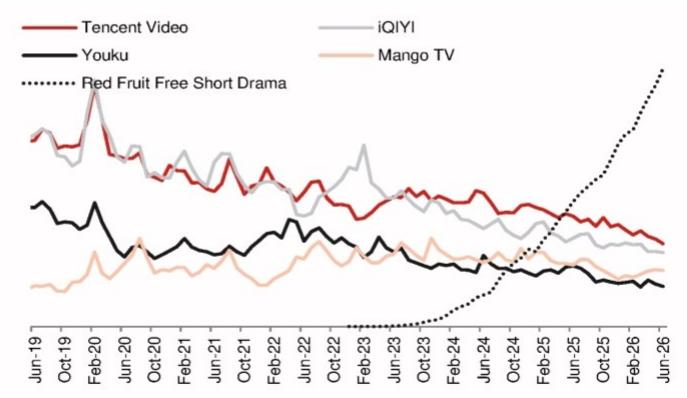  
来源：QuestMobile，NOM

图4：每用户日均使用时长  
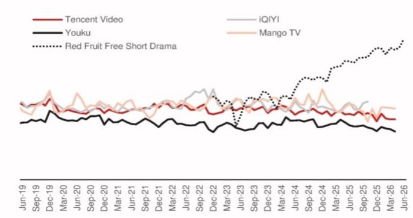  
来源：QuestMobile，NOM

## 短视频

6月，抖音在总使用时长方面保持了稳健的增长势头，同比增长27%，主要受日活跃用户增长20%的推动。哔哩哔哩（BILI US，中性）6月总使用时长同比增长7%，受日活跃用户同比增长5%和每用户日均使用时长增长3%的推动。然而，快手（1024 HK，中性）表现相对平稳，总使用时长同比下降14%，主要受每用户日均使用时长同比下降13%的影响。

图5：短视频应用的日活跃用户  
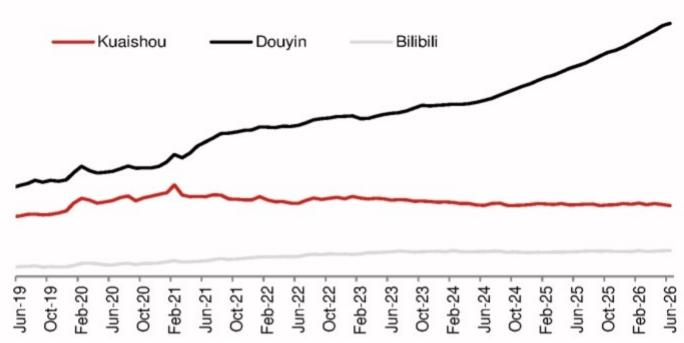  
来源：QuestMobile，NOM

图6：每用户日均使用时长  
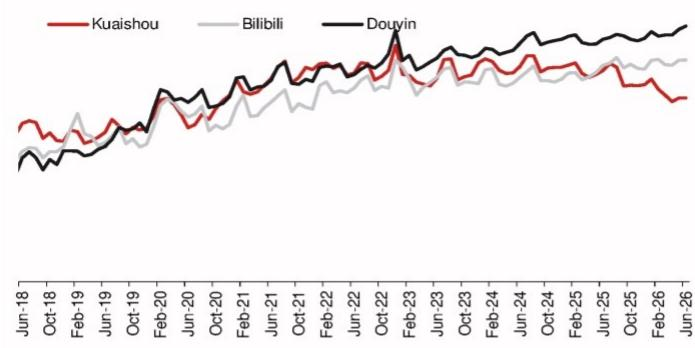  
来源：QuestMobile，NOM

## 在线阅读

免费阅读应用领头羊番茄免费小说（未上市；字节跳动旗下）的总使用时长在6月呈现增速放缓趋势，同比增长8%（2026年5月为12%），主要得益于日活跃用户同比增长8%。另一款免费阅读应用七猫免费小说（未上市）延续了下降趋势，总使用时长同比下降44%，受日活跃用户和每用户日均使用时长分别同比下降31%和20%的影响。

阅文集团（772 HK，买入）旗下的付费阅读应用，即起点读书和QQ阅读，用户参与度也表现平稳，6月日活跃用户同比分别下降8%和7%，每用户日均使用时长均同比下降10%。

图7：在线阅读平台的日活跃用户  
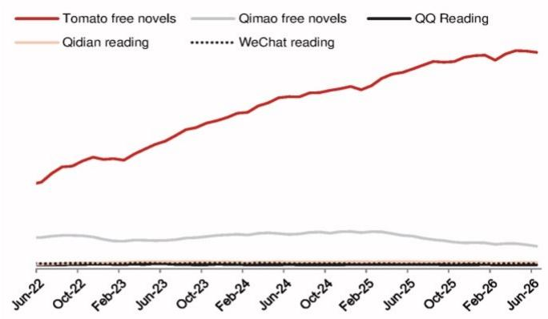  
来源：QuestMobile，NOM

图8：在线阅读平台每用户日均使用时长  
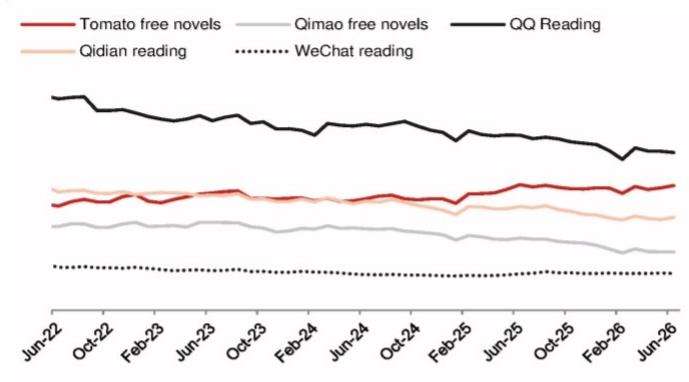  
来源：QuestMobile，NOM

## 直播

直播秀场应用在6月延续了总使用时长的同比下降趋势。然而，陌陌（MOMO US，未评级）的整体用户参与度相比YY（百度旗下）显得更具韧性。陌陌2026年6月总使用时长同比下降12%，主要由于日活跃用户下降11%。相比之下，YY的总使用时长同比下降17%，主要受每用户日均使用时长下降14%的影响。

图9：直播秀场应用的日活跃用户  
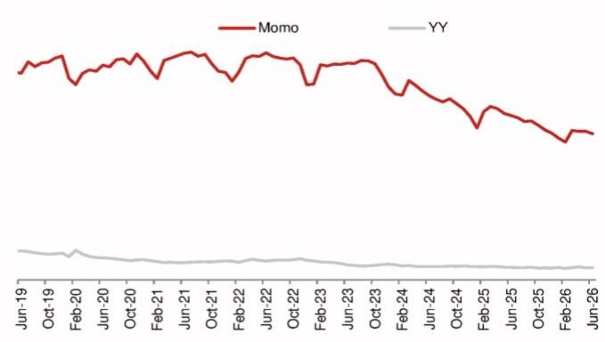

图10：每用户日均使用时长  
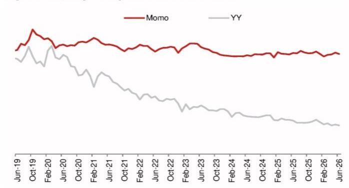  
来源：QuestMobile，NOM  
来源：QuestMobile，NOM

对于游戏直播应用，虎牙（HUYA US，未评级）6月总使用时长同比下降14%，主要受日活跃用户同比下降16%的影响。斗鱼（DOYU US，未评级）6月总使用时长同比下降2%，受日活跃用户同比下降12%的影响，但被每用户日均使用时长同比增长11%所部分抵消。

图11：游戏直播应用的日活跃用户  
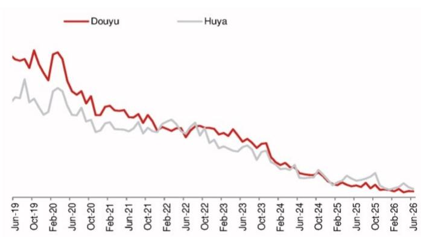  
来源：QuestMobile，NOM

图12：每用户日均使用时长  
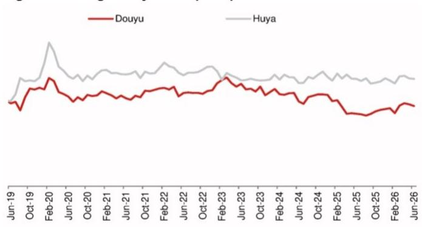  
来源：QuestMobile，NOM

## 音乐

音乐领域大部分应用的日活跃用户同比均呈下降趋势，但Soda Music和番茄畅听（均为字节跳动旗下）除外，两者在6月分别录得77%和43%的同比增长。面对新兴的Soda Music和番茄畅听的竞争，网易云音乐（9899 HK，未评级）用户规模保持相对稳定，6月日活跃用户同比增长1%。然而，腾讯音乐（TME US，买入）旗下的音乐应用，即QQ音乐/酷狗音乐/酷我音乐，正经历用户流失，6月日活跃用户同比分别下降5%/13%/14%（如图13所示）。

全民K歌的总使用时长延续同比下降趋势，6月同比下降22%，主要受日活跃用户同比下降28%的影响，但被每用户日均使用时长同比增长9%所部分抵消（如图14所示）。

图13：音乐流媒体应用的日活跃用户  
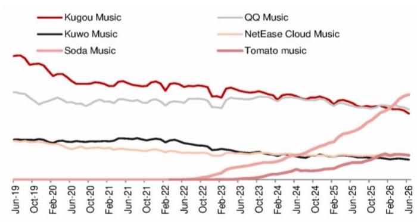  
来源：QuestMobile，NOM

图14：在线K歌应用的日活跃用户  
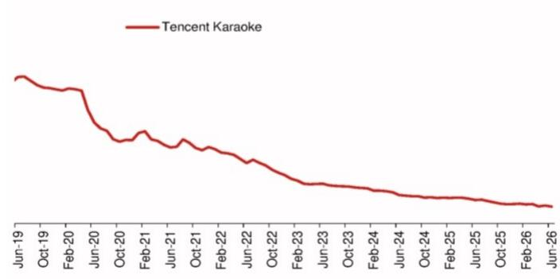  
来源：QuestMobile，NOM

## 社交

小红书（未上市）的总使用时长在6月恢复至同比增长3%，主要受日活跃用户同比增长4%的推动，我们认为这得益于其获得的2026年国际足联世界杯在中国的整理版在线转播权。微博（WB US，中性）6月总使用时长同比下降3%，受每用户日均使用时长下降3%的影响。在腾讯的社交生态系统中，QQ的总使用时长延续下降趋势，同比下降4%，而微信6月总使用时长同比增长2%。

图15：社交应用的日活跃用户  
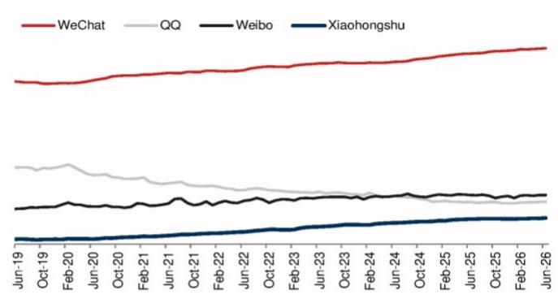  
来源：QuestMobile，NOM

图16：每用户日均使用时长  
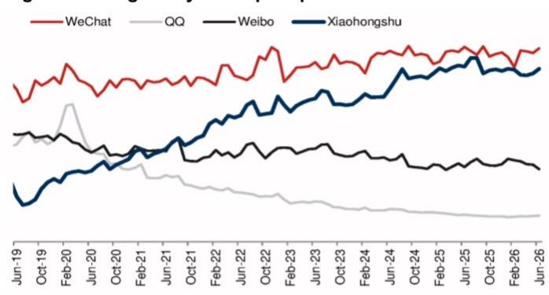  
来源：QuestMobile，NOM

## 办公应用

在办公应用垂直领域，飞书（字节跳动旗下）和企业微信（腾讯旗下）的日活跃用户在6月分别同比增长51%和10%，而钉钉（阿里巴巴旗下）同比持平。然而，钉钉拥有最大的日活跃用户基数，约为8200万，分别是企业微信和飞书的1.1倍和8.6倍。根据QuestMobile数据，飞书的每用户日均使用时长为14.5分钟（同比下降1%），其次是企业微信的12.2分钟（同比增长1%）和钉钉的10.0分钟（同比下降3%）。

图17：办公商务应用的日活跃用户  
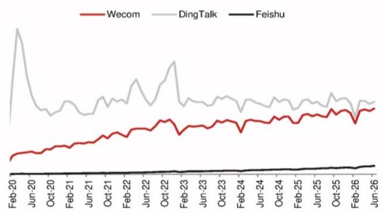  
来源：QuestMobile，NOM

图18：每用户日均使用时长  
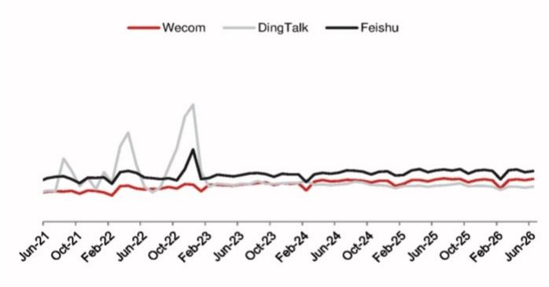  
来源：QuestMobile，NOM

## 搜索

百度应用尽管是中国占主导地位的搜索引擎，但6月总使用时长同比下降22%，主要受日活跃用户同比下降21%的影响。

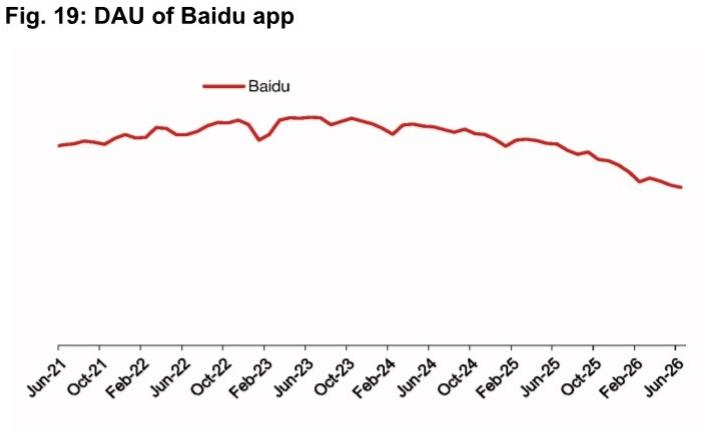  
来源：QuestMobile，NOM

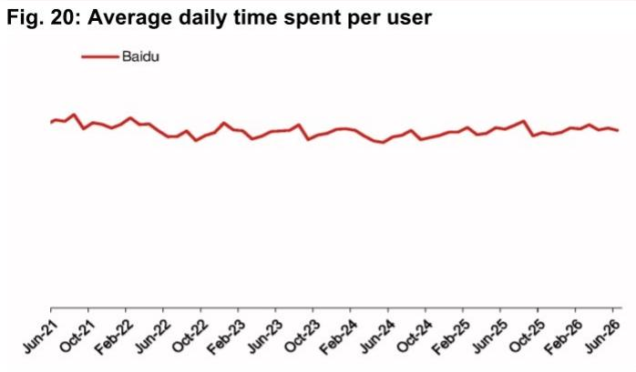  
来源：QuestMobile，NOM

## AI工具

根据QuestMobile数据，豆包（字节跳动旗下）的日活跃用户在6月排名第一，为1.67亿，同比增长3.3倍，环比增长6%。紧随其后的是夸克浏览器，为3400万（同比持平，环比增长4%），DeepSeek为3200万（同比增长1%，环比增长6%），以及通义千问（阿里巴巴旗下）为2900万（同比增长84倍，环比增长5%）。

在每用户日均使用时长方面，夸克浏览器在6月录得最高时长，为32分钟（同比下降1%，环比下降4%）。DeepSeek排名第二，为16.7分钟（同比增长65%，环比下降3%），其次是Kimi的12.4分钟（同比增长75%，环比增长8%），以及智谱清言的12.2分钟（同比增长71%，环比增长4%）。

图21：AI应用的日活跃用户  
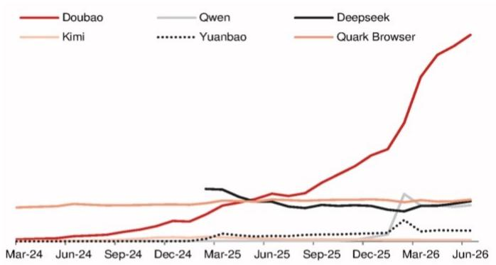  
来源：QuestMobile，NOM

图22：AI应用每用户日均使用时长  
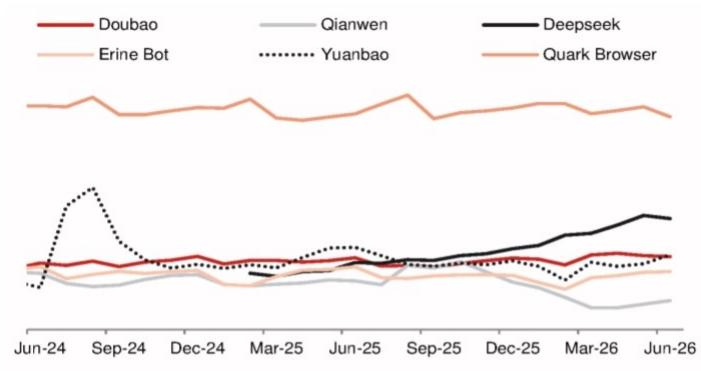  
来源：QuestMobile，NOM

## 在线旅行

在线旅行应用中，携程（TCOM US，中性）的国内应用携程旅行和去哪儿，以及飞猪（未上市，阿里巴巴旗下）在6月的总使用时长同比分别下降17%/11%/11%，主要受日活跃用户同比分别下降7%/10%/5%的影响。在每用户日均使用时长方面，携程旅行和飞猪在6月同比分别下降10%/7%，而去哪儿同比持平。

图23：在线旅行应用的日活跃用户  
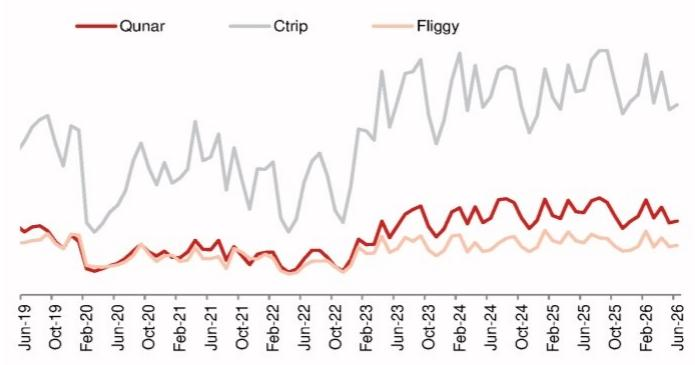  
来源：QuestMobile，NOM

图24：每用户日均使用时长  
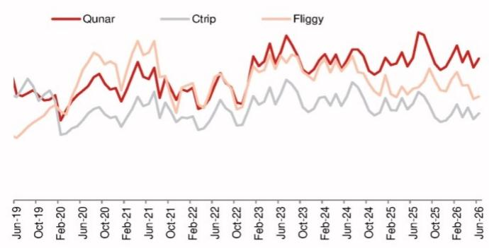  
来源：QuestMobile，NOM

## 电子商务

拼多多（PDD US，中性）应用和阿里巴巴的淘宝应用在用户数和总使用时长方面是排名前两位的电商应用。拼多多的日活跃用户在6月录得3%的同比增长，主要得益于轻度用户（日均使用时长<1分钟）数量同比增长20%，而重度用户（日均使用时长>1分钟）数量同比微降1%。然而，淘宝的日活跃用户同比下降2%，受重度用户数量下降4%的影响，但被轻度用户数量同比增长7%所部分抵消。同时，京东应用的日活跃用户同比下降2%，受重度用户数量同比下降11%的影响，但被轻度用户数量同比增长25%所部分抵消。

在每用户日均使用时长方面，淘宝和拼多多在6月分别实现2%/3%的同比增长，而京东应用录得5%的同比下降。

图25：中国电子商务应用的日活跃用户  
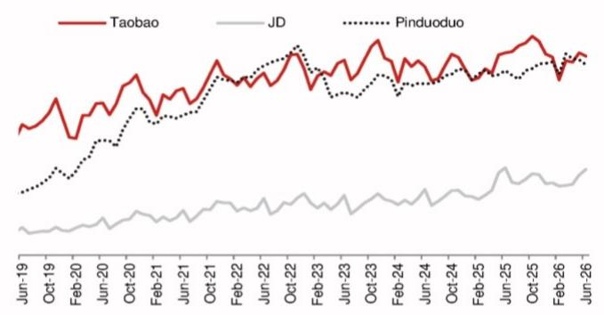  
来源：QuestMobile，NOM

图26：每用户日均使用时长  
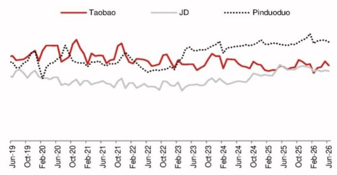  
来源：QuestMobile，NOM

图27：日均使用时长<1分钟的用户数  
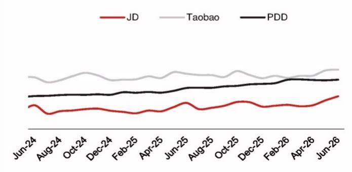  
来源：QuestMobile，NOM

图28：日均使用时长>1分钟的用户数  
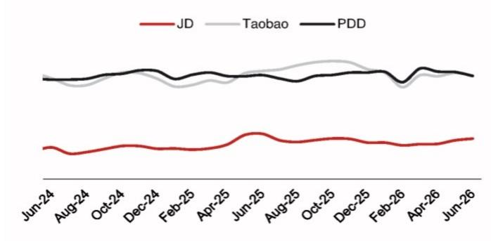  
来源：QuestMobile，NOM

## O2O

美团应用6月总使用时长同比下降8%，受每用户日均使用时长下降10%的影响，但被日活跃用户增长2%所部分抵消。点平应用（美团旗下）总使用时长同比下降5%，受每用户日均使用时长同比下降16%的影响，但被日活跃用户增长13%所部分抵消。

图29：美团和点平的日活跃用户  
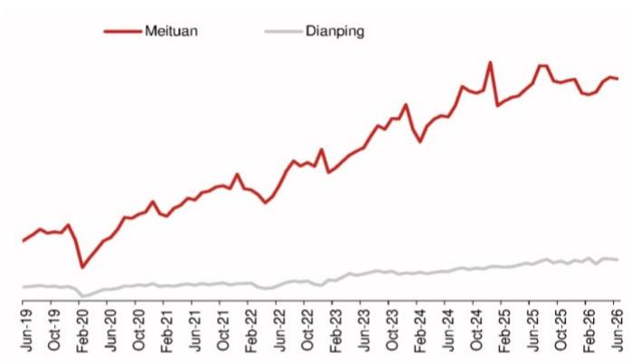  
来源：QuestMobile，NOM

图30：每用户日均使用时长  
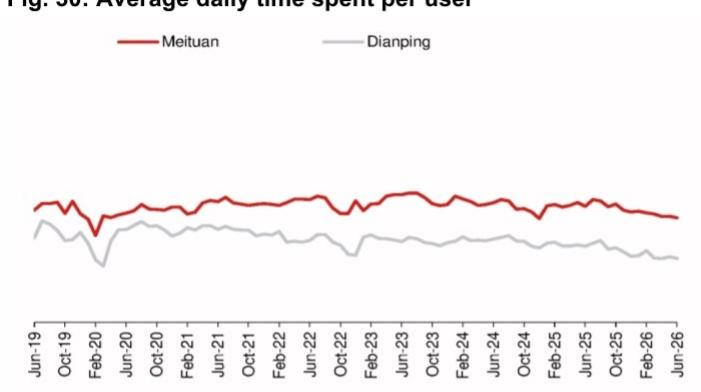  
来源：QuestMobile，NOM

## 手机地图应用

百度地图6月总使用时长同比下降14%，受每用户日均使用时长下降9%和日活跃用户下降6%的影响。高德地图（阿里巴巴旗下）6月总使用时长同比下降2%，受每用户日均使用时长同比下降4%的影响，但被日活跃用户同比增长2%所部分抵消。

图31：百度地图和高德地图的日活跃用户  
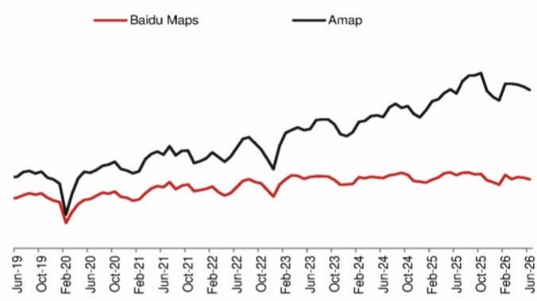  
来源：QuestMobile，NOM

图32：每用户日均使用时长  
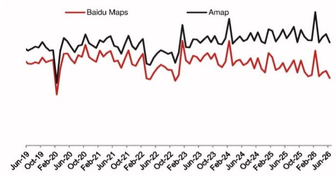  
来源：QuestMobile，NOM

## 数字货运应用

在货主端，运满满货主（满帮集团旗下，YMM US，买入）和货拉拉（未上市）的总使用时长同比分别增长16%和20%，主要受日活跃用户分别增长9%和11%的推动。货车帮货主（满帮集团旗下）6月同比持平，得益于每用户日均使用时长同比增长4%，但被日活跃用户同比下降4%所抵消。

在司机端，运满满司机（满帮集团旗下）6月总使用时长同比增长22%，主要受每用户日均使用时长增长17%的推动；货拉拉司机（未上市）总使用时长增长27%，主要得益于日活跃用户同比增长17%。而货车帮司机（满帮集团旗下）总使用时长同比持平，得益于每用户日均使用时长增长14%，但被日活跃用户同比下降12%所抵消。

图33：数字货运应用的日活跃用户  
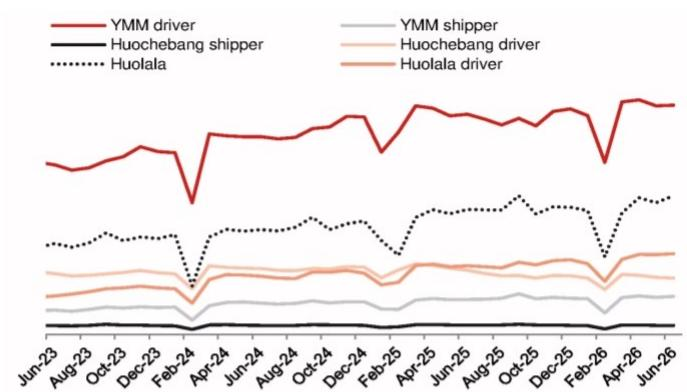  
来源：QuestMobile，NOM

图34：每用户日均使用时长  
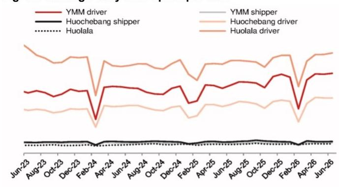  
来源：QuestMobile，NOM

## 在线招聘应用

BOSS直聘应用（看准科技旗下，BZ US，未评级），作为在线招聘行业的领先者之一，6月总使用时长同比增长7%，受日活跃用户同比增长11%的推动，但被每用户日均使用时长同比下降4%所部分抵消。然而，智联招聘（未上市）和前程无忧（未上市）6月总使用时长同比分别下降14%和13%，主要受每用户日均使用时长分别下降9%和14%的影响。

图35：在线招聘应用的日活跃用户  
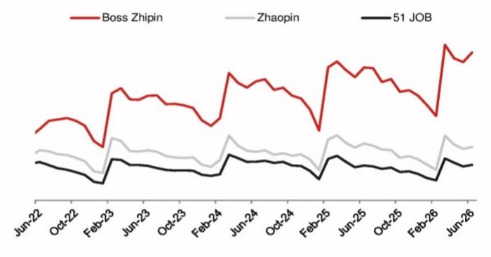  
来源：QuestMobile，NOM

图36：每用户日均使用时长  
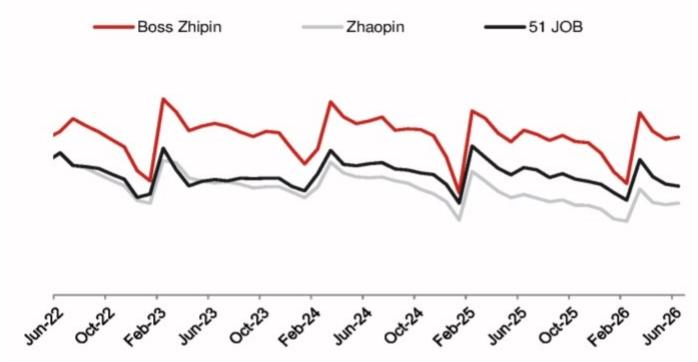  
来源：QuestMobile，NOM
