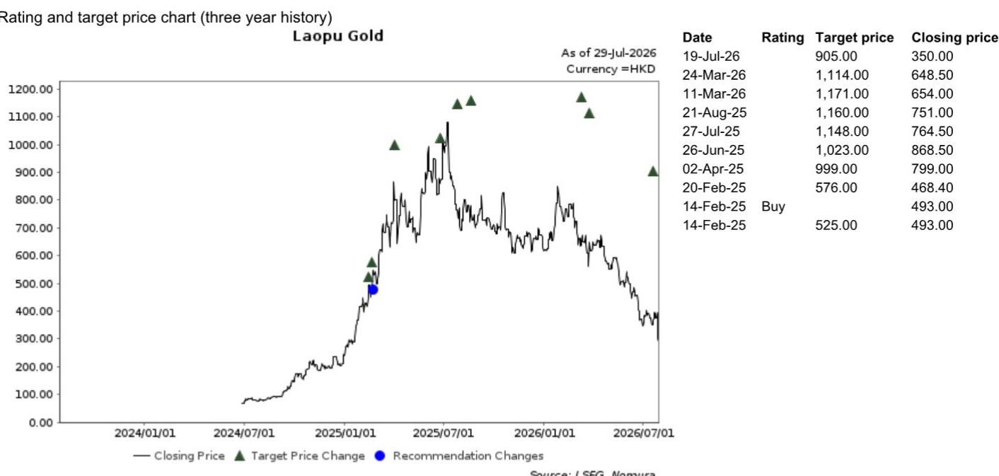

# Hermès 2026年第二季度业绩观察：中国高端市场呈现结构性分化

Hermès公布2026年第二季度营收为40.9亿欧元，按固定汇率计算同比增长6.7%，略高于彭博一致预期的40.7亿欧元。然而，在这一整体数据之下，存在一个值得关注的分化现象：亚太地区（不含日本）作为公司最大的区域收入来源（16.5亿欧元），同比仅增长2.5%，增速在所有主要市场中最低，约为市场普遍预期4.5%的一半。与此形成对比的是，美洲地区增长13.7%，日本增长12.3%。对于关注中国消费市场的观察者而言，这不仅是Hermès的单一数据点，更是一个信号：中国高端消费需求的结构性分化已到达一个关键节点，需要重新评估哪些公司可能受益，哪些则不然。

“中国高端消费整体放缓”这一传统叙事可能忽略了问题的本质。Hermès管理层在发布业绩时的评论提供了更精确的分析：高净值客户表现出韧性，而潜力型消费者则面临更多挑战。这不是需求的全面收缩，而是需求的分层重组，其影响波及整个高端消费生态，从皮具到珠宝再到腕表。对于观察者而言，问题不在于中国高端市场是否仍有增长空间，而在于当中间层消费收缩时，哪些商业模式能够持续发展。

## 亚太地区（不含日本）2.5%的增长并非偶然，而是高端需求向顶部集中的结构性信号

Hermès在2026年第二季度亚太地区（不含日本）2.5%的同比增长，是继第一季度2.2%增长后，该区域连续第二个季度增速低于3%。需要指出的是，该区域贡献了Hermès第二季度总营收的40%。如果这只是由宏观环境波动驱动的暂时性疲软，我们应能看到其他产品类别和区域也出现普遍回落。然而，美洲地区增速加快至13.7%，日本也录得12.3%的增长。这种分化是地域性的，而非类别性的。

产品层面的数据进一步印证了这一判断。皮具及马具作为Hermès核心且最具专属性的品类，第二季度同比增长10.2%。成衣及配饰作为价格区间更广、客户基础更宽的品类，仅增长3.6%。腕表品类在中国市场高度依赖潜力型消费和礼品需求，增长4.4%。模式一致：专属性和价格门槛越高，增长越强劲。这并非公司特有现象，而是反映了市场中顶层消费者持续支出，而次顶层消费者正在收缩的现实。

对于观察者而言，这意味着中国高端消费市场的整体数据可能具有误导性。一个持平或低个位数增长的总体数据，可能掩盖了高端市场10%的增长和中间市场中等个位数的下滑。依赖广泛客户金字塔的公司将面临利润压力和库存风险。而那些围绕超高净值人群构建商业模式的公司，则可能展现出与宏观叙事看似矛盾的韧性。

## Hermès管理层评论确认分化：高净值客户稳健，潜力型客户面临挑战

Hermès管理层对“高净值”与“潜力型”客户的区分，并非模糊的定性观察，而是理解公司当前表现和未来策略的核心框架。管理层明确指出，采用高端材质的产品系列（如珠宝和成衣）表现良好。这些正是吸引成熟高净值客户的品类，他们对宏观环境波动较不敏感，更关注工艺、稀缺性和品牌传承。

相比之下，潜力型客户是入门级皮具、丝巾和香水等品类销量的主要驱动力。香水及美妆作为该群体最容易接触的品类，第二季度同比下滑9.5%。这并非巧合。当潜力型消费者面临经济不确定性时，他们会推迟非必需品的购买，尤其是在品牌专属感在入门级产品中不那么突出的品类。香水及美妆9.5%的下滑，是这一动态在Hermès数据中最直接的量化体现。

对于观察者而言，这种分化具有直接的组合启示。那些收入结构严重依赖入门级高端产品、可接受定价和广泛分销的公司，在中国面临的需求环境比那些客户群集中在顶层1%消费者的公司更具挑战。问题不在于中国消费者是否会整体回归高端消费，而在于哪个细分市场会回归以及何时回归。Hermès的数据表明，高净值细分市场从未离开。

## 中国高端市场仍有结构性增长空间，但仅限于已占据超高净值人群的品牌

报告中“中国高端消费细分市场仍有结构性增长空间”的结论，与2.5%的增长数据并不矛盾。这是一个关于市场长期潜力的前瞻性表述，但前提是拥有正确的商业模式。中国超高净值人群的数量和消费能力持续增长，这得益于科技、金融和特定工业领域财富的集中创造。这些消费者并非在消费降级，而是在其偏好的品牌内进行消费升级，寻求更高价位、更具专属性的产品以巩固其地位。

因此，结构性增长机会并非均匀分布。它不成比例地流向那些已在该群体中确立不可或缺地位信号的品牌。Hermès是其中之一，但其在亚太地区（不含日本）2.5%的增长表明，即使是它也感受到了潜力型消费者缺席带来的影响。区别在于，Hermès能够吸收这种影响，因为其高净值客户群提供了收入底线。缺乏这一底线的品牌则面临更不稳定的处境。

报告中重申对老铺黄金（一家专注于高端黄金珠宝的香港上市珠宝商）的偏好，与此逻辑一致。老铺黄金处于两大趋势的交汇点：中国消费者对黄金作为价值储存手段的文化偏好，以及高净值消费者对工艺驱动型高端产品的需求。其商业模式不依赖潜力型消费者的销量，而是依赖相对较小的高净值客户群的重复购买，这些客户将黄金珠宝视为装饰品和投资品。在潜力型需求疲软的市场中，这种模式提供了更广泛分销的高端品牌无法比拟的缓冲。

## 观察框架：将每项高端消费持仓与高净值/潜力型收入划分对应

Hermès 2026年第二季度业绩不仅提供了一个数据点，还提供了一个系统性观察框架。观察者应依据三个标准，评估其投资组合中每项与中国市场相关的高端消费或可选消费持仓。

第一，公司来自中国的收入中，有多大比例来自定价高于有效排除潜力型消费者门槛的产品？对于Hermès，该门槛大致是皮具的入门价格，从数千美元起步。对于老铺黄金这样的品牌，门槛是每克黄金价格加上工艺溢价。对于大众市场高端品牌，门槛可能低得多，这意味着更大比例的收入容易受到潜力型消费收缩的影响。

第二，公司同店销售增长与消费者信心或GDP增长等宏观指标的历史相关性如何？与宏观指标相关性低的品牌，其客户群可能足够富裕，具有逆周期性。高相关性则暗示脆弱性。

第三，公司是否拥有定价权，使其能够在不大幅流失核心客户的情况下提价？Hermès管理层指出，2027年预计价格涨幅将略低于2026年水平，预算流程仍在进行中。这表明即使是Hermès也在谨慎调整其定价策略。但它能够提价，并且皮具品类仍实现10.2%的增长，这本身就是大多数品牌不具备的定价权的证据。

应用这一框架，启示是明确的：优先考虑收入集中在高净值细分市场、增长由结构性而非周期性因素驱动、且定价权已由实际收入数据验证的公司。避免那些中国战略依赖潜力型消费者销量增长的公司，因为该细分市场正显示出明显的压力迹象。

## 2.5%的增长率是更广泛中国可选消费主题的预警信号

有一种倾向将Hermès亚太地区（不含日本）2.5%的增长视为单一公司数据点，由特定产品周期或区域旅游模式驱动。这可能是误判。Hermès是全球利润率结构和品牌价值最具韧性的高端品牌。如果其在中国市场的增长放缓至2.5%，那么对于定位较弱的品牌而言，影响将更为严重。

香水及美妆9.5%的下滑、成衣3.6%的增长以及腕表4.4%的增长并非随机波动。它们形成了一致的模式：一个品类越依赖首次或偶发性高端消费者，其表现就越差。这是更广泛中国可选消费市场的缩影——疫情后的消费热潮已让位于除最富裕群体外所有消费者更挑剔、更注重价值、更规避风险的行为。

对于那些一直等待中国高端消费“复苏”的观察者而言，Hermès的数据提供了一个现实检验。复苏（如果到来）不会惠及所有品牌。它只会惠及那些已证明能够驾驭当前分化的品牌。报告中指出的结构性增长空间是真实的，但它是狭窄的。它存在于金字塔的顶端，并且属于那些已在此占据一席之地的品牌。

*仅供参考。部分内容可能基于源材料通过AI辅助生成、翻译、摘要或编辑，可能存在遗漏或错误。请独立核实。本文不构成任何专业建议。*

仅供参考。部分内容可能基于源材料通过AI辅助生成、翻译、摘要或编辑，可能存在遗漏或错误。请独立核实。本文不构成任何专业建议。

