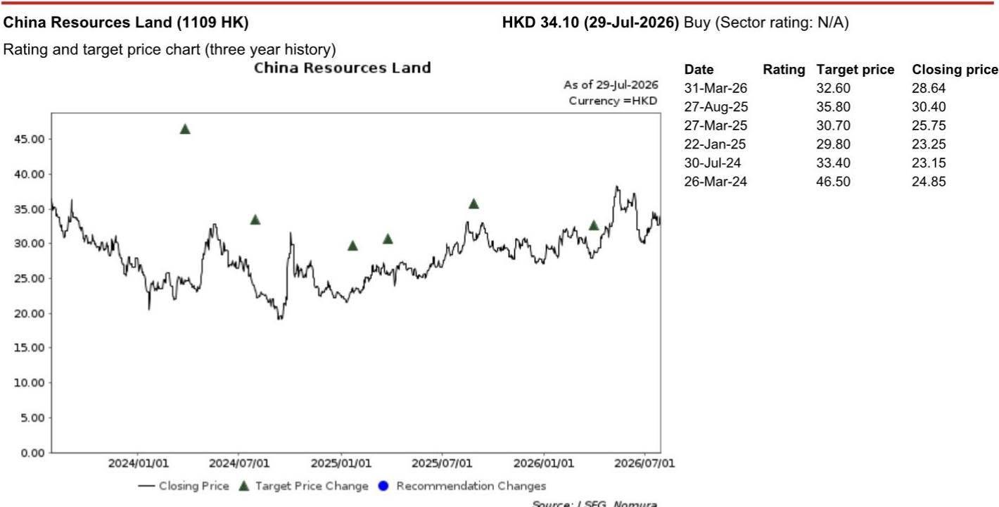
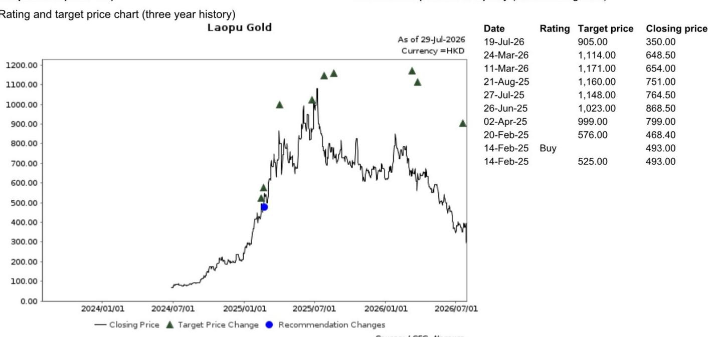

# NOM：中国消费-开云集团2Q26业绩解读

开云集团2026年第二季度业绩提供了中国消费市场的最新信号。这家拥有古驰等品牌的法国集团在7月28日发布1H26财报：第二季度集团可比收入同比增长2%，达到36.5亿欧元，略高于彭博一致预期的36.2亿欧元。核心品牌古驰的可比收入降幅从一季度的8%收窄至二季度的2%，管理层称中国大陆市场“仍在调整中”，尽管二季度出现逐步改善。这份NOM研报同时指出，中国消费趋势展现出显著的结构性增长潜力，并重申对华润置地和老铺黄金的偏好。

## 1. 亚太地区收入降幅收窄至-1%，韩国市场表现突出

按区域看，开云二季度零售收入增速在北美、日本、亚太（除日本）和西欧分别达到+10%、+9%、-1%和-1%，相比一季度的+9%、-3%、-4%和-7%均有改善。管理层在业绩会上表示，中国大陆市场情绪在二季度仍在调整，但亚洲其他地区（尤其是韩国）交出令人鼓舞的表现。亚太地区整体收入降幅从一季度的-4%收窄至-1%，是本次财报中值得关注的变化。

> **KC评论：** 亚太地区收入降幅收窄至-1%，但中国大陆与韩国之间的分化在加大。如果只看亚太整体数字，容易忽略中国大陆市场仍在调整这一事实。报告没有给出韩国具体增速，但管理层明确将其列为“令人鼓舞”的区域。

## 2. 中国消费者行为正在发生结构性转变

管理层在业绩会上描述了三个变化方向：中国消费者变得更挑剔、更注重体验、更倾向于本地偏好。开云正在调整组织架构，将全球团队的战略视野与区域团队的本地洞察相结合，重点在产品开发、传播、营销和零售四个领域提升对中国市场的针对性。这种调整本身说明，国际集团已经意识到过去“全球统一策略”在中国市场不再有效。

NOM在6月的渠道调研中也印证了这一趋势：古驰在中国高端购物中心的销售降幅在5月环比4月有所收窄，但仍处于节奏变化通道。报告认为，中国消费趋势展现出“显著的结构性增长潜力”，但短期恢复路径仍在变化中。

## 3. 批发渠道增速节奏变化，直营零售改善明显

渠道数据提供了另一个观察角度。开云二季度直营零售（含电商）收入同比增长2%，较一季度的-2%明显改善；而批发渠道收入同比增长3%，较一季度的+6%有所节奏变化。批发渠道增速回落可能意味着品牌对渠道库存的控制正在收紧，或者经销商对补货持更谨慎态度。直营零售的改善则更多反映终端需求的边际修复，尤其是在北美和西欧市场，管理层提到新系列持续获得客户认可，VIC和核心客户均实现稳健增长。

## 4. 可复用的观察框架：从单一品牌数据看行业信号

这份报告提供了一个实用的分析框架：单个集团的季度数据，如果结合渠道调研和区域拆解，可以成为判断中国高端消费趋势的领先指标。具体来说，关注三个维度——核心品牌（如古驰）的可比收入变化趋势、亚太地区（除日本）与中国大陆之间的增速差、以及直营与批发渠道的增速对比。这三个指标组合在一起，比单一的总收入数字更能反映消费信心的真实走向。

NOM在报告中维持对华润置地和老铺黄金的积极看法，认为中国消费的结构性增长潜力仍然存在，但短期需要关注宏观环境和消费信心恢复的节奏。

For informational purposes only. Portions may be generated,translated,summarized,or edited with AI assistance based on source materials and may contain omissions or errors. Please verify independently. This is not investment,legal,tax,accounting,or other professional advice.

For informational purposes only. Portions may be generated,translated,summarized,or edited with AI assistance based on source materials and may contain omissions or errors. Please verify independently. This is not investment,legal,tax,accounting,or other professional advice.

