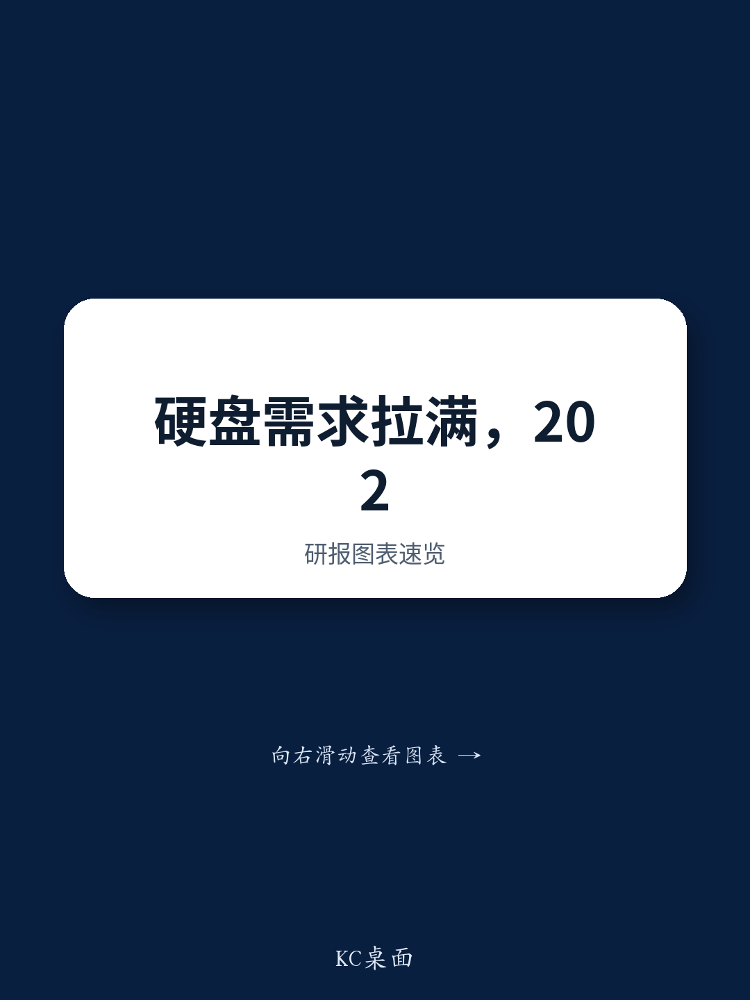

# NOM：6财年Q4营收36.29亿美元

Seagate Technology 7月29日公布的26/6财年第四季度业绩，释放了一个信号：企业级机械硬盘的供需紧张程度，可能比市场此前预期的更深、更持久。这家美国公司当季实现营收36.29亿美元，环比增长17%，营业利润率44.6%，均超出彭博一致预期。更值得关注的是其27/6财年第一季度指引——营收中值41亿美元（环比增长13%），营业利润率约50%，同样大幅高于市场预测。业绩公布后，公司报价在盘后交易中上涨近8%。

NOM日本工业电子团队在快速点评中指出，Seagate在业绩说明会上对需求强度表达了信心。这种信心并非空谈，而是有具体的订单可见度支撑。

> **KC评论：** 机械硬盘行业通常以季度为周期滚动接单，Seagate能将供应锁定到2028年，说明下游云服务商的采购周期已经从“按需补货”转向“长期锁定产能”。这对整个存储供应链的定价权和产能规划都有参考意义。

## 1. 近线HDD供应已分配至2028年，2029年合同谈判启动

Seagate在说明会上透露，几乎全部近线HDD在2028日历年的供应已被客户分配完毕。客户不仅没有缩短采购计划，反而已经开始就2029年及以后的合同进行谈判。这一时间跨度在机械硬盘行业并不常见，通常客户只会提前12-18个月锁定产能。NOM分析师认为，这反映出AI训练和云服务商对高容量存储的长期需求正在重塑传统的采购模式。

## 2. 出货量增速远超长期目标，但公司仍保持产能扩张克制

尽管近线HDD出货量在26/6财年第三和第四季度均实现超过40%的同比增长，Seagate仍将未来几年的出货量年复合增长率目标维持在约25%。公司明确表示，将通过技术迁移（而非增加驱动器数量）来提升出货能力，但同时也指出，根据良率和认证进展，实际出货能力可能超出当前目标。这种“目标保守、实际可能更积极”的表述，暗示公司对技术路线和产能爬坡有一定把握，但不愿在公开指引中过度承诺。

## 3. 每Exabyte价格同比上涨超10%，毛利率预计继续改善

在问答环节，Seagate被问及每Exabyte价格在第四季度同比上涨超过10%的现象——此前市场假设仅为中高个位数增长。公司回应称，这反映了当前的供需平衡状况，并预计价格和毛利率将在未来几个季度持续改善。NOM分析师注意到，这一价格走势与公司此前对“价格温和上涨”的预期存在明显偏差，实际涨幅已超出历史区间。

> **KC评论：** 每Exabyte价格是衡量HDD行业定价能力的核心指标。Seagate的表述意味着，即便出货量增速节奏变化，价格端的贡献仍可能支撑收入增长。读者在评估存储类公司时，可以同时关注“量”和“价”两个维度，而非只看出货量增速。

## 4. 一个可复用的观察框架：从“供应锁定周期”判断行业景气度

Seagate这份财报提供了一个观察存储行业供需格局的框架：当客户开始提前2-3年锁定供应，并主动启动更远期合同谈判时，说明下游需求已从“可替代”变为“必须保障”。这一信号比单季度的营收或出货量数据更具前瞻性。对于关注存储产业链的读者，可以跟踪主要HDD和NAND厂商的“在手订单覆盖周期”和“客户合同谈判时间窗口”两个指标，来判断行业景气度的持续性。

For informational purposes only. Portions may be generated,translated,summarized,or edited with AI assistance based on source materials and may contain omissions or errors. Please verify independently. This is not investment,legal,tax,accounting,or other professional advice.

