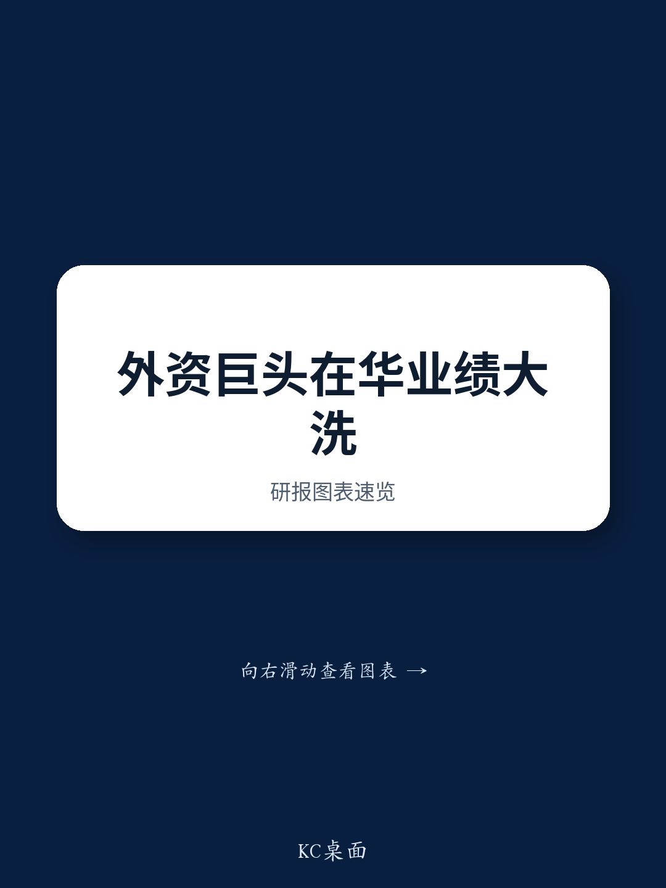

# 中国医疗健康市场：从单一增长到结构性分化

2026年第二季度，跨国医疗健康与制药公司的业绩报告揭示了一个不再同步运行的市场。阿斯利康中国区销售额同比下降7%至15.9亿美元，而诺华在同一地区实现了12%的增长。罗氏中国制药业务收入下降33%，但赛默飞世尔报告了低个位数的增长恢复。这并非周期性下行或统一政策冲击，而是一种由三种不同力量驱动的结构性分化：集中带量采购（VBP）的不均衡影响、创新与成熟产品组合之间的加速分化，以及诊断与生命科学工具市场双速格局的出现。

对于正在为中国配置资源的管理者而言，过去那种认为中国是一个广阔、整体上升市场的假设已不再成立。近期一份研究报告中汇编的八家跨国公司的数据清楚地表明，业绩表现现在取决于公司具体的产品组合、对政府定价机制的暴露程度，以及应对不断演变的采购环境的能力。中国市场并未萎缩，但正在沿着需要更精细化战略的方向分化。

## VBP影响并非统一：创新者与仿制药密集组合的分化

集中带量采购一直是跨国公司在业绩电话会议中提及最多的不利因素，但其影响因公司而异。阿斯利康的中国收入曾占其全球销售额约20%，现在降至10%，其将7%的下降直接归因于VBP对其成熟产品组合的持续压力。罗氏中国制药业务33%的下降和诊断业务15%的下滑同样与医疗定价改革有关。雅培的诊断业务也将VBP列为主要拖累因素，管理层预计2026年下半年将出现温和的中个位数下降。

然而，诺华报告了12%的中国销售增长，提供了对比鲜明的叙事。其增长由Leqvio驱动，该药物被纳入国家医保药品目录（NRDL）后，市场份额相比纳入前翻了一番。这一增长抵消了Cosentyx在竞争加剧下的下滑。模式很明确：VBP和NRDL并非同义词。VBP针对成熟、专利过期的药物和商品化诊断产品，采取激进的价格削减。NRDL纳入虽然也涉及价格谈判，但可以为满足未满足需求的创新疗法解锁销量增长。那些中国产品组合偏向老产品的公司正受到挤压；而那些能够通过NRDL准入推出新药的公司则找到了增长杠杆。

对战略的影响是直接的。跨国公司必须对其在中国的产品组合进行逐一审计，区分面临近期VBP风险的产品和有资格通过NRDL实现销量增长的产品。单一的中国战略已经过时。需要的是双轨方法：一条是通过成本优化和供应链本地化管理成熟资产的衰退，另一条是加速下一代疗法的推出和NRDL申报。

## 创新管线在中国得到验证，而不仅仅是开发

季度业绩中第二个不太明显的模式是，中国已不仅仅是跨国公司的商业市场；它正成为其最重要管线资产临床验证的关键地点。阿斯利康强调，其从中国生物技术公司科济药业和乐普生物引进的Claudin 18.2 ADC药物sonesitatug vedotin，在晚期胃癌的III期结果中显示出积极的总生存期数据。葛兰素史克指出，其合作伙伴翰森制药的B7-H3 ADC药物ris-rez在二线小细胞肺癌中的III期研究达到了主要终点，数据预计在2026年底公布。

这些并非次要的管线填充物。Claudin 18.2和B7-H3是肿瘤学领域竞争最激烈的靶点之一，基于中国的III期阳性数据为这些项目赋予了全球可信度。对葛兰素史克而言，ris-rez数据支持其计划在2026年启动肺癌和前列腺癌的额外III期研究。对阿斯利康来说，sonesitatug vedotin的结果巩固了其在胃癌领域的地位，这是一种在亚洲高发的疾病。

战略信息有两点。首先，从中国生物技术公司引进许可不再是一种成本节约策略；它是差异化、具有全球竞争力资产的来源。其次，中国的监管和临床基础设施已经成熟到这样的程度：在那里产生的III期数据被接受为全球注册的关键依据。缺乏系统性中国创新探索和合作功能的跨国公司处于竞争劣势。那些仅将中国视为销售区域的公司，正在错失共同开发能够推动全球增长的资产的机会。

## 诊断与生命科学工具正在复苏，但轨迹与制药不同

诊断与生命科学工具领域，包括赛默飞世尔、丹纳赫、罗氏诊断和龙沙等公司，讲述了一个比制药领域更微妙的叙事。赛默飞世尔报告称，第二季度中国销售恢复低个位数增长，生命科学解决方案收入同比增长14%，生物制药服务增长12%。丹纳赫实现了中个位数的中国增长，得益于稳健的生物技术板块销售和诊断业务的环比改善。纯CDMO公司龙沙的销售额增长16%，其所有三个业务板块——综合生物制剂、高级合成和特殊模式——均实现两位数增长。

然而，罗氏诊断继续下滑，第二季度销售额下降15%，尽管较第一季度21%的降幅有所改善。雅培的诊断业务也仍面临VBP压力。这里的分化并非随机。那些暴露于生物制药研发支出和生物技术需求的公司，正受益于活跃的创新周期。赛默飞世尔的管理层明确提到，制药和生物技术客户需求强劲，而学术和政府客户需求疲弱。丹纳赫的生物技术板块推动了其复苏。龙沙的CDMO模式直接与生物制剂制造的外包挂钩，这在全球范围内仍然强劲。

这种模式表明，中国的诊断和工具市场正在分裂为两个子市场。第一个是商业诊断市场，面临医院采购改革、VBP式定价和政府紧缩政策。第二个是研发和生物制造供应市场，由国内外药物开发商的创新管线驱动。对于后一类公司，中国仍然是一个增长故事。对于前一类公司，复苏之路取决于定价改革的稳定，丹纳赫预计这将在2026年下半年有所缓解。

## 跨国公司的决策框架：确定中国战略的三个问题

本季度的业绩证据指向一个单一的战略要务：跨国公司必须停止将中国视为一个单一市场，而是沿着三个维度对其暴露进行细分。第一个维度是产品生命周期。成熟、专利过期的产品面临VBP驱动的侵蚀，且不太可能逆转。公司应规划有管理的衰退，降低成本结构，将资源转向新产品的推出。第二个维度是治疗创新。解决高未满足需求并能获得NRDL纳入的产品提供销量驱动的增长，但前提是公司拥有执行快速推出的监管和商业基础设施。第三个维度是客户类型。在诊断和工具领域，暴露于生物制药研发客户是顺风；暴露于医院和政府采购是逆风。

该框架表明，没有单一的地理战略——无论是完全退出中国还是统一扩张——是正确的。相反，跨国公司内的每个业务单元都应针对这三个维度进行评估，资源分配应随之进行。例如，一家拥有强大ADC资产管线但成熟仿制药组合薄弱的公司，应增加在中国的临床开发和NRDL申报投入，同时剥离或授权许可成熟产品。一家医院暴露度高的诊断公司应专注于成本效率并等待政策稳定，而一家CDMO则应继续扩大产能。

第二层含义是，未来三到五年在中国的赢家将不是那些拥有最大现有市场份额的公司。它们将是那些能够最有效地管理从广泛市场向细分市场过渡的公司，将资本和人才重新配置到VBP和NRDL动态所创造的增长领域。

*仅供参考。部分内容可能基于源材料通过AI辅助生成、翻译、总结或编辑，可能存在遗漏或错误。请独立核实。本文不构成任何专业建议。*

仅供参考。部分内容可能基于源材料通过AI辅助生成、翻译、总结或编辑，可能存在遗漏或错误。请独立核实。本文不构成任何专业建议。

