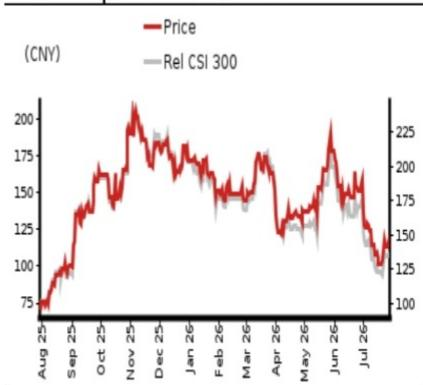
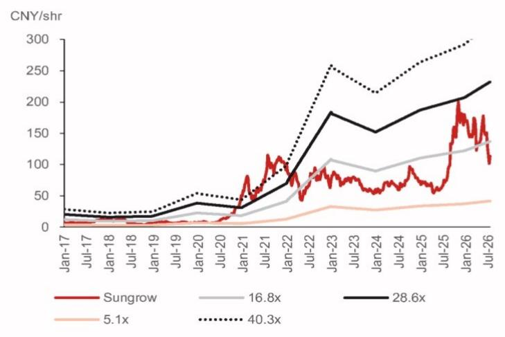
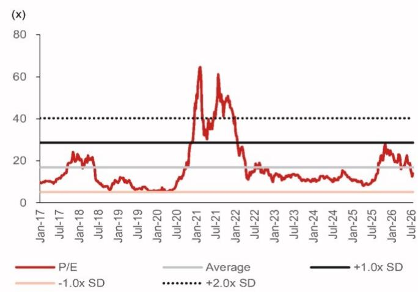

# FCC covered list likely caps US growth

## Grandfathering cushions 2026F, but frozen model pipeline erodes competitiveness into 2027F and beyond

FCC adds foreign-produced inverters to Covered List, effective immediately

The FCC (Federal Communications Commission) Public Safety and Homeland Security Bureau released Public Notice DA 26-786 on 28 July 2026, adding foreign-produced power inverters to the Covered List. The determination defines a power inverter on "two limbs": i) a bi-directional DC/AC conversion device, explicitly including micro-inverters, string, central and hybrid battery-based inverters; and ii) contains components enabling remote communication, control, sensing, data collection or monitoring via Wi-Fi, cellular or Bluetooth. In our view, the product portfolio of Sungrow likely falls within the defined scope, and the explicit naming of hybrid battery-based inverters likely brings storage PCS (power conversion system) into the perimeter. Critically, "foreign-produced" is defined by reference to 48 CFR §25.101(a), the Buy American "domestic end product" test, rather than country-of-origin rules; hence, third-country capacity therefore does not qualify.

Frozen model pipeline near term; SST and margins worth monitoring long term

In the near term, the closure of the new-model certification pathway is one binding constraint, which we expect to erode product competitiveness as the range of inverters ages. In addition, we also see impairment risk to overseas capacity built on a third-country strategy, since such capacity does not satisfy the "Buy America" test and Conditional Approval outcomes remain uncertain. In the long term, we flag classification risk around the EnerNeo SST (solid-state transformer). It is, in our view, an AC-to-DC conversion device that would satisfy both definitional limbs (we also expect the US certification plus grid-interconnection testing to likely extend availability to mid-2028F), would weaken the second-growth-driver narrative. Further, Sungrow's hardware re-sourcing toward non-China components and software and data localization, including US-hosted cloud and source-code audits, should raise costs/expenses, while a stripped-down no-connectivity product variant would impair products competitiveness.

## Maintain Neutral and TP of CNY120; trim 2027/28F EPS

We reiterate our Neutral rating for Sungrow with an unchanged TP of CNY120 to reflect near-term certification and long-term structural margin compression risks. We revise down our 2027/28F EPS to CNY8.78/10.41 from CNY9.13/11.20. Our TP is based on 14x 2027F P/E (previously 16x 2026F P/E), at -0.2x SD of its historical P/E. The stock currently trades at 12x 2027F P/E.

<table><tr><td>Year-end 31 Dec</td><td colspan="2">FY25</td><td colspan="2">FY26F</td><td colspan="2">FY27F</td><td colspan="2">FY28F</td></tr><tr><td>Currency (CNY)</td><td>Actual</td><td>Old</td><td>New</td><td>Old</td><td>New</td><td>Old</td><td>New</td><td></td></tr><tr><td>Revenue (mn)</td><td>89,184</td><td>106,417</td><td>103,136</td><td>128,480</td><td>125,455</td><td>156,765</td><td>152,317</td><td></td></tr><tr><td>Reported net profit (mn)</td><td>13,461</td><td>15,083</td><td>15,030</td><td>18,924</td><td>18,201</td><td>23,222</td><td>21,572</td><td></td></tr><tr><td>Normalised net profit (mn)</td><td>13,461</td><td>15,083</td><td>15,030</td><td>18,924</td><td>18,201</td><td>23,222</td><td>21,572</td><td></td></tr><tr><td>FD normalised EPS</td><td>6.49</td><td>7.28</td><td>7.25</td><td>9.13</td><td>8.78</td><td>11.20</td><td>10.41</td><td></td></tr><tr><td>FD norm. EPS growth (%)</td><td>22.0</td><td>12.0</td><td>11.7</td><td>25.5</td><td>21.1</td><td>22.7</td><td>18.5</td><td></td></tr><tr><td>FD normalised P/E (x)</td><td>16.4</td><td>-</td><td>14.7</td><td>-</td><td>12.1</td><td>-</td><td>10.2</td><td></td></tr><tr><td>EV/EBITDA (x)</td><td>11.1</td><td>-</td><td>9.5</td><td>-</td><td>7.2</td><td>-</td><td>5.4</td><td></td></tr><tr><td>Price/book (x)</td><td>4.4</td><td>-</td><td>3.4</td><td>-</td><td>2.6</td><td>-</td><td>2.0</td><td></td></tr><tr><td>Dividend yield (%)</td><td>1.5</td><td>-</td><td>1.7</td><td>-</td><td>2.1</td><td>-</td><td>2.4</td><td></td></tr><tr><td>ROE (%)</td><td>29.9</td><td>26.1</td><td>26.1</td><td>25.1</td><td>24.2</td><td>23.6</td><td>22.4</td><td></td></tr><tr><td>Net debt/equity (%)</td><td>net cash</td><td>net cash</td><td>net cash</td><td>net cash</td><td>net cash</td><td>net cash</td><td>net cash</td><td></td></tr></table>

Source: Company data, NOM estimates

<table><tr><td>Rating Remains</td><td>Neutral</td></tr><tr><td>Target price Remains</td><td>CNY 120.00</td></tr><tr><td>Closing price 29 July 2026</td><td>CNY 106.55</td></tr><tr><td>Implied upside</td><td>+12.6%</td></tr><tr><td>Market Cap (USD mn)</td><td>32,631.8</td></tr><tr><td>ADT (USD mn)</td><td>1,629.4</td></tr></table>

## Relative performance chart

  
Source: LSEG, NOM

## Research Analysts

Advanced Manufacturing

Frank Fan - NIHK

frank.fan@NOM.com

+852 2252 2195

Donnie Teng - NIHK
donnie.teng@NOM.com
+852 2252 1439

## Key data on Sungrow Power Supply

<table><tr><td>Performance(%)</td><td>1M</td><td>3M</td><td>12M</td><td></td><td></td><td></td></tr><tr><td>Absolute (CNY)</td><td>-31.5</td><td>-22.8</td><td>41.2</td><td colspan="2">M cap (USDmn)</td><td>32,631.8</td></tr><tr><td>Absolute (USD)</td><td>-31.3</td><td>-22.1</td><td>49.7</td><td colspan="2">Free float (%)</td><td>61.0</td></tr><tr><td>Rel to CSI 300</td><td>-24.3</td><td>-17.8</td><td>31.2</td><td colspan="2">3-mth ADT (USDmn)</td><td>1,629.4</td></tr><tr><td colspan="7">Income statement (CNYmn)</td></tr><tr><td>Year-end 31 Dec</td><td></td><td>FY24</td><td>FY25</td><td>FY26F</td><td>FY27F</td><td>FY28F</td></tr><tr><td>Revenue</td><td></td><td>77,857</td><td>89,184</td><td>103,136</td><td>125,455</td><td>152,317</td></tr><tr><td>Cost of goods sold</td><td></td><td>-54,545</td><td>-60,795</td><td>-72,344</td><td>-88,576</td><td>-108,621</td></tr><tr><td>Gross profit</td><td></td><td>23,312</td><td>28,389</td><td>30,791</td><td>36,879</td><td>43,696</td></tr><tr><td>SG&amp;A</td><td></td><td>-8,528</td><td>-11,230</td><td>-12,715</td><td>-15,066</td><td>-17,835</td></tr><tr><td colspan="7">Employee share expense</td></tr><tr><td>Operating profit</td><td></td><td>14,784</td><td>17,159</td><td>18,076</td><td>21,812</td><td>25,860</td></tr><tr><td>EBITDA</td><td></td><td>15,706</td><td>18,414</td><td>19,389</td><td>23,184</td><td>27,295</td></tr><tr><td>Depreciation</td><td></td><td>-783</td><td>-1,112</td><td>-1,168</td><td>-1,226</td><td>-1,288</td></tr><tr><td>Amortisation</td><td></td><td>-138</td><td>-143</td><td>-144</td><td>-146</td><td>-147</td></tr><tr><td>EBIT</td><td></td><td>14,784</td><td>17,159</td><td>18,076</td><td>21,812</td><td>25,860</td></tr><tr><td>Net interest expense</td><td></td><td>-290</td><td>-40</td><td>-651</td><td>-459</td><td>-560</td></tr><tr><td colspan="7">Associates &amp; JCEs</td></tr><tr><td>Other income</td><td></td><td>-950</td><td>-859</td><td>307</td><td>187</td><td>229</td></tr><tr><td>Earnings before tax</td><td></td><td>13,544</td><td>16,260</td><td>17,733</td><td>21,540</td><td>25,529</td></tr><tr><td>Income tax</td><td></td><td>-2,280</td><td>-2,727</td><td>-2,673</td><td>-3,231</td><td>-3,829</td></tr><tr><td>Net profit after tax</td><td></td><td>11,264</td><td>13,533</td><td>15,060</td><td>18,309</td><td>21,700</td></tr><tr><td>Minority interests</td><td></td><td>-228</td><td>-72</td><td>-30</td><td>-108</td><td>-128</td></tr><tr><td colspan="7">Other items</td></tr><tr><td colspan="7">Preferred dividends</td></tr><tr><td>Normalised NPAT</td><td></td><td>11,036</td><td>13,461</td><td>15,030</td><td>18,201</td><td>21,572</td></tr><tr><td colspan="7">Extraordinary items</td></tr><tr><td>Reported NPAT</td><td></td><td>11,036</td><td>13,461</td><td>15,030</td><td>18,201</td><td>21,572</td></tr><tr><td>Dividends</td><td></td><td>-2,217</td><td>-3,367</td><td>-3,757</td><td>-4,550</td><td>-5,393</td></tr><tr><td>Transfer to reserves</td><td></td><td>8,820</td><td>10,095</td><td>11,272</td><td>13,651</td><td>16,179</td></tr><tr><td colspan="7">Valuations and ratios</td></tr><tr><td>Reported P/E (x)</td><td></td><td>20.0</td><td>16.4</td><td>14.7</td><td>12.1</td><td>10.2</td></tr><tr><td>Normalised P/E (x)</td><td></td><td>20.0</td><td>16.4</td><td>14.7</td><td>12.1</td><td>10.2</td></tr><tr><td>FD normalised P/E (x)</td><td></td><td>20.0</td><td>16.4</td><td>14.7</td><td>12.1</td><td>10.2</td></tr><tr><td>Dividend yield (%)</td><td></td><td>1.0</td><td>1.5</td><td>1.7</td><td>2.1</td><td>2.4</td></tr><tr><td>Price/cashflow (x)</td><td></td><td>18.3</td><td>13.1</td><td>13.4</td><td>10.1</td><td>8.5</td></tr><tr><td>Price/book (x)</td><td></td><td>5.5</td><td>4.4</td><td>3.4</td><td>2.6</td><td>2.0</td></tr><tr><td>EV/EBITDA (x)</td><td></td><td>13.4</td><td>11.1</td><td>9.5</td><td>7.2</td><td>5.4</td></tr><tr><td>EV/EBIT (x)</td><td></td><td>14.2</td><td>11.9</td><td>10.2</td><td>7.7</td><td>5.7</td></tr><tr><td>Gross margin (%)</td><td></td><td>29.9</td><td>31.8</td><td>29.9</td><td>29.4</td><td>28.7</td></tr><tr><td>EBITDA margin (%)</td><td></td><td>20.2</td><td>20.6</td><td>18.8</td><td>18.5</td><td>17.9</td></tr><tr><td>EBIT margin (%)</td><td></td><td>19.0</td><td>19.2</td><td>17.5</td><td>17.4</td><td>17.0</td></tr><tr><td>Net margin (%)</td><td></td><td>14.2</td><td>15.1</td><td>14.6</td><td>14.5</td><td>14.2</td></tr><tr><td>Effective tax rate (%)</td><td></td><td>16.8</td><td>16.8</td><td>15.1</td><td>15.0</td><td>15.0</td></tr><tr><td>Dividend payout (%)</td><td></td><td>20.1</td><td>25.0</td><td>25.0</td><td>25.0</td><td>25.0</td></tr><tr><td>ROE (%)</td><td></td><td>31.7</td><td>29.9</td><td>26.1</td><td>24.2</td><td>22.4</td></tr><tr><td>ROA (pretax %)</td><td></td><td>18.5</td><td>18.0</td><td>17.4</td><td>17.6</td><td>17.6</td></tr><tr><td colspan="7">Growth (%)</td></tr><tr><td>Revenue</td><td></td><td>7.8</td><td>14.5</td><td>15.6</td><td>21.6</td><td>21.4</td></tr><tr><td>EBITDA</td><td></td><td>18.9</td><td>17.2</td><td>5.3</td><td>19.6</td><td>17.7</td></tr><tr><td>Normalised EPS</td><td></td><td>-16.4</td><td>22.0</td><td>11.7</td><td>21.1</td><td>18.5</td></tr><tr><td>Normalised FDEPS</td><td></td><td>-16.4</td><td>22.0</td><td>11.7</td><td>21.1</td><td>18.5</td></tr></table>

Source: Company data, NOM estimates

Cashflow statement (CNYmn)

<table><tr><td colspan="6">Cashflow statement (CNYmn)</td></tr><tr><td>Year-end 31 Dec</td><td>FY24</td><td>FY25</td><td>FY26F</td><td>FY27F</td><td>FY28F</td></tr><tr><td>EBITDA</td><td>15,706</td><td>18,414</td><td>19,389</td><td>23,184</td><td>27,295</td></tr><tr><td>Change in working capital</td><td>-6,009</td><td>1,473</td><td>5,655</td><td>-1,022</td><td>-2,144</td></tr><tr><td>Other operating cashflow</td><td>2,372</td><td>-2,969</td><td>-8,549</td><td>-321</td><td>736</td></tr><tr><td>Cashflow from operations</td><td>12,068</td><td>16,918</td><td>16,495</td><td>21,841</td><td>25,887</td></tr><tr><td>Capital expenditure</td><td>-2,786</td><td>-3,008</td><td>-3,720</td><td>-4,391</td><td>-5,331</td></tr><tr><td>Free cashflow</td><td>9,282</td><td>13,910</td><td>12,775</td><td>17,451</td><td>20,556</td></tr><tr><td>Reduction in investments</td><td>0</td><td>0</td><td>0</td><td>0</td><td></td></tr><tr><td>Net acquisitions</td><td></td><td></td><td></td><td></td><td></td></tr><tr><td>Dec in other LT assets</td><td>-810</td><td>-899</td><td>-738</td><td>-798</td><td></td></tr><tr><td>Inc in other LT liabilities</td><td>-1,099</td><td>-689</td><td>0</td><td>0</td><td></td></tr><tr><td>Adjustments</td><td>-8,067</td><td>1,646</td><td>2,242</td><td>738</td><td>798</td></tr><tr><td>CF after investing acts</td><td>1,215</td><td>13,647</td><td>13,429</td><td>17,451</td><td>20,556</td></tr><tr><td>Cash dividends</td><td>-2,217</td><td>-3,367</td><td>-3,757</td><td>-4,550</td><td>-5,393</td></tr><tr><td>Equity issue</td><td></td><td></td><td></td><td></td><td></td></tr><tr><td>Debt issue</td><td>897</td><td>-2,713</td><td>2,280</td><td>2,280</td><td>2,280</td></tr><tr><td>Convertible debt issue</td><td></td><td></td><td></td><td></td><td></td></tr><tr><td>Others</td><td>3,637</td><td>-4,536</td><td>6,827</td><td>1,399</td><td>2,242</td></tr><tr><td>CF from financial acts</td><td>2,317</td><td>-10,616</td><td>5,350</td><td>-871</td><td>-871</td></tr><tr><td>Net cashflow</td><td>3,532</td><td>3,031</td><td>18,779</td><td>16,579</td><td>19,684</td></tr><tr><td>Beginning cash</td><td>16,267</td><td>19,799</td><td>22,831</td><td>41,610</td><td>58,189</td></tr><tr><td>Ending cash</td><td>19,799</td><td>22,831</td><td>41,610</td><td>58,189</td><td>77,874</td></tr><tr><td>Ending net debt</td><td>-10,722</td><td>-17,343</td><td>-36,248</td><td>-52,828</td><td>-72,512</td></tr><tr><td colspan="6">Balance sheet (CNYmn)</td></tr><tr><td>As at 31 Dec</td><td>FY24</td><td>FY25</td><td>FY26F</td><td>FY27F</td><td>FY28F</td></tr><tr><td>Cash &amp; equivalents</td><td>19,799</td><td>22,831</td><td>41,610</td><td>58,189</td><td>77,874</td></tr><tr><td>Marketable securities</td><td></td><td></td><td></td><td></td><td></td></tr><tr><td>Accounts receivable</td><td>28,486</td><td>24,733</td><td>34,468</td><td>42,517</td><td>52,269</td></tr><tr><td>Inventories</td><td>29,028</td><td>27,255</td><td>36,918</td><td>48,585</td><td>59,988</td></tr><tr><td>Other current assets</td><td>17,836</td><td>20,609</td><td>16,038</td><td>17,360</td><td>18,791</td></tr><tr><td>Total current assets</td><td>95,149</td><td>95,428</td><td>129,034</td><td>166,652</td><td>208,922</td></tr><tr><td>LT investments</td><td></td><td></td><td></td><td></td><td></td></tr><tr><td>Fixed assets</td><td>11,267</td><td>13,674</td><td>14,538</td><td>15,293</td><td>16,187</td></tr><tr><td>Goodwill</td><td>297</td><td>297</td><td>297</td><td>297</td><td>297</td></tr><tr><td>Other intangible assets</td><td>1,122</td><td>1,231</td><td>1,295</td><td>1,321</td><td>1,348</td></tr><tr><td>Other LT assets</td><td>7,239</td><td>8,049</td><td>8,948</td><td>9,685</td><td>10,483</td></tr><tr><td>Total assets</td><td>115,074</td><td>118,679</td><td>154,111</td><td>193,248</td><td>237,237</td></tr><tr><td>Short-term debt</td><td>4,214</td><td>2,422</td><td>2,279</td><td>2,279</td><td>2,279</td></tr><tr><td>Accounts payable</td><td>36,757</td><td>36,636</td><td>50,762</td><td>66,805</td><td>82,484</td></tr><tr><td>Other current liabilities</td><td>19,327</td><td>18,169</td><td>24,525</td><td>28,498</td><td>33,261</td></tr><tr><td>Total current liabilities</td><td>60,298</td><td>57,228</td><td>77,565</td><td>97,582</td><td>118,024</td></tr><tr><td>Long-term debt</td><td>4,863</td><td>3,065</td><td>3,083</td><td>3,083</td><td>3,083</td></tr><tr><td>Convertible debt</td><td></td><td></td><td></td><td></td><td></td></tr><tr><td>Other LT liabilities</td><td>9,714</td><td>8,615</td><td>7,926</td><td>7,926</td><td>7,926</td></tr><tr><td>Total liabilities</td><td>74,875</td><td>68,908</td><td>88,574</td><td>108,591</td><td>129,033</td></tr><tr><td>Minority interest</td><td></td><td></td><td></td><td></td><td></td></tr><tr><td>Preferred stock</td><td></td><td></td><td></td><td></td><td></td></tr><tr><td>Common stock</td><td>2,073</td><td>2,073</td><td>2,073</td><td>2,073</td><td>2,073</td></tr><tr><td>Retained earnings</td><td>28,346</td><td>37,640</td><td>52,670</td><td>70,871</td><td>92,444</td></tr><tr><td>Proposed dividends</td><td></td><td></td><td></td><td></td><td></td></tr><tr><td>Other equity and reserves</td><td>9,779</td><td>10,058</td><td>10,793</td><td>11,712</td><td>13,688</td></tr><tr><td>Total shareholders&#x27; equity</td><td>40,199</td><td>49,772</td><td>65,537</td><td>84,657</td><td>108,205</td></tr><tr><td>Total equity &amp; liabilities</td><td>115,074</td><td>118,679</td><td>154,111</td><td>193,248</td><td>237,237</td></tr><tr><td>Liquidity (x)</td><td></td><td></td><td></td><td></td><td></td></tr><tr><td>Current ratio</td><td>1.58</td><td>1.67</td><td>1.66</td><td>1.71</td><td>1.77</td></tr><tr><td>Interest cover</td><td>50.9</td><td>433.8</td><td>27.8</td><td>47.5</td><td>46.2</td></tr><tr><td>Leverage</td><td></td><td></td><td></td><td></td><td></td></tr><tr><td>Net debt/EBITDA (x)</td><td>net cash</td><td>net cash</td><td>net cash</td><td>net cash</td><td>net cash</td></tr><tr><td>Net debt/equity (%)</td><td>net cash</td><td>net cash</td><td>net cash</td><td>net cash</td><td>net cash</td></tr><tr><td>Per share</td><td></td><td></td><td></td><td></td><td></td></tr><tr><td>Reported EPS (CNY)</td><td>5.32</td><td>6.49</td><td>7.25</td><td>8.78</td><td>10.41</td></tr><tr><td>Norm EPS (CNY)</td><td>5.32</td><td>6.49</td><td>7.25</td><td>8.78</td><td>10.41</td></tr><tr><td>FD norm EPS (CNY)</td><td>5.32</td><td>6.49</td><td>7.25</td><td>8.78</td><td>10.41</td></tr><tr><td>BVPS (CNY)</td><td>19.39</td><td>24.01</td><td>31.61</td><td>40.83</td><td>52.19</td></tr><tr><td>DPS (CNY)</td><td>1.07</td><td>1.62</td><td>1.81</td><td>2.19</td><td>2.60</td></tr><tr><td>Activity (days)</td><td></td><td></td><td></td><td></td><td></td></tr><tr><td>Days receivable</td><td>133.5</td><td>108.9</td><td>104.8</td><td>112.0</td><td>113.9</td></tr><tr><td>Days inventory</td><td>194.2</td><td>169.0</td><td>161.9</td><td>176.2</td><td>182.9</td></tr><tr><td>Days payable</td><td>246.0</td><td>220.3</td><td>220.5</td><td>242.2</td><td>251.5</td></tr><tr><td>Cash cycle</td><td>81.8</td><td>57.5</td><td>46.2</td><td>45.9</td><td>45.3</td></tr></table>

Source: Company data, NOM estimates

## Company profile

Sungrow Power Supply is a top-tier power control system and energy storage vendor in China, with major product being PV inverter, energy storage equipment, and solar EPC.

## Valuation Methodology

We use P/E method to value Sungrow and our TP of CNY120 is based on 14x 2027F P/E, -0.2x SD of its historical average at 17x, which is due to declining gross margins in 2026-28F. The benchmark index is CSI300.

Risks that may impede the achievement of the target price

Upside risks include: 1) faster ESS development in data center clients; 2) better gross margins due to stable battery prices. Downside risks include: 1) policy headwinds for ESS business; 2) softening utility-scale project demand.

## ESG

Sungrow fits the ESG theme since it is one of leading solar inverter companies, helping generate renewable energy with low consumption costs.

Fig. 1: Sungrow – forward P/E band  
  
Source: Bloomberg Finance L.P., NOM

Fig. 2: Sungrow – forward P/E with -1/+2 SD  
  
Source: Bloomberg Finance L.P., NOM

## Appendix A-1

This report has been produced by NOM International (Hong Kong) Ltd. (NIHK), Hong Kong. See Disclaimers for NOM Group entity details.

## Analyst Certification

We, Frank Fan and Donnie Teng, hereby certify (1) that the views expressed in this Research report accurately reflect our personal views about any or all of the subject securities or issuers referred to in this Research report, (2) no part of our compensation was, is or will be directly or indirectly related to the specific recommendations or views expressed in this Research report and (3) no part of our compensation is tied to any specific investment banking transactions performed by NOM Securities International, Inc., NOM International plc or any other NOM Group company.

## Issuer Specific Regulatory Disclosures

The terms "NOM" and "N
