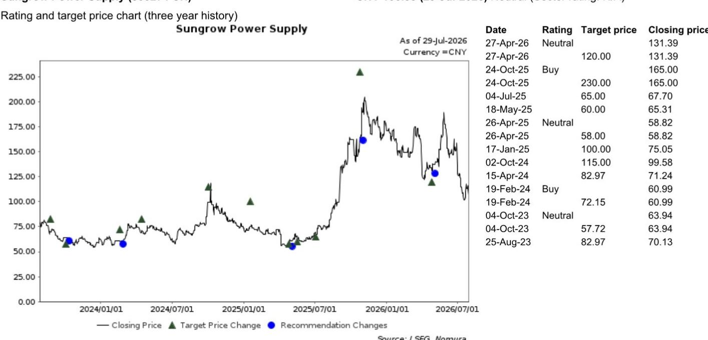
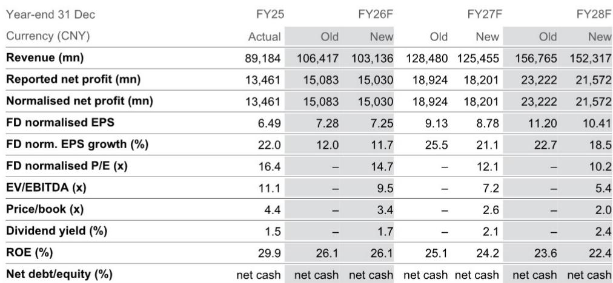

# NOM：阳光电源业务与近期数据观察

2026年7月28日，美国联邦通信委员会发布公共通知DA 26-786，将外国生产的电力逆变器纳入覆盖清单。NOM研报认为，阳光电源的产品组合大概率落入定义范围，且混合电池逆变器的明确提及很可能将储能变流器也纳入限制边界。这份清单并非基于原产地规则，而是援引《购买美国产品法》中的“国内最终产品”测试标准，因此第三国产能无法满足合规要求。

短期来看，现有产品的祖父条款能为2026年提供缓冲，但新机型认证通道的关闭将逐步侵蚀产品竞争力。长期而言，固态变压器等第二代增长驱动力的叙事可能被削弱，硬件重新采购、软件与数据本地化等合规成本将上升。，下调2027/2028年每股盈利预测至8.78元和10.41元。

## 1. 覆盖清单定义范围超出逆变器本身

FCC的认定包含两个要件：一是双向直流/交流转换装置，明确涵盖微型逆变器、组串式、集中式和混合电池逆变器；二是包含通过Wi-Fi、蜂窝或蓝牙实现远程通信、控制、传感、数据收集或监测的组件。NOM认为，阳光电源的产品组合大概率同时满足这两个要件。混合电池逆变器的明确提及，意味着储能变流系统也被纳入限制范围。

关键区别在于“外国生产”的定义。它引用的是48 CFR 25.101(a)中的《购买美国产品法》国内最终产品测试，而非传统原产地规则。这意味着，即使阳光电源在第三国设厂生产，只要关键组件或最终组装不满足“美国成分占比”门槛，仍无法获得合规资格。

> **KC评论：** 许多市场参与者此前认为，在东南亚或印度建厂可以规避美国对华逆变器限制。但FCC此次援引的是《购买美国产品法》测试标准，而非原产地规则，第三国产能策略的合规性存在根本性疑问。报告没有完全展开的是，这一测试标准的具体门槛数值以及是否存在豁免路径，这里仍需验证。

## 2. 祖父条款提供短期缓冲但模型管道冻结

NOM认为，现有已通过认证的产品型号可以继续销售，这为2026年提供了缓冲。但新机型认证通道的关闭是一个更紧的约束条件。随着现有产品系列老化，无法推出新型号将逐步侵蚀阳光电源在美国市场的产品竞争力。

长期来看，NOM还关注EnerNeo固态变压器的分类不确定性。该装置是交流-直流转换设备，很可能同时满足FCC定义的两个要件。即使美国认证和电网互联测试可能将可用性延长至2028年中，但一旦被纳入限制范围，固态变压器作为第二代增长驱动力的叙事将被削弱。

## 3. 合规成本上升与产品竞争力受损

NOM指出，阳光电源需要采取多项合规措施：硬件重新采购转向非中国组件、软件与数据本地化，包括美国托管云服务和源代码审计。这些措施将推高成本和费用。另一种选择是推出无连接功能的简化版产品，但这将严重损害产品竞争力。

报告同时提及，海外第三国产能面临减值不确定性，因为这类产能不满足《购买美国产品法》测试标准，且有条件批准的最终结果仍不确定。NOM在估值方法中已将2026-2028年毛利率下降纳入考量，低于历史均值17倍。

## 4. 盈利预测调整反映结构性不确定性

NOM将2027年每股盈利预测从9.13元下调至8.78元，2028年从11.20元下调至10.41元。收入预测也相应下调，2027年从1284.8亿元降至1254.55亿元，2028年从1567.65亿元降至1523.17亿元。毛利率预测从2025年的31.8%逐步下降至2028年的28.7%。

报告列出的上行不确定性包括数据中心客户储能业务发展快于预期、电池价格稳定带来毛利率改善。节奏变化不确定性包括储能业务政策阻力、公用事业规模项目需求节奏变化。这些因素共同构成了阳光电源在美国市场面临的结构性约束框架。

For informational purposes only. Portions may be generated,translated,summarized,or edited with AI assistance based on source materials and may contain omissions or errors. Please verify independently. This is not investment,legal,tax,accounting,or other professional advice.

For informational purposes only. Portions may be generated,translated,summarized,or edited with AI assistance based on source materials and may contain omissions or errors. Please verify independently. This is not investment,legal,tax,accounting,or other professional advice.

