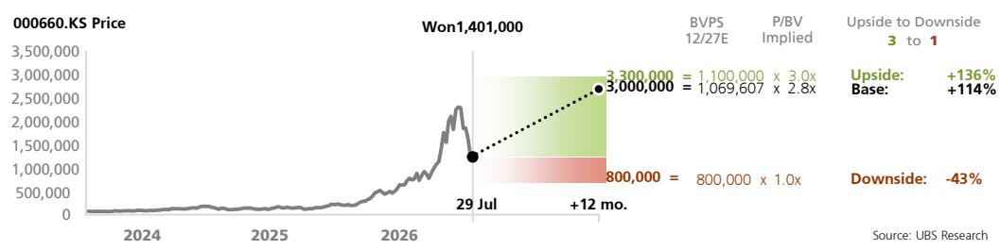

# SK Hynix

# 近期估值回调幅度较大，维持积极看法

## 基本面依然扎实，未来或启动股份回购

SK Hynix 股价自6月22日高点回落52%，但年初至今仍上涨115%。市场及机构对2027年营业利润的预测已分别上调361%/281%。当前股价对应1.66倍市净率，隐含长期净资产回报表现为18.9%，而机构预测2027-2031年平均净资产回报表现为40.2%，DRAM行业整合后（2012年）、AI时代前（2022年）的平均值为17.7%。然而，存储半导体行业格局已发生显著变化。我们持续认为，代理型AI将推动存储位元需求增长至2027年，DRAM位元需求增速将从2026年的22%提升至36%，NAND从20%提升至23%（详见近期亚太聚焦报告：链接）。SK Hynix正在以超出预期的速度签署修订后的长期协议，目前已签署10份，更多协议正在洽谈中。我们认为已签约客户包括美国超大规模云服务商及大型OEM厂商。这可能在短期内压缩部分平均售价上行空间，但长期来看有望提升利润率与回报。HBM相关2027年及以后的谈判已有进展。主要风险仍在于存储的可负担性，尤其是当其进一步推高超大规模云服务商资本支出时（链接）。随着长期利润更加稳定及自由现金流充裕，我们认为SK Hynix可能在2026年下半年启动股份回购，后续将有更全面的更新。

## 二季度DRAM平均售价承压，资本支出预测上调

1/ DRAM平均售价：二季度仅环比上涨30%。我们认为有三个关键因素：a/ 移动DRAM在DRAM收入中的占比提升至19%，定价低于其他细分市场；b/ 部分大额合同的长期协议固定价格部分开始生效；c/ HBM4开始量产发货，但时间在季度末。2/ 资本支出：SK Hynix指引2026年为"40万亿韩元区间高位"。我们将预测上调至47万亿韩元（此前为45万亿韩元），同比增长71%；2027年预测上调至62万亿韩元（此前为60万亿韩元），同比增长31%；2028年预测上调至67万亿韩元（此前为63万亿韩元），同比增长8%。龙仁1号洁净室预计于2027年2月安装设备（符合预期），2号洁净室将于2027年下半年启动。M17（NAND）可能从2029年开始爬坡。

## 近期首次下调盈利预测，但营业利润预测仍高于2027年市场共识17%

我们将三季度营业利润预测从100万亿韩元下调至86万亿韩元，略高于市场共识。调整原因是假设长期协议覆盖率提高，因此DRAM平均售价环比上涨19%（此前为21%，基数更高），NAND环比上涨25%不变。基于类似原因，我们下调了2027/2028年DRAM平均售价预测，降幅超过位元增长预测的上调，并将2027/2028年营业利润预测下调至505万亿韩元/544万亿韩元（较此前下降19%/18%），每股收益预测相应下调19%/19%。我们继续预测2026/2027/2028年将产生可观的自由现金流，分别为188万亿韩元/320万亿韩元/374万亿韩元。

## 估值：目标价从320万韩元下调至300万韩元；维持积极看法

我们基于长期净资产回报表现预测40.2%（此前为42.3%）和股权成本11.5%，以3.65倍市净率（此前为3.67倍）对SK Hynix进行估值。

## 股票

<table><tr><td>韩国</td></tr><tr><td>半导体</td></tr></table>

12个月评级 积极

12个月目标价 3,000,000韩元

价格（2026年7月29日） 1,401,000韩元

RIC: 000660.KS BBG: 000660 KS  
交易数据与关键指标

<table><tr><td>52周区间</td><td>2,919,000-245,000韩元</td></tr><tr><td>市值</td><td>1,019,931亿韩元/7040亿美元</td></tr><tr><td>流通股数</td><td>7.28亿股（普通股）</td></tr><tr><td>自由流通比例</td><td>66%</td></tr><tr><td>日均成交量（千股）</td><td>5,652</td></tr><tr><td>日均成交额（百万韩元）</td><td>11,930,310.2</td></tr><tr><td>普通股权益（2026年12月预测）</td><td>397,268亿韩元</td></tr><tr><td>市净率（2026年12月预测）</td><td>2.5倍</td></tr><tr><td>净债务/EBITDA（2026年12月预测）</td><td>不适用</td></tr></table>

每股收益（机构预测，摊薄）（韩元）

<table><tr><td></td><td>此前</td><td>当前</td><td>变动%</td><td>市场共识</td></tr><tr><td>2026年12月预测</td><td>375,858</td><td>396,943</td><td>6</td><td>317,543</td></tr><tr><td>2027年12月预测</td><td>713,786</td><td>576,936</td><td>-19</td><td>455,640</td></tr><tr><td>2028年12月预测</td><td>839,779</td><td>680,722</td><td>-19</td><td>473,683</td></tr></table>

分析师
Nicolas Gaudois
nicolas.gaudois@ubs.com
+65-6495 5148

分析师
Jimmy Yoon
jimmy.yoon@ubs.com
+65-6495 4617

分析师
Luke Yoo
luke.yoo@ubs.com
+82-2-3702 8132

<table><tr><td>关键数据（十亿韩元）</td><td>2023年12月</td><td>2024年12月</td><td>2025年12月</td><td>2026年12月预测</td><td>2027年12月预测</td><td>2028年12月预测</td><td>2029年12月预测</td><td>2030年12月预测</td></tr><tr><td>收入</td><td>32,766</td><td>66,193</td><td>97,147</td><td>364,681</td><td>612,749</td><td>681,271</td><td>587,048</td><td>673,181</td></tr><tr><td>营业利润（机构）</td><td>(7,730)</td><td>23,467</td><td>47,206</td><td>286,637</td><td>504,523</td><td>544,469</td><td>429,368</td><td>492,456</td></tr><tr><td>净利润（机构）</td><td>(9,138)</td><td>19,797</td><td>42,948</td><td>281,375</td><td>393,950</td><td>425,386</td><td>335,797</td><td>385,122</td></tr><tr><td>每股收益（机构，摊薄）（韩元）</td><td>(12,552)</td><td>27,193</td><td>58,994</td><td>396,943</td><td>576,936</td><td>680,722</td><td>608,171</td><td>828,890</td></tr><tr><td>每股股息（净）（韩元）</td><td>1,200</td><td>2,205</td><td>3,000</td><td>22,725</td><td>51,125</td><td>66,125</td><td>106,125</td><td>121,125</td></tr><tr><td>净（债务）/现金</td><td>(20,548)</td><td>(8,527)</td><td>12,694</td><td>170,674</td><td>429,829</td><td>680,257</td><td>873,509</td><td>1,051,763</td></tr></table>

<table><tr><td>盈利能力/估值</td><td>2023年12月</td><td>2024年12月</td><td>2025年12月</td><td>2026年12月预测</td><td>2027年12月预测</td><td>2028年12月预测</td><td>2029年12月预测</td><td>2030年12月预测</td></tr><tr><td>营业利润率（机构）%</td><td>(23.6)</td><td>35.5</td><td>48.6</td><td>78.6</td><td>82.3</td><td>79.9</td><td>73.1</td><td>73.2</td></tr><tr><td>投入资本回报率（营业利润）%</td><td>(10.9)</td><td>32.4</td><td>56.0</td><td>193.2</td><td>208.9</td><td>178.9</td><td>125.8</td><td>133.1</td></tr><tr><td>企业价值/EBITDA（机构核心）倍</td><td>15.6</td><td>3.9</td><td>3.4</td><td>3.0</td><td>1.3</td><td>0.8</td><td>0.5</td><td>0.1</td></tr><tr><td>市盈率（机构，摊薄）倍</td><td>(8.6)</td><td>6.6</td><td>5.2</td><td>3.5</td><td>2.4</td><td>2.1</td><td>2.3</td><td>1.7</td></tr><tr><td>股权自由现金流（机构）回报表现%</td><td>(8.2)</td><td>10.5</td><td>12.0</td><td>18.1</td><td>31.4</td><td>36.6</td><td>30.7</td><td>34.3</td></tr><tr><td>股息回报表现（净）%</td><td>1.1</td><td>1.2</td><td>1.0</td><td>1.6</td><td>3.6</td><td>4.7</td><td>7.6</td><td>8.6</td></tr></table>

来源：公司数据、LSEG Eikon、机构预测。标注为（机构）的指标已由分析师进行调整。估值：基于当年平均股价，（预测）：基于2026年7月29日股价1,401,000韩元

关键问题

## 机构研究框架——我们的思考及本报告内容指引

## 问题：存储供应紧张局面会持续到2028年吗？

我们认为会的。代理型AI正在多个层面推动存储需求增长，不仅限于HBM，还包括传统服务器和AI服务器CPU节点的DDR5/LPDDR5，以及用于KV缓存和存储的NAND闪存。我们目前预测存储需求增长将加速至2027年，DRAM位元终端消费同比增长36%，高于2026年的22%；NAND闪存从20%提升至23%。由于DRAM新增晶圆产能几乎全部用于HBM，且NAND领域除中国外没有新增产能，供应无法跟上需求。主要风险仍在于可负担性，因为存储行业收入在2027年预计将接近1.8万亿美元。

## 问题：SK Hynix在2026和2027年能否保持HBM领先地位？

我们估计，到2026年底HBM部署产能将达到23万片/月，到2027年底达到27万片/月。据此我们预测2026年HBM出货量为172亿Gb（同比增长37%），2027年为230亿Gb（同比增长34%）。我们预测SK Hynix在2026年将保持HBM市场份额第一，占行业位元出货量的48%，但在2027年将略低于三星，占行业位元出货量的39%（三星41%；美光20%）。

## 问题：SK Hynix是否会进行可观的股东回报？

是的。尽管资本支出预测持续上调，我们预计SK Hynix在2026/2027/2028年将分别产生188万亿/320万亿/374万亿韩元的自由现金流。我们认为SK Hynix可能在2026年下半年启动股份回购（机构预测12万亿韩元），并在后续（可能在2026年三季度电话会议中）提供更全面的股东回报政策更新。长期来看，我们仍认为SK Hynix将朝着将50%自由现金流返还给股东的方向发展，结合股息和股份回购两种方式。

SK Hynix股价目前较6月22日高点下跌52%。尽管近期有所回调，但我们认为基本面依然强劲，代理型AI正在推动存储需求显著增长。在当前估值水平下，我们认为SK Hynix股价尚未充分反映结构性更高的存储盈利能力、更强的自由现金流生成能力以及显著提升的股东回报。

1) HBM需求导致更多产能从DDR转移，这可能在一定程度上缓和长期周期波动。我们估计前端DRAM用于HBM的产能到2026/2027年底可能达到50万/69万片/月，占行业产能的25%/31%。2) 存储厂商持续签署长期协议，这应有助于收窄周期内的利润率波动，并对净资产回报表现产生积极影响。3) 代理型AI持续提升存储需求，强劲的服务器CPU和传统服务器需求即为明证。

经历近期回调后，SK Hynix股价目前交易于1.66倍市净率，隐含长期净资产回报表现为18.8%，而我们的预测为40.2%。

<table><tr><td>价值驱动因素</td><td>DRAM平均售价同比变化2026年/2027年预测</td><td>NAND平均售价同比变化2026年/2027年预测</td><td>营业利润（韩元）2026年/2027年预测</td></tr><tr><td>330万韩元（上行）</td><td>+182%/+56%</td><td>+264%/+50%</td><td>292万亿/583万亿</td></tr><tr><td>300万韩元（基准）</td><td>+177%/+39%</td><td>+260%/+41%</td><td>287万亿/505万亿</td></tr><tr><td>80万韩元（下行）</td><td>+172%/+26%</td><td>+232%/+27%</td><td>274万亿/426万亿</td></tr></table>

来源：机构预测

SK Hynix是一家专注于存储半导体的公司，主要产品为DRAM（2024年占销售额68%）和NAND闪存芯片（占销售额29%）。它也是HBM设备的领先供应商。

## 机构预测

图1：SK Hynix – 2026年二季度业绩摘要

<table><tr><td colspan="2">（十亿韩元）</td><td>2026年二季度实际</td><td>机构预测</td><td>市场共识</td><td>2026年一季度实际</td><td>环比%</td><td>2025年二季度实际</td><td>同比%</td></tr><tr><td colspan="2">收入</td><td>79,319</td><td>86,458</td><td>79,964</td><td>52,576</td><td>51%</td><td>22,232</td><td>257%</td></tr><tr><td colspan="2">毛利润</td><td>65,991</td><td>73,647</td><td></td><td>41,679</td><td>58%</td><td>11,983</td><td>451%</td></tr><tr><td></td><td>% 毛利率</td><td>83.2%</td><td>85.2%</td><td></td><td>79.3%</td><td></td><td>53.9%</td><td></td></tr><tr><td colspan="2">营业利润</td><td>60,543</td><td>68,501</td><td>60,522</td><td>37,610</td><td>61%</td><td>9,213</td><td>557%</td></tr><tr><td></td><td>% 营业利润率</td><td>76.3%</td><td>79.2%</td><td>75.7%</td><td>71.5%</td><td></td><td>41.4%</td><td></td></tr><tr><td colspan="2">每股收益（韩元）</td><td>128,874</td><td>75,035</td><td>66,876</td><td>56,610</td><td>128%</td><td>9,610</td><td>1241%</td></tr><tr><td colspan="9">DRAM</td></tr><tr><td colspan="2">收入</td><td>57,903</td><td>66,465</td><td></td><td>41,005</td><td>41%</td><td>17,130</td><td>238%</td></tr><tr><td colspan="2">位元增长率（环比）</td><td>高个位数%</td><td>+7.5%</td><td></td><td>-0.3%</td><td></td><td>+25.0%</td><td></td></tr><tr><td colspan="2">平均售价变化（环比）</td><td>约+30%</td><td>+42.6%</td><td></td><td>+65.1%</td><td></td><td>+2.1%</td><td></td></tr><tr><td colspan="9">NAND</td></tr><tr><td colspan="2">收入</td><td>21,416</td><td>19,744</td><td></td><td>11,342</td><td>89%</td><td>4,732</td><td>353%</td></tr><tr><td colspan="2">位元增长率（环比）</td><td>中十位数%</td><td>+15.0%</td><td></td><td>-10.4%</td><td></td><td>+73.6%</td><td></td></tr><tr><td colspan="2">平均售价变化（环比）</td><td>中五十位数%</td><td>+43.3%</td><td></td><td>+71.2%</td><td></td><td>-9.6%</td><td></td></tr><tr><td colspan="9">库存</td></tr><tr><td colspan="2">库存</td><td>17,986</td><td>16,848</td><td></td><td>15,974</td><td></td><td>13,408</td><td></td></tr><tr><td colspan="2">库存天数</td><td>123</td><td>120</td><td></td><td>134</td><td></td><td>119</td><td></td></tr></table>

来源：机构预测

图2：SK Hynix – 预测调整

<table><tr><td rowspan="2">（十亿韩元）</td><td colspan="3">2026年三季度预测</td><td colspan="3">2026年四季度预测</td><td colspan="3">2026年预测</td><td colspan="3">2027年预测</td><td colspan="3">2028年预测</td><td colspan="3">2029年预测</td></tr><tr><td>新</td><td>旧</td><td>变动%</td><td>新</td><td>旧</td><td>变动%</td><td>新</td><td>旧</td><td>变动%</td><td>新</td><td>旧</td><td>变动%</td><td>新</td><td>旧</td><td>变动%</td><td>新</td><td>旧</td><td>变动%</td></tr><tr><td>总收入</td><td>106,805</td><td>120,751</td><td>-11.5%</td><td>125,982</td><td>143,804</td><td>-12.4%</td><td>364,681</td><td>403,589</td><td>-9.6%</td><td>612,749</td><td>726,083</td><td>-15.6%</td><td>681,271</td><td>795,236</td><td>-14.3%</td><td>587,048</td><td>590,945</td><td>-0.7%</td></tr><tr><td>DRAM收入</td><td>79,148</td><td>94,234</td><td>-16.0%</td><td>94,278</td><td>113,007</td><td>-16.6%</td><td>272,907</td><td>314,711</td><td>-13.3%</td><td>455,803</td><td>572,799</td><td>-20.4%</td><td>555,962</td><td>672,820</td><td>-17.4%</td><td>513,044</td><td>521,308</td><td>-1.6%</td></tr><tr><td>NAND闪存收入</td><td>27,384</td><td>26,220</td><td>4.4%</td><td>31,449</td><td>30,515</td><td>3.1%</td><td>90,614</td><td>87,483</td><td>3.6%</td><td>155,939</td><td>152,167</td><td>2.5%</td><td>124,275</td><td>121,270</td><td>2.5%</td><td>72,959</td><td>68,478</td><td>6.5%</td></tr><tr><td>营业利润</td><td>85,682</td><td>100,219</td><td>-14.5%</td><td>102,802</td><td>120,680</td><td>-14.8%</td><td>286,637</td><td>327,010</td><td>-12.3%</td><td>504,523</td><td>622,651</td><td>-19.0%</td><td>544,469</td><td>667,048</td><td>-18.4%</td><td>429,368</td><td>445,177</td><td>-3.6%</td></tr><tr><td>DRAM营业利润</td><td>65,518</td><td>80,739</td><td>-18.9%</td><td>79,080</td><td>97,594</td><td>-19.0%</td><td>222,978</td><td>264,838</td><td>-15.8%</td><td>383,548</td><td>502,886</td><td>-23.7%</td><td>460,918</td><td>582,674</td><td>-20.9%</td><td>403,305</td><td>415,541</td><td>-2.9%</td></tr><tr><td>NAND闪存营业利润</td><td>20,221</td><td>19,542</td><td>3.5%</td><td>23,778</td><td>23,148</td><td>2.7%</td><td>63,483</td><td>61,596</td><td>3.1%</td><td>121,168</td><td>119,979</td><td>1.0%</td><td>83,727</td><td>84,569</td><td>-1.0%</td><td>26,192</td><td>29,779</td><td>-12.0%</td></tr><tr><td>% 营业利润率</td><td>80.2%</td><td>83.0%</td><td></td><td>81.6%</td><td>83.9%</td><td></td><td>78.6%</td><td>81.0%</td><td></td><td>82.3%</td><td>85.8%</td><td></td><td>79.9%</td><td>83.9%</td><td></td><td>73.1%</td><td>75.3%</td><td></td></tr><tr><td>每股收益</td><td>94,463</td><td>110,365</td><td>-14.4%</td><td>114,087</td><td>133,848</td><td>-14.8%</td><td>396,943</td><td>375,858</td><td>5.6%</td><td>576,936</td><td>713,786</td><td>-19.2%</td><td>680,722</td><td>839,779</td><td>-18.9%</td><td>608,171</td><td>634,958</td><td>-4.2%</td></tr></table>

来源：机构预测

图3：SK Hynix – 机构预测 vs 市场共识

<table><tr><td rowspan="2">（十亿韩元）</td><td colspan="3">2026年三季度预测</td><td colspan="3">2026年四季度预测</td><td colspan="3">2026年预测</td><td colspan="3">2027年预测</td><td colspan="3">2028年预测</td><td colspan="3">2029年预测</td></tr><tr><td>机构</td><td>市场共识</td><td>差值</td><td>机构</td><td>市场共识</td><td>差值</td><td>机构</td><td>市场共识</td><td>差值</td><td>机构</td><td>市场共识</td><td>差值</td><td>机构</td><td>市场共识</td><td>差值</td><td>机构</td><td>市场共识</td><td>差值</td></tr><tr><td>收入</td><td>106,805</td><td>105,040</td><td>1.7%</td><td>125,982</td><td>116,964</td><td>7.7%</td><td>364,681</td><td>347,026</td><td>5.1%</td><td>612,749</td><td>544,368</td><td>12.6%</td><td>681,271</td><td>617,797</td><td>10.3%</td><td>587,048</td><td>859,022</td><td>-31.7%</td></tr><tr><td>营业利润</td><td>85,682</td><td>82,984</td><td>3.3%</td><td>102,802</td><td>92,579</td><td>11.0%</td><td>286,637</td><td>265,641</td><td>7.9%</td><td>504,523</td><td>430,321</td><td>17.2%</td><td>544,469</td><td>472,732</td><td>15.2%</td><td>429,368</td><td>706,865</td><td>-39.3%</td></tr><tr><td>% 营业利润率</td><td>80.2%</td><td>79.0%</td><td>122个基点</td><td>81.6%</td><td>79.2%</td><td>245个基点</td><td>78.6%</td><td>76.5%</td><td>205个基点</td><td>82.3%</td><td>79.0%</td><td>329个基点</td><td>79.9%</td><td>76.5%</td><td>340个基点</td><td>73.1%</td><td>82.3%</td><td>-915个基点</td></tr><tr><td>每股收益</td><td>94,463</td><td>90,788</td><td>4.0%</td><td>114,087</td><td>100,158</td><td>13.9%</td><td>396,943</td><td>304,397</td><td>30.4%</td><td>576,936</td><td>484,532</td><td>19.1%</td><td>680,722</td><td>543,422</td><td>25.3%</td><td>608,171</td><td>792,122</td><td>-23.2%</td></tr></table>

来源：Visible Alpha、机构预测

图4：SK Hynix – 关键假设调整

<table><tr><td rowspan="2"></td><td colspan="2">2026年三季度（环比）</td><td colspan="2">2026年四季度（环比）</td><td colspan="2">2026年（同比）</td><td colspan="2">2027年（同比）</td><td colspan="2">2028年（同比）</td><td colspan="2">2029年（同比）</td></tr><tr><td>新</td><td>旧</td><td>新</td><td>旧</td><td>新</td><td>旧</td><td>新</td><td>旧</td><td>新</td><td>旧</td><td>新</td><td>旧</td></tr><tr><td colspan="13">DRAM</td></tr><tr><td>位元出货量</td><td>10.3%</td><td>13.4%</td><td>12.0%</td><td>6.5%</td><td>25.6%</td><td>25.7%</td><td>20.0%</td><td>17.5%</td><td>18.2%</td><td>15.0%</td><td>15.6%</td><td>17.1%</td></tr><tr><td>平均售价变化</td><td>18.8%</td><td>21.1%</td><td>8.4%</td><td>12.6%</td><td>177.4%</td><td>207.7%</td><td>38.8%</td><td>52.0%</td><td>3.2%</td><td>2.1%</td><td>-20.2%</td><td>-33.8%</td></tr><tr><td>% 营业利润率</td><td>82.8%</td><td>85.7%</td><td>83.9%</td><td>86.4%</td><td>81.7%</td><td>84.1%</td><td>84.1%</td><td>87.8%</td><td>82.9%</td><td>86.6%</td><td>78.6%</td><td>79.7%</td></tr><tr><td colspan="13">NAND闪存</td></tr><tr><td>位元出货量</td><td>2.7%</td><td>2.7%</td><td>6.5%</td><td>5.8%</td><td>20.0%</td><td>19.8%</td><td>21.3%</td><td>21.5%</td><td>18.3%</td><td>18.3%</td><td>16.1%</td><td>11.8%</td></tr><tr><td>平均售价变化</td><td>25.2%</td><td>25.2%</td><td>9.9%</td><td>10.0%</td><td>259.8%</td><td>237.0%</td><td>41.0%</td><td>39.1%</td><td>-32.6%</td><td>-32.6%</td><td>-49.4%</td><td>-49.5%</td></tr><tr><td>% 营业利润率</td><td>73.8%</td><td>74.5%</td><td>75.6%</td><td>75.9%</td><td>70.1%</td><td>70.4%</td><td>77.7%</td><td>78.8%</td><td>67.4%</td><td>69.7%</td><td>35.9%</td><td>43.5%</td></tr></table>

来源：机构预测

图5：SK Hynix – 机构DRAM预测

<table><tr><td colspan="2"></td><td>2025</td><td>2026年一季度</td><td>2026年二季度</td><td>2026年三季度预测</td><td>2026年四季度预测</td><td>2026年预测</td><td>2027年一季度预测</td><td>2027年二季度预测</td><td>2027年三季度预测</td><td>2027年四季度预测</td><td>2027年预测</td><td>2028年预测</td><td>2029年预测</td><td>2030年预测</td></tr><tr><td rowspan="3" colspan="2">DRAM收入（十亿韩元）</td><td>75,349</td><td>41,008</td><td>58,473</td><td>79,148</td><td>94,278</td><td>272,907</td
