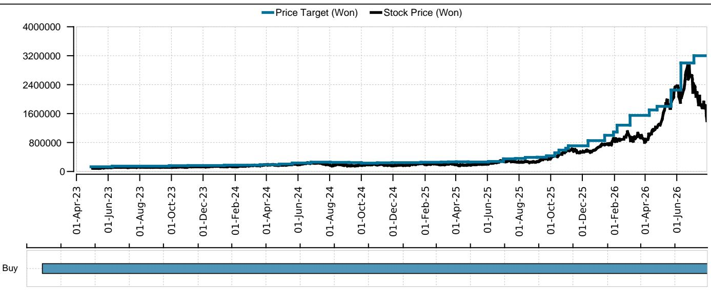
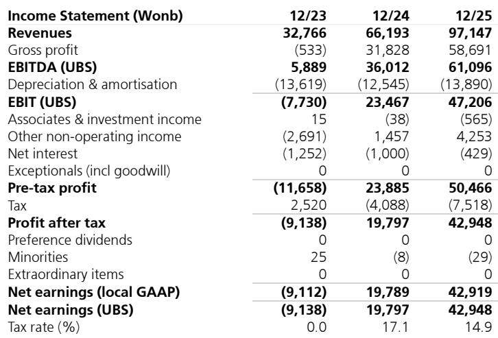
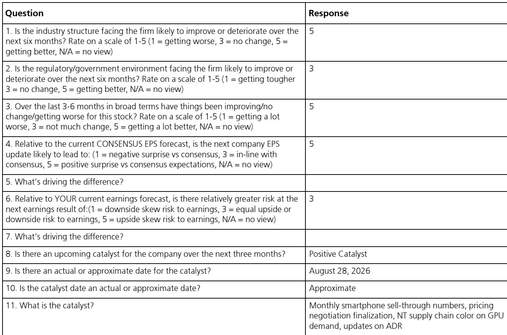

# UBS：研究主题与行业变化观察

SK海力士报价自2026年6月22日高点已有所调整，但年内仍保持一定涨幅。UBS在最新报告中认为，这一幅度调整并不完全反映基本面。核心判断是：市场对DRAM价格短期变化和资本支出持续上升的关注，掩盖了三个结构性变化——智能体AI对存储需求的拉动仍在加速、长期协议（LTA）正在改变盈利稳定性、以及公司可能在2026年下半年启动公司回购。报告同时调整了2027-2028年盈利预测，但调整后仍比市场共识高出17%以上。

## 1. 智能体AI推动存储需求增速在2027年进一步加快

UBS预计，DRAM位元消耗量增速将从2026年的22%提升至2027年的36%，NAND从20%提升至23%。推动力来自多个方向：HBM之外，DDR5和LPDDR5用于传统服务器和AI服务器CPU节点，NAND用于KV缓存和存储。供给端，DRAM新增晶圆产能几乎全部流向HBM，NAND除中国外没有新增产能。报告估算，到2027年存储行业收入接近1.8万亿美元，可负担性仍是主要不确定性。

> **KC评论：** 需求增速在2027年不降反升，与市场对存储周期见顶的直觉相反。关键在于智能体AI对存储的拉动从HBM扩散到传统DRAM和NAND，需求基础比上一轮AI行情更宽。

## 2. 长期协议推进速度超预期，短期ASP承压但长期回报改善

SK海力士已签署10份长期协议，更多正在谈判中，签约客户包括美国超大规模云厂商和大型OEM。UBS认为，LTA覆盖比例上升是导致2026年第二季度DRAM ASP仅环比上涨约30%（低于预期的42.6%）的原因之一。但LTA有助于收窄周期中的盈利波动，对长期ROE是正向贡献。报告将2026年DRAM ASP同比增速从207.7%调整至177.4%，2027年从52%调整至38.8%。

## 3. 资本支出持续上调，但自由现金流仍将大幅增长

SK海力士2026年资本支出指引为“高40万亿韩元”，UBS将其预测从45万亿上调至47万亿韩元，2027年从60万亿上调至62万亿。龙仁第一洁净室预计2027年2月进机，第二洁净室在2027年下半年。尽管资本支出持续上升，UBS预计2026-2028年自由现金流分别达到188万亿、320万亿和374万亿韩元。公司可能在2026年下半年启动公司回购（UBS预计12万亿韩元），并在第三季度电话会议上更新股东回报政策，长期目标是将自由现金流的50%返还给股东。

## 4. 盈利预测调整后仍高于市场共识，估值隐含的长期ROE远低于预期

UBS将2027年营业利润预测从622.7万亿调整至504.5万亿韩元，降幅19%，2028年从667万亿调整至544.5万亿。但调整后仍比市场共识高出17.2%（2027年）和15.2%（2028年）。当前报价对应1.66倍市净率，隐含长期ROE为18.9%，而UBS预计2027-2031年平均ROE为40.2%。DRAM整合后、AI爆发前（2012-2022年）的平均ROE为17.7%，当前估值实际上回到了AI时代之前的水平。

> **KC评论：** 估值隐含的长期ROE（18.9%）与UBS预测（40.2%）之间的差距，是这份报告最核心的观察框架。如果LTA和HBM产能分配确实能改变存储行业的盈利结构，这个差距就是市场尚未定价的部分。但这里仍需验证：40%的ROE能否持续，以及LTA是否会在下一轮节奏变化周期中被重新谈判。

For informational purposes only. Portions may be generated,translated,summarized,or edited with AI assistance based on source materials and may contain omissions or errors. Please verify independently. This is not investment,legal,tax,accounting,or other professional advice.

For informational purposes only. Portions may be generated,translated,summarized,or edited with AI assistance based on source materials and may contain omissions or errors. Please verify independently. This is not investment,legal,tax,accounting,or other professional advice.

