# ASEAN Equity Strategy: Can ASEAN Benefit Beyond AI?

## Looking Beyond Recent Performance

ASEAN's relative performance compared to Asia ex Japan reflects macro factors, policy considerations and limited direct exposure to the AI theme that has driven regional equity returns. Technology accounts for just 4% of MSCI ASEAN, yet contributed 25% of index returns year-to-date. Growth expectations and investor sentiment are subdued, leaving the region largely overlooked. While aggregate valuations have been lifted to 2 standard deviations above the 20-year average by a handful of index heavyweights, valuations across the broader market remain compelling, with 55% of MSCI ASEAN stocks trading below historical averages. Capital market reforms and domestic policy initiatives are gaining traction, creating potential catalysts for re-evaluation. As investors diversify beyond increasingly concentrated AI-related holdings, ASEAN markets could warrant renewed attention.

## Selective Flows and Positioning Could Broaden on AI Diversification

Limited large-scale AI beneficiaries have resulted in uneven participation across ASEAN. Foreign investors have been net buyers of Thailand and Malaysia, reflecting interest in reform momentum and tech-related themes, while Indonesia and the Philippines continue to see net outflows amid policy uncertainty and macro concerns. Singapore remains the only ASEAN market where global funds are overweight, while the rest are broadly neutral. We expect AI to remain the dominant driver of investor allocations, favoring markets with direct and indirect exposure to the theme, including Thailand, Malaysia and Singapore. As market leadership broadens beyond a narrow group of AI winners, however, ASEAN could attract incremental inflows, particularly into markets offering earnings visibility, reform momentum and valuation support. Recent performance may be an early indication of a shift, with ASEAN outperforming broader EM and Asia by 16% since KOSPI's June 2026 peak.

## Key Themes That Will Drive Markets in H226

1) Direct AI exposure remains limited at 8% of ASEAN (versus 31% for EM/APAC), but the region provides selective opportunities and diversification benefits. 2) Oil and food inflation will be a key swing factor for growth, earnings and margins, with the Philippines, Thailand and Indonesia most vulnerable. El Niño adds a further layer of risk, with ASEAN equities underperforming by 7% on average during past cycles. 3) While the bulk of the tightening cycle is likely behind us, higher-for-longer rates remain a headwind. Philippines is the most sensitive to US rates, while local rates matter more for Indonesia. 4) Policy and political uncertainty are key overhangs for Indonesia and the Philippines, while election-related risks are building in Malaysia. 5) Value-up initiatives in Singapore, Malaysia and Thailand could create scope for sustained re-evaluation.

## How Are We Positioned Within ASEAN?

Our ASEAN market ratings are based on the EM & APAC Equity strategy framework. We are overweight Malaysia and Vietnam, where supportive structural and policy catalysts outweigh overall macro risks. Malaysia benefits from a stable macro backdrop and re-evaluation potential from MY Value Up as well as tech-related opportunities, despite emerging election risk. Vietnam remains the premier growth market, with ongoing reforms and potential index inclusion catalysts. We are neutral Singapore and Thailand. Singapore's capital market reforms, safe-haven characteristics and structural demand drivers, particularly in banking and tech, support resilience. Thailand offers recovery potential through tourism and domestic policy support, offset by continued macro challenges. We are underweight Indonesia and Philippines, where policy uncertainty, earnings risks and macro pressures continue to outweigh attractive valuations. Figure 15 presents our preferred stocks across ASEAN markets.

## Equity Strategy

Asia

Karen Hizon
Strategist
karen.hizon@ubs.com
+852-2971 6741

Sunil Tirumalai
Strategist
sunil.tirumalai@ubs.com
+91-22-6155 6080

Grace Lim
Economist
grace-k.lim@ubs.com
+65-6495 5965

Joshua Tanja, CFA
Analyst
joshua.tanja@ubs.com
+62-21-2554 7030

Permada Darmono
Analyst
permada.darmono@ubs.com
+65-6495 3137

Nicole Goh
Analyst
nicole.goh@ubs.com
+603-2781 1133

Alex Manoonpol
Analyst
alex.manoonpol@ubs.com
+662-613 5770

John Te, CFA
Analyst
john.te@ubs.com
+632-8784 8814

Kruti Shah, CFA
Strategist
kruti.shah@ubs.com
+91-22-6155 6031

Claire Long
Economist
claire.long@ubs.com
+65 6495 7426

## ASEAN AT A GLANCE

Figure 1: ASEAN markets have been largely overlooked due to limited exposure to large-scale AI beneficiaries  
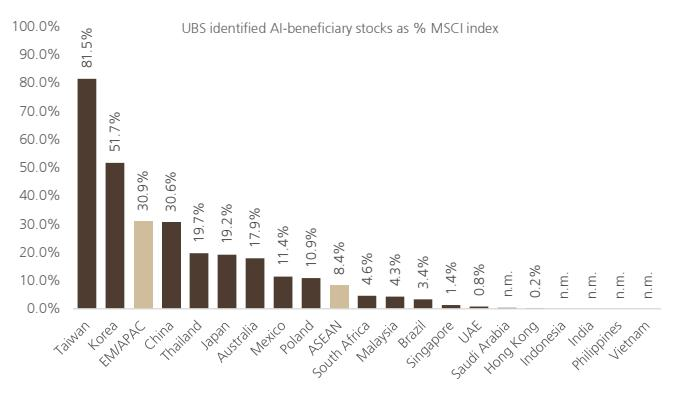  
Source: UBS

Figure 2: While IT only accounts for 4% of MSCI ASEAN, it has driven 25% of returns YTD  
  
Source: IBES, MSCI, Datastream

Figure 3: ASEAN valuations are largely skewed by a handful of index heavyweights  
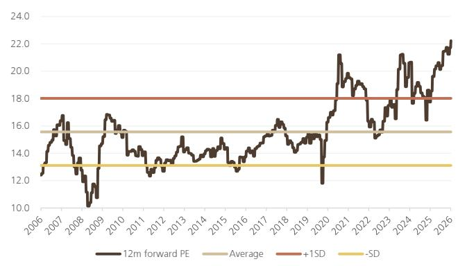  
Source: IBES, MSCI, Datastream, UBS. Note: calculated on the basis of index-weighted methodology (video link)

Figure 4: 55% of MSCI ASEAN stocks are trading below their respective 10y average valuations  
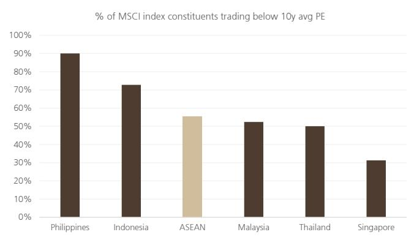  
Source: IBES, MSCI, Datastream

Figure 5: 2026 EPS evolution: Downgrades across the region, except for Thailand and Malaysia  
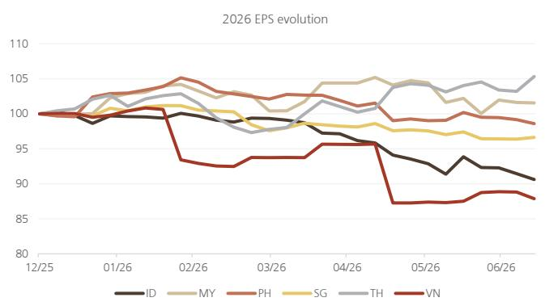  
Source: IBES, MSCI, Datastream, UBS. Note: calculated on the basis of index-weighted methodology

Figure 6: 2027 EPS evolution: Thailand is seeing upgrades, alongside Vietnam amid big 2026 cuts  
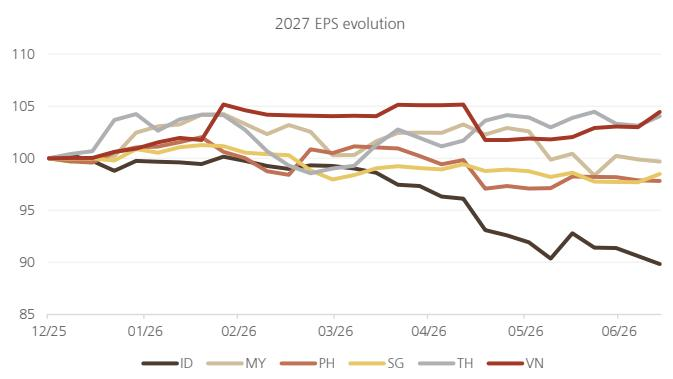  
Source: IBES, MSCI, Datastream, UBS. Note: calculated on the basis of index-weighted methodology

Figure 7: EPS revisions were strongest in Korea and Taiwan, with Thailand also seeing modest upgrades. The rest of the region generally saw downgrades  
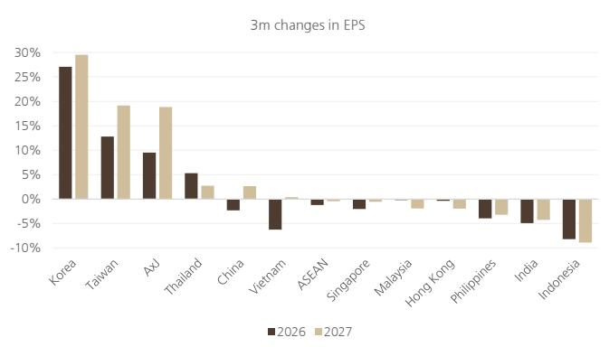  
Source: IBES, MSCI, Datastream, UBS. Note: calculated on the basis of index-weighted methodology

Figure 8: EPS momentum by sector contribution: Financials, which account for 50% of MSCI ASEAN, are leading downgrades, followed by consumer staples  
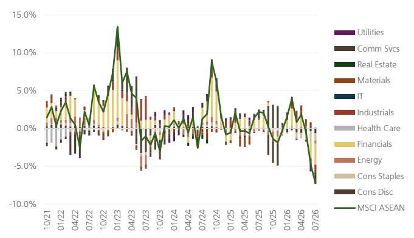  
Source: IBES, MSCI, Datastream, UBS

Figure 9: Within ASEAN, foreigners are net buyers of Thailand and Malaysia and net sellers of Indonesia and Philippines  
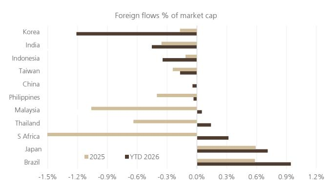  
Source: Bloomberg, UBS

Figure 10: Global funds are overweight Singapore, while the rest of ASEAN are largely at benchmark as of 1Q26  
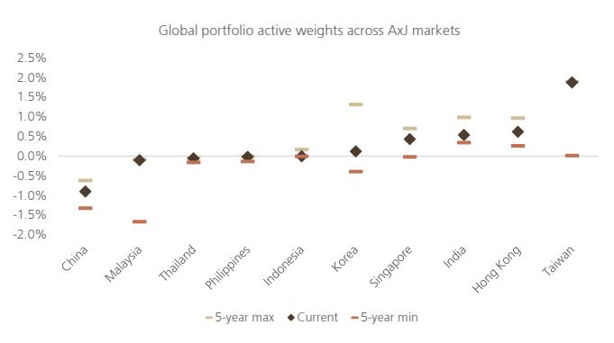  
Source: Bloomberg, MSCI, Datastream, UBS

Figure 11: ASEAN total return attribution: PE expansion has been the primary driver of total returns since 2025, followed by dividends and currency  
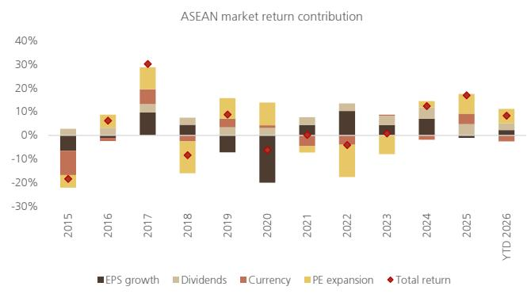  
Source: IBES, MSCI, Datastream, UBS

Figure 12: But over the last 10 years, EPS growth has been the biggest driver of returns, followed by PE expansion  
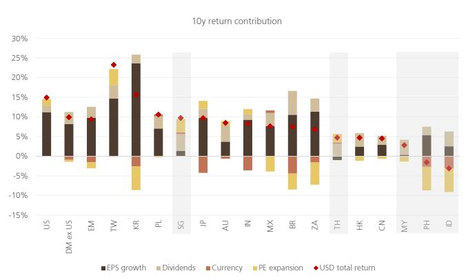  
Source: IBES, MSCI, Datastream, UBS

Figure 13: Similar to broader regional trends, ASEAN markets have high concentration at the single-stock level  
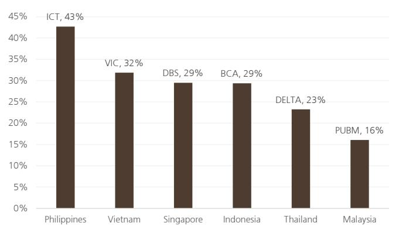  
Source: IBES, MSCI, Datastream. Note: based on free-float adjusted market cap

Figure 14: Excluding Indonesia, over 50% of YTD returns in each market were driven by the single largest stock  
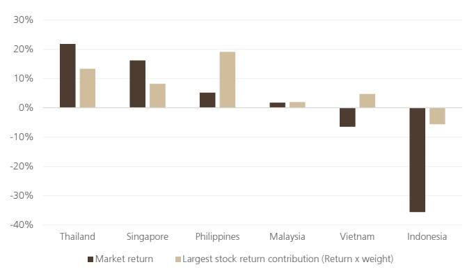  
Source: IBES, MSCI, Datastream. Note: based on free-float adjusted market cap

Figure 15: Our preferred stocks in ASEAN

<table><tr><td rowspan="2"></td><td rowspan="2"></td><td rowspan="2">RIC</td><td rowspan="2">Mkt Cap (US$ bn)</td><td rowspan="2">Price (LC)</td><td rowspan="2">Price Target (LC)</td><td colspan="2">P/E (x)</td><td colspan="2">P/BV (x)</td><td colspan="2">Div yield (%)</td><td colspan="2">EPS growth (%)</td></tr><tr><td>2026E</td><td>2027E</td><td>2026E</td><td>2027E</td><td>2026E</td><td>2027E</td><td>2026E</td><td>2027E</td></tr><tr><td>BCA</td><td>ID</td><td>BBCA.JK</td><td>43.1</td><td>6275.0</td><td>7150.0</td><td>13.3</td><td>12.8</td><td>2.6</td><td>2.4</td><td>5.4</td><td>5.4</td><td>0.6</td><td>4.0</td></tr><tr><td>AIS</td><td>TH</td><td>ADVANC.BK</td><td>33.2</td><td>376.0</td><td>400.0</td><td>21.4</td><td>20.3</td><td>19.5</td><td>18.2</td><td>4.5</td><td>4.9</td><td>13.4</td><td>5.4</td></tr><tr><td>Gulf Development</td><td>TH</td><td>GULF.BK</td><td>29.2</td><td>66.0</td><td>82.0</td><td>29.4</td><td>27.1</td><td>3.0</td><td>2.8</td><td>2.2</td><td>2.4</td><td>16.6</td><td>8.4</td></tr><tr><td>ST Engineering</td><td>SG</td><td>STEG.SI</td><td>25.6</td><td>10.6</td><td>12.6</td><td>31.6</td><td>25.6</td><td>11.0</td><td>9.2</td><td>1.9</td><td>2.1</td><td>126.1</td><td>23.3</td></tr><tr><td>Tenaga</td><td>MY</td><td>TENA.KL</td><td>20.4</td><td>14.4</td><td>17.0</td><td>17.0</td><td>16.1</td><td>1.6</td><td>1.6</td><td>3.8</td><td>4.0</td><td>19.3</td><td>5.9</td></tr><tr><td>CIMB Group</td><td>MY</td><td>CIMB.KL</td><td>20.3</td><td>7.7</td><td>9.2</td><td>10.5</td><td>9.8</td><td>1.1</td><td>1.1</td><td>6.1</td><td>6.2</td><td>0.0</td><td>6.8</td></tr><tr><td>Jardine Matheson</td><td>SG</td><td>JARD.SI</td><td>18.7</td><td>63.6</td><td>80.0</td><td>12.2</td><td>10.1</td><td>0.7</td><td>0.6</td><td>3.9</td><td>4.1</td><td>-9.0</td><td>21.2</td></tr><tr><td>Kasikornbank</td><td>TH</td><td>KBANK.BK</td><td>16.9</td><td>240.0</td><td>255.0</td><td>11.3</td><td>11.7</td><td>1.0</td><td>0.9</td><td>5.8</td><td>5.5</td><td>1.5</td><td>-3.6</td></tr><tr><td>Amman</td><td>ID</td><td>AMMN.JK</td><td>16.3</td><td>4040.0</td><td>6100.0</td><td>19.6</td><td>10.7</td><td>2.6</td><td>2.1</td><td>0.0</td><td>0.0</td><td>242.7</td><td>78.5</td></tr><tr><td>Telkom Indonesia</td><td>ID</td><td>TLKM.JK</td><td>14.5</td><td>2630.0</td><td>3400.0</td><td>12.0</td><td>10.7</td><td>2.0</td><td>1.9</td><td>8.1</td><td>8.1</td><td>-3.8</td><td>11.5</td></tr><tr><td>True Corp</td><td>TH</td><td>TRUE.BK</td><td>14.3</td><td>14.0</td><td>19.3</td><td>19.0</td><td>17.8</td><td>5.9</td><td>5.5</td><td>3.9</td><td>4.2</td><td>33.3</td><td>7.0</td></tr><tr><td>CP All</td><td>TH</td><td>CPALL.BK</td><td>12.3</td><td>46.5</td><td>61.0</td><td>13.7</td><td>12.4</td><td>2.7</td><td>2.4</td><td>3.4</td><td>3.7</td><td>7.6</td><td>10.4</td></tr><tr><td>Meralco</td><td>PH</td><td>MER.PS</td><td>10.9</td><td>600.0</td><td>750.0</td><td>13.5</td><td>12.3</td><td>3.6</td><td>3.2</td><td>4.8</td><td>4.9</td><td>-2.2</td><td>9.6</td></tr><tr><td>Banco de Oro</td><td>PH</td><td>BDO.PS</td><td>10.6</td><td>123.0</td><td>180.0</td><td>7.7</td><td>6.5</td><td>1.0</td><td>0.9</td><td>3.7</td><td>4.1</td><td>-2.5</td><td>17.8</td></tr><tr><td>Petronas Chemicals</td><td>MY</td><td>PCGB.KL</td><td>9.6</td><td>4.9</td><td>6.9</td><td>21.2</td><td>23.6</td><td>1.1</td><td>1.0</td><td>2.6</td><td>2.3</td><td>-269.2</td><td>-10.1</td></tr><tr><td>Bangkok Dusit</td><td>TH</td><td>BDMS.BK</td><td>8.9</td><td>18.9</td><td>23.0</td><td>19.1</td><td>17.7</td><td>2.8</td><td>2.7</td><td>4.5</td><td>4.9</td><td>-0.7</td><td>7.6</td></tr><tr><td>BPI</td><td>PH</td><td>BPI.PS</td><td>8.8</td><td>102.5</td><td>145.0</td><td>8.3</td><td>7.1</td><td>1.1</td><td>1.0</td><td>4.9</td><td>4.8</td><td>-1.9</td><td>16.8</td></tr><tr><td>TECHCOMBank</td><td>VN</td><td>TCB.HM</td><td>7.7</td><td>28600.0</td><td>45000.0</td><td>7.2</td><td>5.6</td><td>1.1</td><td>1.0</td><td>2.5</td><td>5.6</td><td>10.7</td><td>29.0</td></tr><tr><td>HPG</td><td>VN</td><td>HPG.HM</td><td>6.7</td><td>20800.0</td><td>31500.0</td><td>8.8</td><td>6.8</td><td>1.1</td><td>0.9</td><td>0.5</td><td>1.3</td><td>32.2</td><td>28.7</td></tr><tr><td>UOL Group</td><td>SG</td><td>UTOS.SI</td><td>6.2</td><td>9.4</td><td>12.7</td><td>16.8</td><td>12.7</td><td>n/a</td><td>n/a</td><td>2.1</td><td>2.3</td><td>20.6</td><td>31.8</td></tr><tr><td>City Developments</td><td>SG</td><td>CTDM.SI</td><td>5.2</td><td>7.5</td><td>11.6</td><td>15.2</td><td>13.3</td><td>n/a</td><td>n/a</td><td>2.7</td><td>2.7</td><td>-39.1</td><td>14.1</td></tr><tr><td>Asia Commercial Bank</td><td>VN</td><td>ACB.HM</td><td>4.4</td><td>22500.0</td><td>36000.0</td><td>6.1</td><td>4.9</td><td>1.1</td><td>0.9</td><td>3.1</td><td>5.0</td><td>21.3</td><td>23.8</td></tr><tr><td>Mobile World</td><td>VN</td><td>MWG.HM</td><td>3.8</td><td>68000.0</td><td>118000.0</td><td>11.9</td><td>10.6</td><td>3.2</td><td>3.0</td><td>1.8</td><td>2.0</td><td>18.4</td><td>12.5</td></tr><tr><td>Mr D.I.Y.</td><td>MY</td><td>MRDI.KL</td><td>3.7</td><td>1.6</td><td>2.15</td><td>21.1</td><td>18.8</td><td>8.0</td><td>8.0</td><td>5.7</td><td>5.3</td><td>11.7</td><td>11.8</td></tr><tr><td>Alamtri Minerals</td><td>ID</td><td>ADMR.JK</td><td>3.4</td><td>1480.0</td><td>2500.0</td><td>n/a</td><td>n/a</td><td>n/a</td><td>n/a</td><td>n/a</td><td>n/a</td><td>n/a</td><td>n/a</td></tr><tr><td>Vale Indonesia</td><td>ID</td><td>INCO.JK</td><td>2.7</td><td>4870.0</td><td>8400.0</td><td>11.2</td><td>6.2</td><td>0.9</td><td>0.8</td><td>1.1</td><td>3.7</td><td>224.3</td><td>75.2</td></tr><tr><td>Jollibee</td><td>PH</td><td>JFC.PS</td><td>2.6</td><td>144.0</td><td>220.0</td><td>16.0</td><td>11.1</td><td>1.9</td><td>1.7</td><td>2.3</td><td>3.3</td><td>-4.2</td><td>44.1</td></tr><tr><td>Maynilad</td><td>PH</td><td>MYNLD.PS</td><td>2.3</td><td>19.5</td><td>25.5</td><td>8.7</td><td>8.6</td><td>1.2</td><td>1.1</td><td>5.8</td><td>6.4</td><td>-13.3</td><td>1.7</td></tr><tr><td>AEM Holdings</td><td>SG</td><td>AEM.SI</td><td>2.2</td><td>9.0</td><td>16.0</td><td>38.5</td><td>22.9</td><td>5.1</td><td>4.3</td><td>0.5</td><td>0.9</td><td>332.9</td><td>68.3</td></tr><tr><td>Cimory</td><td>ID</td><td>CMRY.JK</td><td>2.0</td><td>4580.0</td><td>6800.0</td><td>16.1</td><td>13.1</td><td>4.9</td><td>4.3</td><td>4.4</td><td>4.9</td><td>12.3</td><td>23.0</td></tr><tr><td>Monde Nissin</td><td>PH</td><td>MONDE.PS</td><td>2.0</td><td>6.7</td><td>8.4</td><td>10.9</td><td>10.4</td><td>2.0</td><td>1.9</td><td>8.9</td><td>6.9</td><td>13.7</td><td>4.9</td></tr><tr><td>Vincom Retail</td><td>VN</td><td>VRE.HM</td><td>1.9</td><td>21900.0</td><td>41100.0</td><td>9.0</td><td>8.3</td><td>n/a</td><td>n/a</td><td>4.6</td><td>0.0</td><td>-13.8</td><td>8.0</td></tr><tr><td>Kelington Group</td><td>MY</td><td>KELG.KL</td><td>1.5</td><td>8.0</td><td>9.0</td><td>34.2</td><td>26.8</td><td>8.4</td><td>7.4</td><td>1.7</td><td>2.1</td><td>10.4</td><td>27.7</td></tr><tr><td>Gemadept</td><td>VN</td><td>GMD.HM</td><td>1.2</td><td>73200.0</td><td>92000.0</td><td>15.3</td><td>14.5</td><td>2.3</td><td>2.2</td><td>4.6</td><td>4.8</td><td>19.7</td><td>5.5</td></tr><tr><td>FPT Retail</td><td>VN</td><td>FRT.HM</td><td>0.7</td><td>107800.0</td><td>200000.0</td><td>18.1</td><td>14.1</td><td>3.7</td><td>3.0</td><td>1.1</td><td>1.4</td><td>27.9</td><td>27.7</td></tr><tr><td>Nam Long Investment</td><td>VN</td><td>NLG.HM</td><td>0.4</td><td>21350.0</td><td>37000.0</td><td>11.7</td><td>12.2</td><td>n/a</td><td>n/a</td><td>4.7</td><td>4.7</td><td>13.6</td><td>-4.4</td></tr></table>

Source: UBS estimates. Note: Sorted by market cap. Pricing data as of 24 July 2026.

MSCI Asia ex Japan sector breakdown by market cap

## Key Themes

We believe five key themes could shape ASEAN markets for the rest of the year.

## 1. The AI (and Anti-AI) Trade

Over the last three years, ASEAN markets have lagged regional peers as investors favored markets with stronger exposure to the AI investment cycle, largely concentrated in North Asia. While ASEAN has seen increasing investments driven by the tech upcycle, equity markets remain more closely tied to domestic growth drivers such as financials, industrials and consumption. With AI-related holdings becoming increasingly concentrated, investors are starting to diversify into areas which are less correlated with the AI theme. This could support renewed interest in ASEAN equities, as investors look to broaden allocations.

At the same time, we continue to view AI as a key theme in 2026. As the AI cycle now extends beyond tech into the supporting infrastructure supply chain—including data centers, power and materials—ASEAN still offers some opportunities. While exposures are uneven across the markets, Thailand is relatively well-positioned due to Delta Thailand, while Malaysia and Singapore also offer some exposure. As such, we think ASEAN may benefit not only from diversification flows from more crowded AI trades, but also from selective exposures in the AI supply chain.

Figure 16: The tech upcycle has led to an investment upcycle in ASEAN, particularly for Malaysia and Thailand  
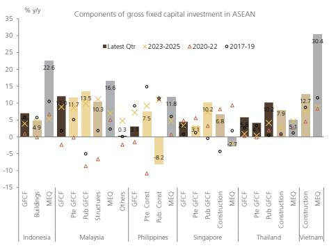

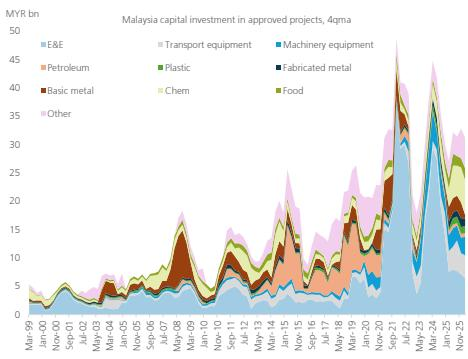

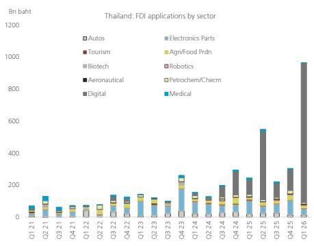  
Source: UBS. Notes: (1) MEQ refers to machinery & equipment investment. For Vietnam, construction in GVA is used as a proxy for construction GFCF; capital goods imports is used as a proxy for MEQ. All data in constant prices. (2) For Thailand, investments in the Digital sector are mostly from large data centers.

Figure 17: MSCI ASEAN is dominated by domestic and traditional sectors such as financials (50%), industrials (13%) and consumer (9%)  
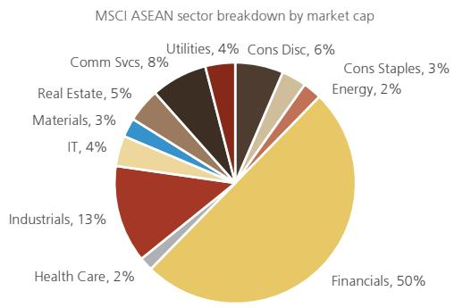  
Source: MSCI, Datastream, UBS

Figure 18: Tech now accounts for 48% of MSCI Asia ex Japan, benefiting from stronger AI exposure, compared to only 4% in ASEAN  
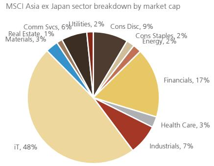  
Source: MSCI, Datastream, UBS

Figure 19: ASEAN offers better diversification to US (and broader EM) equities  
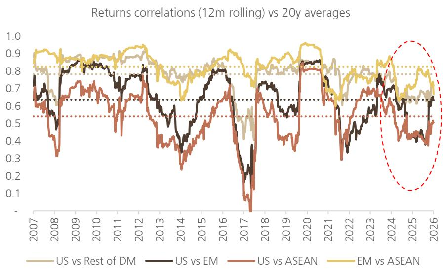  
Source: MSCI, Datastream, UBS

Figure 20: MSCI returns since KOSPI's 22 June 2026 peak  
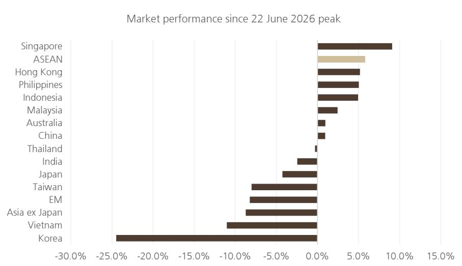  
Source: MSCI, Datastream, UBS

Figure 21: AI revenue exposure  
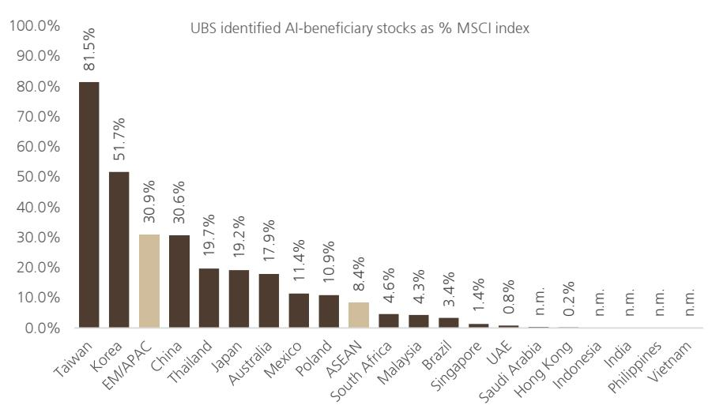  
Source: UBS  
As we've highlighted here, EM equities have historically provided diversification from US equities. But as AI-related stocks have come to dominate EM, EM return drivers have become increasingly aligned with those of the US. ASEAN has traditionally been highly correlated with EM, but that has since weakened in the last two years. As a result, ASEAN now offers better diversification not only relative to US equities, but also within EM itself.  
Since KOSPI peaked on 22 June 2026, ASEAN markets have generally outperformed broader EM and Asia. This supports the region's potential as a diversification trade.

Nevertheless, we believe AI will remain the dominant driver of returns. ASEAN may benefit not only from AI diversification, but also from selective exposures in the AI supply chain. We worked with UBS analysts to identify stocks that see potential incremental upside of at least 15% over the next 3-5 years. Overall, these account for 31% of EM/APAC led by North Asia, although select ASEAN markets are not too far behind.

## 2. Inflation Risk

Broad-based growth moderation and rising inflation create a challenging set-up for ASEAN equities. Risks around Middle East oil flows remain unresolved, but any easing could provide some relief, although longer tail risks from weather-related disruptions due to a likely strengthening El Niño remain. This could be a factor for already below-trend economic growth. Within ASEAN, Indonesia, Philippines, Vietnam and Thailand are particularly vulnerable.

Figure 22: Headline inflation by contribution: Philippines has historically been among the most sensitive to food and energy inflation  
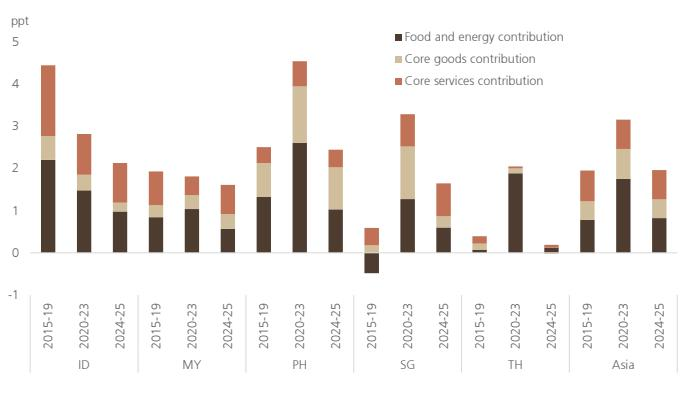  
Source: CEIC, UBS estimates

Figure 23: Thailand, Philippines and Vietnam are the most exposed to food inflation by CPI weight. Including fuel and utilities, Thailand and Philippines are most vulnerable  
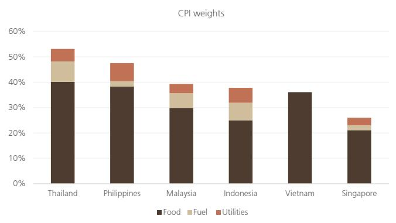  
Source: CEIC, government & central bank websites, UBS

Figure 24: ASEAN GDP growth vs inflation forecasts vs 10y history (%ile rank)  
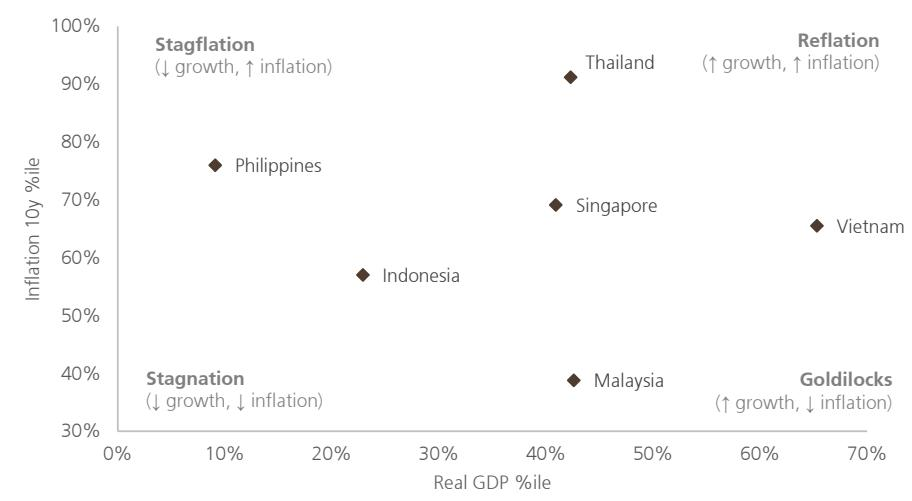  
Source: UBS

Growth across ASEAN is at the 50th percentile vs 10y trend, with the exception of Vietnam, whereas inflation is above the 50th percentile, with the exception of Malaysia thanks to fuel subsidies. Philippines looks most vulnerable, with 2026-27E average GDP growth at the 9th percentile, whereas inflation is at the 76th percentile. Thailand's growth also sits in the 42nd percentile, while inflation is at the higher end of its 10y trend.

Figure 25: Real GDP growth and headline inflation forecasts  
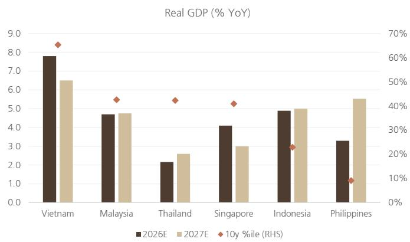  
Source: Haver, CEIC, National Statistics, UBS forecasts

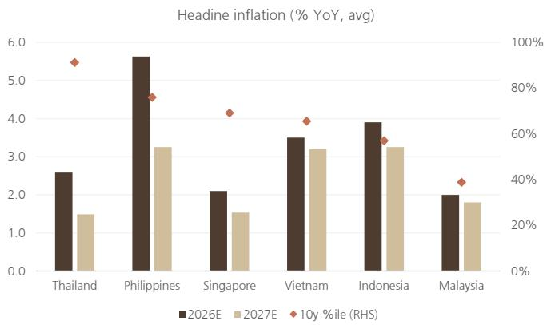

Figure 26: ASEAN indices performance around El Niño phases (2014-16, 2018-19 & 2023-24)  
![](images/60210b8354e
