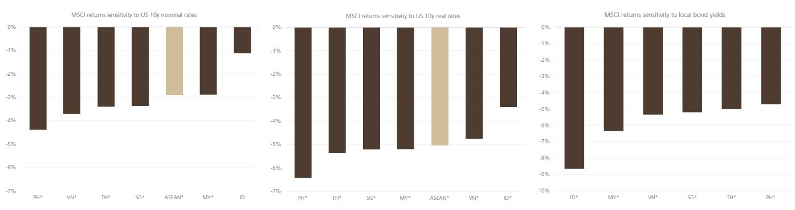

# ASEAN Markets Are Not an AI Story—But That Is Exactly Why They Deserve a Second Look

In a year when technology stocks have driven 48% of MSCI Asia ex Japan returns, ASEAN equity markets present a contrarian puzzle. The MSCI ASEAN index allocates only 4% to information technology, yet that tiny slice has generated 25% of the index's year-to-date total return. This asymmetry—where a negligible sector weight produces a disproportionate share of performance—reveals something deeper than a simple tech observation. It signals that ASEAN markets have been carried by a handful of index heavyweights while the broader opportunity set remains ignored, undervalued, and structurally mispriced.

The region's aggregate valuation now sits two standard deviations above its 20-year average. That statistic, on its own, would suggest froth. But the distribution tells a different story. More than half of MSCI ASEAN constituents—55% to be precise—trade below their own 10-year average valuations. The headline multiple has been inflated by a narrow cluster of large-cap names, not by broad-based re-rating. The region is not expensive; it is bifurcated. And that bifurcation creates the central strategic question for institutional observers: is ASEAN a value trap masked by a few expensive stocks, or is it a diversification opportunity hiding in plain sight?

The timing of this question is not accidental. Since the KOSPI peak in June 2026, ASEAN equities have outperformed broader emerging markets and Asia by 16%. That relative performance shift may be an early signal that capital is beginning to rotate away from hyper-concentrated AI trades and into markets with independent earnings drivers, reform catalysts, and valuation support. The argument for ASEAN is not that it will become an AI leader—it will not. The argument is that as AI concentration becomes a risk rather than a tailwind, the region's lack of correlation to that theme becomes an asset.

## The AI Concentration Risk Is Becoming a Tailwind for ASEAN Diversification

The dominant narrative in Asian equity markets over the past three years has been the AI investment cycle, concentrated overwhelmingly in North Asian markets. Technology now constitutes 48% of MSCI Asia ex Japan, compared to just 4% in ASEAN. This structural gap has been the primary driver of ASEAN's sustained underperformance. Global fund positioning reflects this bias: Singapore is the only ASEAN market where global funds are overweight. The rest of the region sits at neutral or underweight, with Indonesia and the Philippines continuing to see net foreign outflows amid policy uncertainty and macro headwinds.

But the very force that suppressed ASEAN returns is now beginning to reverse direction. AI-related holdings have become increasingly concentrated in a narrow set of stocks and geographies. As portfolio managers confront the risk of single-theme crowding, the logical hedge is not to abandon AI but to diversify into markets with low correlation to it. ASEAN offers exactly that. The correlation of MSCI ASEAN to US equities and to broader emerging markets is structurally lower than that of North Asian indices. For an institutional portfolio that has ridden the AI wave to concentrated exposure, adding ASEAN exposure reduces factor concentration without requiring a bearish view on technology.

This is not a theoretical argument. The data already shows selective foreign flows responding to this logic. Thailand and Malaysia have seen net foreign buying, reflecting interest in reform momentum and tech-adjacent opportunities such as data center infrastructure and power supply chains. Singapore continues to attract global fund overweight positioning. The markets seeing outflows—Indonesia and the Philippines—are those where domestic policy uncertainty and macro fragility override the diversification case. The rotation is happening, but it is discriminating.

## Earnings Momentum Is Diverging Across Markets, Creating a Clear Hierarchy of Risk and Reward

The aggregate earnings picture for ASEAN is weak. Financials, which account for 50% of MSCI ASEAN, are leading the downgrade cycle, followed by consumer staples. This explains much of the region's valuation compression outside the heavyweight names. But the aggregate masks a critical divergence. Earnings revisions for 2026 are positive in only two markets: Thailand and Malaysia. For 2027, the upgrade momentum broadens to include Vietnam, where large downward revisions in 2026 have set a low base for recovery.

This divergence is not random. It maps directly onto the presence or absence of structural reform catalysts. Malaysia's earnings resilience is supported by a stable macro backdrop and the "MY Value Up" initiative, a capital market reform program designed to improve corporate governance, increase dividend payouts, and narrow the valuation discount to regional peers. Thailand's upgrades reflect a combination of tourism recovery, domestic policy support, and selective tech supply chain exposure, particularly through data center investments. Vietnam's trajectory is driven by ongoing economic reforms and the potential for MSCI index inclusion, which would force passive flows into a market that remains under-owned by global funds.

The markets where earnings are being downgraded—Indonesia and the Philippines—share common vulnerabilities: policy uncertainty, elevated exposure to commodity and food inflation, and higher sensitivity to US interest rates. The Philippines is the most rate-sensitive market in ASEAN, while Indonesia's vulnerability is more tied to domestic rate dynamics. Both face El Niño-related risks that historically have caused ASEAN equities to decline by an average of 7% during past cycles. The hierarchy is clear: markets with reform momentum and earnings visibility offer a fundamentally different risk-return profile than those where macro and policy headwinds dominate.

## Capital Market Reforms in Singapore, Malaysia, and Thailand Are Creating Re-Rating Catalysts That Markets Have Not Yet Priced

The most underappreciated factor in the ASEAN equity story is the wave of capital market reforms underway across the region. These are not cosmetic changes. Singapore's value-up initiatives, Malaysia's MY Value Up program, and Thailand's similar efforts are designed to address structural issues that have long kept ASEAN equities at a discount: weak corporate governance, low dividend payouts, and insufficient shareholder returns.

The mechanism is straightforward. When a government or exchange introduces measures that incentivize or require companies to improve return on equity, increase dividend payout ratios, or enhance board independence, the effect on valuation multiples can be durable and significant. Japan's corporate governance reforms under the Tokyo Stock Exchange provide the most compelling recent precedent. The TSE's requirement for companies to disclose and act on plans to improve capital efficiency led to a sustained re-rating of Japanese equities, particularly among companies that had been trading below book value with excessive cash holdings.

ASEAN's reform programs are at an earlier stage, but the direction is identical. Singapore's push to consolidate exchange-listed companies and improve liquidity, Malaysia's focus on state-linked enterprises and their dividend policies, and Thailand's efforts to attract foreign capital through improved disclosure and investor relations—all of these create conditions for multiple expansion that is independent of the global AI cycle. For observers who missed the Japan re-rating trade, or who are concerned about its maturity, ASEAN offers a similar structural thesis at an earlier inflection point.

The risk is execution. Election-related uncertainty is building in Malaysia, and political transitions in Indonesia and the Philippines could disrupt reform momentum. But the payoff for getting the timing right is significant. A 10-20% multiple expansion in a market where 55% of stocks already trade below historical averages would produce returns that do not depend on earnings growth accelerating. That is a low-beta bet on institutional change, not a high-beta bet on technology.

## A Decision Framework: How to Allocate Across ASEAN Markets Based on Reform Exposure, Earnings Visibility, and AI Adjacency

The strategic question for an institutional observer is not whether to allocate to ASEAN, but how to differentiate across its constituent markets. The region is not a monolith, and the dispersion in outcomes is likely to widen as global capital becomes more selective. A three-factor framework captures the essential drivers.

First, reform exposure. Markets with active, credible capital market reform programs—Singapore, Malaysia, and Thailand—offer a structural catalyst for multiple expansion that is independent of the global cycle. These are the markets where domestic policy can drive returns. Indonesia and the Philippines lack comparable reform momentum, and their valuations, while attractive on a headline basis, lack the catalyst needed to close the discount.

Second, earnings visibility. Thailand and Malaysia are the only markets where 2026 earnings revisions are positive. Vietnam offers a compelling 2027 recovery story. Indonesia and the Philippines face continued downgrade risk from commodity inflation, El Niño, and policy uncertainty. Earnings visibility determines whether valuation support is a value trap or a genuine opportunity. A stock trading at a discount to its historical average is only a bargain if earnings do not deteriorate further.

Third, AI adjacency. Direct AI exposure in ASEAN is limited to 8% of the market, but the AI cycle is extending beyond semiconductors into data center infrastructure, power generation, and materials. Thailand, through companies like Delta Thailand, and Malaysia and Singapore, through data center investments and power utilities, offer selective exposure to this secondary wave. Markets without this adjacency—Indonesia and the Philippines—miss the incremental demand driver that could offset weakness in domestic sectors.

Applying this framework produces a clear hierarchy. Malaysia and Vietnam are the most attractive, combining reform catalysts, positive earnings momentum, and selective AI adjacency. Singapore and Thailand offer resilience and recovery potential but lack the same combination of catalysts. Indonesia and the Philippines, despite low valuations, face headwinds that are unlikely to resolve quickly. The framework does not predict that all ASEAN markets will rise together. It predicts that the dispersion will widen, and that capital will flow to markets where the three factors align.

## The Rotation Has Begun, but It Is Still Early Enough to Position Ahead of Broader Recognition

The 16% relative outperformance of ASEAN versus broader EM and Asia since the June 2026 KOSPI peak is not noise. It is the first measurable signal that the rotation away from AI concentration is beginning to reach markets that had been left behind. But the flows are still selective. Foreign investors are net buyers of Thailand and Malaysia, overweight on Singapore, and net sellers of Indonesia and the Philippines. The rotation is discriminating, not indiscriminate.

This selectivity is precisely what creates the opportunity. When a rotation is broad and obvious, the alpha is competed away quickly. When it is narrow and tentative, there is time to analyze, differentiate, and position. The markets that have been overlooked are not the ones with the highest valuations or the most exciting narratives. They are the ones where structural reforms, earnings momentum, and diversification demand are quietly aligning.

The risk, of course, is that the rotation stalls. If AI enthusiasm reignites and capital flows back into the same concentrated names, ASEAN could once again lag. But that risk is symmetrical. The more concentrated the AI trade becomes, the greater the eventual rotation away from it. ASEAN's low correlation to that theme is not a weakness to be remedied. It is a structural portfolio hedge that becomes more valuable as the AI trade becomes more crowded. The region does not need to become an AI leader to deliver attractive returns. It only needs to remain what it is: a diversified, reform-driven, under-owned set of markets that offer something the rest of Asia cannot—uncorrelated exposure to domestic growth.

*For informational purposes only. Portions may be generated, translated, summarized, or edited with AI assistance based on source materials and may contain omissions or errors. Please verify independently. This is not professional advice.*

For informational purposes only. Portions may be generated, translated, summarized, or edited with AI assistance based on source materials and may contain omissions or errors. Please verify independently. This is not professional advice.

