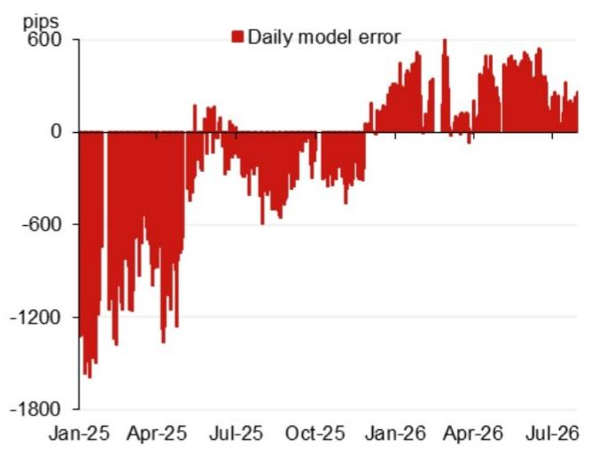
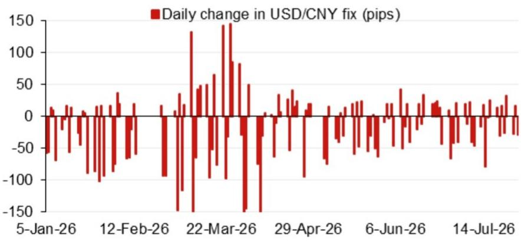

# 宏观观察：亚洲（除日本）汇率动态

## 模型测算

模型测算值：6.7536

模型测算值6.7536，此前为6.7899（较前次官方收盘价有所变化）。

含逆周期因子的模型测算值：6.7727

## 研究团队

亚洲汇率策略
Craig Chan - NSL
craig.chan@NOM.com

Vicky Chen - NSL
vicky.chen1@NOM.com

Manthan Shingala - NSL
manthan.shingala1@NOM.com

图1：隔夜主要贡献因素对测算值的影响（不含逆周期因子）

来源：NOM

图2：近期模型误差（不含逆周期因子调整）

来源：Bloomberg, NOM

图3：每日汇率定盘价变动

来源：Bloomberg, NOM

图4：事件日历

| 日期 | 事件 | 地点 | 备注 |
|------|------|------|------|
| 2026年7月下旬 | 政治局会议（经济工作相关） | 中国 | 会议通常每月一次，7月会议通常包含经济工作安排及高层关注重点 |
| 2026年8月中旬 | 央行2026年第二季度货币政策报告 | | |
| 2026年9月24日 | 主席对美国进行国事访问 | 美国华盛顿特区 | |
| 2026年9月下旬 | 央行货币政策委员会会议 | | |
| 2026年10月1-7日 | 国庆黄金周假期 | 中国 | |

来源：Bloomberg, NOM

## 附录A-1

本报告由NOM Singapore Ltd. (NSL)编制。

关于NOM集团实体的免责声明请参见相关章节。

## 分析师声明

我们，Craig Chan, Wee Choon Teo, Vicky Chen和Manthan Shingala，特此声明：(1) 本研究报告中所表达的观点准确反映了我们个人对相关标的的看法；(2) 我们的报酬中没有任何部分直接或间接与本研究报告中的特定观点相关；(3) 我们的报酬与任何特定业务活动无关。

## 重要披露

## 研究报告在线获取及利益冲突披露

NOM集团研究报告可在www.NOMnow.com/research、Bloomberg、Capital IQ、Factset、LSEG获取。

重要披露信息可访问相关网站或向NOM Securities International, Inc.索取。

编制本报告的分析师的报酬基于多种因素，包括公司总收入等。除非另有说明，本报告所列的非美国分析师未在FINRA规则下注册/取得资格，可能不是NSI的关联人员，且可能不受FINRA规则2241的限制。

NOM Global Financial Products Inc. (NGFP)、NOM Derivative Products Inc. (NDP)和NOM International plc. (NIplc)已在美国商品期货交易委员会和国家期货协会注册为掉期交易商。

## 美国市场额外披露要求

主要交易：NOM Securities International, Inc及其关联公司通常作为固定收益证券（或相关衍生品）的主要交易方。分析师互动：固定收益研究分析师定期与销售和交易部门人员互动，以获取流动性和定价信息。

## 估值方法 - 固定收益

NOM的固定收益策略师通过提供交易建议来表达对证券价格和金融市场的看法。这些建议可以是相对价值建议、方向性交易建议、资产配置建议或三者的组合。分析内容包括但不限于：

- 基本面分析：判断证券价格是否偏离其宏观或微观基本面
- 价格变动的定量分析
- 技术因素：如监管变化、市场风险偏好变化、评级行动、一级市场活动及供需考量

交易建议的时间框架可变。战术性建议时间框架较短，通常不超过三个月。战略性建议时间框架较长，通常超过三个月。

根据欧盟市场滥用法规，NOM全球固定收益研究发布的评级分布如下：

52%被赋予买入（或同等）评级；其中50%的发行人曾接受NOM集团的重要服务。
0%被赋予中性（或同等）评级。
48%被赋予卖出（或同等）评级；其中50%的发行人曾接受NOM集团的重要服务。
截至2026年6月30日。

## 免责声明

本出版物包含由第1页所列NOM集团实体编制的材料。术语"NOM集团"指NOM Holdings, Inc.及其关联公司和子公司。

本材料仅供您个人参考，不构成任何司法管辖区内的买卖要约或要约邀请。除与NOM集团相关的披露外，本材料基于我们认为可靠的来源信息，但未经NOM集团独立核实。

除与NOM集团相关的披露外，NOM集团不对本文件的公平性、准确性、完整性、正确性、可靠性或适用于任何特定目的作出任何明示或暗示的保证。在法律允许的最大范围内，NOM集团不承担因使用本文件而产生的任何责任。

本文件中的观点或估计为原始发布日期的当前观点，如有变更，恕不另行通知。NOM集团明确表示没有义务更新或修订本文件。

NOM集团及其高级管理人员、董事、员工和关联公司，在适用法律允许的范围内，可能作为主体、代理人或其他身份进行交易，或持有相关证券的多头或空头头寸。

本文件可能包含从第三方获得的信息。NOM集团特此明确否认对第三方信息的任何保证，并不承担任何相关责任。

读者应将本文件视为做出投资决策的单一因素之一。本报告不应被视为识别所有直接或间接风险。

本文件中的数字可能涉及过往表现或基于过往表现的模拟，这些并非未来表现的可靠指标。

本文件已在英国获准作为投资研究分发。NIplc由审慎监管局授权，并由金融行为监管局和审慎监管局监管。

本文件已在欧洲经济区获准作为投资研究分发。NFPE由德国联邦金融监管局授权和监管。

本文件已获NIHK批准在香港分发。NIHK受香港证券及期货事务监察委员会监管。

本文件已获NAL批准在澳大利亚分发。NAL由ASIC授权和监管。

本文件已获NSM批准在马来西亚分发。

在新加坡，本文件由NSL分发。NSL是《财务顾问法》定义的豁免财务顾问，受新加坡金融管理局监管。

本文件未获批准在沙特阿拉伯、阿联酋或卡塔尔向特定类别以外的个人分发。

本材料不得在印度尼西亚分发。

本材料任何部分未经NOM集团成员事先书面同意，不得以任何形式复制、转载或重新分发。

版权所有 © 2026 NOM Singapore Ltd., Singapore。保留所有权利。
