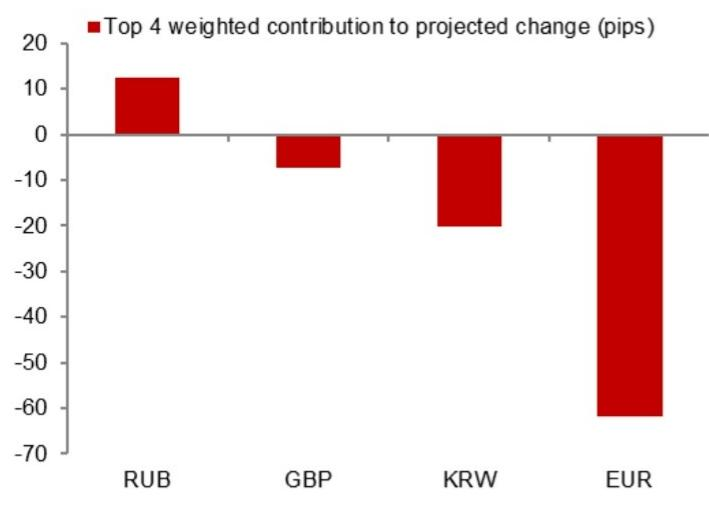

# 关于人民币汇率中间价调整机制的一些观察

近期，中国在汇率管理方面进入了一个更为精细的阶段。根据模型测算，美元/人民币中间价的预测值为6.7536，较此前模型预测的6.7899低363个基点，也低于前一交易日官方收盘价119个基点。这些数字本身显示出人民币存在温和的升值倾向。但更值得关注的是，在引入逆周期因子后，调整后的预测值为6.7727，较前一日中间价低172个基点。未调整模型与调整后模型之间的差距，揭示了一种策略性的安排。中国人民银行正在运用其政策工具来管理人民币汇率的节奏和方向，并非通过直接干预现货市场，而是通过重新校准每日中间价的设定机制。这一区别对于关注亚洲（除日本外）外汇市场的参与者而言，具有重要意义。

这一时机的选择并非偶然。2026年下半年，中国将迎来一系列重要的政策事件：7月下旬的政治局会议、8月中旬的第二季度货币政策报告、9月24日的国事访问、9月下旬的央行货币政策委员会会议，以及10月初的国庆黄金周假期。每一个事件都构成了一个时间窗口，在此期间，央行更倾向于维持汇率稳定，或至少保持一个可预期的轨迹。逆周期因子使得央行能够在不动用外汇储备或干扰在岸-离岸套利渠道的情况下，传达其期望的中间价信号。这是一个在当前需要精细操作的时期所使用的工具。

本文的核心观点是：央行正在利用逆周期因子，在政治敏感日程到来之前，对美元/人民币中间价进行更紧密的管理，这对更广泛的亚洲（除日本外）外汇市场具有直接影响。市场参与者不应将模型预测值与调整后中间价之间差距的缩小，解读为政策放松的信号。相反，这反映了一种深思熟虑的策略，即在保持政策灵活性的同时，管理人民币的升值预期。以下分析将详细阐述其机制、近期模型误差所揭示的模式，以及对区域货币和资产配置的间接影响。

## 逆周期因子并非残余项，而是主要的引导机制

报告提供了两种预测：一种未考虑逆周期因子，另一种则考虑了该因子。未调整模型预测值为6.7536，调整后的预测值为6.7727。两者之间191个基点的差距，正是逆周期因子的贡献。这并非一个微小的调整。它表明央行正在主动抑制模型所隐含的人民币升值幅度。该模型综合了隔夜美元指数、交叉汇率和市场情绪等因素，会推动中间价走低。而央行则进行了反向操作。结果是，中间价虽然比前一日更强，但弱于纯粹市场力量所决定的价格。

这并非全新的机制，但当前的使用力度不同寻常。报告显示，对预测变化贡献最大的四个隔夜权重因素包括美元指数、欧元、日元和离岸人民币的变动。这些都是标准输入项。新的变化在于逆周期因子调整的幅度。在以往相对平稳的时期，调整幅度通常仅为个位数或十几个基点。191个基点的调整表明，央行认为模型的输出结果与其更广泛的政策目标不一致。央行并未让中间价随市场信号自由浮动，而是通过中间价渠道为人民币升值的速度设定了上限。

其策略逻辑是清晰的。中间价过快升值会引发进一步升值的预期，可能导致不稳定的资本流入，并影响出口竞争力。然而，中间价过弱则可能引发资本外流，并传递出信心不足的信号。逆周期因子使央行能够在这两者之间取得平衡：在防止市场跑在政策前面的同时，发出渐进升值的信号。对于市场参与者而言，这意味着中间价已不再是市场状况的被动反映，而是一个主动的政策工具。模型值与中间价之间的差距，是未来几周最值得关注的变量。

## 近期模型误差揭示出对中间价强度的系统性低估

报告包含了近期未考虑逆周期因子调整的模型误差数据。这些误差并非随机出现。它们呈现出一致的模式：模型低估了实际中间价的强度。换言之，即使在应用逆周期因子之前，实际中间价也比模型预测的要强。这表明，在最近几周，央行一直在对抗贬值压力，而非升值压力。该模型旨在捕捉市场驱动的输入项，但近期对人民币的预测似乎过于悲观。

这是一个关键的细微差别。许多市场评论中的说法是，中国正在允许人民币贬值以支持出口。但模型误差数据讲述了一个不同的故事。央行一直在通过逆周期因子悄悄支持中间价，使其强于纯粹市场动态所产生的结果。这些误差是系统性的，而非偶发性的，这表明了一种有意的政策立场。央行不仅仅是在平抑波动，而是在主动将中间价引导至一个更强的均衡水平。

对市场参与者而言，这意味着人民币近期的稳定并非自然的市场结果，而是人为制造的。如果逆周期因子有所放松，很可能导致中间价立即贬值。反之，如果央行决定减少逆周期因子的抵消作用，中间价将更接近模型预测值，意味着人民币走强。风险是不对称的。市场已经在一定程度上对央行的干预进行了定价，但干预的规模是不透明的。那些认为中间价将保持稳定的参与者，实际上是在押注央行将维持当前的调整力度。考虑到即将到来的政治日程，这在短期内是一个合理的押注，但并非没有风险。

## 政治日程对9月下旬前的中间价波动形成约束

报告列出了2026年7月下旬至10月初之间的五个关键事件：政治局会议、第二季度货币政策报告、国事访问、央行货币政策委员会会议以及国庆黄金周假期。这些事件中的每一个都对人民币中间价产生影响。7月下旬的政治局会议将设定下半年的经济政策议程。8月中旬的第二季度货币政策报告将提供央行对经济状况的评估和前瞻性指引。9月24日的国事访问在地缘政治上最为敏感。稳定的人民币是经济信心的外交信号。国事访问期间的汇率波动将付出政治代价。

央行有强烈的动机在此期间将中间价维持在一个狭窄的区间内。逆周期因子为其提供了工具，无需诉诸现货市场干预，从而避免消耗储备并引起不必要的关注。10月初的国庆黄金周假期是这一管理稳定期的自然终点。假期过后，央行可能会根据经济数据和外部环境，允许更大的灵活性。

对于市场参与者而言，这创造了一个清晰的时间框架。到9月下旬之前，中间价很可能受到严格控制，逆周期因子将是主要机制。此后，政策转向的风险会增加。模型预测值6.7536代表了如果央行完全取消逆周期因子所允许的水平。这并非基准情形，但如果央行决定让人民币更自由地升值，这将是发展的方向。6.7727与6.7536之间的差距就是政策溢价。市场参与者应每周跟踪这一差距。差距缩小表明央行正在减少对升值的抵抗；差距扩大则表明其正在加强抵抗。

## 围绕美元/人民币中间价进行决策的参考框架

以下框架将报告中的数据转化为投资组合和风险管理决策的参考维度。该框架包含三个维度：逆周期因子的方向、模型误差的幅度以及与政治事件的接近程度。

首先，关注逆周期因子的调整幅度。报告给出了一个精确的数字：未调整与调整后预测值之间相差191个基点。如果这一调整幅度扩大，表明央行在更用力地对抗升值；如果缩小，则表明央行允许更多市场驱动的升值。调整幅度扩大对人民币而言相对模型预测偏负面；调整幅度缩小则偏正面。这一调整是政策意图最透明的信号。

其次，跟踪模型误差的方向。报告显示，近期的误差方向是实际中间价强于模型。如果这一模式持续，则确认央行在维持其支持力度。如果误差转向相反方向，即实际中间价弱于模型，那将是一个警告信号，表明央行正在放松其立场。误差方向的转变往往先于逆周期因子的变化。

第三，根据政治日程调整风险敞口。9月24日的国事访问是风险最高的节点。在访问前两周，央行很可能将中间价维持在异常稳定的水平。访问后，政策调整的可能性上升。持有人民币敞口的参与者应考虑在访问前进行风险管理，并在访问后重新评估。国庆黄金周假期是一个自然的流动性事件，交易量将下降，中间价对市场波动的反应可能减弱。这不是对人民币进行方向性押注的时机。

第四，考虑跨资产的影响。稳定或渐进升值的人民币对亚洲（除日本外）货币，尤其是韩元、新台币和新加坡元，具有支撑作用。由于贸易联系和竞争动态，这些货币往往与人民币同向波动。如果央行维持当前立场，区域央行面临的干预压力较小。如果央行允许更大幅度的升值，区域货币可能上涨。如果央行放松并允许贬值，区域货币可能走弱。人民币中间价是整个区域的锚。

第五，不要将中间价的稳定与现货市场的稳定混为一谈。中间价是政策工具，现货市场由供需驱动，两者可能背离。稳定的中间价并不能保证稳定的即期汇率，尤其是在资本流动规模较大时。报告聚焦于中间价，而非即期汇率。参与者应同时跟踪两者，但需认识到中间价是领先指标。中间价轨迹的变化最终会传导至即期汇率，但时机不确定。

## 对区域外汇风险管理和套利策略的间接影响

人民币中间价已成为亚洲（除日本外）货币风险管理决策的事实上的锚。当中间价稳定且可预测时，由于波动率预期被压缩，风险管理成本会下降。当中间价波动时，成本会上升。当前环境，即中间价受到严格管理且逆周期因子发挥作用，有利于降低人民币敞口的风险管理成本。但这是一种脆弱的平衡。任何中间价的意外变动，尤其是打破近期模式的变动，都将导致整个区域隐含波动率的飙升。

涉及做空人民币兑较高收益亚洲货币的套利策略尤其敏感。套利交易依赖于稳定性。如果人民币意外升值，套利交易将同时遭受即期损失和波动率上升带来的不利影响。逆周期因子降低了人民币大幅贬值的可能性，这是做空人民币头寸的主要风险。但它并未消除大幅升值的风险。参与套利策略的读者应意识到，央行的非对称干预造成了单边风险。考虑到政治约束，中间价下行可能比上行更快。做多亚洲货币、做空人民币的套利交易，实际上是在押注央行将维持当前立场。这在目前是一个合理的押注，但并非结构性押注。

模型预测值6.7536并非预测，而是基于隔夜输入项的数学输出。实际中间价将取决于央行的判断。两者之间的差距是政策判断的衡量标准。这一差距目前较大。只有当央行认为政治日程不再需要如此严格的控制时，这一差距才会缩小。在此之前，中间价是一个被管理的变量，而非市场变量。将其视为市场变量的读者，可能犯了类别错误。

*仅供参考。部分内容可能基于源材料通过AI辅助生成、翻译、总结或编辑，可能存在遗漏或错误。请独立核实。本文不构成任何专业建议。*

仅供参考。部分内容可能基于源材料通过AI辅助生成、翻译、总结或编辑，可能存在遗漏或错误。请独立核实。本文不构成任何专业建议。

