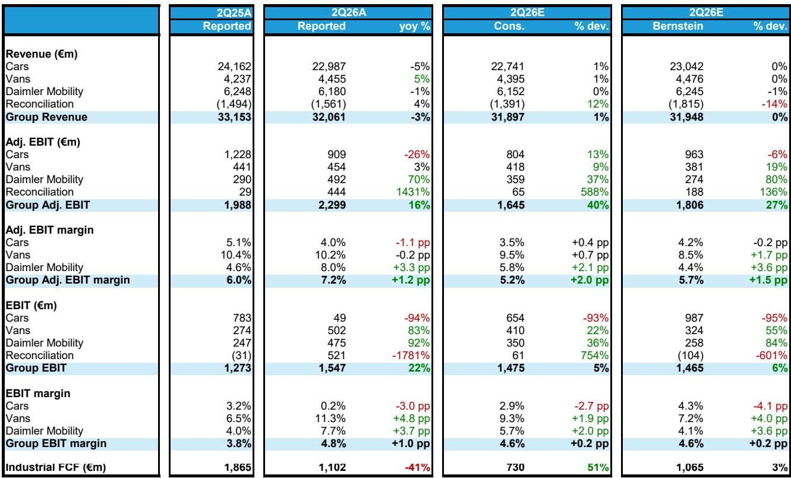
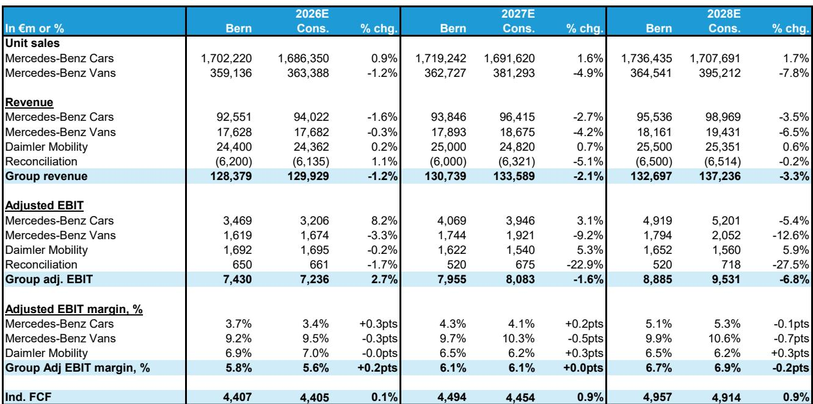
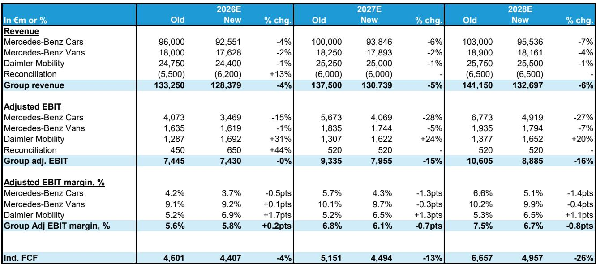

# Bernstein：研究主题与行业变化观察

梅赛德斯-奔驰集团在7月28日发布了2026年第二季度财报。这份财报在当前的宏观环境中交出了一份超出市场预期的答卷。集团调整后EBIT同比增长16%至22.99亿欧元，比公司汇编的卖方共识高出40%。消息公布后，报价一度上涨6%，最终收涨2.9%。

但超预期的业绩背后，有一个数字值得仔细拆解。奔驰乘用车部门调整后营业利润率录得4.0%，高于市场预期的3.5%，也落在全年3-5%指引区间内。然而，乘用车部门报告期内的净利润仅为4900万欧元，同比下滑94%。造成这一巨大落差的核心原因，是一笔7.96亿欧元的非现金减值——对象是奔驰在中国的合资公司。

这笔减值反映了奔驰对中国市场未来回报预期的调整。Bernstein在报告中指出，中国市场的销量同比下滑约20%，对奔驰自身的销量和合资公司盈利能力都产生了实质性影响。奔驰在中国的合资公司BBAC的权益法核算收益，从去年同期的正1.11亿欧元，转为负5.6亿欧元。这是影响乘用车部门报告期利润率降至仅0.2%的主要因素。

> **KC评论：** 调整后利润与报告利润之间的巨大差距，是理解奔驰当前处境的关键。调整后利润剔除了减值等一次性项目，展示的是经营层面的韧性；而报告利润则反映了中国业务在资产负债表上的真实影响。两者之间的剪刀差，是这家德国豪华车制造商在转型期最真实的财务写照。

## 1. 欧洲和美国市场成为业绩支撑，中国以外BEV销量增长51%

在整体销量承压的背景下，奔驰在欧洲和美国的业务表现提供了重要支撑。Bernstein报告显示，排除中国市场后，奔驰全球销量同比增长2%。其中，纯电动车（BEV）的全球销量增长51%，欧洲市场增幅高达87%。管理层在交流中形容，新一代BEV在欧洲“从货架上飞走”，订单强劲。

这一表现促使奔驰将2026年xEV（纯电+插电混动）的销量占比指引从之前的21-23%上调至23-25%。在欧洲，中国汽车制造商目前更多集中在大众化市场，奔驰通过聚焦细分市场而非追求纯销量，得以在保持利润率的同时扩大电动化份额。

在美国市场，奔驰的定价能力和品牌溢价依然稳固。Bernstein认为，美国市场对奔驰新BEV系列的积极反馈，是支撑其全年利润率指引的重要变量。

## 2. 匈牙利工厂产能弹性较高，德国成本不确定性倒逼生产网络重构

奔驰正在采取具体措施降低对德国高成本生产基地的依赖。Bernstein报告披露，奔驰位于匈牙利凯奇凯梅特的工厂已完成扩建，产能弹性较高至40万辆。该工厂的要素成本（包括劳动力、能源、工厂管理费用和物流，不含原材料和零部件采购）比德国低约70%。

这是奔驰“生产力提升计划”的一部分。该计划的目标是在2019年至2024年已实现19%固定成本削减的基础上，未来三年再削减超过10%。具体路径包括：通过内部效率提升、与工会和相关方的谈判优化工作时间与竞争力、以及将低成本国家在生产网络中的占比从约15%提升至30%。

奔驰还计划到2027年将本地化生产比例从60%提升至70%，以降低汇率、物流和关税不确定性，同时加快对区域需求变化的响应速度。在“下一代生产”战略下，奔驰将在全球网络中三年内推出超过40款车型，并在同一条生产线上实现BEV、ICE和混动车型的混线生产，以最大化资产利用率。

## 3. 戴姆勒卡车持股成为资本回报的灵活工具

在资本回报方面，奔驰采取了不同于传统车企的做法。Bernstein报告指出，奔驰正在逐步调整其在戴姆勒卡车（DTG）的股份。第二季度，通过分阶段出售部分持股，奔驰获得了4.17亿欧元现金，并实现了1.6亿欧元的收益。7月份，随着戴姆勒卡车报价创下历史新高，奔驰又调整了约6亿欧元的持股。

这些调整所得被用于支持股东回报。2026年上半年，奔驰通过股息和公司回购向股东返还了50亿欧元。同时，奔驰宣布启动新一轮10亿欧元的公司回购，预计在2027年4月年度股东大会前几周完成。

Bernstein分析师指出，戴姆勒卡车持股的减持方式具有灵活性——既可以分阶段出售，也可以视市场条件进行大宗交易——这为奔驰保留了在时机、折扣和市场影响上的选择空间。这种操作方式，使戴姆勒卡车持股成为奔驰资本配置中的一个灵活工具，而非一次性退出。

## 4. MB.OS与YASA电机：技术投入是长期竞争力的锚点

在短期财务不确定性之外，奔驰在技术层面的投入仍在持续。Bernstein报告提到，奔驰自研的芯片到云操作系统MB.OS正在作为统一的软件平台，在BEV和燃油车上同步部署。新一代S级被描述为“首款完全软件定义的高科技燃油车”，其ADAS和L2++功能是核心亮点。基于AI的点到点辅助驾驶已在中国和美国推出，并计划在欧洲新法规下扩展。

在动力总成方面，奔驰采取双轨策略：一方面通过2021年收购的YASA子公司开发高效紧凑的轴向磁通电机，作为BEV性能的差异化优势；另一方面开发符合EU7标准的高科技电动化V8发动机，维持燃油车领域的竞争力。

Bernstein认为，这些技术投入虽然短期内增加了折旧和研发费用，但长期来看是奔驰在豪华车市场维持品牌溢价和定价能力的基础。在竞争日益激烈的中国市场，奔驰依然保持着豪华车平均售价的领先地位，这与其技术投入和品牌定位直接相关。

> **KC评论：** 奔驰当前面临的核心矛盾是：短期财务不确定性（中国减值、成本上升）与长期技术投入（MB.OS、电动化平台、产能重构）之间的平衡。Bernstein将SOTP估值折价从20%上调至25%，主要反映中国业务前景的不确定性。但报告同时指出，奔驰在欧洲和美国的BEV销售势头、匈牙利工厂的成本优势、以及戴姆勒卡车持股带来的资本灵活性，都是支撑其估值的重要变量。对于关注传统车企转型的读者而言，奔驰的案例提供了一个观察窗口：一家百年豪华车品牌，如何在利润承压期同时推进电动化、软件化和生产网络重构。

For informational purposes only. Portions may be generated,translated,summarized,or edited with AI assistance based on source materials and may contain omissions or errors. Please verify independently. This is not investment,legal,tax,accounting,or other professional advice.

For informational purposes only. Portions may be generated,translated,summarized,or edited with AI assistance based on source materials and may contain omissions or errors. Please verify independently. This is not investment,legal,tax,accounting,or other professional advice.

