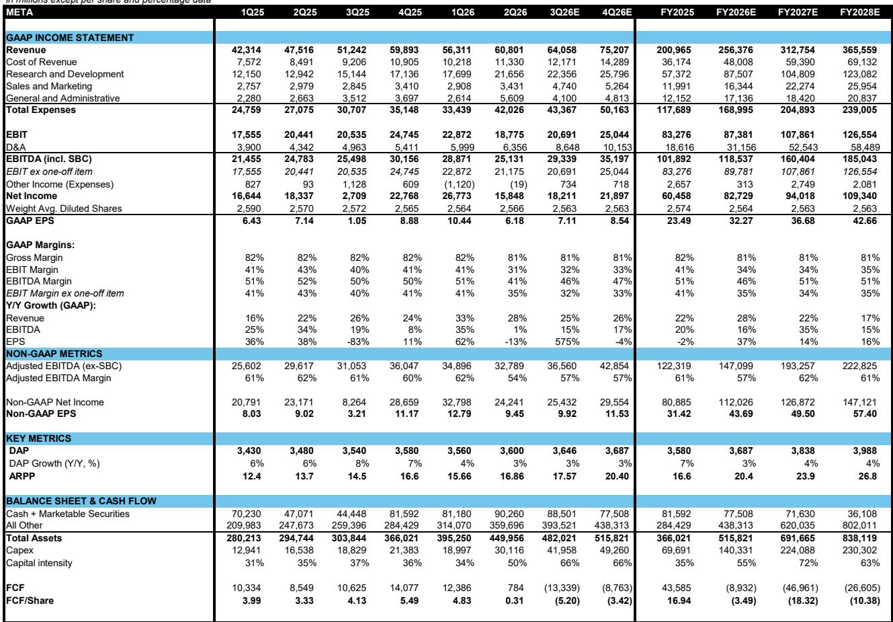
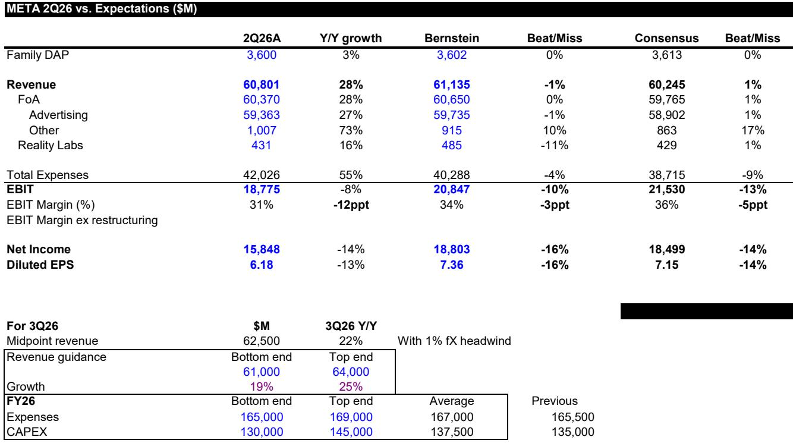
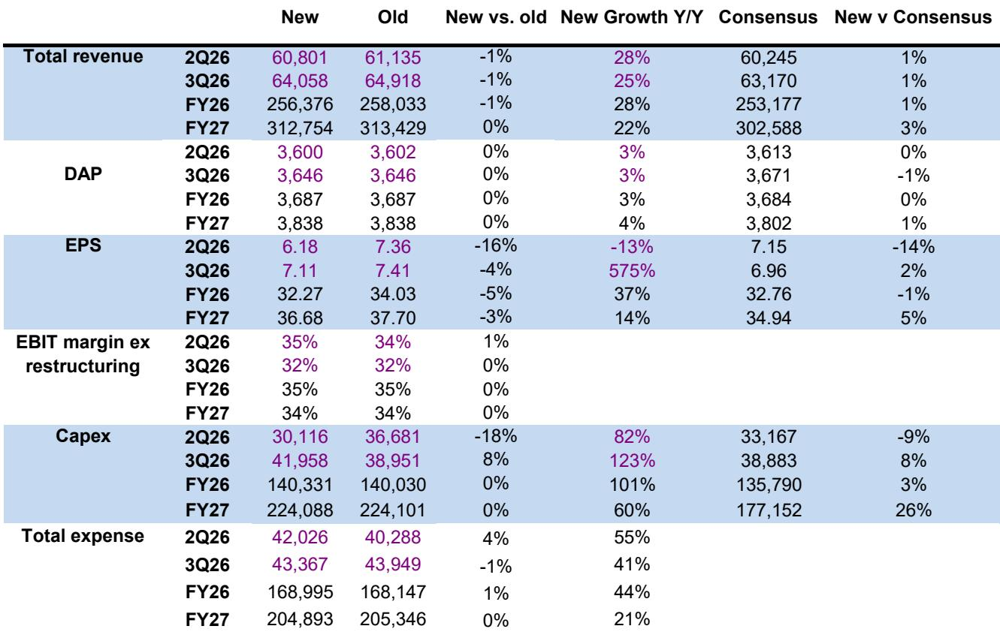

# Bernstein：Meta 2Q26——避免TikTok 2.0

Meta 在 2026 年第二季度交出了一份营收增长 28% 的财报，但真正让Bernstein分析师 Mark Shmulik 在最新研报中反复推敲的，不是这个数字本身，而是扎克伯格在年度备忘录中提出的“个人超级智能”愿景。报告认为，Meta 正在走一条与同行截然不同的路——当谷歌和OpenAI将重心转向更容易变现的企业市场时，Meta选择押注消费者AI这个尚未被验证的领域。这个选择昂贵且充满不确定性，但背后有一个其他公司无法复制的筹码：36亿日活跃用户。

## 1. 核心广告业务仍受益于AI驱动的效率提升

第二季度广告收入同比增长27%至594亿美元，广告展示量增长14%，定价增长12%。这些数字背后是Meta持续投入的AI基础设施在发挥作用。报告特别提到，Meta新推出的生成式系统利用大语言模型同时理解广告内容和用户偏好，早期测试中已推动Instagram上的应用事件转化率提升1%。在Facebook上，检索、排序和用户理解模型的改进带来了广告点击量增长8.3%和转化率提升15.7%。

> **KC评论：** 这些数字说明Meta的AI投入在核心广告业务上已经产生可量化的回报。但报告也暗示，这种效率提升是“入场券级别”的竞争要求，而非差异化优势。

Advantage+套件的年化收入运行率已超过750亿美元，成为广告收入增长的重要引擎。第三季度营收指引为610亿至640亿美元，同比增长19%至25%，考虑到去年同期的高基数，这个指引并不保守。

## 2. 消费者AI战略的底层逻辑是应对“TikTok式”冲击

报告用一个历史案例解释了Meta为何在基础模型和算力上如此激进：过去十年，Meta两次被消费者行为的突然变化打乱节奏。第一次是TikTok带来的短视频浪潮，Meta花了数年时间才通过Reels堵住这个生存级不确定性；第二次是ChatGPT，其周活跃用户已接近10亿。在这两次事件中，Meta都面临一个共同瓶颈——缺乏足够的算力储备来快速响应。

报告指出，消费者行为的变化速度正在加快。一个新产品可能只是短暂热潮，比如Clubhouse和BeReal，但也可能彻底改变用户习惯。Meta的策略是确保自己拥有随时响应的能力：前沿模型、产品交付团队、消费级AI硬件和充足的算力。这份研报的标题“Avoiding TikTok 2.0”直接点明了这一战略的核心动机。

## 3. 消费者AI的变现路径仍不清晰，但“其他收入”开始释放信号

报告坦率地承认，关于消费者AI何时、以何种方式变现，目前还没有答案。扎克伯格的愿景是让AI代理进入每个人的手中，但报告列举了几个现实约束：消费者AI的杀手级应用尚未出现，AI搜索可能是最好的结果；消费者采用速度可能像智能手机那样需要五年，也可能像电商那样需要数十年。

不过，一个值得关注的信号是“其他收入”类别。第二季度该类别同比增长73%，首次突破10亿美元，主要由商业消息、订阅和支付收入构成。报告认为，随着Meta开始推出面向企业的AI代理，并采用订阅和按效果定价的模式，这部分收入可能加速增长。虽然目前体量还不到季度总营收600亿美元的零头，但它可能是消费者AI变现路径的第一个可观测指标。

## 4. 资本支出指引与市场定价的错位

Meta将2026年资本支出指引的下限提高了50亿美元，但上限维持在1450亿美元不变。管理层同时表示，至少到2027年，支出仍将保持增长，直到他们对算力储备感到满意。报告认为，这个指引本身并不意外，市场对此已有预期。

真正值得关注的是当前报价隐含的估值。报告计算，按盘后交易价格计算，Meta的动态市盈率约为15倍。这个估值水平意味着市场对Meta的AI投入尚未给予溢价，甚至可能包含了部分折价。报告认为，如果Meta在下半年密集的产品发布中找到消费者AI的突破口，或者WhatsApp的企业消息代理开始贡献可观的收入，这个估值水平可能显得偏低。

> **KC评论：** 15倍市盈率对于一家营收仍保持25%以上增长的公司来说并不高。但问题在于，市场需要看到消费者AI从“PPT上的想法”变成“可量化的收入”。报告提到的“其他收入”类别可能是最早给出答案的地方。

---

For informational purposes only. Portions may be generated,translated,summarized,or edited with AI assistance based on source materials and may contain omissions or errors. Please verify independently. This is not investment,legal,tax,accounting,or other professional advice.

For informational purposes only. Portions may be generated,translated,summarized,or edited with AI assistance based on source materials and may contain omissions or errors. Please verify independently. This is not investment,legal,tax,accounting,or other professional advice.

