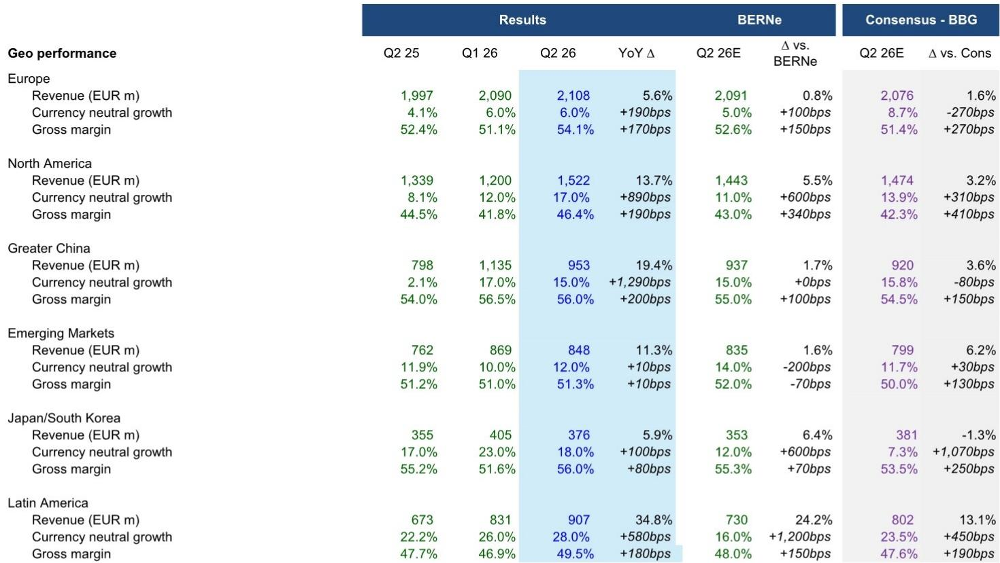
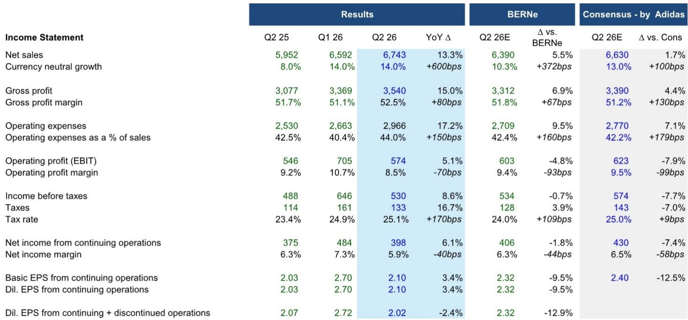
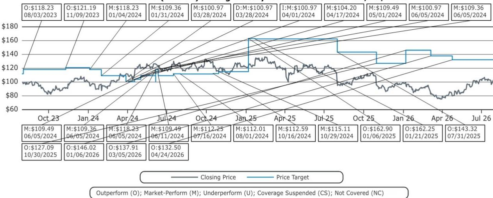

# Bernstein：阿迪达斯业务与季度数据观察

阿迪达斯二季度交出了一份“一半超预期、一半低于预期”的成绩单。营收端以14%的货币中性增速跑赢市场预期的13%，但营业利润率却从去年同期的9.2%降至8.5%，低于市场预期的9.4%。Bernstein在最新发布的研报中指出，这一反差的核心原因在于营销费用和DTC履约成本的双重超支。

这是阿迪达斯自2022年终止Yeezy合作以来，首个完全没有Yeezy同比影响的财年。业绩的“含金量”因此更值得拆解：增长来自哪里，利润又被什么吃掉。

## 1. 运动表现品类以39%增速成为增长引擎

二季度增长结构出现明显分化。运动表现品类录得39%的货币中性增长，远超一季度的29%和去年四季度的27%。足球品类受世界杯产品线和复古系列推动，跑步品类由Adizero系列和Hyperboost Edge驱动，赛车运动同样贡献了双位数增长。

相比之下，生活方式品类仅增长2%，增速低于一季度的6%和去年四季度的3%。Originals服装和低帮鞋款虽有双位数增长，但整体动能明显弱于运动表现线。按产品分部看，服装增长35%，配饰增长20%，而鞋类仅增长1%，部分原因是去年二季度鞋类基数较高。

> **KC评论：** 运动表现品类的高增长说明阿迪达斯正在完成从“潮流驱动”到“功能驱动”的增长切换。但鞋类增速仅1%值得关注，因为鞋类通常是运动品牌利润率和品牌力的核心载体。

## 2. 北美和拉美增速加快，欧洲批发仍偏保守

区域表现同样呈现分化。北美市场录得17%的货币中性增长，高于一季度的12%，尽管批发渠道继续维持保守的铺货策略。大中华区增长15%，与一季度持平。拉丁美洲增长28%，日本/韩国增长18%，新兴市场增长12%。

欧洲市场增速仅为6%，与一季度一致。报告指出，欧洲批发渠道的保守铺货部分被DTC的双位数增长所抵消。Bernstein认为，欧洲消费者环境的不确定性和促销活动的加剧，是阿迪达斯在该区域采取谨慎批发策略的主要原因。

## 3. 毛利率改善但运营费用超支，下半年指引隐含增速节奏变化

二季度毛利率同比提升80个基点至52.5%，高于市场预期的51.3%。驱动因素包括健康的全价销售、渠道结构改善以及小额关税退税，但部分被货运和采购成本上升以及美国关税影响所抵消。

问题出在运营费用端。其他运营费用占收入比例同比上升140个基点，其中营销费用占比上升170个基点，主要用于世界杯营销和Adizero Dropset Elite等新品发布。运营杠杆仅贡献30个基点的改善，低于市场预期，原因是DTC业务扩张带来的运输成本和人力成本上升。

Bernstein测算，隐含的下半年指引显示，下半年货币中性销售增速仅为4.2%至6.2%，远低于市场预期的7.6%。营业利润率指引在7.6%至7.8%之间，若计入关税退税则为9.4%至9.5%。报告认为，下半年增速节奏变化的预期反映了管理层对宏观环境和促销竞争的谨慎判断。

## 4. 新CFO任命与关税退税的不确定性

公司同时宣布，现任CFO Harm Ohlmeyer将于年底卸任，由在阿迪达斯工作25年、最近担任C&A CFO六年的Birgit Kretschmer接任。Bernstein在报告中未对这一人事变动给出明确判断，但指出管理层交接期通常伴随战略节奏的调整。

关于关税影响，公司2026年指引中明确排除了2.5亿至3亿美元的关税成本。若计入关税退税，营业利润率可提升至约9.5%。Bernstein认为，关税退税的时间和金额仍存在不确定性，这是下半年利润率能否达到指引上限的关键变量。

> **KC评论：** 阿迪达斯当前的核心矛盾不是需求不足，而是增长质量。营收超预期但利润率低于预期，说明公司在规模扩张和成本控制之间尚未找到最优平衡。下半年增速指引明显低于上半年，意味着管理层对市场环境持谨慎态度。对于关注运动品牌竞争格局的读者，需要持续跟踪阿迪达斯在北美和欧洲的批发渠道策略变化，以及DTC扩张对运营费用的长期影响。

For informational purposes only. Portions may be generated,translated,summarized,or edited with AI assistance based on source materials and may contain omissions or errors. Please verify independently. This is not investment,legal,tax,accounting,or other professional advice.

For informational purposes only. Portions may be generated,translated,summarized,or edited with AI assistance based on source materials and may contain omissions or errors. Please verify independently. This is not investment,legal,tax,accounting,or other professional advice.

