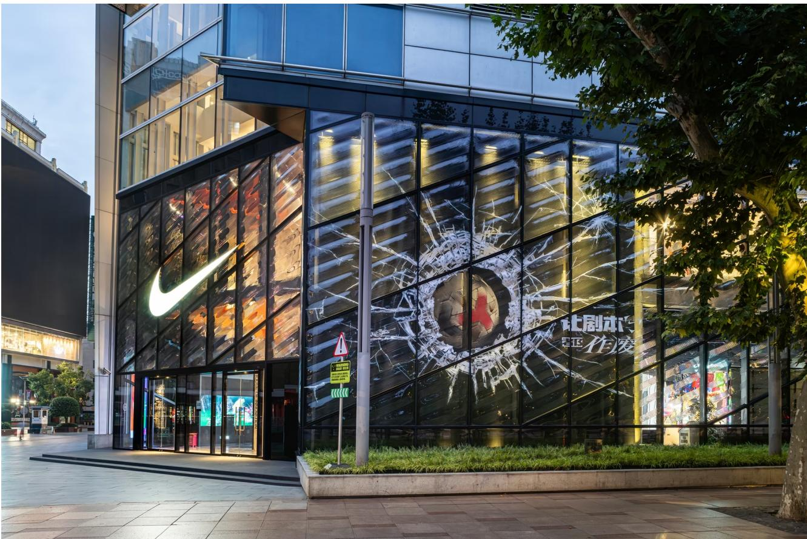
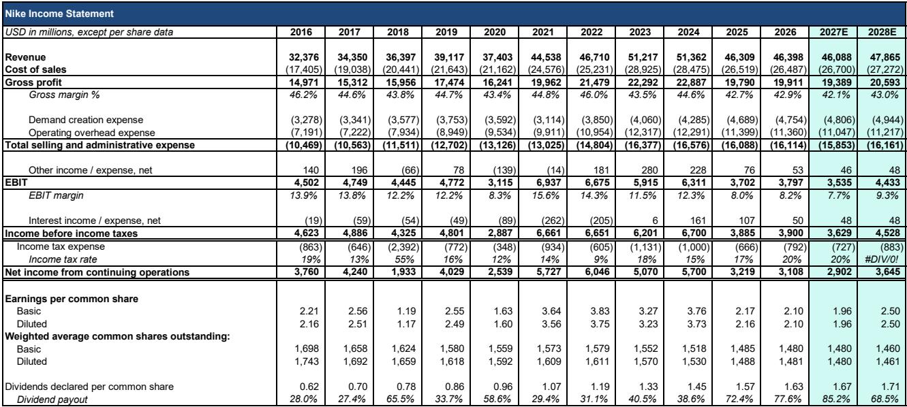
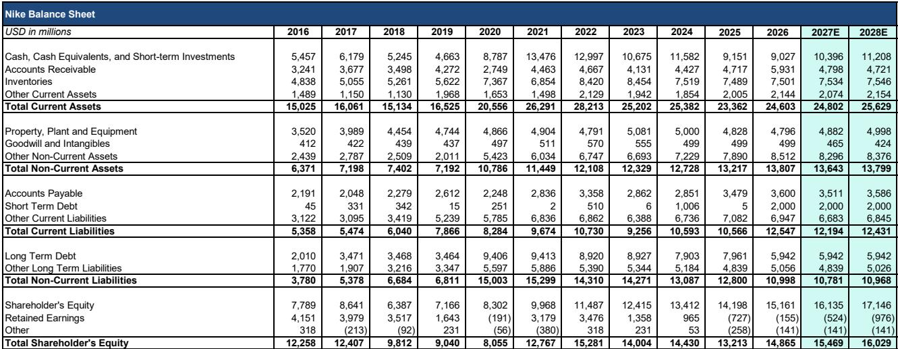

# Nike’s China Online Reset Is a Strategic Trade-Off: Sacrificing $1 Billion in Revenue to Reclaim Brand Pricing Power

Nike’s China business has been declining since fiscal 2025, with market share falling from a peak of 27 percent in 2020 to roughly 16 percent in 2025. Against that backdrop, the company is now taking its most aggressive distribution action in decades: completely eliminating partner-operated online sales in China by January 2027, while simultaneously trimming its own direct-to-consumer discount activity on major e-commerce platforms. This is not a routine channel rationalization. It is a deliberate surrender of roughly $1 billion in annual wholesale online revenue — a high-teens percentage of Nike’s China business — in exchange for cleaner brand positioning and higher-quality full-price selling.

The immediate consequence is a low-teens decline in China revenue for fiscal 2027, which will act as a roughly 200-basis-point drag on total company growth. Observers have been waiting for Nike to demonstrate a credible path back to top-line expansion, and this reset pushes that timeline back by at least another year. But the strategic logic is defensible: Nike is choosing to accept near-term pain to restore pricing discipline in a market where excessive discounting has eroded both brand equity and margin structure. The question is whether the eventual payoff — a smaller but more profitable China business growing in line with the market — justifies the scale of the current sacrifice.

For competitors, the implications are uneven but consequential. Adidas stands to gain the most, both from displaced online customers and from distributors who will need to fill the shelf space Nike is vacating. Domestic brands will absorb demand at the lower end of the price spectrum. Premium Western brands such as On and Hoka will be largely unaffected because they never relied on the broad wholesale distribution channels Nike is now abandoning. The competitive landscape in China’s sportswear market is about to shift in ways that favor disciplined brand operators over volume-driven players.

## Nike’s Market Share Decline Has Been Structural, Not Cyclical, and the Reset Addresses the Root Cause

Nike entered China in the early 1980s and spent decades building a dominant position, reaching a peak of 27 percent market share by 2020. That share has since eroded steadily: first due to external shocks such as the Xinjiang cotton controversy in 2021 and COVID-related lockdowns that disproportionately affected Western brands concentrated in high-tier cities, then more sharply from 2024 onward as Nike became over-reliant on a narrow set of lifestyle franchises. The company responded with a multi-year marketplace cleanup — buying back inventory from partners, reducing sell-in, liquidating product, and even physically moving inventory out of China into neighboring markets such as Turkey. By 2025, Nike’s share had fallen to approximately 16 percent.

This is not a temporary dip. The share losses have been driven by a combination of structural factors: domestic brands such as Anta and Li Ning have become more aggressive and more sophisticated in product and marketing; premium Western competitors have carved out the high end of the market; and Nike’s own distribution strategy created a glut of discounted product online that diluted brand perception. The inventory cleanup is now largely complete — marketplace sell-through trends have turned positive, and comps at renovated stores in China are showing improvement — but the brand damage from years of aggressive discounting persists. The online distribution reset is Nike’s attempt to address that damage at its source.

The key insight is that Nike is not simply cutting distribution; it is changing the nature of its digital presence in China. Beginning January 2027, Nike’s digital footprint will be limited to direct web and app sales plus official flagship stores on platforms such as Tmall, JD.com, and Douyin. Partner-operated online storefronts — which currently account for a high-teens percentage of Nike’s China revenue — will disappear entirely. On the DTC side, Nike will stop participating in deep-discount shopping festivals such as 6.18 and 11.11. The goal, as Nike’s Greater China leadership has stated, is to reduce fragmentation and strengthen the consumer journey by concentrating traffic into fewer, higher-quality touchpoints.

## The Revenue Hit Is Real and Will Delay Nike’s Growth Recovery by at Least One Year

Modeling the financial impact requires breaking down Nike’s China business by channel. Wholesale online currently represents a high-teens percentage of Nike’s China revenue. This business is being wound down to zero over the next two to three quarters. Based on Nike’s guidance for the first half of fiscal 2027, the company expects a mid-teens decline in China revenue, driven primarily by lower sell-in associated with the online reset. The second half of fiscal 2027 should see more moderate declines, helped by easier comparisons, completed store renovations, and a wave of new lifestyle product launches scheduled for spring 2027.

The aggregate effect is a low-teens decline for China in fiscal 2027, which translates into roughly 200 basis points of headwind for total company revenue growth. This is significant because Nike’s China business has already been declining since fiscal 2025. The reset pushes any credible return to growth in the region into fiscal 2028 at the earliest.

The offset is margin improvement. Exiting low-end discounted sales and shifting share from wholesale online to DTC online should produce a stronger mix of full-price selling. The analysis models approximately 200 basis points of margin improvement in China for fiscal 2027, which makes double-digit operating margins in the region more achievable over the medium term. But margin improvement alone will not satisfy those focused on top-line momentum. The growth narrative for Nike has been pushed back repeatedly, and this reset adds another delay.

Not all of the lost wholesale online volume will disappear from Nike’s ecosystem. Some of those sales should migrate to Nike’s DTC online business, which will become the only channel through which consumers can purchase Nike product on major e-commerce platforms. But the customers who were buying discounted product through partner-operated stores are unlikely to suddenly pay full price through Nike’s own channels. The majority of that demand will shift to other brands. Nike is effectively choosing to walk away from a significant portion of its online customer base in exchange for a cleaner brand position.

## Adidas Is the Most Likely Near-Term Beneficiary, While Domestic Brands Absorb the Low-End Demand

The competitive implications of Nike’s reset are not uniform across the market. Three categories of competitors will be affected differently.

Adidas stands to gain the most in the near term. Nike’s removal of discounted product from the online marketplace will reduce pricing pressure across the category, which benefits any brand that competes on full-price selling rather than promotion. More directly, Nike’s largest wholesale partners in China — Topsports and Pou Sheng — will need to replace the lost Nike online volume. These distributors already have strong relationships with Adidas, which is growing at a double-digit rate in China and has strong traction across multiple categories. The natural response for these partners will be to increase their emphasis on Adidas product. This is not a speculative scenario; it is a direct consequence of distribution economics. When a major brand reduces sell-in, the distributor reallocates shelf space to the next-best alternative.

Domestic brands such as Anta and Li Ning will also benefit, particularly in lower-price and more promotional channels. A portion of the online demand Nike is walking away from is likely to migrate toward domestic players that operate at the mass and economy price points. To the extent that Nike is prioritizing quality of sales over volume, domestic competitors appear well positioned to absorb some of the demand that was previously captured through heavily discounted Nike online channels. This continues a trend that has been underway since 2020: domestic brands have steadily gained share at the expense of international brands, and Nike’s distribution reset accelerates that dynamic in the online channel.

Premium Western brands such as On and Hoka should be largely unaffected. These brands have limited wholesale exposure in China and do not sell through the broad network of distributors and resellers that Nike is now abandoning. Hoka works with Topsports and could see some incremental demand as that partner looks to fill the Nike gap, but the gating factor for these brands is distribution control rather than retailer demand. Higher demand from distributors will not translate into higher sales if the brand chooses to maintain tight distribution discipline. The premium segment of the market operates on different economics than the mass market, and Nike’s reset does not change those dynamics.

## A Decision Framework for Evaluating Nike’s China Reset

For those trying to assess the implications of this move, the relevant framework has three dimensions: timing, magnitude, and competitive response.

On timing, the key question is how long the revenue headwind lasts. The analysis indicates that the full impact will be felt in the first half of fiscal 2027, with moderation in the second half as comparisons ease and new product launches provide a tailwind. By fiscal 2028, Nike should be lapping the reset entirely, meaning the year-over-year comparison will no longer include the step-down. The margin improvement, by contrast, should be more durable. Once Nike exits the low-end discount business, that mix benefit persists as long as the company maintains discipline on full-price selling.

On magnitude, the critical number is the $1 billion in wholesale online revenue that Nike is surrendering. That is the direct hit. The question is how much of that volume gets recaptured through DTC online channels. The analysis assumes partial recapture, with the majority lost to competitors. This is a conservative assumption that reflects the reality of consumer price sensitivity in China’s online marketplace. If Nike’s DTC business proves more effective at converting wholesale customers than expected, the revenue impact could be smaller. But the company’s stated goal is to reduce discounting, not to maximize volume, so aggressive recapture would be inconsistent with the strategy.

On competitive response, the key variable is how quickly Adidas and domestic brands move to fill the gap. Adidas has the most to gain and is already positioned for growth. Domestic brands have been gaining share steadily and will continue to do so, but they face their own strategic challenges around brand elevation and margin expansion. The net effect is that Nike is unlikely to regain its prior position of market share dominance in China. The analysis models Nike growing in line with the China market over the medium term, which is a significant downgrade from the 27 percent share it held at its peak.

## The Strategic Logic Is Sound, but the Execution Risk Is High

Nike’s China reset is a textbook example of a brand choosing long-term positioning over short-term volume. The company has correctly diagnosed that excessive discounting and fragmented online distribution have damaged its brand equity in China, and it is taking decisive action to address both problems. The margin improvement from this shift should be meaningful, and a cleaner brand position should support full-price selling over time.

But execution risk is high. Eliminating wholesale online entirely is a blunt instrument that will alienate distributors and disrupt consumer purchasing patterns. The transition period will be messy, with inventory liquidation, channel conflict, and potential revenue shortfalls that could exceed current estimates. The assumption that Nike can maintain its offline distribution network while dramatically shrinking its online presence is untested at this scale. And the broader competitive dynamics in China — rising domestic brands, aggressive premium competitors, and a consumer base that has become accustomed to discounts — may limit the upside even if Nike executes flawlessly.

The most important unknown is whether Nike’s product pipeline can support the premium positioning this strategy requires. The company is betting that new lifestyle launches in spring 2027 will generate enough consumer excitement to drive full-price demand. If those products fall short, Nike will have surrendered volume without gaining the brand lift that justified the sacrifice. That is the central tension in the thesis: the reset only works if the product is good enough to command full-price attention in a market that has learned to wait for discounts.

*For informational purposes only. Portions may be generated, translated, summarized, or edited with AI assistance based on source materials and may contain omissions or errors. Please verify independently. This is not professional advice.*

For informational purposes only. Portions may be generated, translated, summarized, or edited with AI assistance based on source materials and may contain omissions or errors. Please verify independently. This is not professional advice.

